The capability map lists **what the product can do**, grouped into eight domains, and shows how mature each capability is. Use it to scope releases, to spot where "built" really means "built on a mock", and to find the module an engineer would change.

**Maturity key**

| Label | Meaning |
|---|---|
| ✅ **Built** | Business logic, API and UI are complete and work with no external system. |
| 🟡 **Mocked** | The workflow is built, but it depends on a provider adapter that is a mock today, so no real data enters or leaves. |
| ⛔ **Planned** | Not built. There may be env keys, stored settings or UI placeholders only. |

Module paths are relative to `backend/src/modules/` unless noted. See [System architecture](/docs/architecture/system-architecture) for how the modules map to service boundaries.

## Overview

```mermaid
flowchart LR
  subgraph DF["Data foundation"]
    df1["Accounts & contacts ✅"]
    df2["Import & dedup ✅"]
    df3["Enrichment 🟡"]
  end
  subgraph SG["Signals"]
    sg1["Manual & webhook ingest ✅"]
    sg2["Vendor connectors ⛔"]
  end
  subgraph SC["Scoring"]
    sc1["Fit + intent + tiers ✅"]
    sc2["Scheduled decay ⛔"]
  end
  subgraph OR["Orchestration"]
    or1["Playbooks & approvals ✅"]
    or2["LLM drafting 🟡"]
    or3["Async workers ⛔"]
  end
  subgraph EN["Engagement"]
    en1["Sequences & enrollment ✅"]
    en2["Sending 🟡 / scheduler ⛔"]
    en3["Reply capture ⛔"]
  end
  subgraph PL["Pipeline"]
    pl1["Deal board ✅"]
    pl2["CRM sync 🟡"]
  end
  subgraph IN["Insights"]
    in1["Dashboard & analytics ✅"]
    in2["Warehouse ⛔"]
  end
  subgraph PF["Platform"]
    pf1["Auth, roles, tenancy ✅"]
    pf2["SSO, audit, billing ⛔"]
  end
  DF --> SG --> SC --> OR --> EN --> PL --> IN
  PF -.-> DF
```

## 1 · Data foundation

| Capability | Maturity | What exists | Owning module |
|---|---|---|---|
| Account records (CRUD, owner, stage, tags, notes) | ✅ Built | Normalized domains, revenue estimate, bulk actions | `accounts` |
| Contact records | ✅ Built | Seniority, email status, per-contact timeline | `contacts` |
| Duplicate detection & merge | ✅ Built | Domain-based flagging, merge moves children, dismiss | `accounts` |
| Entity version history | ✅ Built | Field-level diffs on every edit | `accounts` |
| CSV / JSON import | ✅ Built | Aliases, dry run, skip / update, per-row errors | `import` |
| Account enrichment (waterfall) | 🟡 Mocked | Waterfall order stored and honoured; mock fills a few fields | `accounts` + `providers` (`EnrichmentProvider`) |
| Email finding & verification | 🟡 Mocked | Deterministic mock verdicts | `contacts` + `providers` |
| TAM sourcing (Apollo, Limadata) | ⛔ Planned | Catalog entries and keys only | `integrations` (future `entity` worker) |
| Web scraping and research (Apify, Linkup) | ⛔ Planned | Catalog entries and keys only | future research worker |
| Large imports via S3 | ⛔ Planned | Inline upload up to `IMPORT_MAX_BYTES` (5 MB) | `import` |

## 2 · Signals

| Capability | Maturity | What exists | Owning module |
|---|---|---|---|
| Manual signal entry | ✅ Built | Eight signal types, strength, occurred-at | `signals` |
| Generic webhook with API keys | ✅ Built | `POST /webhooks/signals`, `signals:write` scope, batches ≤ 100 | `signals` (`webhooksModule`), `organization` |
| Signal feed, stats, process pending | ✅ Built | 24h / 7d / by type / by source | `signals` |
| Simulate signal (demo only) | ✅ Built | Behind `ENABLE_SIMULATION`; to be removed | `signals` |
| Native RB2B / Trigify / Bombora connectors | ⛔ Planned | Env keys; HMAC secrets unused | future vendor webhook routes |
| Minimum-strength filter per vendor | ⛔ Planned | Setting stored, not applied | `integrations` |

## 3 · Scoring

| Capability | Maturity | What exists | Owning module |
|---|---|---|---|
| ICP definition (criteria, weights) | ✅ Built | One ICP per workspace | `scoring` |
| Fit + intent score, tiers A–D | ✅ Built | Deterministic engine, 14-day intent half-life | `scoring/engine.ts` |
| Score breakdown and history | ✅ Built | Contributors, last 20 scoring events | `accounts`, `scoring` |
| What-if preview before saving | ✅ Built | Tier deltas, promoted / demoted | `scoring` |
| Scheduled decay re-scoring | ⛔ Planned | Scores refresh only on triggers | future scheduler ([tech debt #8](/docs/engineering/tech-debt)) |
| Multiple ICPs / segments | ⛔ Planned | Open product question | `scoring` |
| LLM-assisted scoring and research | ⛔ Planned | Catalog lists Claude for it | future research worker |

## 4 · Orchestration

| Capability | Maturity | What exists | Owning module |
|---|---|---|---|
| Autopilot switch | ✅ Built | Per workspace | `agent` |
| Playbooks (trigger, min score, tiers, actions) | ✅ Built | Route, enrich, draft, enroll, create deal, notify | `agent` |
| Run log with step trace | ✅ Built | Completed / awaiting approval / failed / skipped | `agent` |
| Approval queue (edit, approve, reject, regenerate) | ✅ Built | Human in the loop by default | `agent` |
| Round-robin routing, best-contact selection | ✅ Built | Seniority-based | `agent` |
| Outreach drafting with Claude | 🟡 Mocked | `LlmProvider.draftOutreach` returns templates | `providers` (`LlmProvider`) |
| Async agent workers (event bus) | ⛔ Planned | `MemoryEventBus`, no subscribers | `events` |
| Playbook priority, multi-playbook runs | ⛔ Planned | First match wins, creation order | `agent` ([tech debt #20](/docs/engineering/tech-debt)) |

## 5 · Engagement

| Capability | Maturity | What exists | Owning module |
|---|---|---|---|
| Sequences and step builder (email, LinkedIn, call, wait) | ✅ Built | Duplicate, reorder, settings | `outreach` |
| Enrollment rules | ✅ Built | Skips unsubscribed, bounced, invalid | `outreach` |
| Mailboxes and deliverability view | ✅ Built (static) | Health scores are stored values; alerts computed in the browser | `outreach` |
| Reply inbox with sentiment, book meeting | ✅ Built | Messages come from seed data | `outreach` |
| AI reply suggestions | 🟡 Mocked | `LlmProvider.suggestReply` templates | `providers` |
| Sending approved drafts and replies | 🟡 Mocked | `EmailProvider.send` logs only | `providers` (`EmailProvider`) |
| Step scheduler (windows, limits, stop on reply) | ⛔ Planned | Settings stored, enrollments never advance | future outreach worker ([tech debt #3](/docs/engineering/tech-debt)) |
| Inbound reply capture | ⛔ Planned | No mailbox is read | future inbound worker ([tech debt #9](/docs/engineering/tech-debt)) |
| LinkedIn sending (HeyReach) | ⛔ Planned | No `LinkedInProvider` interface yet | `providers` |
| Real delivery stats, warm-up, DNS checks | ⛔ Planned | Seeded numbers; modelled per-step stats | `outreach` |

## 6 · Pipeline

| Capability | Maturity | What exists | Owning module |
|---|---|---|---|
| Deal board and table, stage probabilities | ✅ Built | Drag and drop, closed-won effects | `pipeline` |
| Deals from agent and booked meetings | ✅ Built | Source tracked | `pipeline`, `agent`, `outreach` |
| CSV export | ✅ Built | `GET /deals/export.csv` | `pipeline` |
| Push to CRM | 🟡 Mocked | `CrmProvider.pushDeal` returns fake ids | `providers` (`CrmProvider`) |
| Two-way CRM sync, conflict policy, score write-back | ⛔ Planned | Settings stored | future CRM sync worker |

## 7 · Insights

| Capability | Maturity | What exists | Owning module |
|---|---|---|---|
| Dashboard KPIs and charts | ✅ Built | Computed on request | `analytics` |
| Analytics (attribution, funnel, tiers, sequences, reps) | ✅ Built | 30 / 90 / 180-day ranges | `analytics` |
| Global search (⌘K) | ✅ Built | In-memory substring scan | `search` |
| Notifications feed, Slack webhook (production only) | ✅ Built | Workspace-wide feed | `notifications` |
| Per-user notification routing and email | ⛔ Planned | Preferences saved but unused | `notifications` |
| Call intelligence (Fireflies) | ⛔ Planned | Catalog entry only | future analytics worker |
| Warehouse analytics, historical snapshots | ⛔ Planned | `ANALYTICS_WAREHOUSE_URL` reserved | future analytics pipeline |
| Agent-influenced pipeline (north star) | ⛔ Planned | Proposed metric | `analytics` ([Metrics](/docs/product/metrics)) |

## 8 · Platform

| Capability | Maturity | What exists | Owning module |
|---|---|---|---|
| Sign-up, login, JWT sessions | ✅ Built | bcrypt, stateless 7-day tokens | `auth` |
| Roles (owner, admin, member, viewer) | ✅ Built | Enforced on every route | `lib/roles`, `middleware` |
| Multi-tenancy | ✅ Built | `orgId` scoping in the repository | `db` |
| Team, invites (link only), seats, plans | ✅ Built / partial | Invite emails not sent; plans change seats only | `organization` |
| Encrypted vendor credentials | ✅ Built | AES-256-GCM with `ENCRYPTION_KEY` | `integrations`, `lib/crypto` |
| OpenAPI + Swagger UI | ✅ Built | `/api/v1/docs` | `lib/openapi` |
| Demo mode (in-browser API) | ✅ Built | `NEXT_PUBLIC_DATA_SOURCE=mock` | `frontend/src/mock-api` |
| PostgreSQL storage | ⛔ Planned | Driver stub throws | `db/postgres` |
| SSO (Cognito / Auth0), MFA, refresh tokens | ⛔ Planned | `AUTH_DRIVER` reserved | `auth` |
| Audit log | ⛔ Planned | Entity versions only | new module |
| Billing and usage metering | ⛔ Planned | Plan prices shown, no payments | new module |
| CI/CD, IaC, observability | ⛔ Planned | pino logs only | repo / ops |

## Maturity summary

| Domain | ✅ Built | 🟡 Mocked | ⛔ Planned | Biggest gap for launch |
|---|:-:|:-:|:-:|---|
| Data foundation | 5 | 2 | 3 | One real enrichment vendor |
| Signals | 4 | 0 | 2 | At least one native intent connector |
| Scoring | 4 | 0 | 3 | Scheduled decay |
| Orchestration | 5 | 1 | 2 | Claude drafting, async workers |
| Engagement | 4 | 2 | 4 | Sending scheduler and reply capture |
| Pipeline | 3 | 1 | 1 | Real HubSpot sync |
| Insights | 4 | 0 | 4 | Agent-influenced pipeline metric |
| Platform | 7 | 0 | 5 | Postgres, CI/CD, observability |

The launch gaps above are exactly what [MVP scope → In scope](/docs/mvp-scope/in-scope) marks as "needs a real integration before launch".
