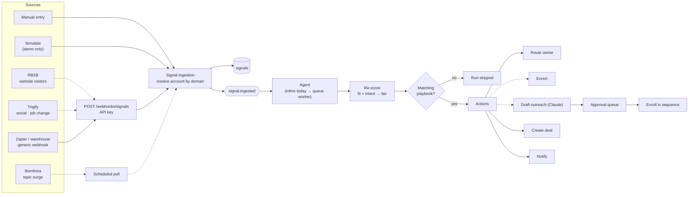
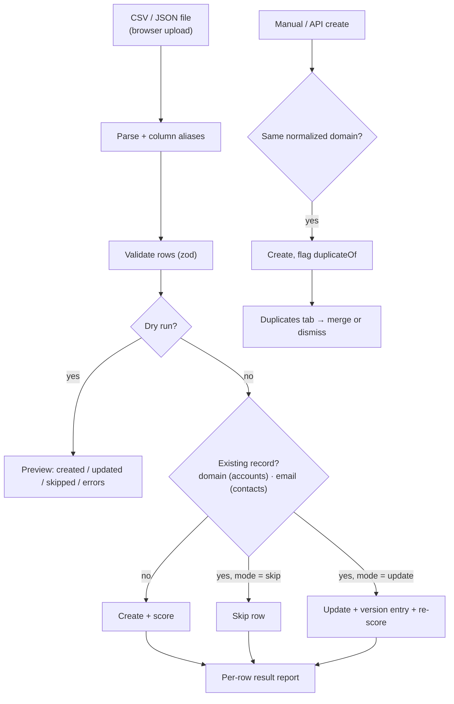
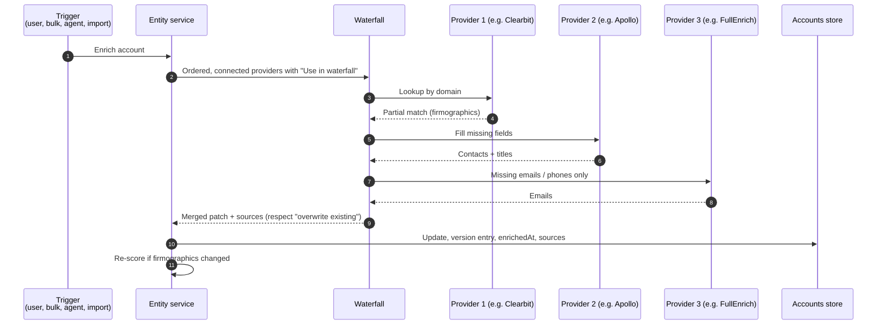
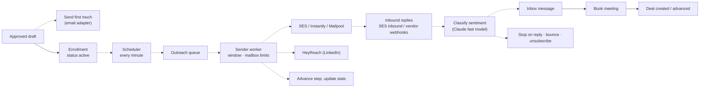
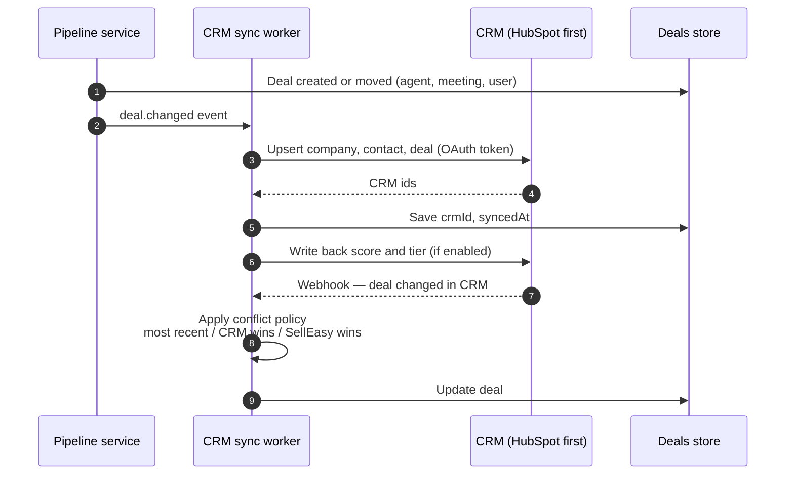
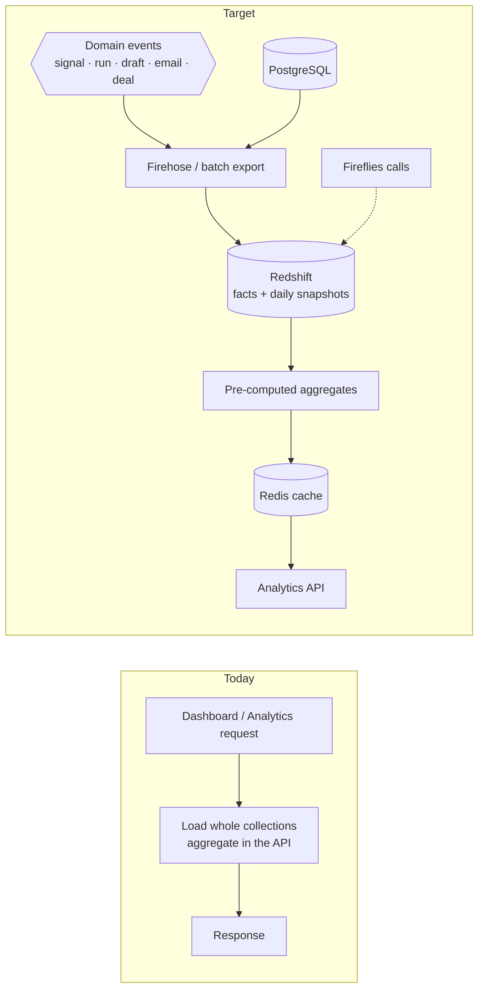

Each flow below shows how data moves through SellEasy, then notes what is real today and what changes in the target platform. Solid arrows are built. Dotted arrows depend on a mocked or planned component.

## 1 · Signal ingestion → scoring → playbook → action

This is the core loop and the product's main value.

| Step | Today | Target |
|---|---|---|
| Vendor delivery | Generic webhook only; vendors must be mapped externally (for example with Zapier) | Native, HMAC-verified RB2B and Trigify webhooks; scheduled Bombora pull |
| Ingestion | Synchronous; batches ≤ 100 processed one at a time | Validate, store, publish, return `202` immediately |
| Agent | Runs inside the request | SQS worker, idempotent per signal, retries and a dead-letter queue |
| Draft | Template | Claude with account, contact and signal context |

## 2 · Import and dedup

- **Today:** fully built. The file travels inline as JSON, limited to 5 MB.
- **Target:** large files go to S3 through presigned uploads and are processed by a background job, with progress shown in the UI. Optional enrichment and email verification run after import.

## 3 · Enrichment waterfall

- **Today:** the order is stored and read, but a single mock produces the patch and names the first two providers as sources.
- **Target:** real adapters that stop on a full match and fall through on a miss. Per-provider cost caps, caching of recent lookups, and a Step Functions workflow for bulk runs.

## 4 · Outreach and reply

- **Today:** enrollment, inbox, sentiment labels and "book meeting" are built. Nothing is sent, steps never advance, and inbox messages come from seed data.
- **Target:** this is the largest single build in [Month 2](/docs/roadmap/month-2-integrations). Deliverability tooling (DNS checks, caps, health from real bounce data) follows in [Month 3](/docs/roadmap/month-3-launch); warm-up networks and volume-sending vendors are [post-launch](/docs/roadmap/beyond-the-mvp).

## 5 · Deal → CRM sync

- **Today:** "Sync to CRM" requires a connected CRM entry and writes a fake CRM id. It is push-only and manual.
- **Target:** automatic two-way sync with HubSpot in [Month 2](/docs/roadmap/month-2-integrations). Attio and Salesforce are [post-launch](/docs/roadmap/beyond-the-mvp#theme-2--integration-breadth). Which system owns a deal is an open product decision, due 6 November 2026 ([Product roadmap & status](/docs/product/roadmap#open-questions)).

## 6 · Analytics aggregation

- **Today:** correct but computed on each request, so dashboards slow down as data grows.
- **Month 3:** SQL aggregates and indexes replace the in-memory scans, targeting a dashboard p95 under 2 seconds.
- **Post-launch:** Redis caches the heavy aggregates if the targets are missed, and a Redshift warehouse adds history, custom ranges, attribution and the agent-influenced pipeline metric ([Beyond the MVP](/docs/roadmap/beyond-the-mvp#theme-6--analytics-and-attribution)).

## Related

- [Integrations landscape](/docs/architecture/integrations-landscape)
- [User journeys](/docs/product/user-journeys)
- [Engineering → Events and providers](/docs/engineering/backend/events-and-providers)
