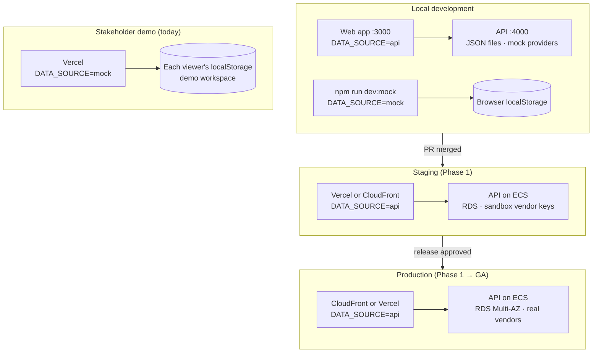
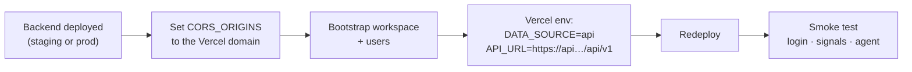

SellEasy runs in four environments. The web app can get its data from two **data sources**, chosen at build time with `NEXT_PUBLIC_DATA_SOURCE`:

| Value | Where data comes from | Needs a backend? | Typical use |
|---|---|---|---|
| `api` (default) | The SellEasy API at `NEXT_PUBLIC_API_URL` | Yes | Local development, staging, production |
| `mock` | A copy of the backend's routes and services running **inside the browser**, with demo data in localStorage | No | Stakeholder and sales demos on Vercel, UI work without a backend |

## Environments

| | Local development | Stakeholder demo | Staging | Production |
|---|---|---|---|---|
| **Purpose** | Build and test features | Show the full product to investors, customers, internal teams | Integration testing, pilot rehearsals, UAT | Design partners, then GA customers |
| **Web hosting** | `next dev` | Vercel (frontend only) | Vercel or CloudFront + S3 | CloudFront + S3 or Vercel |
| **Data source** | `api` (or `mock` with `npm run dev:mock`) | `mock` | `api` | `api` |
| **Backend** | Local Node process | None | ECS Fargate | ECS Fargate (≥ 2 tasks) |
| **Storage** | JSON files in `backend/db/` | Browser localStorage | RDS PostgreSQL (single-AZ) | RDS PostgreSQL (Multi-AZ, PITR) |
| **Vendors** | Mocks | Mocks (in the browser) | Real adapters with sandbox or test accounts | Real adapters |
| **`ENABLE_SIMULATION`** | `true` | always on (fixed) | `true` if useful | **`false`** |
| **`ENABLE_ADMIN_RESET`** | `true` | always on (fixed) | `false` | `false` (forced off) |
| **Data** | `seed:demo` or empty `bootstrap` | Demo workspace "Acme Growth Inc." | Synthetic + pilot rehearsal data | Customer data |
| **Available** | Today | **Today** | Phase 1 | Phase 1 (pilot), GA at end of Phase 3 |

## How mock mode works

<Steps>
<Step>
**Sync.** `npm run mock:sync` (root or `frontend/`) copies `backend/src` into `frontend/src/mock-api/core`. Server-only files (`app.ts`, `server.ts`, OpenAPI, the Express error handler) are skipped. A few files are replaced by browser versions from `src/mock-api/overrides`: config, the JSON repository, auth middleware, crypto, logging and HTTP helpers. The output is committed, so the frontend builds without the backend folder. `npm run mock:check` fails if the copy is out of date, which makes it suitable for CI.
</Step>
<Step>
**Route.** With `NEXT_PUBLIC_DATA_SOURCE=mock`, the API client lazily loads `src/mock-api/server.ts` instead of calling `fetch`. It matches the request against the **same route definitions** the Express API registers and runs the same zod validation, role checks and services.
</Step>
<Step>
**Store.** The repository persists each collection to `localStorage` under keys starting with `selleasy-mock-db:`. Data is private to that browser and survives reloads.
</Step>
<Step>
**Seed.** On the first request, the mock API creates the workspace **Acme Growth Inc.** with owner **Jordan Lee** and loads the demo dataset. The login page pre-fills the demo credentials.
</Step>
<Step>
**Simulate latency.** Each call waits 60–200 ms so loading states look realistic.
</Step>
</Steps>

<Callout type="info" title="Demo login">
Email **`jordan@acmegrowth.com`**, password **`demo1234`**. The header shows a **Demo data** badge while mock mode is on.
</Callout>

### Resetting demo data

- **In the app:** as the owner, open **Settings → Organization → Danger zone** and reset the workspace, either to the demo dataset or to an empty workspace. Mock mode always enables admin reset.
- **In the browser:** clear site data, or delete the `selleasy-mock-db:*` localStorage keys. The demo workspace is re-created on the next request.
- Each viewer has their own copy, so one person's demo changes never affect another's.

### What mock mode is — and isn't

| It is | It isn't |
|---|---|
| The real business logic, so scoring, playbooks, approvals, dedup and analytics behave exactly as they do against the API | Shared: every browser has its own data |
| Safe for public links: no backend, no secrets, no customer data | A real integration demo: vendor calls are the same mocks the backend uses |
| Kept in step with the backend by `mock:sync` | Automatically up to date: someone must run `mock:sync` after backend changes |
| Good for design reviews and sales demos | Suitable for load testing, security testing or real pilots |

## Switching a Vercel demo to live data

Switching is a configuration change plus a rebuild. No code changes are needed. `NEXT_PUBLIC_*` values are inlined **at build time**, so you must redeploy after changing them.

**Checklist**

- [ ] The API is deployed and `GET /health` returns `ok` at the public URL.
- [ ] The API runs with `NODE_ENV=production`, unique `JWT_SECRET` and `ENCRYPTION_KEY` from a secrets manager, and `ENABLE_SIMULATION` / `ENABLE_ADMIN_RESET` set as intended for that environment.
- [ ] `CORS_ORIGINS` on the API includes the exact Vercel origin (for example `https://selleasy-demo.vercel.app`). Add preview domains only if you need them.
- [ ] A workspace exists: run `npm run bootstrap` against the target database. Optionally run `seed:demo` in **staging only**. Never seed production.
- [ ] Users are created or invited, and the bootstrap admin password has been changed.
- [ ] In Vercel project settings, set **`NEXT_PUBLIC_DATA_SOURCE=api`** and **`NEXT_PUBLIC_API_URL=https://<api-host>/api/v1`** for the target environment (Production and/or Preview).
- [ ] Redeploy (a fresh build — changing env vars alone does not update the bundle).
- [ ] Confirm the **Demo data** badge is gone, and that the login page shows "Connected to `<api host>`" instead of pre-filled demo credentials.
- [ ] Smoke test: log in, view accounts, create a signal (or send one through the webhook with an API key), approve a draft, move a deal.
- [ ] Tell demo viewers that their old browser-only data will not carry over. It stays in their localStorage until cleared.
- [ ] Keep a separate Vercel project (or branch) on `mock` if you still need a public, self-contained demo.

<Callout type="warn" title="Keep a mock demo around">
A live-data deployment needs a backend, credentials and real data. Many teams keep **two** frontend deployments: `demo.` on `mock` for anyone, and `app.` on `api` for customers.
</Callout>

## Related

- [Engineering → Configuration](/docs/engineering/configuration)
- [Engineering → Deployment](/docs/engineering/deployment)
- [Engineering → Frontend data layer](/docs/engineering/frontend/data-layer)
- [MVP scope → Launch checklist](/docs/mvp-scope/launch-checklist)
