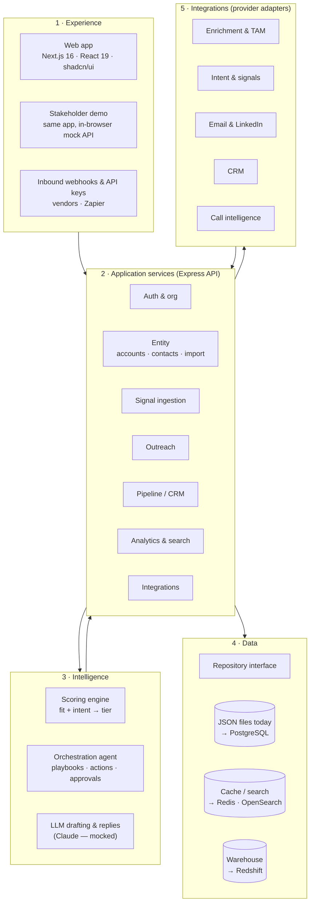

This tab explains how SellEasy is put together, written for founders, PMs, stakeholders and engineering leads. It sits between the [Product](/docs/product) tab (what the product does) and the [Engineering](/docs/engineering) tab (how the code works). Use it to reason about **scope, sequencing and risk**. The planning tabs build on it: [MVP scope](/docs/mvp-scope), [Roadmap](/docs/roadmap) and [Team & cost](/docs/team-and-cost).

<Callout type="info" title="The short version">
SellEasy is a **modular monolith**. A Next.js web app talks to one Express + TypeScript API, and that API owns every business rule. The workflow is fully built: signals, scoring, the orchestration agent, approvals, sequences, pipeline and analytics. What is **not** built yet is the plumbing to the outside world. Storage is JSON files, and every vendor adapter (enrichment, CRM, email, LLM) is a mock. Most of the next 6–9 months is spent swapping those mocks for real implementations behind interfaces that already exist.
</Callout>

## The five layers

| Layer | What it does | Today | Target | Read more |
|---|---|---|---|---|
| **1 · Experience** | Screens for SDRs, AEs, RevOps and leaders. Webhook and API-key entry points for machines. | ✅ Built. 12 app areas, ⌘K search, role-aware UI. Can run against the API or fully in the browser for demos. | Same app on Vercel or CloudFront + S3. SSO login. | [Environments & data modes](/docs/architecture/environments-and-data-modes) |
| **2 · Application services** | Business rules, validation, permissions, multi-tenancy. One module per future service. | ✅ Built. 18 route modules, 139 operations, zod validation, JWT roles. | Same modules on ECS Fargate, stateless, horizontally scaled. | [System architecture](/docs/architecture/system-architecture) |
| **3 · Intelligence** | Scores accounts, picks playbooks, drafts outreach, suggests replies. | 🟡 Scoring and agent built. LLM mocked (templates). Agent runs inside the request. | Claude drafting and research. Agent runs on queue workers. | [Data flows](/docs/architecture/data-flows) |
| **4 · Data** | Persists records per tenant, caches aggregates, indexes search, stores history. | 🟡 JSON files behind a `Repository` interface. Single process only. | RDS PostgreSQL, ElastiCache Redis, OpenSearch, Redshift. | [Target architecture](/docs/architecture/target-architecture) |
| **5 · Integrations** | Pulls data in (enrichment, intent) and pushes work out (email, LinkedIn, CRM). | 🟡 19-vendor catalog, encrypted keys, waterfall ordering. Every adapter is a mock. | Real adapters, prioritised by customer value. | [Integrations landscape](/docs/architecture/integrations-landscape) |

## Current vs. target at a glance

| Concern | Today | Target | When (roadmap) |
|---|---|---|---|
| Hosting | Local processes. Frontend-only demo on Vercel (mock mode). | AWS: ECS Fargate, ALB, CloudFront | [Phase 1](/docs/roadmap/phase-1-foundation) |
| Database | JSON files, one process | RDS PostgreSQL with migrations | Phase 1 |
| LLM | Template mock | Anthropic Claude (`claude-opus-5`, fast model `claude-haiku-4-5`) | Phase 1 |
| Enrichment | Mock | One vendor first, then a real waterfall | Phase 1 → 2 |
| Email sending | Logged only | SES first, then Instantly / Mailpool | Phase 1 → 3 |
| Intent signals | Generic webhook + Simulate button | RB2B, Trigify, Bombora connectors | [Phase 2](/docs/roadmap/phase-2-real-integrations) |
| CRM | Fake ids | HubSpot, then Salesforce and Attio | Phase 2 → 4 |
| Agent execution | Synchronous, in the request | EventBridge + SQS workers | Phase 2 |
| Sequences | State only, never send | Scheduler, sending windows, reply capture | Phase 2 |
| Cache and search | In-memory scans | Redis, OpenSearch | [Phase 3](/docs/roadmap/phase-3-scale-and-intelligence) |
| Auth | Local JWT + bcrypt | Cognito or Auth0, SSO, audit logs | [Phase 4](/docs/roadmap/phase-4-enterprise-and-analytics) |
| Analytics | Computed per request | Redshift warehouse, attribution | Phase 4 |

## Why this shape works for planning

- **The product surface is stable.** Swapping infrastructure doesn't change screens or API contracts, so design and GTM work can run in parallel with platform work.
- **Every external dependency has a seam.** Storage, event bus, cache, search, auth and each vendor sit behind an interface plus a `*_DRIVER` or `*_PROVIDER` env switch. Each real implementation is a bounded, estimable epic.
- **Demos don't wait for infrastructure.** The same frontend runs a synced copy of the backend in the browser, so stakeholders can click through the whole product today.
- **The main risk is integration, not invention.** Vendor contracts, API quirks, deliverability and data quality drive the schedule more than new product logic does. See [Dependencies & risks](/docs/roadmap/dependencies-and-risks).

## In this tab

<Cards>
  <Card title="Capability map" href="/docs/architecture/capability-map" description="Every capability, its maturity (Built / Mocked / Planned) and the module that owns it." />
  <Card title="System architecture" href="/docs/architecture/system-architecture" description="Components, service boundaries, request and agent sequences, tenancy and security." />
  <Card title="Data flows" href="/docs/architecture/data-flows" description="Signal → score → playbook → action, import, enrichment, outreach, CRM sync and analytics." />
  <Card title="Integrations landscape" href="/docs/architecture/integrations-landscape" description="All third-party vendors: what they feed, direction, auth, status and priority." />
  <Card title="Environments & data modes" href="/docs/architecture/environments-and-data-modes" description="Local, demo, staging and production, and how to flip a demo from mock to live data." />
  <Card title="Target architecture" href="/docs/architecture/target-architecture" description="The AWS platform we are building towards and how each layer changes." />
  <Card title="Decisions" href="/docs/architecture/decisions" description="ADR-style log of the main product-architecture decisions." />
</Cards>
