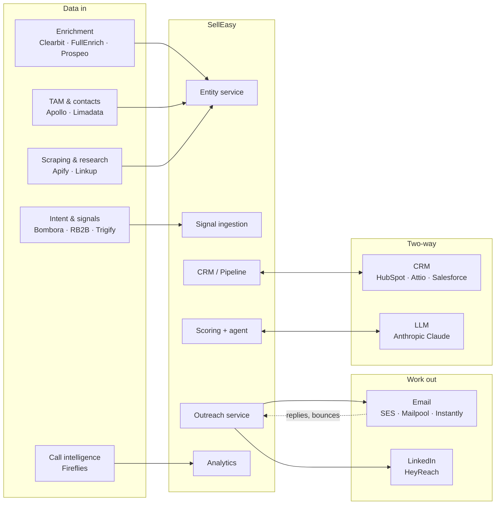

SellEasy follows a **rent, don't build** principle for data, delivery and CRM ([Problem & vision](/docs/product/problem-and-vision#principles)). This page is the planning view of those vendors. For how integrations look to users, see [Integrations (feature)](/docs/product/features/integrations).

<Callout type="warn" title="Every adapter is a mock today">
The in-app catalog lists 19 vendors in 9 categories. Admins can connect them, and keys are stored encrypted, but no vendor API is called. Connection tests only check key length, and sync history is synthetic.
</Callout>

## Map

## Vendor register

**Direction:** In = SellEasy reads from the vendor. Out = SellEasy sends to it. Both = read and write.
**Priority:** P1 = needed for the [MVP](/docs/mvp-scope/in-scope). P2 = needed for GA. P3 = enterprise or later.

| Category | Vendor | Feeds | Direction | Auth method (expected) | Status today | Priority | Roadmap phase |
|---|---|---|---|---|---|---|---|
| LLM | **Anthropic (Claude)** | Drafting, reply suggestions, sentiment, research | Both (request / response) | API key (`x-api-key`), server-side only | 🟡 Mock (`LLM_PROVIDER=mock`) | **P1** | 1 |
| Email | **AWS SES** | Outreach sending, invite emails, inbound replies | Out (+ inbound via S3 / SNS) | IAM role; SPF, DKIM, DMARC on sending domains | 🟡 Mock (`EMAIL_PROVIDER`) | **P1** | 1 |
| Enrichment | **Clearbit** (HubSpot Breeze Intelligence) | Firmographics, technographics | In | API key | 🟡 Mock | **P1** (or Apollo) | 1 |
| TAM & contacts | **Apollo.io** | Contacts, titles, emails, TAM search | In | API key (plan-gated API access) | 🟡 Mock | **P1** (or Clearbit) | 1 |
| Intent | **RB2B** | Person-level website visits | In (push) | Webhook + shared secret (`RB2B_WEBHOOK_SECRET`) | ⛔ Generic webhook only | **P1** | 2 |
| Intent | **Trigify.io** | Social engagement, job changes | In (push) | Webhook + shared secret, API key | ⛔ Generic webhook only | P2 | 2 |
| Intent | **Bombora** | Company topic surge | In (scheduled pull or file) | API key + client id | ⛔ Not built | P2 | 2 |
| CRM | **HubSpot** | Companies, contacts, deals; score write-back | Both | OAuth 2.0 app (public app), webhooks | 🟡 Mock (`CRM_PROVIDER`) | **P1** | 2 |
| Enrichment | **FullEnrich** | Waterfall emails and phones | In | API key (async, webhook callback) | 🟡 Mock | P2 | 2 |
| Enrichment | **Prospeo** | Email finder and verifier | In | API key | 🟡 Mock | P2 | 2 |
| Email | **Instantly.ai** | Cold email at volume, warm-up, replies | Both | API key, webhooks | 🟡 Mock | P2 | 3 |
| Email | **Mailpool** | Managed inboxes, warm-up | Out (+ mailbox provisioning) | API key | 🟡 Mock | P2 | 3 |
| LinkedIn | **HeyReach** | LinkedIn steps across sender accounts | Both (webhooks for replies and accepts) | API key | ⛔ No `LinkedInProvider` yet | P2 | 3 |
| Scraping | **Apify** | Job boards, websites, review sites | In | API token | ⛔ Not built | P2 | 3 |
| Research | **Linkup** | Web search for news and account research | In | API key | ⛔ Not built | P2 | 3 |
| TAM & contacts | **Limadata** | Real-time person and company data | In | API key | 🟡 Mock | P3 | 3–4 |
| CRM | **Salesforce** | Accounts, leads, contacts, opportunities | Both | OAuth 2.0 connected app; Platform Events or CDC | 🟡 Mock | P3 (enterprise) | 4 |
| CRM | **Attio** | Records and lists | Both | OAuth 2.0 or API key, webhooks | 🟡 Mock | P3 | 4 |
| Calls | **Fireflies.ai** | Call transcripts, summaries | In (+ push summaries to CRM) | API key (GraphQL), webhooks | ⛔ Not built | P3 | 4 |

Non-catalog services used by the platform itself: **Slack** incoming webhook (live in production), **Sentry** and **Datadog** (planned), **Vercel** (demo hosting), **Stripe** or similar for billing ([post-launch](/docs/roadmap/beyond-the-mvp#theme-3--commercial), to be decided).

## How customers connect (credential model)

| Model | How it works | Used for | Implication |
|---|---|---|---|
| **Bring your own key** (default) | The customer's admin pastes their own vendor key; SellEasy stores it encrypted per workspace | Enrichment, TAM, intent, scraping, email tools, HeyReach, Fireflies | Customer pays the vendor. SellEasy pays only for dev and sandbox accounts. Adapters must accept per-org credentials ([tech debt #2](/docs/engineering/tech-debt)). |
| **OAuth app** | SellEasy registers an app; the customer authorises it | HubSpot, Salesforce, Attio | Needs app review or listing (HubSpot marketplace, Salesforce AppExchange security review), which adds lead time |
| **Platform-owned** | SellEasy's own account, cost passed through in pricing | Anthropic Claude, AWS SES | Shows up as cost of goods sold. Needs usage metering and per-plan token budgets. |

See [Vendor & AI cost](/docs/team-and-cost/vendor-and-ai-cost) for price ranges under each model.

## Implementation order and rationale

<Steps>
<Step>
**Claude drafting ([Month 1](/docs/roadmap/month-1-foundation)).** The most visible gap: the UI already says "Draft outreach with Claude". Platform-owned, no customer setup, easy to demo.
</Step>
<Step>
**One enrichment vendor + SES (Month 1).** Pilot customers need real firmographics and must be able to send. SES is also needed for invite emails.
</Step>
<Step>
**One intent webhook + HubSpot ([Month 2](/docs/roadmap/month-2-integrations)).** One real intent source proves the signal loop. HubSpot is the most common CRM among the target mid-market customers.
</Step>
<Step>
**Trigify (if RB2B shipped first), Bombora, second enrichment vendor ([post-launch](/docs/roadmap/beyond-the-mvp#theme-2--integration-breadth)).** Broadens signal coverage and completes the waterfall.
</Step>
<Step>
**Instantly / Mailpool, HeyReach, Apify, Linkup (post-launch).** Volume sending, LinkedIn and research for GA.
</Step>
<Step>
**Salesforce, Attio, Fireflies, Limadata (post-launch).** Enterprise CRM and call intelligence.
</Step>
</Steps>

## Adapter checklist (per vendor)

Every real adapter should ship with:

- [ ] Implementation of the provider interface, selected by env (`*_PROVIDER`) and using **per-org credentials**
- [ ] Real connection test (replaces the length check)
- [ ] Timeouts, retries with backoff, and rate-limit handling
- [ ] Idempotency keys for writes; HMAC signature checks for inbound webhooks
- [ ] Mapping tests with recorded fixtures (no live calls in CI)
- [ ] Usage metering into the integration usage counter
- [ ] Real sync log entries instead of synthetic history
- [ ] Mock kept as the default for local development, tests and demo mode

## Related

- [Data flows](/docs/architecture/data-flows)
- [Engineering → Events and providers](/docs/engineering/backend/events-and-providers)
- [Configuration → vendor env vars](/docs/engineering/configuration)
- [Roadmap → Dependencies & risks](/docs/roadmap/dependencies-and-risks)
