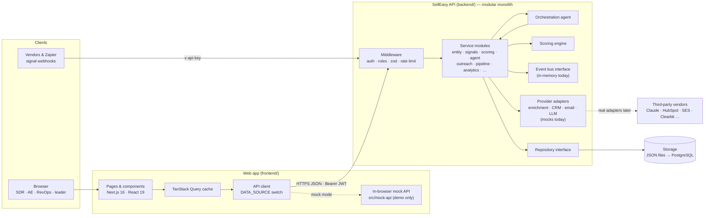
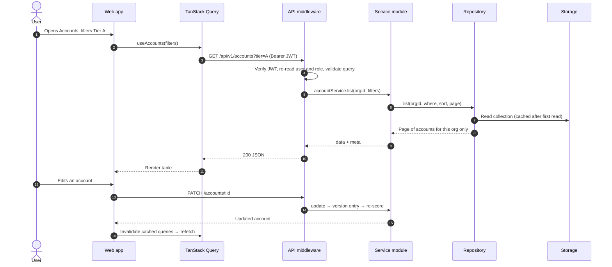
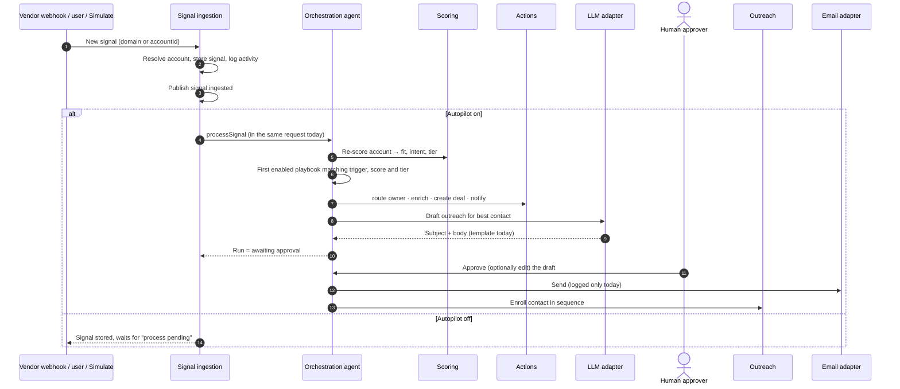

This page is the component view of SellEasy as it is built today, with notes on where each part is heading. For code-level detail, see [Engineering → Architecture](/docs/engineering/architecture).

## Components

| Component | Responsibility | Technology | State today |
|---|---|---|---|
| **Web app** | All screens. Holds no business data; only the session token is persisted. | Next.js 16, React 19, shadcn/ui, TanStack Query 5, zustand (auth only) | ✅ Complete |
| **API client + data-source switch** | Sends every call to the API, or to the in-browser mock API when `NEXT_PUBLIC_DATA_SOURCE=mock` | `frontend/src/lib/api/client.ts` | ✅ Complete |
| **In-browser mock API** | A synced copy of the backend's routes and services running on localStorage, for stakeholder demos | `frontend/src/mock-api`, regenerated by `npm run mock:sync` | ✅ Complete |
| **API (modular monolith)** | Auth, validation, business rules, tenancy, OpenAPI | Express 5, TypeScript, zod, pino | ✅ Complete |
| **Scoring engine** | Deterministic fit + intent scoring, tiers, preview | `modules/scoring/engine.ts` | ✅ Complete |
| **Orchestration agent** | Matches playbooks, executes actions, holds drafts for approval | `modules/agent` | ✅ Complete (synchronous) |
| **Event bus** | Publishes domain events such as `signal.ingested` | `events/bus.ts` (`MemoryEventBus`) | 🟡 Interface only; nothing subscribes |
| **Provider adapters** | Isolate every vendor behind an interface | `providers/index.ts` | 🟡 All mocks |
| **Repository** | Tenant-scoped persistence with a small, SQL-friendly query language | `db/repository.ts`, `JsonRepository` | 🟡 JSON driver only |

## Service boundaries

The API is one deployable, but its folders follow the service boundaries in `plan.md`. Boundaries are kept by convention: modules call each other directly today, and those calls become events or HTTP calls if a module is ever extracted.

| Logical service | Modules | Owns | Extract when… |
|---|---|---|---|
| Auth & organization | `auth`, `organization` | organizations, users, API keys, preferences | SSO / identity provider arrives (Phase 4) |
| Entity | `accounts`, `contacts`, `import` | accounts, contacts | Import and enrichment volume needs its own workers |
| Signal ingestion | `signals` (+ webhooks) | signals | **First candidate**: bursty vendor traffic (Phase 2) |
| Scoring | `scoring` | ICP config | Rarely; stays a library called by others |
| Orchestration agent | `agent` | playbooks, runs, drafts | **Second candidate**: queue workers (Phase 2) |
| Outreach | `outreach` | sequences, enrollments, mailboxes, inbox | Sending scheduler and inbound capture (Phase 2) |
| CRM / Pipeline | `pipeline` | deals | Two-way CRM sync workers |
| Timeline | `activities`, `notifications` | activities, notifications | Notification routing (SNS) |
| Analytics & search | `analytics`, `search` | read-only | Warehouse and OpenSearch (Phases 3–4) |
| Integrations | `integrations` | integration catalog, encrypted keys | Stays with the API |
| Platform | `meta`, `admin` | none | n/a |

<Callout type="info" title="Why not microservices now?">
One deployable keeps delivery fast for a team of 5–10 engineers, and the event bus and repository seams make later extraction cheap. See [Decisions → ADR-01](/docs/architecture/decisions#adr-01--modular-monolith-with-service-shaped-modules).
</Callout>

## A user request, end to end

In mock mode the same sequence happens, but steps 3–10 run inside the browser tab against localStorage.

## The agent loop

**Target change:** in [Phase 2](/docs/roadmap/phase-2-real-integrations), ingestion stops calling the agent directly. It publishes to EventBridge, an SQS queue buffers the event, and an agent worker processes it. The webhook returns immediately with `run: null`, which is already the documented "queued" response.

## Multi-tenancy

- **Tenant = organization.** Every record carries an `orgId`. It comes from the authenticated token, never from the request body or URL.
- **Isolation is enforced in the repository.** Every query is filtered by `orgId`, so a record from another tenant looks like a missing record (HTTP 404).
- **Cross-tenant reads are limited** to login by email, API-key lookup by hash and invite acceptance. Emails are unique across all workspaces.
- **Per-tenant settings** include autopilot, waterfall order, ICP, playbooks and encrypted vendor keys.
- **Target:** PostgreSQL with `org_id` on every table and indexes that lead with it. Row-level security is an option to add defence in depth before enterprise launch.

## Security model summary

| Area | Today | Target |
|---|---|---|
| Authentication | Email + password (bcrypt), HS256 JWT, 7-day expiry, user re-read on each request | Cognito or Auth0, SSO (SAML / OIDC), MFA, short-lived access + refresh tokens |
| Authorization | Four roles checked on every route | Same roles, plus audit log of admin actions |
| Machine access | API keys (hashed, shown once), `signals:write` enforced on the webhook | Scoped keys on more routes, HMAC-verified vendor webhooks |
| Secrets | `.env`; vendor keys AES-256-GCM encrypted at rest | AWS Secrets Manager, KMS envelope encryption, key rotation |
| Transport & edge | helmet, CORS allow-list, rate limits (stricter on auth) | CloudFront + WAF, TLS everywhere, shared rate-limit store |
| Input handling | zod validation on body, query and params | Same |
| Logging | pino with header and password redaction | CloudWatch / Datadog, Sentry, alerting |
| Data | Tenant scoping, no soft delete | RDS encryption, backups with point-in-time recovery, retention policies |
| Compliance | None | SOC 2 readiness in [Phase 4](/docs/roadmap/phase-4-enterprise-and-analytics) |

Details: [Engineering → Auth and security](/docs/engineering/backend/auth-and-security) and [Roles & permissions](/docs/product/roles-and-permissions).

## Related

- [Data flows](/docs/architecture/data-flows)
- [Target architecture](/docs/architecture/target-architecture)
- [Engineering → Request lifecycle](/docs/engineering/backend/request-lifecycle)
- [Engineering → Orchestration agent](/docs/engineering/backend/orchestration-agent)
