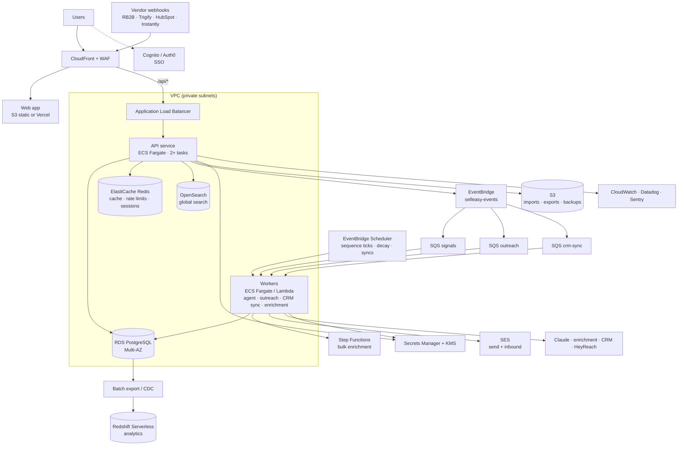

The target architecture comes from `plan.md` and the keys already reserved in `backend/.env.example`. Every piece has an env switch (`DB_DRIVER`, `CACHE_DRIVER`, `SEARCH_DRIVER`, `EVENT_BUS_DRIVER`, `AUTH_DRIVER`, `*_PROVIDER`), so each can be introduced on its own. For container files and the production checklist, see [Engineering → Deployment](/docs/engineering/deployment).

## Target topology (AWS, us-east-1)

## What changes per layer

| Layer | Today | Target | Change required | Phase |
|---|---|---|---|---|
| **Experience** | Next.js locally; mock demo on Vercel | CloudFront + S3 (or Vercel) with `DATA_SOURCE=api`; WAF | CI build per environment; confirm static-export compatibility or keep Vercel | 1 |
| **API runtime** | One Node process, `tsx` / `node` | ECS Fargate behind an ALB, 2+ tasks, blue/green deploys | Dockerfile, IaC (Terraform or CDK), health checks, `trust proxy` config | 1 |
| **Storage** | JSON files, one writer | RDS PostgreSQL with migrations, PITR, Multi-AZ | `PostgresRepository`, transactions, JSON → Postgres migration script | 1 |
| **Async processing** | Agent inside the request; in-memory bus with no subscribers | EventBridge + SQS workers, DLQs, idempotency, outbox | `EventBus` implementation, worker entry point, `202` responses | 2 |
| **Scheduling** | None | EventBridge Scheduler for sequence ticks, decay re-scoring, CRM and vendor syncs | Scheduler handlers | 2 |
| **Intelligence** | Deterministic scoring; template drafts | Claude drafting, sentiment and research; model per task; token budgets | `LlmProvider` for Anthropic, prompt templates, evals, usage metering | 1 → 3 |
| **Integrations** | Mock adapters | Real adapters with per-org credentials, webhooks, sync logs | One adapter per vendor ([landscape](/docs/architecture/integrations-landscape)) | 1 → 4 |
| **Cache** | None | ElastiCache Redis for aggregates, rate limits, token revocation | Cache layer, Redis rate-limit store | 3 |
| **Search** | Substring scan | OpenSearch indexed from domain events (Postgres `pg_trgm` as a stepping stone) | Indexer + search adapter | 3 |
| **Auth** | Local JWT, 7-day tokens in localStorage | Cognito or Auth0, SSO, MFA, refresh tokens in httpOnly cookies, audit log | Auth driver, user mapping, audit module | 1 (hardening) → 4 (SSO) |
| **Secrets** | `.env` + AES-GCM vendor keys | Secrets Manager, KMS envelope encryption, rotation | Key ids in ciphertext, re-encryption script | 1 → 4 |
| **Analytics** | Per-request aggregation | Redshift Serverless with daily snapshots; attribution; agent-influenced pipeline | Export pipeline, data model, analytics API | 4 |
| **Observability** | pino to stdout | CloudWatch logs and alarms, Sentry errors, Datadog APM, business metrics | SDK initialisation, dashboards, on-call runbooks | 1 |

## Scaling path

The table below gives indicative sizing. Cost for each stage is in [Infrastructure cost](/docs/team-and-cost/infrastructure-cost).

| Stage | Workload (assumed) | API / workers | Database | Cache / search | Notes |
|---|---|---|---|---|---|
| **Pilot** (Phase 1–2) | ≤ 20 workspaces, ≤ 100 users, ~50k signals and ~20k emails per month | 2 small API tasks, 1 worker | `db.t4g.medium` Multi-AZ | Redis optional; no OpenSearch | Single region. Keep JSON mode only for local and demo. |
| **GA** (Phase 3) | ~50–100 workspaces, ~500 users, ~500k signals and ~250k emails per month | 2–4 API tasks, 2–4 workers with queue-depth autoscaling | `db.t4g.large` or `db.r6g.large` | Small Redis; 2-node OpenSearch | Add read replica if analytics load grows |
| **Growth** (Phase 4+) | ~200 workspaces, ~2,000 users, ~2M signals and ~1M emails per month | 4–6 API tasks, 4–8 workers | `db.r6g.large` Multi-AZ + read replica | Redis with replica; 3-node OpenSearch | Redshift Serverless; consider extracting signal ingestion |
| **Scale** (beyond this plan) | 1,000+ workspaces | Split ingestion and agent into separate services | Partitioning by `org_id`, or Aurora | Dedicated clusters | Multi-region, data residency (EU) |

## Principles for the migration

1. **One switch at a time.** Each driver ships behind its env flag, runs in staging first, and keeps the mock or memory implementation for local work and demos.
2. **Stateless API first.** Postgres unlocks more than one API task, which in turn unlocks zero-downtime deploys. Do this before anything else.
3. **Queue before scale.** Moving the agent onto SQS protects the API from vendor and LLM latency. Do it before signal volume grows.
4. **Measure before caching.** Add Redis and OpenSearch when dashboards or search miss their latency targets, not before.
5. **Keep mock mode working.** `npm run mock:check` in CI keeps the stakeholder demo in step with the backend.

## Related

- [Engineering → Architecture → scalability path](/docs/engineering/architecture#scalability-path)
- [Roadmap](/docs/roadmap)
- [Decisions](/docs/architecture/decisions)
