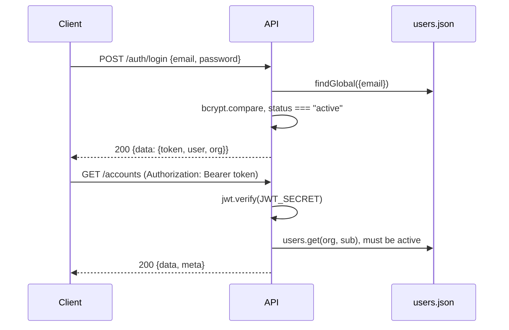

The auth endpoints live in `backend/src/modules/auth/routes.ts`. They call `authService` in `backend/src/modules/organization/service.ts`, and the credential checks happen in `backend/src/middleware/auth.ts`.

## How authentication works



### JWT (user) auth

- **Header:** `Authorization: Bearer <token>`
- **Token:** HS256, signed with `JWT_SECRET`. The claims are `sub` (user ID), `org` (org ID) and `role`. It expires after `JWT_EXPIRES_IN` (default `7d`).
- **Checked on every request:** the API loads the user by `org` and `sub`. It returns `401 "User no longer has access"` if the user was removed or isn't `active`. The role the API enforces is the one **stored in the database**, not the one in the token, so a role change takes effect immediately.
- **Stateless:** the API keeps no sessions. `POST /auth/logout` doesn't revoke anything; the client just throws the token away. A token stays valid until it expires or `JWT_SECRET` changes.
- **Passwords** are hashed with bcrypt (10 rounds). They must be 8 to 200 characters.

### API key auth (webhooks)

- **Header:** `x-api-key: se_live_…`. The API also accepts `Authorization: Bearer se_live_…`.
- **Creating keys:** an admin calls `POST /api-keys` (see [Organization and team](/docs/engineering/api/organization-and-team#api-keys)). The API returns the secret **once**. It stores only a SHA-256 hash and a 12-character prefix.
- **Lookup:** the API matches the key's hash among all non-revoked keys. It returns `401 "Invalid API key"` if nothing matches, `401 "Missing x-api-key header"` if no key was sent, and `403` if the key lacks the route's scope. Every successful call updates the key's `lastUsedAt`.
- **Identity:** the request runs as role `member`, in the key's org, with the key's creator as the acting user.
- **Scopes:** `accounts:read`, `accounts:write`, `signals:write`, `outreach:read`, `outreach:write`, `pipeline:read`, `pipeline:write`. **Today only `signals:write` is enforced**, by `POST /webhooks/signals`. Every other route accepts JWTs only.

<Callout type="warn" title="Credential endpoints have their own rate limit">
`/auth/login`, `/auth/register` and `/auth/accept-invite` allow 20 requests per 15 minutes per IP in production (1000 per 15 minutes in other environments). This is on top of the global API limit.
</Callout>

## Endpoints

### `POST /auth/register`

Creates a new organization and makes the caller its owner. Returns a session.

**Auth:** none. **Status:** `201`.

<TypeTable
  type={{
    orgName: { type: 'string (1–120)', description: 'Workspace name.', required: true },
    domain: { type: 'string (3–253)', description: 'Company domain. Stored in lowercase.', required: true },
    name: { type: 'string (1–120)', description: "Owner's display name.", required: true },
    email: { type: 'email', description: 'Owner email. Must be unique across all workspaces.', required: true },
    password: { type: 'string (8–200)', description: 'Owner password.', required: true },
  }}
/>

**Side effects:** creates the org on the `growth` plan (10 seats, timezone `America/New_York`, autopilot on, default waterfall order), creates the owner user, creates the default ICP, and adds the 19-vendor integration catalog with everything disconnected.

**Errors:** `409 conflict` "An account with this email already exists"; `400` on validation failure.

```bash
curl -s -X POST http://localhost:4000/api/v1/auth/register \
  -H 'content-type: application/json' \
  -d '{"orgName":"Northwind","domain":"northwind.io","name":"Riley Chen","email":"riley@northwind.io","password":"Sup3rSecret!"}'
```

### `POST /auth/login`

Signs in with email and password.

**Auth:** none. **Status:** `200`.

| Field | Type | Required |
|---|---|---|
| `email` | email (trimmed; matched in lowercase) | yes |
| `password` | string, at least 1 character | yes |

**Side effects:** updates the user's `lastActiveAt`.

**Errors:** `401 "Invalid email or password"`; `401 "Your invitation has not been accepted yet"` for users whose status is `invited`.

```bash
curl -s -X POST http://localhost:4000/api/v1/auth/login \
  -H 'content-type: application/json' \
  -d '{"email":"jordan@acmegrowth.com","password":"ChangeMe123!"}'
```

```json title="200 response (trimmed)"
{
  "data": {
    "token": "eyJhbGciOiJIUzI1NiIsInR5cCI6Ik…",
    "user": {
      "id": "usr_6MxxQTxx",
      "name": "Jordan Lee",
      "email": "jordan@acmegrowth.com",
      "role": "owner",
      "avatarColor": "bg-indigo-500",
      "title": "Owner",
      "status": "active",
      "lastActiveAt": "2026-09-17T13:34:12.368Z"
    },
    "org": {
      "id": "org_n5VxwIp6",
      "name": "Acme Growth Inc.",
      "domain": "acmegrowth.com",
      "plan": "growth",
      "seats": 10,
      "timezone": "America/New_York",
      "settings": { "autopilot": true, "waterfallOrder": ["clearbit", "apollo", "fullenrich", "prospeo", "limadata"] },
      "orgId": "org_n5VxwIp6",
      "createdAt": "2026-09-17T12:47:43.082Z",
      "updatedAt": "2026-09-17T13:12:46.869Z"
    }
  }
}
```

The session shape `{ token, user, org }` is the same for register, login and accept-invite. The `user` object is always the **public** user: it never includes `passwordHash` or `inviteToken`.

### `POST /auth/accept-invite`

Accepts a team invitation, sets a password and returns a session.

**Auth:** none. **Status:** `200`.

| Field | Type | Required | Notes |
|---|---|---|---|
| `token` | string, at least 10 characters | yes | The `inviteToken` (`inv_…`) returned by `POST /users/invite` or `POST /users/:id/resend-invite` |
| `password` | string (8–200) | yes | |
| `name` | string | no | Replaces the display name that was generated from the email |

**Side effects:** sets the user's `status` to `active`, clears the invite token, stores the password hash and updates `lastActiveAt`.

**Errors:** `400 "Invitation is invalid or already used"`.

```bash
curl -s -X POST http://localhost:4000/api/v1/auth/accept-invite \
  -H 'content-type: application/json' \
  -d '{"token":"inv_Qm3…","password":"Welcome123!","name":"Sam Rivera"}'
```

<Callout type="info" title="Invite delivery">
The API doesn't send invite emails yet. The web app builds a link, `/login?invite=<token>`, for an admin to share. The login page reads the token from that link and shows the accept-invite form.
</Callout>

### `GET /auth/me`

Returns the current user and their organization. The frontend calls this on every load to refresh the cached session.

**Auth:** JWT. **Roles:** any.

```bash
curl -s http://localhost:4000/api/v1/auth/me -H "Authorization: Bearer $TOKEN"
```

```json title="200 response (shape)"
{ "data": { "user": { "id": "usr_…", "name": "…", "role": "owner", "...": "..." }, "org": { "id": "org_…", "plan": "growth", "...": "..." } } }
```

**Errors:** `401` if the token is invalid or expired, or if the user or org no longer exists.

### `POST /auth/logout`

Signs out. The API is stateless, so this call does nothing on the server; the client discards the token.

**Auth:** JWT. **Roles:** any. **Status:** `204` with no body.

```bash
curl -si -X POST http://localhost:4000/api/v1/auth/logout -H "Authorization: Bearer $TOKEN"
```

### `POST /auth/change-password`

Changes the current user's password.

**Auth:** JWT. **Roles:** any. **Status:** `204`.

| Field | Type | Required | Notes |
|---|---|---|---|
| `currentPassword` | string | yes | |
| `newPassword` | string (8–200) | yes | Must differ from `currentPassword`. Otherwise the error is reported on `details.fieldErrors.newPassword`. |

**Errors:** `400 "Current password is incorrect"`; `400` validation error.

Tokens issued before the change **stay valid** until they expire.

```bash
curl -si -X POST http://localhost:4000/api/v1/auth/change-password \
  -H "Authorization: Bearer $TOKEN" -H 'content-type: application/json' \
  -d '{"currentPassword":"ChangeMe123!","newPassword":"EvenBetter456!"}'
```

## Related endpoints

| Task | Endpoint |
|---|---|
| Update your name, title or email | [`PATCH /me`](/docs/engineering/api/organization-and-team#patch-me) |
| Invite, update or remove users | [`/users/*`](/docs/engineering/api/organization-and-team#team) |
| Create and revoke API keys | [`/api-keys/*`](/docs/engineering/api/organization-and-team#api-keys) |
| Send signals with an API key | [`POST /webhooks/signals`](/docs/engineering/api/signals-and-webhooks#post-webhookssignals) |

## Not implemented yet

- **SSO:** `AUTH_DRIVER=cognito` and the Auth0, Google and Microsoft OAuth variables exist in `.env.example`, but only `local` (JWT + bcrypt) is implemented.
- **Token revocation and refresh tokens:** there's no server-side denylist and no refresh endpoint. When a token expires, the user signs in again.
- **Password reset by email:** not available.
