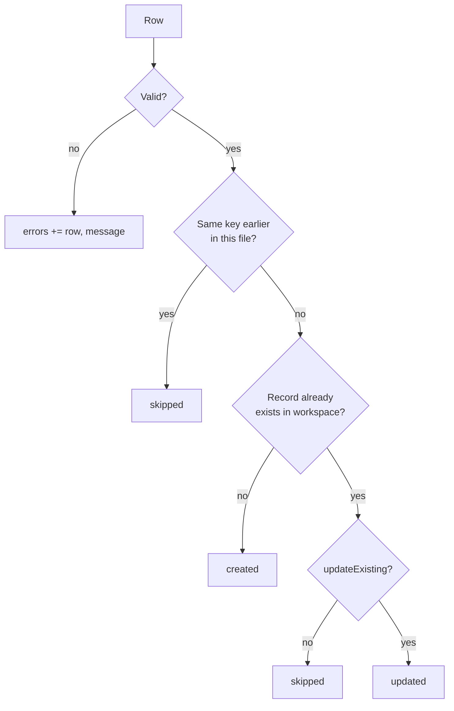

The import endpoints are the supported way to load real data. Every row is validated, deduplicated and scored, which doesn't happen if you edit the JSON files by hand. The code is in `backend/src/modules/import/`. The web app's **Import** dialogs on the Accounts and Contacts pages call these endpoints.

## Endpoints at a glance

| Endpoint | Role | Status |
|---|---|---|
| `POST /import/accounts` | member or higher | `200` |
| `POST /import/contacts` | member or higher | `200` |
| `GET /import/templates/:type` | viewer or higher | `200 text/csv` |

## Request body

Both import endpoints take the same JSON body. The file content is sent as a **string**.

<TypeTable
  type={{
    format: { type: '"csv" | "json"', description: 'How to parse content.', required: true },
    content: { type: 'string', description: 'The raw file text. It must be at most IMPORT_MAX_BYTES (5 MB by default), measured in UTF-8 bytes.', required: true },
    dryRun: { type: 'boolean', description: 'Validate and count without writing anything.', default: 'false' },
    updateExisting: { type: 'boolean', description: 'Update records that already exist instead of skipping them.', default: 'false' },
  }}
/>

- **CSV:** the first row is the header. Parsing is lenient: a UTF-8 BOM is removed, blank lines are skipped, cells are trimmed, rows may have more or fewer cells than the header (extra cells are ignored), and stray quotes are tolerated. Put cells that contain commas in double quotes.
- **JSON:** the content must be an **array of objects**. Array values are joined with `", "`. `null` values are ignored. Numbers and booleans are converted to strings.

## Column names and aliases

Headers are matched **case-insensitively, ignoring everything except letters and digits**. For example, `Company Name`, `company_name` and `companyName` all normalize to `companyname`. The normalized header is then looked up in an alias table. If it isn't there, it's used as-is, so the field names in the tables below always work.

If two columns map to the same field, the first **non-empty** value wins. Unknown columns are ignored.

### Account columns

| Field | Also accepted as | Notes |
|---|---|---|
| `domain` **(required)** | `website`, `url`, `website url`, `company domain`, `company website` | Normalized: lowercase, `https://` and `www.` removed, anything after the first `/` dropped. It must then match `^[a-z0-9.-]+\.[a-z]{2,}$`. |
| `name` | `company`, `company name`, `account name`, `organization`, `organisation` | Defaults to the domain |
| `industry` | | |
| `employees` | `employee count`, `headcount`, `number of employees`, `company size`, `size` | [Number format](#number-format) |
| `revenue` | `annual revenue` | [Number format](#number-format). If it's missing on a new account, it's set to `employees × 120,000`. |
| `country` | | |
| `city` | `location` | |
| `fundingStage` | `funding` | |
| `description` | | |
| `linkedinUrl` | `linkedin`, `company linkedin url` | |
| `technologies` | `tech`, `tech stack`, `technology` | [List format](#list-format) |
| `tags` | `tag` | [List format](#list-format) |
| `ownerEmail` | `owner` | Must be the email of a member of your workspace (case-insensitive) |

### Contact columns

| Field | Also accepted as | Notes |
|---|---|---|
| `firstName` **(required\*)** | `first`, `given name` | \*Or give a full name instead |
| `lastName` | `last`, `surname`, `family name` | Can be empty |
| full name | `name`, `contact name` | Used only when `firstName` is empty. The first word becomes `firstName`, and the rest becomes `lastName` unless a `lastName` column has a value. |
| `email` | `email address`, `work email` | Stored in lowercase. It must look like `x@y.z`. It's also the **deduplication key**. |
| `title` | `job title`, `position` | Used to infer seniority |
| `seniority` | `level` | See [seniority](#seniority) |
| `department` | | |
| `phone` | `phone number`, `mobile` | |
| `linkedinUrl` | `linkedin`, `linkedin profile` | |
| `location` | `city` | Defaults to the account's "city, country" |
| `accountId` | `account` | An existing account ID |
| `accountDomain` | `domain`, `company domain`, `website`, `company website` | Matched to an account, which is **created if it doesn't exist** |
| `accountName` | `company`, `company name`, `organization` | Matched case-insensitively to an **existing** account's name. It's also used as the name of an account created from `accountDomain`. |

**Account resolution for contacts.** The API tries the columns in this order: `accountId`, then `accountDomain`, then `accountName`. A new contact needs one of them.

- `accountId` must exist.
- `accountDomain` uses the existing account with that normalized domain (a non-duplicate account is preferred). If there's none, a new account is created with source "CSV import" or "JSON import" and scored, and `accountsCreated` goes up by one.
- `accountName` must match an existing account. It never creates one.

### Number format

`employees` and `revenue` accept:

- Plain numbers and thousands separators: `1200`, `1,200`
- Currency symbols, which are removed: `$30M`, `€5m`, `£2bn`
- Suffixes: `k` or `thousand`; `m`, `mm` or `million`; `b`, `bn` or `billion`. `12.5k` becomes 12500, and `2 billion` becomes 2000000000.
- Ranges, where the lower bound is used: `50-200` becomes 50
- A trailing `+`: `1000+` becomes 1000

Results are rounded to integers. Anything else fails the row with `employees must be a number (got "lots")`.

### List format

`technologies` and `tags` are split on `;`, `,` or `|`. In CSV, use `;` inside a cell, or quote the cell: `"Salesforce, Snowflake"`. In JSON, you can pass an array.

### Seniority

- **With a `seniority` value:** the value is normalized and mapped. `C-Level`, `C-suite`, `CXO`, `Executive`, `Founder` and `Owner` map to **C-Level**. `VP`, `Vice President`, `SVP`, `EVP` and `Head` map to **VP**. `Director` maps to **Director**. `Manager` and `Lead` map to **Manager**. `IC`, `Individual Contributor`, `Entry`, `Senior` and `Staff` map to **IC**. Any other value fails the row with `Unknown seniority "Intern" (use C-Level, VP, Director, Manager or IC)`.
- **Without one:** the seniority is inferred from `title`:
  - chief, CEO, CTO, CFO, COO, CMO, CRO, CIO, CISO, CPO, founder, co-founder, president or owner (but not "vice president") → C-Level
  - VP, SVP, EVP, vice president or "head of" → VP
  - director → Director
  - manager, lead or supervisor → Manager
  - anything else → IC

## Deduplication and update rules



| | Accounts | Contacts |
|---|---|---|
| **Dedup key** | Normalized `domain` | Lowercased `email`. Rows **without an email are never deduplicated** and are always created. |
| **Same key repeated in the file** | Later rows are `skipped` | Later rows are `skipped` |
| **Existing record, `updateExisting: false`** | `skipped` | `skipped` |
| **Existing record, `updateExisting: true`** | Only the **non-empty** columns are updated, plus `name` if the name column has a value. The change is versioned with source "CSV import" or "JSON import", and the account is re-scored if a scoring field changed. | The non-empty columns are updated, along with `firstName`, `lastName` (if it has a value) and `seniority` (if seniority or title has a value). The contact moves to another account if an account column is given and resolves. |
| **New record** | Created with the same rules as `POST /accounts` (scored, activity logged) | Created with the same rules as `POST /contacts`: `emailStatus` is `unverified` or `missing`, the owner is the account's owner |
| **Afterwards** | If the import wasn't a dry run and at least one account was created, **every** account is re-scored (reason "Import") | Same, if any account was created |

Empty cells never overwrite existing data, so it's safe to re-import a partial file with `updateExisting: true`.

## Dry runs

With `dryRun: true`, the whole pipeline runs: parsing, validation, dedup and account resolution. **Nothing is written.** The counts are what a real import would produce. This includes `accountsCreated`, where each unknown domain is counted once.

The web app's Import dialog has a **Validate only (dry run)** option, and shows the per-row errors before you commit.

## Response

```json title="ImportResult"
{
  "data": {
    "total": 6,
    "created": 1,
    "updated": 0,
    "skipped": 2,
    "errors": [
      { "row": 3, "message": "Invalid domain \"beta-labs\"" },
      { "row": 6, "message": "employees must be a number (got \"lots\")" },
      { "row": 8, "message": "No team member with email nobody@acmegrowth.com" }
    ],
    "dryRun": true
  }
}
```

| Field | Meaning |
|---|---|
| `total` | Rows parsed. Blank CSV lines aren't counted. |
| `created` / `updated` / `skipped` | Row outcomes. `created + updated + skipped + errors.length` equals `total`. |
| `errors[].row` | **CSV:** the line number in the file, where the header is line 1 and blank lines still count (so the first data row is usually 2). If a record spans several lines inside quotes, this is the line where the record ends. **JSON:** the 1-based position in the array. |
| `errors[].message` | A readable reason. A row with an error is skipped, and the rest of the file is still processed. |
| `dryRun` | Echoes the request |
| `accountsCreated` | Contacts only. The number of accounts created, or that would be created, from `accountDomain`. |

### Whole-request errors

These fail the entire request, and nothing is imported:

| Status | Message |
|---|---|
| `400` | `Invalid request body`. For example, `fieldErrors.content` says "content is required" or "content must be at most 5242880 bytes". |
| `400` | `Invalid JSON: <parser message>` |
| `400` | `JSON content must be an array of objects` |
| `400` | `Invalid CSV: <parser message>` |
| `400` | `CSV is empty` |
| `413` | `payload_too_large`. The whole JSON request body is larger than `max(2 × IMPORT_MAX_BYTES, 1 MB)`. |

## Examples

<Tabs items={['Accounts (CSV)', 'Contacts (JSON)', 'TypeScript']}>
<Tab value="Accounts (CSV)">

```csv title="accounts.csv"
Company Name,Website,Employee Count,Annual Revenue,Tech Stack,Owner
Acme Corp,https://www.acme.com/about,"1,200",$30M,Salesforce; Snowflake,taylor@acmegrowth.com
Beta Labs,beta-labs,250,,HubSpot,
Polaris Labs,polarislabs.com,6006,,,

Gamma Inc,gamma.io,lots,,,
Acme again,acme.com,10,,,
Delta,delta.dev,50-200,12.5k,,nobody@acmegrowth.com
```

```bash
curl -s -X POST http://localhost:4000/api/v1/import/accounts \
  -H "Authorization: Bearer $TOKEN" -H 'content-type: application/json' \
  -d "$(node -e 'console.log(JSON.stringify({format:"csv",content:require("fs").readFileSync("accounts.csv","utf8"),dryRun:true}))')"
```

Here's what happens to each row in the demo workspace:

| Line | Outcome |
|---|---|
| 2 | `acme.com` is **created**: 1200 employees, revenue 30,000,000, two technologies, owner Taylor |
| 3 | **Error:** `beta-labs` isn't a valid domain |
| 4 | `polarislabs.com` already exists, so it's **skipped**. With `updateExisting: true` it's **updated** instead. |
| 5 | Blank line. It's ignored and not counted. |
| 6 | **Error:** `lots` isn't a number |
| 7 | `acme.com` already appeared on line 2, so it's **skipped** |
| 8 | **Error:** the owner email isn't a team member |

The result is `{ "total": 6, "created": 1, "updated": 0, "skipped": 2, "errors": [3, 6, 8] }`.

</Tab>
<Tab value="Contacts (JSON)">

```json title="contacts.json"
[
  { "name": "Jane Doe", "Work Email": "jane.doe@acme.com", "Job Title": "VP of Sales", "Company Website": "acme.com", "Company": "Acme Corp" },
  { "firstName": "Sam", "lastName": "Lee", "email": "sam@polarislabs.com", "title": "Head of Growth", "accountDomain": "polarislabs.com" },
  { "firstName": "Kai", "email": "kai@nowhere", "accountName": "Polaris Labs" },
  { "firstName": "Mo", "email": "mo@x.com", "seniority": "Intern", "accountName": "Polaris Labs" },
  { "firstName": "Lu", "email": "lu@x.com", "company": "Unknown Co" },
  { "email": "noname@x.com", "accountDomain": "acme.com" },
  "oops",
  { "firstName": "Ana", "lastName": "Ruiz", "title": "CTO", "domain": "acme.com" }
]
```

```json title="Dry-run result"
{
  "data": {
    "total": 8,
    "created": 3,
    "updated": 0,
    "skipped": 0,
    "errors": [
      { "row": 3, "message": "Invalid email \"kai@nowhere\"" },
      { "row": 4, "message": "Unknown seniority \"Intern\" (use C-Level, VP, Director, Manager or IC)" },
      { "row": 5, "message": "Account \"Unknown Co\" not found — add an account domain column to create it" },
      { "row": 6, "message": "firstName (or name) is required" },
      { "row": 7, "message": "Row must be an object" }
    ],
    "dryRun": true,
    "accountsCreated": 1
  }
}
```

Jane is split into first name "Jane" and last name "Doe". Her seniority is inferred as VP, and the unknown `acme.com` creates the "Acme Corp" account. Sam's seniority is inferred as VP ("Head of"), and Ana's as C-Level (CTO). Ana's row uses the same pending `acme.com` account, so `accountsCreated` stays at 1.

</Tab>
<Tab value="TypeScript">

```ts title="import-file.ts"
import { readFile } from "node:fs/promises"

export async function importFile(path: string, type: "accounts" | "contacts", token: string) {
  const content = await readFile(path, "utf8")
  const format = path.endsWith(".json") ? "json" : "csv"
  const call = async (dryRun: boolean) => {
    const res = await fetch(`http://localhost:4000/api/v1/import/${type}`, {
      method: "POST",
      headers: { "content-type": "application/json", Authorization: `Bearer ${token}` },
      body: JSON.stringify({ format, content, dryRun, updateExisting: true }),
    })
    const json = await res.json()
    if (!res.ok) throw new Error(json.error.message)
    return json.data as { total: number; created: number; updated: number; skipped: number; errors: { row: number; message: string }[] }
  }

  const preview = await call(true)
  if (preview.errors.length) {
    for (const e of preview.errors) console.warn(`row ${e.row}: ${e.message}`)
  }
  return call(false) // rows with errors are skipped, and the rest are imported
}
```

</Tab>
</Tabs>

<Callout type="warn" title="Contact rows can partly succeed">
For a **new** contact, the API resolves the account (creating it when `accountDomain` is new) **before** it checks `seniority`. In a real import, a row with a new domain and an invalid seniority therefore creates the account and then fails the contact. Run a dry run first to catch this.
</Callout>

## `GET /import/templates/:type`

Downloads a CSV template, with a header row and one example row. `:type` is `accounts` or `contacts`. Any other value returns `400`.

**Response:** `text/csv`, with `Content-Disposition: attachment; filename="<type>-import-template.csv"`.

<Tabs items={['accounts', 'contacts']}>
<Tab value="accounts">

```csv
name,domain,industry,employees,revenue,country,city,fundingStage,description,linkedinUrl,technologies,tags,ownerEmail
Acme Corp,acme.com,SaaS,250,30000000,United States,San Francisco,Series B,Workflow automation for finance teams,https://www.linkedin.com/company/acme,Salesforce; Snowflake; Segment,priority; conference-2026,
```

</Tab>
<Tab value="contacts">

```csv
firstName,lastName,email,title,seniority,department,phone,linkedinUrl,location,accountDomain,accountName
Jane,Doe,jane.doe@acme.com,VP of Sales,VP,Sales,+1 415 555 0100,https://www.linkedin.com/in/janedoe,"San Francisco, United States",acme.com,Acme Corp
```

</Tab>
</Tabs>

```bash
curl -s http://localhost:4000/api/v1/import/templates/contacts -H "Authorization: Bearer $TOKEN" -o contacts-template.csv
```

The frontend fetches the template with `fetchImportTemplate(type)`, which calls `api.text()`, and saves it with `downloadText()`.

## Limits and tips

- **Size:** `IMPORT_MAX_BYTES` defaults to 5 MB. The web dialog enforces the same 5 MB limit before it uploads. Split larger files, or raise the limit in `backend/.env`. The JSON body limit follows automatically.
- **Speed:** rows are processed one after another, and every write goes through the JSON store's write queue. Imports of a few thousand rows take seconds. Tens of thousands of rows will be slow until the Postgres driver exists.
- **Import accounts first**, then contacts. Contacts can create accounts from `accountDomain`, but those accounts only get a name and a domain.
- **Owners:** `ownerEmail` sets the account owner, and imported contacts inherit their account's owner.
