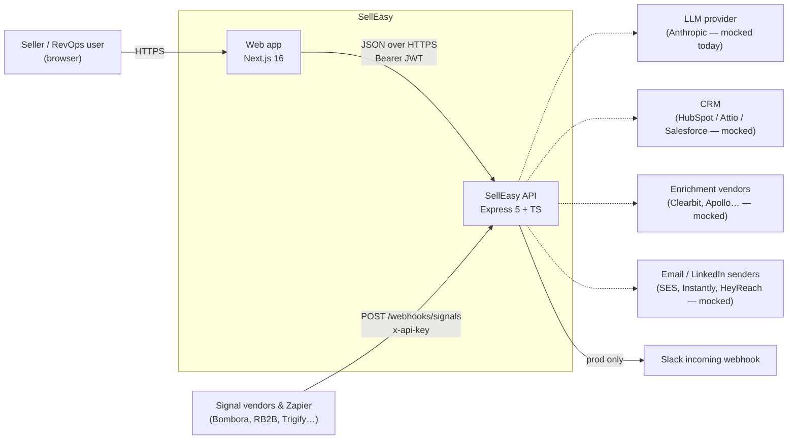
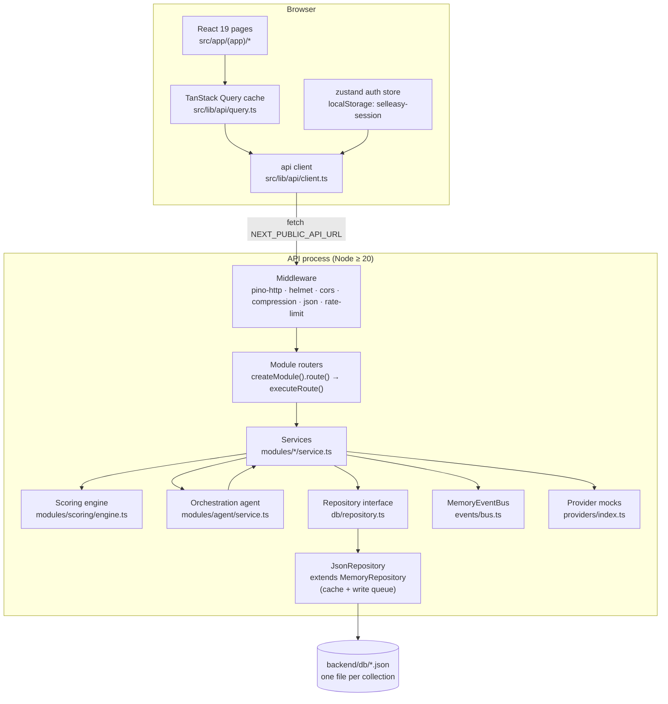
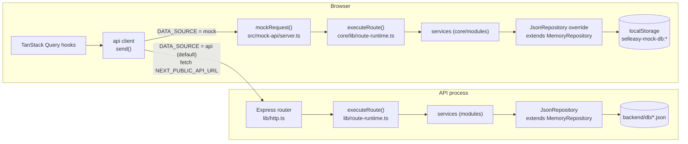
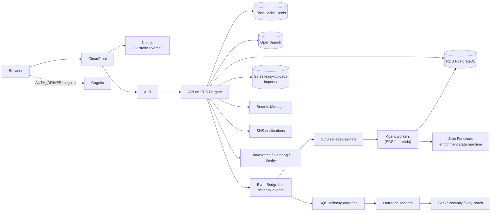
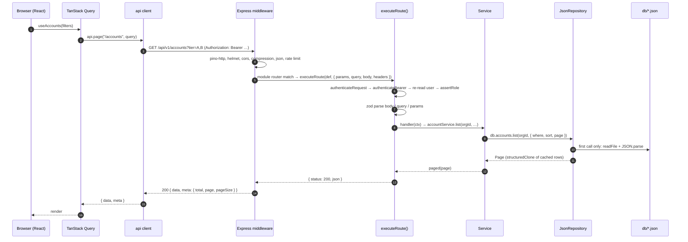
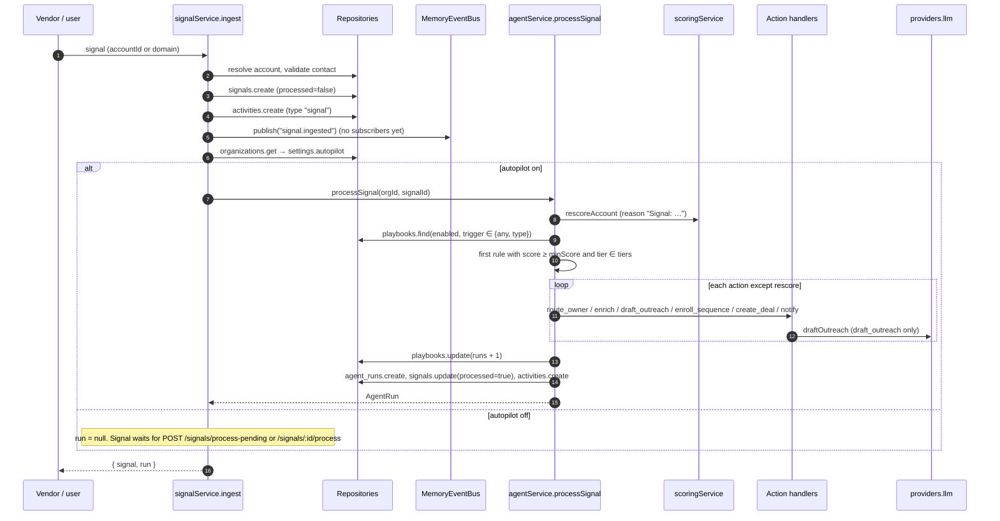

SellEasy is a two-tier web application. A Next.js 16 frontend renders the UI and a single Express 5 + TypeScript API owns all data and business rules. The API is a **modular monolith**: each future "service" (Entity, Signal ingestion, Scoring, Orchestration, Outreach, CRM/Pipeline, and so on) is a folder under `backend/src/modules/`. Every module talks to storage through one tenant-scoped `Repository<T>` interface. Today that interface is backed by JSON files on disk.

The web app can also run **without** the API: in mock data mode it executes a generated copy of the backend's route and service code in the browser (see [Two data modes](#two-data-modes)).

This page covers the system as built today, the AWS architecture it is meant to grow into, and the decisions that connect the two.

## System context

Dotted arrows are **provider adapters**. Their interfaces exist in `backend/src/providers/index.ts`, but every implementation is an offline mock (see [Events and providers](/docs/engineering/backend/events-and-providers)). The one real outbound call today is the Slack incoming webhook in `notificationService.notify`. It only fires when `NODE_ENV=production` and `SLACK_WEBHOOK_URL` starts with `https://hooks.slack.com/`.

## Containers (as implemented)

| Container | Technology | Location | Responsibility |
|---|---|---|---|
| Web app | Next.js 16, React 19, shadcn/ui, TanStack Query 5, zustand | `frontend/` | Rendering, forms, client-side routing. In `api` mode it holds **no business data**, and the only persisted browser state is the session (`selleasy-session`). In `mock` mode it also runs the API code and stores the data in `localStorage`. |
| API | Express 5, TypeScript, zod 4, pino | `backend/src/` | Auth, validation, every business rule, persistence, OpenAPI. |
| Database | JSON files | `backend/db/` (`DATA_DIR`) | One JSON array per collection, written atomically. |
| API docs | swagger-ui-express | `GET /api/v1/docs`, `GET /api/v1/openapi.json` | Generated from route definitions. |
| Product and engineering docs | Fumadocs (Next.js) | `docs/` | This site. |

## Two data modes

The web app picks its data source at build time from `NEXT_PUBLIC_DATA_SOURCE` (`frontend/src/lib/api/client.ts`):

| | `api` (default) | `mock` |
|---|---|---|
| What runs the business logic | The Express API | The same `backend/src` code, copied to `frontend/src/mock-api/core` by `npm run mock:sync` |
| Storage | JSON files in `DATA_DIR` | `localStorage`, one key per collection (`selleasy-mock-db:<collection>`) |
| Auth | HS256 JWTs, bcrypt, SHA-256 API key hashes | Unsigned `mock.` tokens and a non-cryptographic hash. **Demo only.** |
| Who sees the data | Everyone using that API | Only the current browser |
| Deployment | API and web app | Web app only (for example on Vercel) |

`executeRoute()` is the shared core of both modes: it authenticates, checks roles, validates with zod, calls the handler and builds the response envelope, with no dependency on Express. Details: [Mock data mode](/docs/engineering/frontend/mock-mode) and [Environments and data modes](/docs/architecture/environments-and-data-modes).

## Target AWS architecture

`plan.md` and `backend/.env.example` describe where the system is heading. Every infrastructure dependency already has env keys (`DATABASE_URL`, `REDIS_URL`, `OPENSEARCH_NODE`, `EVENTBRIDGE_BUS_NAME`, `SQS_*_QUEUE_URL`, `STEP_FUNCTIONS_ENRICHMENT_ARN`, `SES_FROM_EMAIL`, `COGNITO_*`, `SECRETS_MANAGER_PREFIX`, `CLOUDWATCH_LOG_GROUP`) and a `*_DRIVER` switch. `plan.md` §11 lists the drivers themselves as out of scope for this iteration.

### Target vs. implemented

| Concern | Target (plan.md / .env.example) | Implemented today | Switch |
|---|---|---|---|
| Web hosting | CloudFront + S3, or Vercel | `next dev` / `next start` locally. A frontend-only Vercel demo is possible with `NEXT_PUBLIC_DATA_SOURCE=mock`. | `NEXT_PUBLIC_DATA_SOURCE` |
| API runtime | ECS Fargate behind an ALB | Single Node process (`node dist/server.js`) | n/a |
| Primary database | RDS PostgreSQL | `JsonRepository` over `backend/db/*.json` | `DB_DRIVER=json` (a `postgres` value **throws at startup**) |
| Pipeline DB, warehouse | `PIPELINE_DATABASE_URL`, Redshift/Snowflake | Not implemented; analytics are computed per request | env keys only |
| Cache | ElastiCache Redis | None (the repository's in-memory cache only) | `CACHE_DRIVER` is validated but unused |
| Search | OpenSearch | Case-insensitive substring scan in memory (`GET /search`) | `SEARCH_DRIVER` is validated but unused |
| Event bus | EventBridge / SQS | `MemoryEventBus` (handler `Map` plus `queueMicrotask`); **nothing subscribes** | `EVENT_BUS_DRIVER` is validated; any value other than `memory` logs a warning and falls back to the in-memory bus |
| Workflow | Step Functions (enrichment) | Synchronous `accountService.enrich` | `STEP_FUNCTIONS_ENRICHMENT_ARN` unused |
| Agent processing | Async workers | Synchronous `agentService.processSignal` inside the ingest request | n/a |
| Email | SES / Instantly / Mailpool | `mockEmail.send` logs at debug level | `EMAIL_PROVIDER` (non-`mock` warns, uses mock) |
| LLM | Anthropic (`ANTHROPIC_MODEL`) | `mockLlm` templates | `LLM_PROVIDER` (non-`mock` warns, uses mock) |
| CRM | HubSpot / Attio / Salesforce | `mockCrm` generates fake CRM ids | `CRM_PROVIDER` |
| Enrichment | Vendor waterfall | `mockEnrichment` | `ENRICHMENT_PROVIDER` |
| Auth | Cognito / Auth0 / Google / Microsoft SSO | Local JWT (HS256) + bcrypt | `AUTH_DRIVER` is validated but only `local` exists |
| Secrets | Secrets Manager | `.env` file; vendor keys AES-256-GCM encrypted in `integrations.json` | `SECRETS_MANAGER_PREFIX` unused |
| Uploads | S3 `imports/` | Import content sent inline as a JSON string (limit `IMPORT_MAX_BYTES`) | `S3_BUCKET` unused |
| Observability | CloudWatch, Datadog, Sentry | pino to stdout (pretty in non-prod) | `SENTRY_DSN`, `DD_*` unused |

## Service boundaries and backend modules

`plan.md` groups the domain into logical services. The integration catalog's `feeds` field (`domain/constants.ts`) uses the same names. Each maps to one or more modules, all mounted under `API_PREFIX` (`/api/v1`).

| Logical service | Module folder(s) | Base path(s) | Owns collections |
|---|---|---|---|
| Auth service | `auth`, `organization` | `/auth`, root (`/org`, `/me`, `/users`, `/api-keys`) | `organizations`, `users`, `user_preferences`, `api_keys` |
| Entity service | `accounts`, `contacts`, `import` | `/accounts`, `/contacts`, `/import` | `accounts`, `contacts` |
| Signal ingestion | `signals` (also exports `webhooksModule`) | `/signals`, `/webhooks` | `signals` |
| Scoring | `scoring` | `/icp` | `icp_config` |
| Orchestration agent | `agent` | `/agent` | `playbooks`, `agent_runs`, `drafts` |
| Outreach service | `outreach` | root (`/sequences`, `/enrollments`, `/mailboxes`, `/inbox`, `/outreach/stats`) | `sequences`, `enrollments`, `mailboxes`, `inbox_messages` |
| CRM / Pipeline | `pipeline` | `/deals` | `deals` |
| Timeline | `activities`, `notifications` | `/activities`, `/notifications` | `activities`, `notifications` |
| Analytics | `analytics`, `search` | `/analytics`, `/search` | read-only across collections |
| Integrations | `integrations` | `/integrations` | `integrations` |
| Platform | `meta`, `admin` | `/meta`, `/admin` | none |

<Callout type="info" title="Modules call each other directly">
Boundaries are enforced by convention, not by the process. Services import each other directly: `agentService` calls `accountService`, `contactService`, `pipelineService`, `notificationService`, `enrollmentService` and `scoringService`. They also read other modules' collections through `db.*`. When a module is extracted into its own service, those calls become HTTP calls or events.
</Callout>

There are 18 route modules in `src/app.ts`, registering 139 operations on 111 paths (see `GET /api/v1/openapi.json`).

## Request flow

A write follows the same path. The repository call goes through `MemoryRepository`'s per-collection write queue (`mutate`), and `JsonRepository.persistRows()` then rewrites the whole file (`<name>.json.<pid>.tmp`, then `rename`). In mock mode the Express steps are replaced by `mockRequest()`, and `persistRows()` writes to `localStorage` instead. On success the frontend's `useApiMutation` invalidates **every** cached query by default, and the affected screens refetch.

Details: [Request lifecycle](/docs/engineering/backend/request-lifecycle), [Data layer](/docs/engineering/backend/data-layer), [Frontend data layer](/docs/engineering/frontend/data-layer).

## The agent loop

Signals come in through `POST /signals` (user JWT), `POST /webhooks/signals` (API key with `signals:write`) or `POST /signals/simulate` (when `ENABLE_SIMULATION` is on). All three call `signalService.ingest`. If the organization has `settings.autopilot = true`, the agent runs **synchronously in the same request**.

A draft created with `requireApproval: true` leaves the run in `awaiting_approval`. A human then approves, rejects or regenerates the draft under `/agent/drafts/:id/*`. The full algorithm is in [Orchestration agent](/docs/engineering/backend/orchestration-agent).

## Multi-tenancy

- The **organization is the tenant root**. An `Organization` record's `orgId` equals its own `id`, so it is read with `db.organizations.get(orgId, orgId)`.
- Every persisted record carries `orgId` (`Stored<T>` in `domain/types.ts`). Every `Repository` method except `findGlobal` and `truncate` takes `orgId` as its first argument, and `MemoryRepository` (the base of `JsonRepository`) filters on it (`scoped()`), including in `get`, `update` and `remove`.
- `orgId` always comes from the authenticated principal (the `AuthContext` returned by `authenticateRequest`, exposed to handlers as `ctx.orgId`). It is never read from the request body or URL.
- A record that belongs to another tenant looks exactly like a missing record: `get` returns `null`, and the route answers `404`. The test suite checks this (`registers a new isolated workspace`).
- `findGlobal` is the only cross-tenant read. It is used for login by email, API key lookup by hash, invite acceptance by token, and email uniqueness checks. **Emails are unique across all workspaces.**
- `IcpConfig` is one record per org whose `id` is the `orgId`.

## Key design decisions

<Accordions>
<Accordion title="ADR-1 · JSON-file repository behind a storage-agnostic interface">
**Context.** The product needed a real backend quickly, with no infrastructure to run locally.

**Decision.** Services depend only on `Repository<T>` (`db/repository.ts`). It has a deliberately small query language (`eq`, `ne`, `in`, `nin`, comparisons, `exists`, `contains`, `$or`) that maps directly to SQL. `MemoryRepository` implements the query language and the write queue with no Node APIs. The first driver, `JsonRepository`, extends it with one file per collection and atomic writes. `DB_DRIVER` selects the driver in `db/index.ts`.

**Consequences.** Zero-setup local development, and files you can inspect by hand. Because the query logic is portable, the frontend's mock mode reuses it with a `localStorage` driver. The driver is single-process only and keeps full collections in memory. Every write rewrites the whole file. There are no transactions: multi-collection operations such as cascading deletes are not atomic. The Postgres driver is a stub that throws.
</Accordion>
<Accordion title="ADR-2 · zod-driven routes and a generated OpenAPI document">
**Decision.** Every endpoint is declared with `createModule(tag, basePath).route({ method, path, body, query, params, roles, handler })`. `route()` records the definition in `routeRegistry` and binds it to Express. The transport-agnostic `executeRoute()` in `lib/route-runtime.ts` authenticates, checks roles, validates with zod, calls the handler and builds the response. Handlers get a `RouteContext` without `req` or `res`, and return `fileResponse()` for downloads. `buildOpenApi()` turns the registry into OpenAPI 3.1 with `z.toJSONSchema`.

**Consequences.** Validation, docs and handler types can't drift apart. Because handlers never touch Express, the same definitions run in the browser in mock mode. Response schemas are **not** described (the responses have empty `content`). The frontend keeps a hand-maintained copy of the types in `frontend/src/lib/types.ts`.
</Accordion>
<Accordion title="ADR-3 · Synchronous agent processing now, event bus later">
**Decision.** `signalService.ingest` calls `agentService.processSignal` inline when autopilot is on. It still publishes `signal.ingested` on the `EventBus` abstraction so an async consumer can be added without touching callers.

**Consequences.** Simple and deterministic: the response contains the run, which tests and the UI both use. Ingest latency includes re-scoring, the LLM call and every action. Webhook batches (up to 100) are processed one at a time. Moving to EventBridge/SQS means `ingest` stops calling the agent and returns `run: null` (already the documented "queued" case).
</Accordion>
<Accordion title="ADR-4 · TanStack Query with invalidate-all mutations">
**Decision.** Server state lives in TanStack Query (`staleTime` 15 s). `useApiMutation` defaults to `invalidate: "all"`, because one server action (for example approving a draft) can change drafts, runs, contacts, enrollments, activities and analytics together.

**Consequences.** The UI is always correct, at the cost of extra refetches after each write. Hooks can pass a narrower `invalidate` list, or `"none"`, when they know the blast radius.
</Accordion>
<Accordion title="ADR-5 · Provider adapters with mocks">
**Decision.** Vendor access goes through the interfaces in `providers/index.ts` (`EnrichmentProvider`, `CrmProvider`, `EmailProvider`, `LlmProvider`, `VendorConnectionTester`). Offline mocks are selected by `*_PROVIDER` env vars.

**Consequences.** The whole product works offline and in tests. Real adapters are additive. The mocks are only partly deterministic: CRM ids and some LLM subjects use `Math.random`.
</Accordion>
<Accordion title="ADR-6 · Stateless JWT sessions that re-read the user">
**Decision.** Tokens are HS256 JWTs with `sub`, `org` and `role` claims. `authenticateBearer` still loads the user on every request and uses the stored role and status.

**Consequences.** Role changes and removals take effect immediately, at the cost of one cached lookup per request. Logout is client-side only: there is no token revocation list.
</Accordion>
<Accordion title="ADR-7 · Mock data mode by running the backend code in the browser">
**Context.** Stakeholders need a clickable demo that can be deployed as a frontend only (for example on Vercel), without hosting the API.

**Decision.** `NEXT_PUBLIC_DATA_SOURCE=mock` makes the API client call `mockRequest()` instead of `fetch`. `frontend/scripts/sync-mock-core.mjs` copies `backend/src` into `frontend/src/mock-api/core` and swaps the few Node- or Express-only files for browser overrides. No business logic is rewritten for the frontend.

**Consequences.** The demo behaves exactly like the real API and stays correct as the backend changes, as long as the generated copy is re-synced (`npm run mock:check` catches drift). The shared backend code must stay free of Node-only imports. Mock auth and crypto are not secure, and data lives only in one browser.
</Accordion>
</Accordions>

## Non-functional aspects

### Security

Covered in detail in [Auth and security](/docs/engineering/backend/auth-and-security). In short: helmet (CSP disabled), a CORS allow-list, a global rate limit plus a stricter limit on credential endpoints, zod validation on every input, bcrypt (cost 10) password hashes, SHA-256 API key hashes, AES-256-GCM encryption for vendor credentials, pino redaction of `authorization` and `x-api-key` headers, and tenant scoping in the repository.

### Performance limits of the JSON driver

| Aspect | Behaviour | Practical consequence |
|---|---|---|
| Reads | Whole collection held in a `Map`. Every query is a linear scan plus `structuredClone` of the results. | Fine for thousands of records per collection. Latency grows linearly with data volume. |
| Writes | Serialized per collection. Each mutation rewrites the entire file with `JSON.stringify(…, null, 2)`. | Write throughput drops as files grow. Bulk operations (`createMany`, `updateMany`) are much cheaper than loops. |
| Aggregates | `/analytics/*`, `/signals/stats` and `/agent/stats` load whole collections on each request. | Dashboards get slower as data grows. There is no caching layer. |
| Concurrency | One process only. The cache is never invalidated by outside edits. | You can't run multiple API replicas against the same `DATA_DIR`. |
| Durability | Atomic rename per file, but no cross-file transactions. | A crash in the middle of a cascade can leave orphans. |
| Memory | Every collection that has been touched stays loaded. | Memory use roughly equals the size of the database. |

### Scalability path

<Steps>
<Step>
**Postgres driver.** Implement `createPostgresRepository` (see [Data layer](/docs/engineering/backend/data-layer#implementing-the-postgres-driver)). The API then becomes stateless and can scale horizontally behind a load balancer.
</Step>
<Step>
**Move the agent off the request path.** Add an `EventBus` implementation (EventBridge/SQS), subscribe a worker to `signal.ingested`, and stop calling `processSignal` from `ingest`.
</Step>
<Step>
**Cache and search.** Put Redis in front of the `/analytics/*` aggregates and `/meta`. Index accounts, contacts and deals in OpenSearch for `GET /search`.
</Step>
<Step>
**Warehouse analytics.** Compute the analytics overview from a warehouse (`ANALYTICS_WAREHOUSE_URL`) instead of scanning OLTP data.
</Step>
<Step>
**Split services.** Extract the modules along the boundaries in the table above once team or load requires it. Start with signal ingestion and the agent workers.
</Step>
</Steps>

See also [Tech debt](/docs/engineering/tech-debt) and [Deployment](/docs/engineering/deployment).
