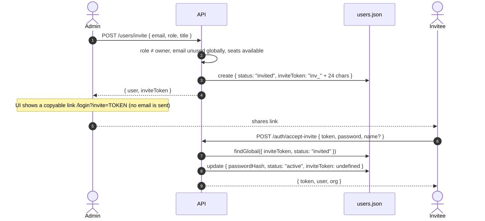

Authentication is local to the API (`AUTH_DRIVER=local`). Users get HS256 JWTs signed with `JWT_SECRET` and passwords are hashed with bcrypt. Machine clients (vendor webhooks, Zapier) use organization API keys, stored only as SHA-256 hashes. Authorization is a four-level role model enforced by `executeRoute()`. Tenant isolation is enforced in the repository layer. Cognito, Auth0 and Google/Microsoft SSO exist only as env keys.

Relevant files: `src/middleware/auth.ts`, `src/lib/roles.ts`, `src/lib/route-runtime.ts`, `src/modules/auth/routes.ts`, `src/modules/organization/service.ts`, `src/lib/crypto.ts`, `src/lib/ids.ts`, `src/app.ts`.

## Authentication functions

`src/middleware/auth.ts` exports plain functions that take header values, not Express requests. Nothing augments `req`, and there is no Express auth middleware.

| Function | Purpose |
|---|---|
| `signToken(user)` | Issues a JWT for `{ id, orgId, role }` |
| `authenticateBearer(header)` | Verifies an `Authorization` header value and returns an `AuthContext` |
| `authenticateApiKey(key, scope?)` | Looks up an API key and returns an `AuthContext` |
| `authenticateRequest(mode, headers, scope?)` | Called by `executeRoute()`. `"user"` → `authenticateBearer(headers.authorization)`. `"apiKey"` → `authenticateApiKey(headers["x-api-key"] ?? <Authorization value without "Bearer ">, scope)`. |
| `assertRole`, `atLeast`, `AuthContext` | Re-exported from `src/lib/roles.ts` |

```ts title="src/lib/roles.ts"
export interface AuthContext {
  userId: string
  orgId: string
  role: Role
  via: "jwt" | "apiKey"
  scopes?: string[]
}
```

Handlers read the principal as `ctx.auth` and `ctx.orgId`.

## JWT sessions

### Issuance

`signToken(user)` is called by `register`, `login` and `acceptInvite`:

```ts title="src/middleware/auth.ts"
export function signToken(user: { id: string; orgId: string; role: Role }) {
  return jwt.sign({ sub: user.id, org: user.orgId, role: user.role } satisfies TokenPayload, config.JWT_SECRET, {
    expiresIn: config.JWT_EXPIRES_IN as jwt.SignOptions["expiresIn"],
  })
}
```

| Claim | Value |
|---|---|
| `sub` | user id |
| `org` | organization id (tenant) |
| `role` | role at issuance (informational only; see below) |
| `iat` / `exp` | added by `jsonwebtoken`. `exp` comes from `JWT_EXPIRES_IN` (default `7d`). |

The algorithm is the `jsonwebtoken` default, HS256. The auth endpoints return `{ token, user, org }`, and the frontend stores the token in the persisted zustand store `selleasy-session` (localStorage).

### Verification

`authenticateBearer(header)` runs for every route with `auth: "user"` (the default):

<Steps>
<Step>It requires a header value of the form `Bearer <token>`. Otherwise it returns `401 Authentication required`.</Step>
<Step>`jwt.verify(token, JWT_SECRET)`. Any failure, including expiry, returns `401 Session expired or invalid token`.</Step>
<Step>**It re-reads the user**: `db.users.get(payload.org, payload.sub)`. If the user is missing or `status !== "active"`, it returns `401 User no longer has access`.</Step>
<Step>It returns `{ userId, orgId, role: user.role, via: "jwt" }`, which `executeRoute()` exposes as `ctx.auth`. The **stored** role is used, not the claim, so role changes and removals apply on the next request.</Step>
</Steps>

<Callout type="info" title="No server-side logout or refresh">
`POST /auth/logout` is a no-op that returns 204, and the client discards the token. There are no refresh tokens and no revocation list. A token stays valid until `exp` unless its user is removed or deactivated. Rotating `JWT_SECRET` invalidates every session. The frontend clears its session when it gets a `401` while holding a token.
</Callout>

<Callout type="error" title="Mock mode tokens are for demos only">
In the frontend's [mock data mode](/docs/engineering/frontend/mock-mode), `middleware/auth.ts` is replaced by a browser override. `signToken` there returns `mock.` followed by **unsigned** base64 JSON (`{ sub, org, role, exp }`, valid for 7 days), and anyone can forge one. `lib/crypto.ts` is replaced too: `sha256` becomes a non-cryptographic FNV-1a digest, and `encrypt`/`decrypt` become base64 with a `mock.` prefix. This is acceptable only because the whole database lives in the visitor's own browser. Never use mock mode with real credentials or customer data, and never copy these overrides into server code.
</Callout>

## Passwords

- Hashing uses `bcryptjs` with **cost 10** (`hashPassword` in `modules/organization/service.ts`).
- Passwords must be 8–200 characters on register, accept-invite and change-password. The bootstrap password must be at least 8 characters (`BOOTSTRAP_ADMIN_PASSWORD`).
- **Login** (`authService.login`) looks the user up **globally** by lower-cased email. It returns the same `401 Invalid email or password` for an unknown email and for a wrong password. Users with status `invited` get `401 Your invitation has not been accepted yet`. A successful login updates `lastActiveAt`.
- **Change password** requires the current password (`400 Current password is incorrect`), and the new one must be different (a zod refine).
- Emails are unique **across all organizations**: register, invite and profile updates all check with `findGlobal`.

## Registration, invitations and acceptance



- `POST /auth/register` (public) calls `createOrganization()`, which creates the org (plan `growth`, 10 seats), the owner, the default ICP and the integration catalog, then returns a session.
- `POST /users/invite` (admin and above) returns the invite token **in the response** because invite emails aren't implemented. The frontend builds `…/login?invite=<token>`.
- `POST /users/:id/resend-invite` issues a **new** token, which invalidates the old one.
- Seat limit: an invite fails with `400 All seats are in use…` when the user count (active plus invited) is at least `org.seats`.
- Accepting consumes the token (`inviteToken: undefined`). Reusing it returns `400 Invitation is invalid or already used`.

## API keys

| Aspect | Implementation |
|---|---|
| Creation | `POST /api-keys` (admin and above) with `{ name, scopes }`. Scopes must be in `API_SCOPES`. |
| Secret format | `randomSecret("se_live_", 32)`: the prefix `se_live_` plus `randomToken(32)`, which is 32 characters from `[a-zA-Z0-9]` (Web Crypto `globalThis.crypto.getRandomValues`, mapped by modulo, in `lib/ids.ts`). |
| Storage | `hash: sha256(secret)` as hex, and `prefix: secret.slice(0, 12)` for display. **The plaintext is returned once**, in the create response (`{ apiKey, secret }`). |
| Lookup | `authenticateRequest` passes the `x-api-key` header, or falls back to the `Authorization: Bearer <key>` value. `authenticateApiKey` then calls `db.apiKeys.findGlobal({ hash: sha256(key), revoked: false })`. |
| Scope check | If the route declares `scope`, a key without it gets `403 API key lacks the "<scope>" scope`. |
| Usage tracking | `lastUsedAt` is updated on every successful call. |
| Principal | `{ userId: record.createdBy, orgId: record.orgId, role: "member", via: "apiKey", scopes }` (returned as the `AuthContext`) |
| Revocation | `POST /api-keys/:id/revoke` sets `revoked: true`. The key then fails lookup (`401 Invalid API key`). Keys are never deleted. |

Defined scopes: `accounts:read`, `accounts:write`, `signals:write`, `outreach:read`, `outreach:write`, `pipeline:read`, `pipeline:write`.

<Callout type="warn" title="Only one route accepts API keys today">
`POST /webhooks/signals` (scope `signals:write`) is the only `auth: "apiKey"` route. The other scopes can be assigned but no endpoint checks them yet. JWT routes never accept API keys.
</Callout>

SHA-256 without a salt is acceptable here because the secrets are high-entropy random strings (about 190 bits; the modulo mapping adds a slight bias), so they are not open to dictionary attacks the way passwords are.

## Roles

```ts title="src/lib/roles.ts"
const RANK: Record<Role, number> = { viewer: 0, member: 1, admin: 2, owner: 3 }
export const atLeast = (role: Role): Role[] => (Object.keys(RANK) as Role[]).filter((r) => RANK[r] >= RANK[role])
export function assertRole(auth: AuthContext | undefined, roles: Role[]) {
  if (!auth) throw unauthorized()
  if (!roles.includes(auth.role)) throw forbidden()
}
```

| Role | Can | Examples of admin-only / owner-only endpoints |
|---|---|---|
| `viewer` | All `GET`s, plus own profile and preferences, change password, logout, `POST /icp/preview` | — |
| `member` | All data writes (accounts, contacts, signals, deals, sequences, drafts, inbox, imports, integration sync) | — |
| `admin` | Everything a member can do, plus org details, team, API keys, ICP (`PUT /icp`), playbooks, integration connect/disconnect/settings, waterfall order, mailbox delete | `PATCH /org`, `POST /users/invite`, `PATCH`/`DELETE /users/:id`, `/api-keys*`, `PUT /icp`, `POST`/`PATCH`/`DELETE /agent/playbooks*` |
| `owner` | Everything an admin can do, plus plan changes and workspace reset | `POST /org/plan`, `POST /admin/reset` |

Rules enforced in `orgService.updateUser` / `removeUser`: nobody can be invited as, or promoted to, `owner`. The owner's role can't be changed and the owner can't be removed. Users can't change their own role or remove themselves.

The defaults (GET is viewer and above, writes are member and above) are described in [Request lifecycle](/docs/engineering/backend/request-lifecycle#default-role-policy). The product-level matrix is in [Roles and permissions](/docs/product/roles-and-permissions).

## Tenant isolation

- The tenant id comes only from the verified principal (`ctx.auth.orgId`, also available as `ctx.orgId`). No route takes an `orgId` parameter.
- Every repository call is scoped by `orgId`. `get`, `update` and `remove` check the record's `orgId`, so guessing another tenant's id gives `404`.
- Cross-tenant reads (`findGlobal`) are limited to login, API key lookup, invite acceptance, email uniqueness, bootstrap and seeding.
- Services validate every referenced id inside the same org (owner ids, account ids, contact ids, sequence ids, mailbox ids) before writing.
- The API test `registers a new isolated workspace` checks that a second tenant sees 0 accounts and gets `404` for a foreign account id.

## Encrypting vendor credentials

Integration API keys are encrypted with **AES-256-GCM** before they are stored:

```ts title="src/lib/crypto.ts"
const key = () => Buffer.from(config.ENCRYPTION_KEY, "hex") // 32 bytes

/** AES-256-GCM encrypt → "iv.tag.ciphertext" (base64url). */
export function encrypt(plain: string) {
  const iv = randomBytes(12)
  const cipher = createCipheriv("aes-256-gcm", key(), iv)
  const data = Buffer.concat([cipher.update(plain, "utf8"), cipher.final()])
  return [iv, cipher.getAuthTag(), data].map((b) => b.toString("base64url")).join(".")
}
```

- `ENCRYPTION_KEY` must be exactly 64 hex characters (validated in `config.ts`).
- `integrationService.connect` tests the key through `providers.connections.test` (mock: at least 8 characters), then stores `apiKeyEncrypted = encrypt(apiKey)` and `apiKeyMasked = mask(apiKey)` (`••••••••` plus the last 4 characters).
- `toPublicIntegration()` removes `apiKeyEncrypted` from every response. A test checks that the plaintext never appears in a response.
- `disconnect` clears both fields.
- `decrypt(payload)` exists for future real adapters. **Nothing calls it yet.**

<Callout type="error" title="Key rotation">
There is no key versioning. Changing `ENCRYPTION_KEY` makes every stored `apiKeyEncrypted` unreadable, and GCM authentication will fail. To rotate: decrypt with the old key, re-encrypt with the new one (a one-off script), or have users reconnect their integrations. Consider adding a key-id prefix to the payload before real adapters depend on it.
</Callout>

## HTTP hardening

| Control | Setting | Location |
|---|---|---|
| `x-powered-by` | disabled | `app.ts` |
| helmet | defaults with `contentSecurityPolicy: false` (for Swagger UI) | `app.ts` |
| CORS | allow-list `CORS_ORIGINS` (comma-separated, `*` allowed), `credentials: true`. Requests without an `Origin` are allowed. | `app.ts` |
| Global rate limit | `RATE_LIMIT_MAX` requests per `RATE_LIMIT_WINDOW_MS` per IP (default 600/min) on everything under `API_PREFIX` | `app.ts` |
| Auth rate limit | `/auth/login`, `/auth/register`, `/auth/accept-invite`: **20 per 15 min** in production, 1000 otherwise | `modules/auth/routes.ts` |
| Proxy awareness | `trust proxy = 1`, so the client IP comes from `X-Forwarded-For` behind one proxy | `app.ts` |
| Body size | JSON limit `max(2 × IMPORT_MAX_BYTES, 1 MB)`. Oversized bodies return `413`, malformed ones `400`. Import `content` is also capped at `IMPORT_MAX_BYTES`. | `app.ts`, `modules/import/routes.ts` |
| Log redaction | `req.headers.authorization`, `req.headers['x-api-key']`, `*.password`, `*.apiKey` | `lib/logger.ts` |
| Error hygiene | Unknown errors return a generic `500 internal_error`. Details are only logged. | `middleware/error.ts` |
| Dev-only features | `POST /signals/simulate` requires `ENABLE_SIMULATION`. `POST /admin/reset` requires `ENABLE_ADMIN_RESET` **and** `NODE_ENV !== "production"`. | `config.ts` |

<Callout type="info">
Rate limits use the in-memory store from `express-rate-limit`, so each API process counts separately. With several replicas, use a shared store (Redis) or enforce limits at the load balancer or WAF.
</Callout>

## Input validation

- Every body, query and path parameter goes through zod in `executeRoute()`. Unknown body keys are **stripped** (zod's default for `z.object`), so clients can't set server-owned fields like `orgId`, `score` or `passwordHash`.
- Services add semantic checks: references exist in the same org, domains contain a dot, emails are unique, enum transitions are valid, and ICP thresholds satisfy `A > B > C`.
- Sort fields are whitelisted (`parseSort`). Filter values reach the repository only as data, never as code, so the JSON driver has no injection surface. A future SQL driver must use parameterized queries.
- CSV import uses `csv-parse` and reports row-level errors instead of failing the whole request.

## Secrets handling

- `backend/.env` is git-ignored. `backend/.env.example` is committed and contains **only placeholders**.
- `npm run setup` (`scripts/setup.mjs`) generates `JWT_SECRET` and `ENCRYPTION_KEY` with `crypto.randomBytes(32).toString("hex")` when it creates `backend/.env`.
- `config.ts` rejects a `JWT_SECRET` shorter than 16 characters and a malformed `ENCRYPTION_KEY`. It does **not** reject the example values, so production deployments must set real ones.
- Vendor credentials entered in the UI are encrypted at rest (above). Env-level vendor keys (`HUBSPOT_ACCESS_TOKEN`, `ANTHROPIC_API_KEY`, …) are reserved for future adapters and belong in AWS Secrets Manager (`SECRETS_MANAGER_PREFIX`) in production.

<Callout type="warn" title="GitHub push protection and placeholder values">
GitHub secret scanning blocks pushes that contain strings shaped like real credentials, such as AWS access key ids (`AKIA…`), Anthropic keys (`sk-ant-…`), Slack tokens (`xoxb-…`) and Slack webhook URLs (`https://hooks.slack.com/services/…`). This happens even when the values are fake. `.env.example` therefore uses clearly non-secret placeholders (`your-aws-access-key-id`, `your-anthropic-api-key`, `your-slack-bot-token`, `dummy-…`) and leaves `SLACK_WEBHOOK_URL=` empty. Keep that convention in examples, docs and tests. Never commit a real `.env`, and never paste real keys into fixtures.
</Callout>

## Security checklist

<Accordions>
<Accordion title="Before deploying">
- [ ] `NODE_ENV=production` (disables admin reset, tightens the auth rate limit, switches pino to JSON)
- [ ] `JWT_SECRET` is a unique random value of at least 32 bytes (`openssl rand -hex 32`)
- [ ] `ENCRYPTION_KEY` is a unique random 32-byte hex value, stored in a secrets manager and backed up
- [ ] `CORS_ORIGINS` lists only the real web origins (no `*`)
- [ ] `ENABLE_SIMULATION=false`
- [ ] TLS terminated at the load balancer; `trust proxy` matches the number of proxy hops
- [ ] `JWT_EXPIRES_IN` shortened if sessions should expire sooner than 7 days
- [ ] `LOG_LEVEL=info` or stricter; logs shipped to a restricted sink
- [ ] `DATA_DIR` (JSON driver) on an encrypted volume with restricted permissions and backups
</Accordion>
<Accordion title="When adding endpoints">
- [ ] Use `route()` with explicit `roles` for anything beyond ordinary data writes
- [ ] Validate every input with zod; use `.nullable().optional()` rather than defaults for PATCH bodies
- [ ] Scope every read and write by `ctx.orgId`; check referenced ids belong to the org
- [ ] Strip server-only fields from responses (`toPublic*`)
- [ ] Whitelist sort fields with `parseSort`
- [ ] Add a test for the 401, 403 and cross-tenant 404 cases
</Accordion>
<Accordion title="Known gaps">
- [ ] No token revocation, refresh tokens or MFA; SSO (Cognito/Auth0) not implemented
- [ ] Invite tokens don't expire (only replaced on resend or consumed on accept)
- [ ] API key scopes other than `signals:write` aren't enforced anywhere
- [ ] Webhook payloads aren't signature-verified (`RB2B_WEBHOOK_SECRET` / `TRIGIFY_WEBHOOK_SECRET` are unused); authentication relies on the API key
- [ ] No encryption key rotation
- [ ] No account lockout beyond the IP rate limit
- [ ] No audit log of admin actions beyond activities
</Accordion>
</Accordions>
