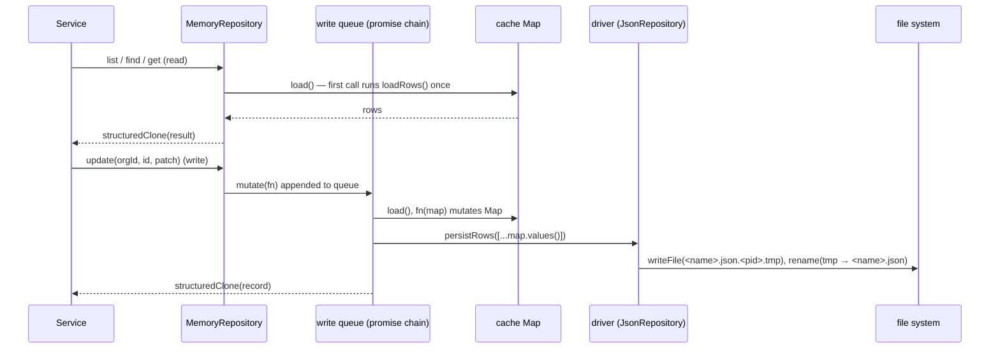

Services never touch storage directly. They call `db.<collection>`, which returns a `Repository<T>` (`src/db/repository.ts`). The driver behind it is chosen by `DB_DRIVER` in `src/db/index.ts`.

Today every working driver is built on **`MemoryRepository`** (`src/db/memory/memory-repository.ts`). It holds a collection in memory and implements the whole query language and write queue with no Node APIs. Storage drivers subclass it and only decide where rows are loaded from and saved to:

| Driver | File | Storage | Used by |
|---|---|---|---|
| `MemoryRepository` | `src/db/memory/memory-repository.ts` | Nothing (in memory only) | Base class |
| `JsonRepository` | `src/db/json/json-repository.ts` | One JSON array file per collection in `DATA_DIR` | The API (`DB_DRIVER=json`) |
| `JsonRepository` (browser override) | `frontend/src/mock-api/overrides/db/json/json-repository.ts` | One `localStorage` key per collection (`selleasy-mock-db:<collection>`) | The frontend's [mock data mode](/docs/engineering/frontend/mock-mode) |
| Postgres | `src/db/postgres/postgres-repository.ts` | — | Stub that throws |

The browser driver keeps the `JsonRepository` name and constructor so `db/index.ts` works unchanged in both runtimes.

## The `Repository<T>` interface

Every method except `findGlobal` and `truncate` takes the tenant id first. The return types use `Stored<T>`, which is `T` plus `orgId`, `createdAt` and `updatedAt`.

```ts title="src/db/repository.ts"
export interface Repository<T extends { id: ID }> {
  readonly name: string
  list(orgId: ID, query?: ListQuery<Stored<T>>): Promise<Page<Stored<T>>>
  find(orgId: ID, where?: Where<Stored<T>>, sort?: Sort<Stored<T>> | Sort<Stored<T>>[]): Promise<Stored<T>[]>
  findOne(orgId: ID, where: Where<Stored<T>>): Promise<Stored<T> | null>
  get(orgId: ID, id: ID): Promise<Stored<T> | null>
  count(orgId: ID, where?: Where<Stored<T>>): Promise<number>
  create(orgId: ID, data: CreateInput<T>): Promise<Stored<T>>
  createMany(orgId: ID, data: CreateInput<T>[]): Promise<Stored<T>[]>
  update(orgId: ID, id: ID, patch: Partial<T>): Promise<Stored<T>>
  updateMany(orgId: ID, where: Where<Stored<T>>, patch: Partial<T> | ((r: Stored<T>) => Partial<T>)): Promise<Stored<T>[]>
  remove(orgId: ID, id: ID): Promise<boolean>
  removeMany(orgId: ID, where: Where<Stored<T>>): Promise<number>
  findGlobal(where: Where<Stored<T>>): Promise<Stored<T> | null>
  truncate(): Promise<void>
}
```

| Method | Semantics |
|---|---|
| `list` | Filter, then search, then sort, then paginate. Returns `{ items, total, page, pageSize }`. `pageSize` is clamped to 1–1000 (default 25) and `page` to at least 1. |
| `find` | All matching records, optionally sorted. No pagination. |
| `findOne` | First match in storage order, or `null`. |
| `get` | By id. Returns `null` when the record belongs to another org. |
| `count` | Number of matches. |
| `create` / `createMany` | Fills in `id` (from `newId(idPrefix)` unless supplied), `orgId`, and `createdAt`/`updatedAt` (unless supplied). |
| `update` | Shallow merge `{ ...cur, ...patch }`. `id`, `orgId` and `createdAt` are protected, and `updatedAt` is set to now. Throws `404` (`"<collection> not found"`) when the record is missing or belongs to another tenant. |
| `updateMany` | The same merge for every match. `patch` can be a function of the current record. Returns the updated records. |
| `remove` | `true` if something was deleted. Never throws. |
| `removeMany` | Returns the number deleted. `removeMany(orgId, {})` clears the org's data in that collection. |
| `findGlobal` | **Cross-tenant** first match. Only for authentication flows. |
| `truncate` | Deletes every record for every tenant (used by `db:reset`). |

`CreateInput<T>` is `T` without `id`, `orgId`, `createdAt` and `updatedAt`, plus optional `id`, `createdAt` and `updatedAt`.

## Query language

```ts title="src/db/repository.ts"
export type FieldCondition<V> =
  | V                    // equality shorthand
  | null                 // IS NULL shorthand
  | {
      eq?: V | null; ne?: V | null
      in?: V[]; nin?: V[]
      gt?: V; gte?: V; lt?: V; lte?: V
      exists?: boolean   // true → not null/undefined
      contains?: string  // case-insensitive substring
    }

export type Where<T> = { [K in keyof T]?: FieldCondition<T[K] extends (infer U)[] ? U : T[K]> } & {
  $or?: Where<T>[]
}
```

For array fields (for example `technologies: string[]`), the condition's value type is the **element** type.

### Operator semantics (`MemoryRepository`)

| Condition | Scalar field | Array field |
|---|---|---|
| `field: v` | `(value ?? null) === v` | `value.includes(v)` |
| `field: null` | value is `null` or `undefined` | never matches (an array is not null) |
| `{ eq: v }` | same as the shorthand | `value.includes(v)` |
| `{ ne: v }` | `(value ?? null) !== v` | compares the array itself (no element semantics) |
| `{ in: [...] }` | value is in the list | **any** element is in the list |
| `{ nin: [...] }` | value is not in the list | **no** element is in the list |
| `{ gt, gte, lt, lte }` | JS comparison (numbers, or ISO strings compared lexicographically) | not meaningful |
| `{ exists: true \| false }` | value is / isn't `null`/`undefined` | an array always "exists" |
| `{ contains: "x" }` | `String(value ?? "")` contains `x`, case-insensitively | **any** element contains `x` as a substring, case-insensitively |
| several operators in one object | all must hold (AND) | |
| several fields | all must hold (AND) | |
| `$or: [w1, w2]` | at least one sub-`Where` matches. An **empty** `$or` is ignored. | |
| `field: undefined` | **ignored**: the condition is skipped | |

The "undefined is ignored" rule is what makes filter builders short:

```ts title="src/modules/signals/service.ts"
export function signalWhere(f: SignalFilters): Where<Stored<Signal>> {
  return {
    type: f.type?.length ? { in: f.type } : undefined,
    source: f.source?.length ? { in: f.source } : undefined,
    processed: f.processed,                    // undefined → no filter
    accountId: f.accountId,
    occurredAt: f.sinceDays ? { gte: new Date(Date.now() - f.sinceDays * DAY_MS).toISOString() } : undefined,
    $or: f.q ? [{ title: { contains: f.q } }, { detail: { contains: f.q } }] : undefined,
  }
}
```

More examples from the codebase:

```ts
// Open deals for an account
db.deals.findOne(orgId, { accountId, stage: { nin: ["closed_won", "closed_lost"] } })

// Non-duplicate account by domain
db.accounts.findOne(orgId, { domain, duplicateOf: { exists: false } })

// Sequences that use a mailbox (array membership shorthand)
db.sequences.count(orgId, { mailboxIds: mailboxId })

// Active, non-viewer users
db.users.find(orgId, { status: "active", role: { ne: "viewer" } })

// Unassigned accounts
db.accounts.list(orgId, { where: { ownerId: null } })

// Paged, searched, multi-key sort
db.contacts.list(orgId, {
  where: { accountId },
  search: { q: "jane", fields: ["firstName", "lastName", "email"] },
  sort: [{ field: "firstName", dir: "asc" }, { field: "lastName", dir: "asc" }],
  page: 2,
  pageSize: 50,
})
```

### Search

`ListQuery.search = { q, fields }` trims and lower-cases `q`, then keeps records where **any** listed field, converted with `String(field ?? "")`, contains it. An empty `q` is ignored. Search runs after `where`, so the two combine with AND.

### Sorting

`sortRecords` (exported from `memory-repository.ts`) sorts in place with the keys in order:

- Equal values fall through to the next key.
- `null`/`undefined` values sort **last in both directions**.
- Two numbers compare numerically. Anything else uses `String(a).localeCompare(String(b), undefined, { numeric: true, sensitivity: "base" })`, which is case- and accent-insensitive and orders `item2` before `item10`.
- `dir: "desc"` negates the comparison.
- With no sort, records come back in storage order: insertion order, since the `Map` keeps it.

## `MemoryRepository` and its drivers

```ts title="src/db/memory/memory-repository.ts (outline)"
export class MemoryRepository<T extends { id: ID }> implements Repository<T> {
  constructor(public readonly name: string, protected readonly idPrefix: string) {}

  /** Initial rows for the collection. Drivers override this to read from storage. */
  protected async loadRows(): Promise<Stored<T>[]> { return [] }

  /** Called after every mutation with the full collection. Drivers override this to save. */
  protected async persistRows(rows: Stored<T>[]): Promise<void> {}

  // list, find, findOne, get, count, create, createMany, update, updateMany,
  // remove, removeMany, findGlobal, truncate — all implemented here
}

export function matches<T>(record: T, where?: Where<T>): boolean
export function sortRecords<T>(items: T[], sort?: Sort<T> | Sort<T>[]): T[]
```

```ts title="src/db/json/json-repository.ts (outline)"
export class JsonRepository<T extends { id: ID }> extends MemoryRepository<T> {
  constructor(name: string, private readonly dataDir: string, idPrefix: string) { super(name, idPrefix) }

  protected async loadRows() { /* readFile(<dataDir>/<name>.json) → JSON array; ENOENT → [] */ }

  protected async persistRows(rows) {
    await mkdir(this.dataDir, { recursive: true })
    const tmp = `${this.file}.${process.pid}.tmp`
    await writeFile(tmp, JSON.stringify(rows, null, 2))
    await rename(tmp, this.file)
  }
}
```



| Mechanism | Implementation | Why |
|---|---|---|
| **Lazy load and cache** | `load()` calls `loadRows()` once and builds a `Map<id, record>`. A concurrent first read shares the same `loading` promise. For the JSON driver, a missing file (`ENOENT`) gives an empty collection, and an empty file counts as `[]`. | Reads never hit storage after warm-up. |
| **Validation on load** | The JSON driver throws `must contain a JSON array` for other content. | Catches manual editing mistakes. |
| **Per-collection write queue** | `mutate(fn)` chains onto `this.queue`. Each step loads, runs `fn`, and calls `persistRows()` with the whole collection. A failed step doesn't break the chain (`run.catch(() => undefined)`), but the error is still returned to the caller. | Concurrent requests can never interleave writes. |
| **Atomic persistence (JSON driver)** | `writeFile` to `<file>.<pid>.tmp` (pretty-printed, 2-space indent), then `rename` over the target. `mkdir -p` the data dir first. | A crash never leaves a half-written file. |
| **Copy on read** | Every read and write result goes through `structuredClone`. | Callers can't mutate the cache by accident. |
| **Tenant scoping** | `scoped(map, orgId)` filters on `r.orgId === orgId`. `get`, `update` and `remove` compare `orgId` too. | Isolation between tenants. |
| **Global lookup** | `findGlobal` scans all values without the org filter. | Login by email, API key by hash, invite token. |
| **Protected fields** | `update`/`updateMany` always restore `id`, `orgId` and `createdAt`, and set `updatedAt: nowIso()`. | A patch can't move a record between tenants. |

### The browser driver (mock mode)

`frontend/src/mock-api/overrides/db/json/json-repository.ts` replaces the file driver when the backend code is copied into the frontend:

- **`loadRows()`** reads `localStorage["selleasy-mock-db:<collection>"]` and parses it. Missing, unparsable or non-array values give an empty collection (no error).
- **`persistRows()`** is **debounced by 250 ms**: it keeps only the latest rows and writes them with `localStorage.setItem` once the burst of writes is over. Seeding and bulk re-scoring would otherwise serialize the whole collection hundreds of times.
- A failed `setItem` (usually the quota, about 5 MB per origin) is logged as `[mock-api] could not persist <collection> (storage full?)`. The in-memory copy keeps the change until the page is reloaded.
- It exports `MOCK_DB_PREFIX = "selleasy-mock-db:"`, which `resetMockDatabase()` in `mock-api/server.ts` uses to delete every collection.
- The `dataDir` constructor argument is ignored.

<Callout type="warn" title="Known limitations">
- **Writes are not cloned on the way in.** `build()` and `update()` spread input objects shallowly, so nested arrays and objects in the input are shared with the cache until the next load. Don't mutate an object after passing it to the repository.
- **A corrupt file breaks the collection** (JSON driver). If the file fails to parse, the rejected `loading` promise is cached and every call fails until the process restarts.
- **No transactions.** A service call that touches several collections (cascades, merges) isn't atomic. If `fn` throws partway through an `updateMany`, earlier in-memory changes stay in the cache but are not persisted until the next successful write.
- **One process only.** The cache is never refreshed from storage, and the temp file name includes the pid. Two API processes on the same `DATA_DIR` will overwrite each other's changes. In the browser, two tabs of the mock app each hold their own cache, and the last tab to write a collection wins.
- **Every write rewrites the whole collection.** Prefer `createMany` and `updateMany` to loops.
</Callout>

## Collection registry

`src/db/index.ts` creates every repository through `collection(name, idPrefix)`. `name` is the file name, the `localStorage` key suffix in mock mode, and the collection or table name.

```ts title="src/db/index.ts"
function collection<T extends { id: string }>(name: string, idPrefix: string): Repository<T> {
  switch (config.DB_DRIVER) {
    case "json":
      return new JsonRepository<T>(name, config.dataDir, idPrefix)
    case "postgres":
      return createPostgresRepository<T>(name) // currently throws
  }
}
```

| `db.` key | Collection / file | Id prefix | Domain type |
|---|---|---|---|
| `organizations` | `organizations` | `org` | `Organization` |
| `users` | `users` | `usr` | `UserRecord` |
| `userPreferences` | `user_preferences` | `pref` | `UserPreferences` |
| `apiKeys` | `api_keys` | `key` | `ApiKeyRecord` |
| `accounts` | `accounts` | `acc` | `Account` |
| `contacts` | `contacts` | `con` | `Contact` |
| `signals` | `signals` | `sig` | `Signal` |
| `icp` | `icp_config` | `icp` | `IcpConfig & { id }` (id = orgId) |
| `playbooks` | `playbooks` | `rule` | `PlaybookRule` |
| `runs` | `agent_runs` | `run` | `AgentRun` |
| `drafts` | `drafts` | `drf` | `OutreachDraft` |
| `sequences` | `sequences` | `seq` | `Sequence` |
| `enrollments` | `enrollments` | `enr` | `Enrollment` |
| `mailboxes` | `mailboxes` | `mb` | `Mailbox` |
| `inbox` | `inbox_messages` | `msg` | `InboxMessage` |
| `deals` | `deals` | `deal` | `Deal` |
| `activities` | `activities` | `act` | `Activity` |
| `integrations` | `integrations` | `int` | `Integration` |
| `notifications` | `notifications` | `ntf` | `AppNotification` |

`truncateAll()` calls `truncate()` on every repository. Field-level details are on the [Data model](/docs/engineering/data-model) page.

## Implementing the Postgres driver

`src/db/postgres/postgres-repository.ts` is a stub. `createPostgresRepository` throws `DB_DRIVER=postgres is not implemented yet (collection "…")`. Because `db/index.ts` builds every repository when the module loads, **setting `DB_DRIVER=postgres` today makes the API fail at startup.**

<Steps>
<Step>
### Add the dependency and a pool

`npm i pg` (plus `@types/pg`). Create one `Pool` from `DATABASE_URL` (or the `PG*` variables), sized with `DB_POOL_MIN`/`DB_POOL_MAX`, with SSL controlled by `PGSSLMODE`. Add these keys to the zod schema in `src/config.ts`; today only `DATABASE_URL` is declared there.
</Step>
<Step>
### Choose a table layout

The smallest change is a **document table per collection**, which keeps the domain types untouched:

```sql title="src/db/postgres/migrations/001_init.sql"
CREATE TABLE accounts (
  id          text PRIMARY KEY,
  org_id      text NOT NULL,
  created_at  timestamptz NOT NULL,
  updated_at  timestamptz NOT NULL,
  data        jsonb NOT NULL
);
CREATE INDEX accounts_org ON accounts (org_id);
CREATE INDEX accounts_org_domain ON accounts (org_id, (data->>'domain'));
-- repeat per collection; add GIN indexes on data for array / contains queries
CREATE UNIQUE INDEX users_email ON users ((lower(data->>'email')));
CREATE UNIQUE INDEX api_keys_hash ON api_keys ((data->>'hash'));
```

Promote hot fields (`account_id`, `score`, `tier`, `stage`, `occurred_at`, …) to real columns later, as query plans require.
</Step>
<Step>
### Translate `Where<T>` to SQL

Build parameterized SQL. Never interpolate values, and only interpolate field names after checking them against an allow-list.

| `Where` | SQL, where `f` is `data->>'field'` (cast as needed) | Array field (`data->'field'`) |
|---|---|---|
| `field: v` / `{ eq: v }` | `f = $n` | `data->'field' ? $n` (jsonb contains element) |
| `field: null` / `{ eq: null }` | `f IS NULL` | — |
| `{ ne: v }` | `f IS DISTINCT FROM $n` | — |
| `{ in: [...] }` | `f = ANY($n)` | `data->'field' ?\| $n` (any element) |
| `{ nin: [...] }` | `NOT (f = ANY($n))` or `f IS NULL` | `NOT (data->'field' ?\| $n)` |
| `{ gt / gte / lt / lte }` | `(f)::numeric > $n`, or `::timestamptz` for dates | — |
| `{ exists: true }` | `f IS NOT NULL` | `data ? 'field'` |
| `{ exists: false }` | `f IS NULL` | — |
| `{ contains: s }` | `f ILIKE '%' \|\| $n \|\| '%'` (escape `%` and `_`) | `EXISTS (SELECT 1 FROM jsonb_array_elements_text(data->'field') e WHERE e ILIKE …)` |
| `$or: [...]` | `( … OR … )`. Skip it when empty. | |
| `undefined` | omitted | |
| `search { q, fields }` | `(f1 ILIKE $n OR f2 ILIKE $n …)` | |
| `sort` | `ORDER BY f ASC NULLS LAST, …`. Use `NULLS LAST` for **desc** too, to match the JSON driver. Cast numeric fields, and use a case-insensitive collation for text. | |
| `page`, `pageSize` | `LIMIT $pageSize OFFSET ($page-1)*$pageSize`, plus a `COUNT(*) OVER()` or a second count query for `total` | |
</Step>
<Step>
### Always scope by tenant

Every statement except `findGlobal` and `truncate` must include `WHERE org_id = $1`, and that includes `UPDATE … WHERE id = $2 AND org_id = $1`. Throw `notFound` from `update` when no row is updated, so behaviour matches the JSON driver.
</Step>
<Step>
### Preserve the write semantics

- `update`: `data = data || $patch`. Keys whose value is `undefined` must be **removed** (`data - 'key'`), because that is how services clear fields. Keep `id`, `org_id` and `created_at`, and set `updated_at = now()`.
- `updateMany` with a function patch: `SELECT … FOR UPDATE`, compute the patches in JS, then write them in the same transaction.
- `createMany`: a single multi-row `INSERT`.
- Return the stored shape (`{ ...data, id, orgId, createdAt, updatedAt }`) so services don't change.
</Step>
<Step>
### Add transactions where they matter

The interface has no transaction API. Consider adding `db.transaction(fn)` for the cascades in `accountService.removeMany`, `accountService.merge`, `contactService.removeMany`, `orgService.removeUser` and `outreachService.removeSequence`.
</Step>
<Step>
### Verify

Run `npm test` with `DB_DRIVER=postgres` against a disposable database. The API tests exercise filters, sorting, pagination, tenant isolation and cascades.
</Step>
</Steps>

## Editing the JSON files by hand

The files are plain, pretty-printed JSON arrays, so they are easy to inspect and patch. (In mock mode the same arrays live in `localStorage` under `selleasy-mock-db:<collection>`, minified.) Before you edit:

<Callout type="error" title="Stop the API first">
The server reads each file once and serves it from memory, so edits to a running server are ignored. The next write to that collection then **overwrites your changes** with the cached copy. Stop the API, edit, then start it again.
</Callout>

- Keep the top level an array. Every record needs `id`, `orgId`, `createdAt` and `updatedAt`, and `orgId` must match an existing organization.
- Keep references consistent (`accountId`, `contactId`, `sequenceId`, `ownerId`), and keep enums to the values listed on the [Data model](/docs/engineering/data-model) page.
- Stored scores are **not recomputed** on load. After editing firmographics or signals, call `POST /accounts/bulk-rescore` or save the ICP (`PUT /icp`).
- Don't edit `passwordHash`, `hash` or `apiKeyEncrypted` by hand. Use the API flows.
- To load real data, prefer the import endpoints (`POST /import/accounts`, `POST /import/contacts`). They validate, deduplicate and score each row.
- `backend/db/*.json` is git-ignored (only `.gitkeep` is committed). Back the folder up before bulk edits.
