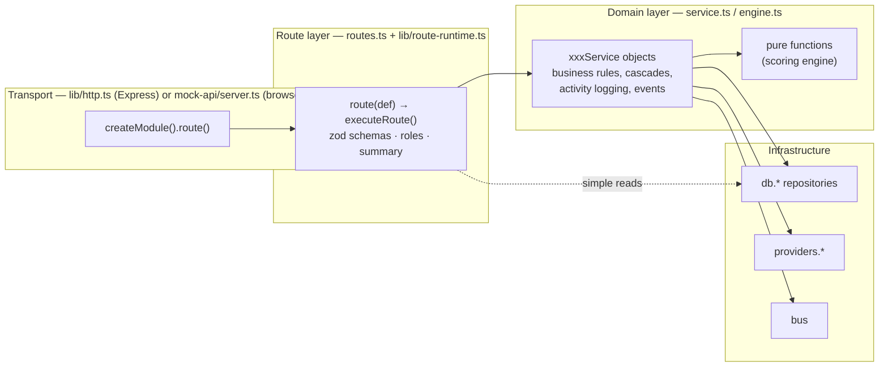

The backend (`backend/`) is an Express 5 + TypeScript REST API. It owns every record and every business rule: authentication, validation, scoring, the orchestration agent, deduplication, enrichment, outreach, pipeline, analytics and imports. It runs as one Node process, serves its own OpenAPI document and Swagger UI, and stores data in JSON files behind a repository interface.

Most of `src/` is **portable**: route definitions, services, the domain, the in-memory repository and the event bus contain no Node or Express imports. The frontend's [mock data mode](/docs/engineering/frontend/mock-mode) copies that code into the browser. Only a thin edge (`app.ts`, `server.ts`, `lib/http.ts`, `lib/openapi.ts`, `lib/logger.ts`, `lib/crypto.ts`, `middleware/*`, `config.ts` and `db/json`) is Node-specific.

## Stack

| Concern | Library / tool | Version (package.json) | Where |
|---|---|---|---|
| Runtime | Node.js | `>=20` (`engines`) | ESM (`"type": "module"`, `NodeNext` resolution) |
| HTTP | Express | `^5.2.1` | `src/app.ts`, `src/lib/http.ts`. Async handler errors reach the error handler without wrappers. |
| Language | TypeScript | `^7.0.2` | `tsconfig.json` (`strict`, target ES2023) |
| Validation | zod | `^4.6.5` | route schemas, `src/config.ts`, OpenAPI via `z.toJSONSchema` |
| Auth | jsonwebtoken, bcryptjs | `^9.0.3`, `^3.0.3` | `src/middleware/auth.ts`, `modules/organization/service.ts` |
| Security | helmet, cors, express-rate-limit | `^8.3.0`, `^2.8.6`, `^8.7.0` | `src/app.ts`, `modules/auth/routes.ts` |
| Logging | pino, pino-http, pino-pretty (dev) | `^10.3.1`, `^11.0.0` | `src/lib/logger.ts` |
| Compression | compression | `^1.8.2` | `src/app.ts` |
| API docs | swagger-ui-express | `^5.0.1` | `/api/v1/docs` |
| CSV | csv-parse | `^7.0.2` | `modules/import/service.ts` |
| Config | dotenv | `^17.4.2` | `import "dotenv/config"` in `src/config.ts` |
| Dev server | tsx | `^4.23.13` | `npm run dev` → `tsx watch src/server.ts` |
| Tests | vitest, supertest | `^5.0.1`, `^7.2.2` | `tests/api.test.ts` |

## Folder structure

<Files>
  <Folder name="backend" defaultOpen>
    <File name=".env.example" />
    <File name="package.json" />
    <File name="tsconfig.json" />
    <File name="tsconfig.build.json" />
    <File name="vitest.config.ts" />
    <Folder name="db">
      <File name="accounts.json … (one file per collection, git-ignored)" />
    </Folder>
    <Folder name="scripts" defaultOpen>
      <File name="bootstrap.ts" />
      <File name="seed-demo.ts" />
      <File name="reset.ts" />
    </Folder>
    <Folder name="tests">
      <File name="api.test.ts" />
    </Folder>
    <Folder name="src" defaultOpen>
      <File name="server.ts" />
      <File name="app.ts" />
      <File name="config.ts" />
      <Folder name="lib" defaultOpen>
        <File name="route-runtime.ts" />
        <File name="http.ts" />
        <File name="roles.ts" />
        <File name="openapi.ts" />
        <File name="errors.ts" />
        <File name="expand.ts" />
        <File name="crypto.ts" />
        <File name="ids.ts" />
        <File name="logger.ts" />
      </Folder>
      <Folder name="middleware">
        <File name="auth.ts" />
        <File name="error.ts" />
      </Folder>
      <Folder name="db" defaultOpen>
        <File name="repository.ts" />
        <File name="index.ts" />
        <Folder name="memory">
          <File name="memory-repository.ts" />
        </Folder>
        <Folder name="json">
          <File name="json-repository.ts" />
        </Folder>
        <Folder name="postgres">
          <File name="postgres-repository.ts" />
          <Folder name="migrations">
            <File name=".gitkeep" />
          </Folder>
        </Folder>
      </Folder>
      <Folder name="domain">
        <File name="types.ts" />
        <File name="constants.ts" />
      </Folder>
      <Folder name="events">
        <File name="bus.ts" />
      </Folder>
      <Folder name="providers">
        <File name="index.ts" />
      </Folder>
      <Folder name="seed">
        <File name="generate.ts" />
        <File name="demo.ts" />
      </Folder>
      <Folder name="modules" defaultOpen>
        <Folder name="accounts"><File name="routes.ts" /><File name="service.ts" /></Folder>
        <Folder name="activities"><File name="routes.ts" /><File name="service.ts" /></Folder>
        <Folder name="admin"><File name="routes.ts" /></Folder>
        <Folder name="agent"><File name="routes.ts" /><File name="service.ts" /></Folder>
        <Folder name="analytics"><File name="routes.ts" /><File name="service.ts" /></Folder>
        <Folder name="auth"><File name="routes.ts" /></Folder>
        <Folder name="contacts"><File name="routes.ts" /><File name="service.ts" /></Folder>
        <Folder name="import"><File name="routes.ts" /><File name="service.ts" /></Folder>
        <Folder name="integrations"><File name="routes.ts" /><File name="service.ts" /></Folder>
        <Folder name="meta"><File name="routes.ts" /></Folder>
        <Folder name="notifications"><File name="routes.ts" /><File name="service.ts" /></Folder>
        <Folder name="organization"><File name="routes.ts" /><File name="service.ts" /></Folder>
        <Folder name="outreach"><File name="routes.ts" /><File name="service.ts" /><File name="enrollment.ts" /></Folder>
        <Folder name="pipeline"><File name="routes.ts" /><File name="service.ts" /></Folder>
        <Folder name="scoring"><File name="routes.ts" /><File name="service.ts" /><File name="engine.ts" /></Folder>
        <Folder name="search"><File name="routes.ts" /></Folder>
        <Folder name="signals"><File name="routes.ts" /><File name="service.ts" /></Folder>
      </Folder>
    </Folder>
  </Folder>
</Files>

| Path | Purpose |
|---|---|
| `src/server.ts` | Entry point. Warns if no organization exists, starts listening on `PORT`, and handles `SIGINT`/`SIGTERM` with a 10 s forced-exit timeout. |
| `src/app.ts` | `createApp()`: middleware, module routers, `/health`, OpenAPI and Swagger, 404 and error handlers. Tests import this without starting a server. |
| `src/config.ts` | Parses `process.env` with zod. Exits the process on invalid config. Exports `config` with derived fields. |
| `src/lib/route-runtime.ts` | Portable route runtime: `RouteDef`, `RouteContext`, `executeRoute()`, `errorOutput()`, `paged()`, `fileResponse()`, `routeRegistry`, shared query schemas. |
| `src/lib/http.ts` | `createModule()` / `route()`: binds each definition to an Express router. Re-exports `route-runtime.ts`, so modules import everything from `lib/http.js`. |
| `src/lib/roles.ts` | `AuthContext`, `atLeast()`, `assertRole()`. |
| `src/middleware/auth.ts` | `signToken`, `authenticateBearer`, `authenticateApiKey`, `authenticateRequest`. |
| `src/db/` | Storage abstraction and drivers. `memory/` holds the portable `MemoryRepository`; `json/` extends it with files. `db` is the registry of all collections. |
| `src/domain/` | Shared types and business constants (industries, stages, the integration catalog, `defaultIcp`). |
| `src/modules/*` | One folder per service boundary: `routes.ts` (HTTP) plus `service.ts` (logic). |
| `src/providers/` | Vendor adapter interfaces and mock implementations. |
| `src/events/` | `EventBus` interface and the in-memory implementation (portable). |
| `src/seed/` | Deterministic demo dataset and org reset helpers. |
| `scripts/` | CLI entry points run with `tsx`. |
| `dist/` | Build output from `npm run build` (`tsconfig.build.json` compiles `src` only). |

## Layering

- **Transport** is a thin adapter. `lib/http.ts` turns an Express request into `executeRoute(def, { params, query, body, headers })` and writes the result back. The frontend's mock runtime does the same without Express.
- **Routes** declare the contract: method, path, zod schemas, roles and a one-line summary. They pull typed values out of `ctx` (which has no `req` or `res`) and call a service. Simple reads and deletes sometimes use `db.*` directly in the route (for example `GET /signals/:id` and `DELETE /agent/playbooks/:id`).
- **Services** are plain object literals (`export const accountService = { … }`) with async methods whose first parameter is `orgId`. They throw `HttpError`s from `lib/errors.ts` and may call other services.
- **Pure logic** that needs no I/O lives in separate files so it is easy to test. `modules/scoring/engine.ts` is the example.
- **Repositories** are the only way to reach storage. Services never touch the file system.
- **Portability.** Nothing below the transport layer may import Node-only modules. See [Contributing](/docs/engineering/contributing#keeping-mock-mode-in-sync).

## Modules

All paths below are relative to `API_PREFIX` (default `/api/v1`). The order matches the `modules` array in `src/app.ts`.

| Module export | Tag (OpenAPI) | Base path | Responsibilities | API reference |
|---|---|---|---|---|
| `authModule` | Auth | `/auth` | register, login, accept-invite, me, logout, change-password. Has its own stricter rate limit. | [Authentication](/docs/engineering/api/authentication) |
| `organizationModule` | Organization | `""` (root) | `/org`, `/org/plan`, `/me`, `/me/preferences`, `/users/*`, `/api-keys/*` | [Organization and team](/docs/engineering/api/organization-and-team) |
| `metaModule` | Meta | `/meta` | Business constants, plan seats, feature flags (`simulation`, `adminReset`) | [Analytics, search, meta](/docs/engineering/api/analytics-search-meta) |
| `accountsModule` | Accounts | `/accounts` | CRUD, list views, duplicates and merge, bulk actions, enrich, rescore, score breakdown, versions, related lists | [Accounts and contacts](/docs/engineering/api/accounts-and-contacts) |
| `contactsModule` | Contacts | `/contacts` | CRUD, bulk delete, email verification, enroll, related lists | [Accounts and contacts](/docs/engineering/api/accounts-and-contacts) |
| `signalsModule` | Signals | `/signals` | List, stats, ingest, simulate, process, process-pending, delete | [Signals and webhooks](/docs/engineering/api/signals-and-webhooks) |
| `webhooksModule` | Webhooks | `/webhooks` | `POST /webhooks/signals` (API key, scope `signals:write`, batch up to 100) | [Signals and webhooks](/docs/engineering/api/signals-and-webhooks) |
| `scoringModule` | ICP & Scoring | `/icp` | Get/replace ICP (re-scores everything), preview, defaults | [Scoring and agent](/docs/engineering/api/scoring-and-agent) |
| `agentModule` | Agent | `/agent` | Autopilot settings, stats, runs, playbooks, drafts (approve, reject, regenerate) | [Scoring and agent](/docs/engineering/api/scoring-and-agent) |
| `outreachModule` | Outreach | `""` (root) | `/sequences/*` (steps, enrollments, performance), `/enrollments/*`, `/mailboxes/*`, `/inbox/*`, `/outreach/stats` | [Outreach](/docs/engineering/api/outreach) |
| `pipelineModule` | Pipeline | `/deals` | Deals CRUD, move, stats, CRM sync, deal activities | [Pipeline and activities](/docs/engineering/api/pipeline-and-activities) |
| `activitiesModule` | Activities | `/activities` | Timeline list and manual logging | [Pipeline and activities](/docs/engineering/api/pipeline-and-activities) |
| `notificationsModule` | Notifications | `/notifications` | List, mark read, mark all read | [Pipeline and activities](/docs/engineering/api/pipeline-and-activities) |
| `analyticsModule` | Analytics | `/analytics` | Dashboard, overview (30/90/180 days), `deals.csv` export | [Analytics, search, meta](/docs/engineering/api/analytics-search-meta) |
| `integrationsModule` | Integrations | `/integrations` | Catalog, stats, waterfall order, connect, disconnect, sync, settings | [Integrations](/docs/engineering/api/integrations) |
| `searchModule` | Search | `/search` | Global search (accounts, contacts, deals, sequences) | [Analytics, search, meta](/docs/engineering/api/analytics-search-meta) |
| `importModule` | Import | `/import` | CSV/JSON import of accounts and contacts, CSV templates | [Import](/docs/engineering/api/import) |
| `adminModule` | Admin | `/admin` | `POST /admin/reset` (owner only, dev only) | [Organization and team](/docs/engineering/api/organization-and-team) |

Outside the prefix, `GET /health` returns `{ status, env, db, uptime }`. It is not rate-limited, and pino-http does not log it.

## Conventions

<Accordions>
<Accordion title="Naming and files">
- One folder per service boundary under `src/modules/`. Each has `routes.ts`, and usually `service.ts`.
- Route files export `xxxModule = createModule("<Tag>", "<basePath>")`. Register new modules in the `modules` array in `src/app.ts`, and import the routes file in `frontend/src/mock-api/server.ts`.
- Services are exported as `xxxService` object literals. Pure helpers are named exports (`normalizeDomain`, `accountWhere`, `probabilityFor`).
- Imports use the `.js` extension (NodeNext ESM), e.g. `import { db } from "../../db/index.js"`.
</Accordion>
<Accordion title="Tenant scoping">
- Every service method takes `orgId` first, and it always comes from `ctx.orgId` (the authenticated principal).
- Never use `findGlobal` outside authentication flows.
</Accordion>
<Accordion title="Filters, sorting and pagination">
- Build `Where<T>` objects in which unused filters are `undefined`. The repository ignores undefined conditions. Pattern: `tier: f.tier?.length ? { in: f.tier } : undefined`.
- Whitelist sort fields as `const XXX_SORT_FIELDS = [...] as const` and use `parseSort(query.sort, XXX_SORT_FIELDS, fallback)`.
- Return `paged(page)` for list endpoints so the response carries `meta`.
</Accordion>
<Accordion title="Errors">
- Throw the helpers from `lib/errors.ts` (`badRequest`, `notFound("Account")`, `conflict`, `forbidden`, `unprocessable`). Never write error responses by hand.
- Row-level problems in bulk endpoints are collected and returned (import, webhooks), not thrown.
</Accordion>
<Accordion title="Side effects">
- Log user-visible changes with `activityService.log` and set `actorId` (user id, `"agent"` or `"system"`).
- Publish domain events with `bus.publish` after the write has persisted.
- Keep every vendor call behind `providers.*`.
- Changes to scoring inputs must trigger `scoringService.rescoreAccount` / `rescoreAll`.
</Accordion>
<Accordion title="Responses">
- Return plain objects, and strip server-only fields (`toPublicUser`, `toPublicApiKey`, `toPublicIntegration`).
- Returning `undefined` produces `204 No Content`. `POST` defaults to `201`; set `status: 200` for action endpoints that don't create a resource.
- For downloads, return `fileResponse(filename, content, contentType = "text/csv")`. Handlers never write to the response directly.
- Attach related summaries with `withAccounts` / `withContacts` from `lib/expand.ts` instead of N+1 lookups.
</Accordion>
</Accordions>

## Scripts

| Command | Runs |
|---|---|
| `npm run dev` | `tsx watch src/server.ts` |
| `npm run build` | `tsc -p tsconfig.build.json` → `dist/` |
| `npm start` | `node dist/server.js` |
| `npm run typecheck` | `tsc --noEmit` (src, scripts, tests) |
| `npm test` | `vitest run` |
| `npm run bootstrap` / `seed:demo` / `db:reset` | See [Seeding and scripts](/docs/engineering/backend/seeding-and-scripts) |

## Where to go next

<Cards>
  <Card title="Request lifecycle" href="/docs/engineering/backend/request-lifecycle" description="Middleware, route(), executeRoute(), validation, errors and OpenAPI." />
  <Card title="Data layer" href="/docs/engineering/backend/data-layer" description="Repository interface, MemoryRepository and its drivers, Postgres plan." />
  <Card title="Auth and security" href="/docs/engineering/backend/auth-and-security" description="JWT, API keys, roles, encryption, rate limits." />
  <Card title="Scoring engine" href="/docs/engineering/backend/scoring-engine" description="Fit, intent, tiers and when re-scoring happens." />
  <Card title="Orchestration agent" href="/docs/engineering/backend/orchestration-agent" description="processSignal, playbooks, actions and drafts." />
  <Card title="Events and providers" href="/docs/engineering/backend/events-and-providers" description="EventBus, vendor adapter interfaces and mocks." />
  <Card title="Seeding and scripts" href="/docs/engineering/backend/seeding-and-scripts" description="bootstrap, seed:demo, db:reset, setup." />
</Cards>
