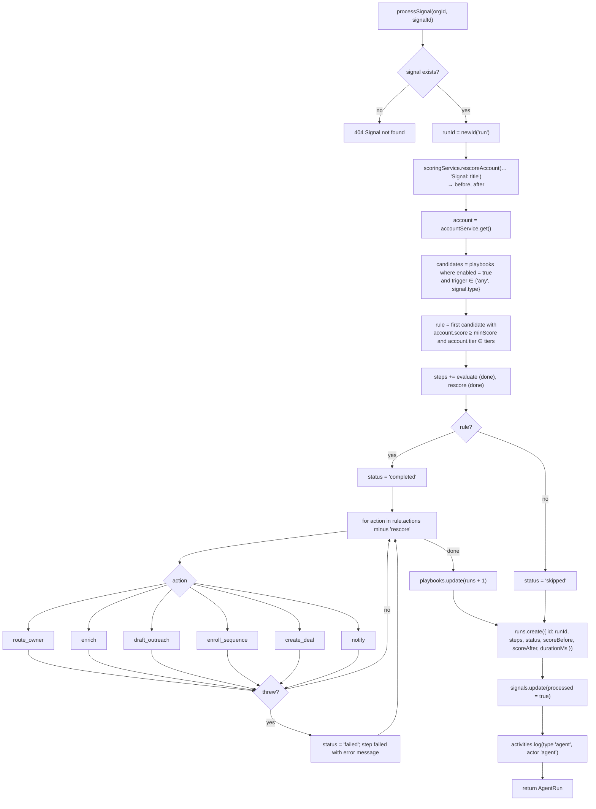
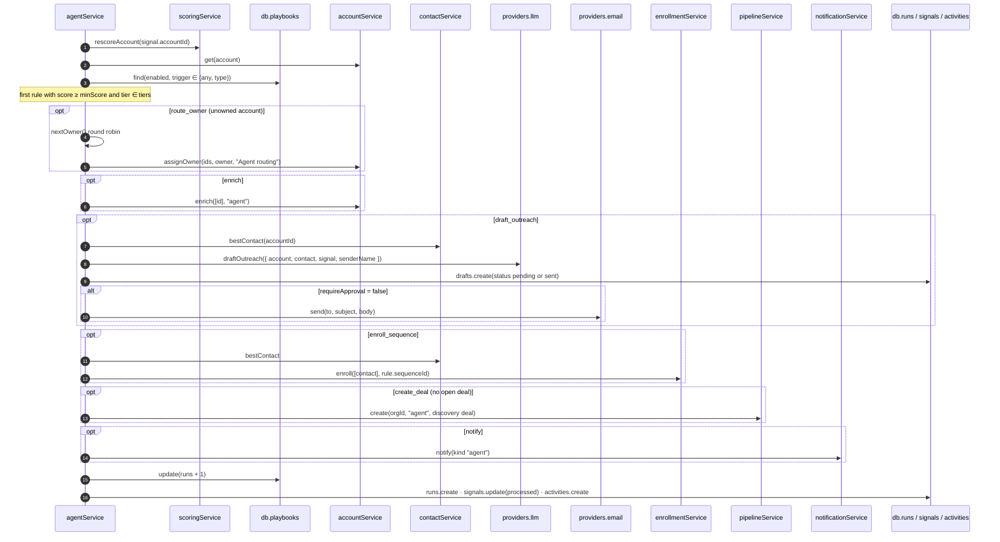
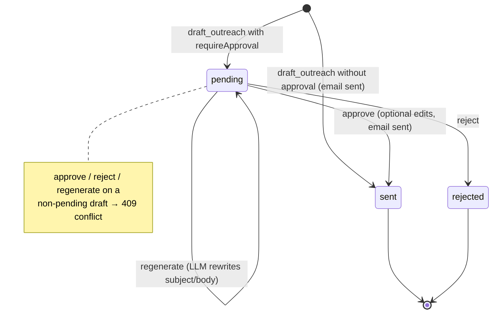

The orchestration agent is `agentService` in `backend/src/modules/agent/service.ts`. For every signal it re-scores the account, picks the first matching playbook, runs that playbook's actions, and records an `AgentRun`. It is deterministic code, not an LLM planner. The LLM provider is used only to **write** outreach drafts and inbox reply suggestions. Everything runs synchronously inside the API process; the in-code comment describes it as mirroring "what EventBridge + Step Functions will do".

## Entry points

| Caller | Route | Behaviour |
|---|---|---|
| `signalService.ingest` | `POST /signals`, `POST /webhooks/signals`, `POST /signals/simulate` | Calls `processSignal` right away **only if** `org.settings.autopilot` is true. Otherwise returns `run: null` (the webhook reports `runStatus: "queued"`). |
| Route handler | `POST /signals/:id/process` | Always processes, even if the signal was already processed (this creates another run). |
| `agentService.processPending` | `POST /signals/process-pending` | Processes every `processed: false` signal, oldest `occurredAt` first, one after another. Returns `{ processed, runs }`. |

Autopilot is read with `agentService.getSettings(orgId)` and changed with `PATCH /agent/settings { autopilot }` (member and above). New workspaces and resets start with autopilot **on**.

## `processSignal` step by step



1. **Load the signal.** A missing signal throws `404`.
2. **Re-score the account.** `rescoreAccount(orgId, signal.accountId, "Signal: <title>")` gives `before` and `after`. The fresh account is loaded (a missing account throws `404 Account not found`).
3. **Evaluate playbooks.** `db.playbooks.find(orgId, { enabled: true, trigger: { in: ["any", signal.type] } })`, with no sort, so candidates come back in **storage (creation) order**. The first rule where `account.score >= rule.minScore && rule.tiers.includes(account.tier)` wins. **Only one playbook runs per signal.**
4. **Record two bookkeeping steps.**
   - `evaluate` (done). Its detail is `Matched “<rule>”`, or `<n> playbook(s) considered — score <s> / Tier <t> below threshold`, or `No enabled playbook for this signal type`.
   - `rescore` (done). Its detail is `<before> → <after> (Tier <t>)`.
5. **Execute actions.** This happens only when a rule matched. Actions run in the order stored in `rule.actions`, skipping `rescore` because it already ran. Each action is wrapped in `try/catch`: an exception adds a `failed` step with the error message, sets the run status to `failed`, and **continues with the next action**.
6. **Bump the rule counter.** `playbooks.update(rule.id, { runs: rule.runs + 1 })`.
7. **Persist the run.** The run is created with the pre-generated `runId`, so drafts created in step 5 can already reference it.
8. **Mark the signal processed** and log an `agent` activity: `Agent ran “<rule>”` or `Agent evaluated signal`, with the step labels joined by `→` as the detail.



## Actions

The step label comes from `STEP_LABELS` in the agent service (falling back to `ACTION_LABELS` in `domain/constants.ts`).

| Action | Step label | Implementation | `done` when | `skipped` when | `failed` when |
|---|---|---|---|---|---|
| `rescore` | Re-score account | Always runs first, before evaluation (step 2). Never executed again in the action loop. | always | — | — |
| `route_owner` | Route to account owner | Re-reads the account. If it has no owner, `nextOwner(orgId)` picks a seller and `accountService.assignOwner(…, "Agent routing")` assigns the account and its contacts. | Detail: `Round-robin assigned to <name>` | Account already owned (`Already owned by <name>`) | No active non-viewer users (`No active sellers to route to`). **The run status is not changed.** |
| `enrich` | Waterfall enrichment | `accountService.enrich(orgId, [id], "agent")`. Uses connected enrichment and contacts vendors in waterfall order, then the mock provider. May trigger a re-score. | Detail: `<sources> refreshed`, or `No providers refreshed` | — | provider or update throws |
| `draft_outreach` | Draft outreach with Claude | `bestContact`, then `providers.llm.draftOutreach({ account, contact, signal, senderName })`, then `db.drafts.create`. `senderName` is the owner's first name, or `"The team"`. `channel` is `linkedin` for `job_change`, otherwise `email`. `sequenceId` comes from the rule. The rationale reads `Tier X (score N). Trigger: <source> — <title>. Chose <title> as the most senior reachable contact.` | `requireApproval = false`: draft stored as `sent`, `providers.email.send(...)`, contact set to `in_sequence` with `lastContactedAt`. Detail `Sent to …`. | — | No reachable contact (`No reachable contact on account`). **The run status is not changed.** |
| — | — | When `requireApproval = true`: draft stored as `pending`, step status **`pending`**, run status set to **`awaiting_approval`**. | — | — | — |
| `enroll_sequence` | Enroll contacts in sequence | `bestContact`, then `enrollmentService.enroll(orgId, [contact.id], rule.sequenceId)`. | Detail: `<contact> → “<sequence>”` | `enrolled === 0` (already actively enrolled, or the contact is blocked) | Sequence missing (`Sequence not configured`) or no contact (`No reachable contact`). **Run status set to `failed`.** An empty sequence throws `400`, which is caught and recorded as failed. |
| `create_deal` | Create discovery deal | If the account has no open deal (stage not in `closed_won`/`closed_lost`): `pipelineService.create(orgId, "agent", { name: "<account> – Discovery", amount: round(employees × 40 / 1000) × 1000 or 12,000, stage: "discovery", closeDate: now + 45 days, source: "Agent: <signal type with spaces>", ownerId })`. Deal creation also moves the account to `opportunity` and logs an activity. | Detail: `Discovery deal opened` | Open deal exists (`Open deal exists: <name>`) | create throws |
| `notify` | Notify owner | `notificationService.notify(orgId, { kind: "agent", title: "<account>: <signal title>", body: "Tier X · score N. <rule name>.", href: "/accounts/<id>" })`. The notification is org-wide; there is no per-user delivery. Posts to Slack only in production when `SLACK_WEBHOOK_URL` is set. | Detail: `Owner notified` | — | notify throws |

Actions see each other's effects because they re-read the account. For example, `route_owner` placed before `draft_outreach` makes the new owner the email's sender.

### Run status rules

| Final `status` | Meaning / how it's reached |
|---|---|
| `skipped` | No playbook matched. The run has only the `evaluate` and `rescore` steps. |
| `completed` | A playbook matched and nothing set another status. Also set later by `resolveRunStep` when a pending draft is approved or rejected. |
| `awaiting_approval` | A `draft_outreach` step created a pending draft. |
| `failed` | An action threw, or `enroll_sequence` couldn't find a sequence or contact. |

<Callout type="warn" title="Status precedence">
`failed` wins: once an action sets the run to `failed`, a later pending draft doesn't change it to `awaiting_approval`, and approving that draft leaves it `failed` (`resolveRunStep` only changes `awaiting_approval`). `route_owner` and `draft_outreach` failures are recorded on their step but don't change the run status.
</Callout>

## Round-robin owner routing

```ts title="src/modules/agent/service.ts"
async function nextOwner(orgId: string) {
  const sellers = await db.users.find(orgId, { status: "active", role: { ne: "viewer" } })
  if (!sellers.length) return null
  const accounts = await db.accounts.find(orgId, { ownerId: { in: sellers.map((u) => u.id) } })
  const counts = sellers.map((u) => ({ u, n: accounts.filter((a) => a.ownerId === u.id).length }))
  counts.sort((a, b) => a.n - b.n)
  return counts[0].u
}
```

This is **least-loaded** routing rather than strict rotation. Every active owner, admin and member is a candidate, and the one who owns the fewest accounts (duplicates included) wins. Ties go to storage order, because `Array.prototype.sort` is stable. Invited users and viewers are never chosen.

## Choosing the contact

```ts title="src/modules/contacts/service.ts"
async bestContact(orgId: string, accountId: string) {
  const contacts = await db.contacts.find(orgId, { accountId, status: { nin: ["unsubscribed", "bounced"] } })
  return contacts.sort((a, b) => SENIORITY_ORDER.indexOf(a.seniority) - SENIORITY_ORDER.indexOf(b.seniority))[0] ?? null
}
```

`SENIORITY_ORDER = ["C-Level", "VP", "Director", "Manager", "IC"]`, so the most senior contact that hasn't unsubscribed or bounced wins, with ties in storage order. `emailStatus` is **not** considered here. A contact with an `invalid` email can still get a draft, but `enrollmentService` will skip them.

## Playbooks

| Operation | Route | Role | Notes |
|---|---|---|---|
| List | `GET /agent/playbooks` | viewer and above | Sorted by `createdAt` ascending, with `sequenceName` attached. This is also roughly the evaluation order. |
| Create | `POST /agent/playbooks` | admin and above | `ruleCreate` defaults: `description ""`, `enabled true`, `requireApproval true`. `validateRule`: `enroll_sequence` requires `sequenceId`, and the sequence must exist. `actions` is normalized to `["rescore", ...unique]`, and `runs` starts at 0. |
| Update | `PATCH /agent/playbooks/:id` | admin and above | `ruleFields.partial()` (no defaults). `sequenceId: null` clears it. Validation runs on the merged rule. If `actions` is given, it is normalized again. |
| Delete | `DELETE /agent/playbooks/:id` | admin and above | Existing runs keep their `ruleId`, and `ruleName` resolves to `null`. |

<Callout type="info" title="Evaluation order">
The first match wins, and candidates are evaluated in storage order: creation order for the JSON driver. There is no priority field. To make a narrow rule win over a broad one, create it first or disable the broad one. A future driver must preserve this order explicitly, for example with `ORDER BY created_at`.
</Callout>

## Drafts lifecycle



The `approved` status exists in the type but is never set: approval sends immediately.

| Action | Route | Effects |
|---|---|---|
| Approve | `POST /agent/drafts/:id/approve` with optional `{ subject, body }` | 1. `providers.email.send({ to: contact.email, subject, body })` (with edits applied). 2. The draft is updated with the final subject and body and `status: "sent"`. 3. `resolveRunStep(runId, "done", "Approved & sent by <name>")`: every `pending` step on the run becomes `done`, and the run goes from `awaiting_approval` to `completed`. 4. Contact becomes `in_sequence` with `lastContactedAt`. 5. If the draft has a `sequenceId`, `enrollmentService.enroll` runs; errors are swallowed and give `enrollment: null`. 6. An activity (`email` for the email channel, otherwise `note`) titled `Sent: <subject>`. Returns `{ draft, contact: { id, name }, enrollment }`. |
| Reject | `POST /agent/drafts/:id/reject` | `status: "rejected"`, then `resolveRunStep(runId, "skipped", "Draft rejected by reviewer")`, which also moves the run to `completed`. |
| Regenerate | `POST /agent/drafts/:id/regenerate` | `providers.llm.draftOutreach({ account, contact, senderName })`, **without** the signal, so the mock uses its generic template. Only `subject` and `body` are overwritten. The status stays `pending`. |
| List | `GET /agent/drafts?status=pending` | Paged, newest first, with account and contact summaries. |

All three actions require member or above and return `200`. Approval sends through the email provider even for `linkedin` drafts, because there is no LinkedIn provider yet (`LINKEDIN_PROVIDER` is not implemented).

## Runs and stats

- `GET /agent/runs?status=&accountId=`: paged, newest `startedAt` first, with the account summary and `ruleName`.
- `GET /agent/runs/:id`: the run plus `signal`, `ruleName` and `drafts` (with contact summaries).
- `GET /agent/stats`: `runsToday`, `runs7d`, `totalRuns`, `actionsTaken` (steps with status `done`, excluding `evaluate`, so `rescore` counts), `awaitingApproval` (pending drafts), `completed`, `failed`, `successRate` (`completed / (completed + failed)` to one decimal, or 100 when both are zero), and `byStatus`.

## Where the LLM provider is called

| Call | Site | Input |
|---|---|---|
| `providers.llm.draftOutreach` | `processSignal` (`draft_outreach`) | account (fresh), best contact, signal, sender first name |
| `providers.llm.draftOutreach` | `regenerateDraft` | account, contact, sender first name (no signal) |
| `providers.llm.suggestReply` | `outreachService.suggestReply` (`POST /inbox/:id/suggest-reply`) | inbox message, contact, the acting user's first name |

Today these all resolve to the mock templates in `providers/index.ts`. To connect Claude, see [Events and providers](/docs/engineering/backend/events-and-providers#example-anthropic-llm-provider).

## Moving to EventBridge / SQS / Step Functions

The current design keeps the seams needed for asynchronous processing:

<Steps>
<Step>
### Publish instead of calling

`signalService.ingest` already calls `bus.publish("signal.ingested", { orgId, signalId })`. Implement an `EventBridgeBus` (the `EventBus` interface, selected by `EVENT_BUS_DRIVER=eventbridge`) that sends `PutEvents` to `EVENTBRIDGE_BUS_NAME` with `Source = EVENTBRIDGE_SOURCE`. Then remove the inline `processSignal` call, or keep it behind a flag for local development, and return `run: null` (the webhook already reports `runStatus: "queued"`).
</Step>
<Step>
### Route to a queue

Add an EventBridge rule for `detail-type = signal.ingested` that targets `SQS_SIGNALS_QUEUE_URL`. Use a FIFO queue with `MessageGroupId = orgId + accountId` so signals for the same account are processed in order.
</Step>
<Step>
### Run a worker

A worker (an ECS service or a Lambda with an SQS trigger) reads `{ orgId, signalId }`, checks whether the signal is `processed` (for **idempotency**, since SQS is at-least-once), checks `organization.settings.autopilot`, then calls `agentService.processSignal`. It shares the service code and the Postgres driver with the API.
</Step>
<Step>
### Split long actions into a state machine

Model `processSignal` as a Step Functions workflow: `Rescore → Evaluate → Map(actions)`. `enrich` delegates to `STEP_FUNCTIONS_ENRICHMENT_ARN` (vendor waterfall with retries and back-off). `draft_outreach` calls the LLM with retries. When approval is needed, a **task token** is stored on the draft and `approveDraft` / `rejectDraft` call `SendTaskSuccess`, replacing `resolveRunStep`.
</Step>
<Step>
### Fan out side effects

Send emails through `SQS_OUTREACH_QUEUE_URL` to the email adapter (SES). Publish notifications to `SNS_TOPIC_ARN` and Slack. Subscribe analytics consumers to `deal.stage_changed`, `account.created` and `draft.approved` (the last one is declared but not published yet).
</Step>
<Step>
### Keep the UI working

The ingest contract already allows `run: null` (the autopilot-off case). The frontend only refreshes on mutation invalidation and window focus, so once processing is asynchronous, add polling on runs and drafts or push run updates over SSE or WebSocket.
</Step>
</Steps>
