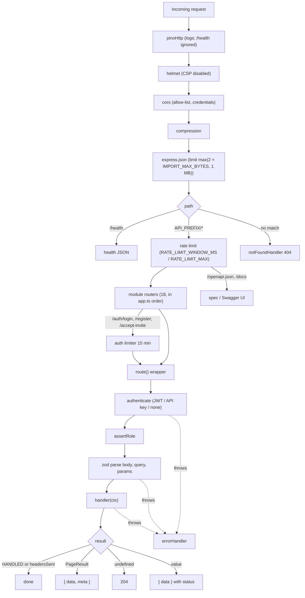

Every HTTP request goes through the same pipeline: the Express middleware in `src/app.ts`, then the module router, then the `route()` wrapper in `src/lib/http.ts` (auth, roles, zod validation, response envelope), then a service, and finally the error handler if anything throws. This page walks through each stage and ends with a worked example of adding an endpoint.



## Middleware stack

`createApp()` in `src/app.ts` registers, in order:

| # | Middleware | Configuration | Notes |
|---|---|---|---|
| 0 | `app.disable("x-powered-by")`, `app.set("trust proxy", 1)` | | `trust proxy` lets rate limiting use the client IP behind one proxy hop (ALB or nginx). |
| 1 | `pinoHttp({ logger, autoLogging: { ignore: req => req.url === "/health" } })` | shared `logger` from `lib/logger.ts` | Adds `req.log`. Headers `authorization` and `x-api-key` are redacted. |
| 2 | `helmet({ contentSecurityPolicy: false })` | | CSP is off so Swagger UI's inline assets load. |
| 3 | `cors({ origin, credentials: true })` | `origin` callback | Allows a request when it has no `Origin` header (curl, server-to-server), when `CORS_ORIGINS` contains `*`, or when the origin is in the comma-separated list. |
| 4 | `compression()` | | gzip/deflate |
| 5 | `express.json({ limit })` | `Math.max(config.IMPORT_MAX_BYTES * 2, 1024 * 1024)` | 10 MB with the default `IMPORT_MAX_BYTES` (5 MB). Import payloads are JSON strings, which is why the limit is doubled. |
| 6 | `GET /health` | | `{ status: "ok", env, db, uptime }`. Sits outside the rate limiter. |
| 7 | `api = express.Router()` mounted at `config.API_PREFIX` | | Everything below is inside the prefix. |
| 7a | `rateLimit({ windowMs: RATE_LIMIT_WINDOW_MS, limit: RATE_LIMIT_MAX, standardHeaders: true, legacyHeaders: false })` | defaults 60 000 ms / 600 | Per IP, in memory. Sends the standard `RateLimit-*` headers. |
| 7b | `for (const m of modules) api.use(m.basePath \|\| "/", m.router)` | 18 modules | Modules with an empty base path (`organizationModule`, `outreachModule`) are mounted at `/`. |
| 7c | `GET /openapi.json` | `buildOpenApi()` result, built once at startup | |
| 7d | `/docs` | `swaggerUi.serve`, `swaggerUi.setup(spec, { customSiteTitle: "SellEasy API" })` | |
| 8 | `notFoundHandler` | | `404 { error: { code: "not_found", message: "Route GET /x not found" } }` |
| 9 | `errorHandler` | | See [Error handling](#error-handling). |

`authModule` adds a second limiter on its own router for `["/login", "/register", "/accept-invite"]`: `windowMs: 15 * 60_000`, `limit: config.isProd ? 20 : 1000`.

<Callout type="warn" title="Route order matters inside a module">
Express matches in registration order. Literal paths like `/accounts/counts`, `/accounts/duplicates` and `/integrations/waterfall` are declared **before** `/:id` so the param route doesn't swallow them. Follow the same rule when you add endpoints.
</Callout>

## The `route()` wrapper

`createModule(tag, basePath)` returns `{ router, route, basePath, tag }`. Each `route(def)` call does two things:

1. It pushes `{ tag, fullPath: basePath + path, def }` into `routeRegistry`. OpenAPI generation reads from there.
2. It registers an async Express handler on `router[def.method](def.path, …)`.

### `RouteDef`

<TypeTable
  type={{
    method: { type: '"get" | "post" | "put" | "patch" | "delete"', description: 'HTTP method.', required: true },
    path: { type: 'string', description: 'Express path relative to the module base path, e.g. "/:id/merge". "/" maps to the base path itself.', required: true },
    summary: { type: 'string', description: 'One-line OpenAPI summary.', required: true },
    description: { type: 'string', description: 'Longer OpenAPI description. Roles and scope are appended automatically.' },
    auth: { type: '"user" | "apiKey" | "none"', description: 'Authentication mode.', default: '"user"' },
    roles: { type: 'Role[]', description: 'Allowed roles. Usually atLeast("admin") or a literal list.', default: 'GET → atLeast("viewer"); other methods → atLeast("member")' },
    scope: { type: 'string', description: 'Required API key scope when auth is "apiKey".' },
    body: { type: 'ZodType<B>', description: 'Schema for req.body.' },
    query: { type: 'ZodType<Q>', description: 'Schema for req.query (strings: use z.coerce / csvList / boolQuery).' },
    params: { type: 'ZodType<P>', description: 'Schema for req.params (usually idParams).' },
    status: { type: 'number', description: 'Success status.', default: 'POST → 201, others → 200' },
    produces: { type: 'string', description: 'OpenAPI response content type, e.g. "text/csv".', default: '"application/json"' },
    handler: { type: '(ctx: RouteContext) => unknown', description: 'Sync or async function. Its return value becomes the response.', required: true },
  }}
/>

### Execution order inside the handler

```ts title="src/lib/http.ts (simplified)"
const mode = def.auth ?? "user"
if (mode === "user") await authenticateJwt(req)              // 401 on missing/invalid token or inactive user
else if (mode === "apiKey") await authenticateApiKey(req, def.scope) // 401 bad key, 403 missing scope
if (mode !== "none") {
  const roles = def.roles ?? (def.method === "get" ? atLeast("viewer") : atLeast("member"))
  assertRole(req.auth, roles)                                  // 403
}
const ctx = {
  req, res,
  body:   parse(def.body,   req.body,   "request body"),       // 400
  query:  parse(def.query,  req.query,  "query parameters"),
  params: parse(def.params, req.params, "path parameters"),
  get auth()  { /* req.auth or throw 401 */ },
  get orgId() { /* req.auth.orgId or throw 401 */ },
}
const result = await def.handler(ctx)
```

- **Authentication happens before validation.** An unauthenticated request with a bad body gets `401`, not `400`.
- **API-key requests always run with the role `member`**, so the default write policy lets them through. See [Auth and security](/docs/engineering/backend/auth-and-security).
- When no schema is given, `parse()` returns the raw value, or `{}` if it is missing.
- On `auth: "none"` routes, reading `ctx.auth` or `ctx.orgId` throws `401`.

### Default role policy

| Method | Default `roles` | Typical overrides |
|---|---|---|
| `GET` | `atLeast("viewer")` → owner, admin, member, viewer | `atLeast("admin")` for `GET /api-keys` |
| `POST`, `PUT`, `PATCH`, `DELETE` | `atLeast("member")` → owner, admin, member | `atLeast("admin")` for org, team, API keys, ICP, playbooks, integration connect and settings. `["owner"]` for `/org/plan` and `/admin/reset`. `atLeast("viewer")` for `POST /icp/preview`, `PATCH /me`, `PUT /me/preferences`. An explicit all-roles list for `/auth/logout` and `/auth/change-password`. |

### Response envelope and status codes

| Handler returns | HTTP status | Body |
|---|---|---|
| `HANDLED` (symbol), or anything after `res` was written | whatever the handler sent | whatever the handler sent (CSV downloads) |
| `paged(page)` → `PageResult` | `def.status ?? 200` for GET. **Always 200 for POST.** | `{ data: items, meta: { total, page, pageSize } }` |
| `undefined` (including `void` handlers) | `204` | empty |
| any other value | `def.status ?? (post ? 201 : 200)` | `{ data: value }` |

Action endpoints that don't create anything set `status: 200` explicitly (for example `POST /accounts/:id/merge` and `POST /agent/drafts/:id/approve`). The webhook uses `status: 202`.

```json title="Paged response"
{
  "data": [{ "id": "acc_k2x9QmZa", "name": "Nimbus Labs", "score": 81, "tier": "A" }],
  "meta": { "total": 66, "page": 1, "pageSize": 25 }
}
```

## Error handling

Handlers and middleware throw. Express 5 forwards rejected promises to `errorHandler` in `src/middleware/error.ts`:

| Error | Status | Body |
|---|---|---|
| `HttpError` | `err.status` | `{ error: { code, message, details } }` |
| body-parser `entity.parse.failed` | 400 | `{ error: { code: "invalid_json", message: "Malformed JSON body" } }` |
| body-parser `entity.too.large` | 413 | `{ error: { code: "payload_too_large", … } }` |
| anything else | 500 | `{ error: { code: "internal_error", message: "Something went wrong" } }`, with the error logged as `Unhandled error` |

### `HttpError` helpers (`src/lib/errors.ts`)

| Helper | Status | `code` | Default message |
|---|---|---|---|
| `badRequest(message, details?)` | 400 | `bad_request` | — |
| `unauthorized(message?)` | 401 | `unauthorized` | `Authentication required` |
| `forbidden(message?)` | 403 | `forbidden` | `You do not have permission to perform this action` |
| `notFound(what?)` | 404 | `not_found` | `` `${what} not found` `` (default `Resource`) |
| `conflict(message, details?)` | 409 | `conflict` | — |
| `unprocessable(message, details?)` | 422 | `unprocessable` | — |
| `must(value, what)` | 404 | `not_found` | Narrows `T \| null \| undefined` to `T` |

Validation errors come out as `badRequest("Invalid request body", z.flattenError(error))`:

```json title="400 response"
{
  "error": {
    "code": "bad_request",
    "message": "Invalid request body",
    "details": { "formErrors": [], "fieldErrors": { "name": ["Too small: expected string to have >=1 characters"] } }
  }
}
```

The frontend's `ApiError.fieldErrors` reads `details.fieldErrors`. The full error catalogue is in [API errors](/docs/engineering/api/errors).

## List query conventions

`src/lib/http.ts` exports shared zod pieces:

| Export | Schema | Result |
|---|---|---|
| `idParams` | `{ id: string (min 1) }` | `params.id` |
| `listQuery` | `page` (int ≥ 1, default 1), `pageSize` (1–1000, default 25), `q` (trimmed, optional), `sort` (regex `^[a-zA-Z_]+:(asc\|desc)$`, optional) | Extend it with `.extend({...})` for resource filters |
| `parseSort(sort, allowed, fallback)` | — | Returns `{ field, dir }`. Throws `400 Cannot sort by "x". Allowed: …` for fields not in the whitelist. |
| `csvList` | `string \| string[]` → `string[] \| undefined` | Accepts `?tier=A,B` and `?tier=A&tier=B`. Pipe into an enum: `csvList.pipe(z.array(tier).optional())`. |
| `boolQuery` | `"true" \| "false"` → `boolean \| undefined` | Anything else is a 400. |
| `idList` | `{ ids: string[] (1–1000) }` | Bulk endpoints |

```ts title="src/modules/accounts/routes.ts"
const listFilters = listQuery.extend({
  view: z.enum(["all", "mine", "unassigned", "duplicates"]).optional(),
  tier: csvList.pipe(z.array(tier).optional()),
  industry: csvList,
  excludeDuplicates: boolQuery,
})
// …
handler: async ({ orgId, auth, query }) => {
  const sort = parseSort(query.sort, ACCOUNT_SORT_FIELDS, { field: "score", dir: "desc" })
  return paged(await accountService.list(orgId, auth.userId, query, query.page, query.pageSize, sort))
}
```

## Expansion helpers

`src/lib/expand.ts` attaches small related summaries in one batched query per collection, which avoids N+1 lookups:

| Helper | Input constraint | Adds |
|---|---|---|
| `withAccounts(orgId, items)` | `items: { accountId: string }[]` | `account: { id, name, domain, tier, score, industry } \| null` |
| `withContacts(orgId, items)` | `items: { contactId?: string }[]` | `contact: { id, firstName, lastName, title, email, accountId } \| null` |

Both are used on signals, runs and drafts, and can be chained: `withContacts(orgId, await withAccounts(orgId, page.items))`. A dangling reference produces `null` instead of an error.

## OpenAPI generation

`buildOpenApi()` in `src/lib/openapi.ts` runs once, inside `createApp()`, and loops over `routeRegistry`:

- **Path.** `API_PREFIX + fullPath`, with `:param` rewritten as `{param}`. Every path param is declared as a required string.
- **Query params.** `z.toJSONSchema(def.query, { io: "input", unrepresentable: "any" })`, with one parameter per property. `required` is taken from the JSON schema, so fields with defaults count as optional.
- **Request body.** The JSON schema of `def.body`. If conversion fails, it falls back to `{ type: "object" }`.
- **Security.** `[]` for `auth: "none"`, `apiKey` (`x-api-key` header) for API-key routes, `bearerAuth` (JWT) otherwise.
- **Description.** `def.description`, plus `Roles: …` when `roles` is set explicitly and `API key scope: …` when `scope` is set.
- **Responses.** The success status, with an empty schema for `produces`, plus generic 400, 401, 403 and 404. **Response bodies are not described.**

The document is OpenAPI `3.1.0`, titled "SellEasy API", with one tag per module. It is served at `GET /api/v1/openapi.json`, with Swagger UI at `/api/v1/docs`.

## Adding a new endpoint

The example adds `POST /accounts/:id/tags`, which appends tags to an account.

<Steps>
<Step>
### Put the logic in the service

```ts title="src/modules/accounts/service.ts"
export const accountService = {
  // …
  async addTags(orgId: string, id: string, tags: string[]) {
    const cur = await this.get(orgId, id) // throws 404 "Account not found"
    const next = [...new Set([...cur.tags, ...tags.map((t) => t.trim().toLowerCase())])]
    // update() records an EntityVersion and re-scores only if scoring fields change
    const { account } = await this.update(orgId, id, { tags: next }, "Tags added")
    return account
  },
}
```
</Step>
<Step>
### Declare the route

```ts title="src/modules/accounts/routes.ts"
route({
  method: "post",
  path: "/:id/tags",               // declared among the single-account actions
  summary: "Add tags to an account",
  status: 200,                      // action, not a creation
  params: idParams,
  body: z.object({ tags: z.array(z.string().trim().min(1).max(40)).min(1).max(20) }),
  // roles omitted → POST defaults to atLeast("member")
  handler: ({ orgId, params, body }) => accountService.addTags(orgId, params.id, body.tags),
})
```
</Step>
<Step>
### Add a test

Add a case to `tests/api.test.ts` (see [Testing](/docs/engineering/testing)). The OpenAPI document and Swagger UI pick up the route automatically on the next start.
</Step>
<Step>
### Expose it to the frontend

Add a typed function and a mutation hook under `frontend/src/lib/api/hooks/accounts.ts` (see [Frontend data layer](/docs/engineering/frontend/data-layer)).
</Step>
</Steps>

## Pitfalls

<Callout type="error" title="zod defaults inside .partial() clobber PATCHes">
zod applies `.default()` values **even inside `.partial()`**. If a create schema has `enabled: z.boolean().default(true)` and you reuse it as `create.partial()` for a PATCH, every PATCH that omits `enabled` sets it back to `true`.

The agent module avoids this by keeping two schemas: `ruleFields` has **no defaults** and backs `ruleFields.partial()` for PATCH, while `ruleCreate = ruleFields.extend({ description: …default(""), enabled: …default(true), requireApproval: …default(true) })` is used for POST. Do the same everywhere.
</Callout>

<Callout type="warn" title="An undefined key in a patch clears the field">
`JsonRepository.update` merges with `{ ...cur, ...patch }`. A key that is **present with the value `undefined`** overwrites the current value, and `JSON.stringify` then drops the field from the file. Services use this on purpose (`{ duplicateOf: undefined }`, `{ apiKeyEncrypted: undefined }`, `{ syncedAt: undefined }`).

The flip side: never spread a partially filled object into a patch without first stripping the undefined keys you didn't mean to clear. When "null clears / omitted leaves unchanged" semantics are needed over HTTP, routes accept `.nullable().optional()` and translate `null` to `undefined` explicitly. See `PATCH /agent/playbooks/:id` (`sequenceId`) and `PATCH /deals/:id` (`contactId`). `null` itself is stored as `null` (for example `ownerId: null`).
</Callout>

<Callout type="info" title="Query values are strings">
`req.query` values are strings or string arrays. Use `z.coerce.number()`, `boolQuery` or `csvList` rather than `z.number()` / `z.boolean()`, which always fail on query input.
</Callout>
