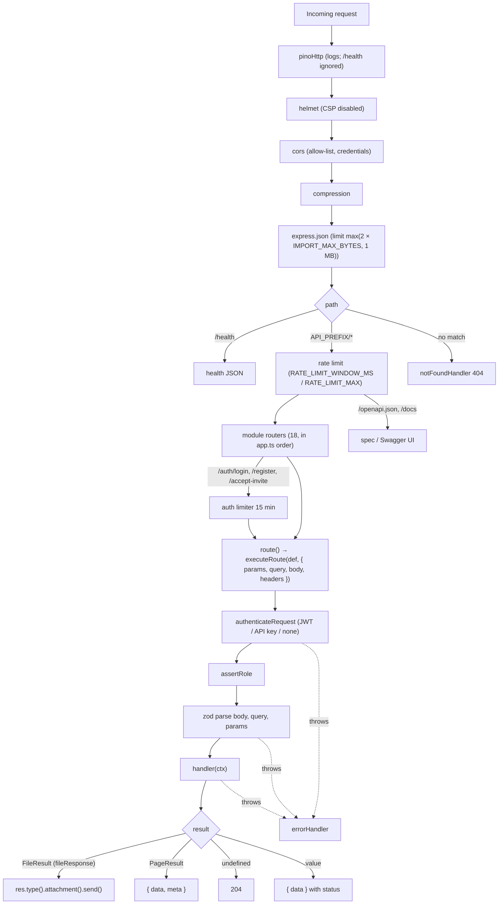

Every HTTP request goes through the same pipeline: the Express middleware in `src/app.ts`, then the module router bound by `src/lib/http.ts`, then `executeRoute()` in `src/lib/route-runtime.ts` (auth, roles, zod validation, response envelope), then a service, and finally the error handler if anything throws. `executeRoute()` knows nothing about Express, which is what lets the frontend's mock mode run the same definitions in the browser. This page walks through each stage and ends with a worked example of adding an endpoint.



## Middleware stack

`createApp()` in `src/app.ts` registers, in order:

| # | Middleware | Configuration | Notes |
|---|---|---|---|
| 0 | `app.disable("x-powered-by")`, `app.set("trust proxy", 1)` | | `trust proxy` lets rate limiting use the client IP behind one proxy hop (ALB or nginx). |
| 1 | `pinoHttp({ logger, autoLogging: { ignore: req => req.url === "/health" } })` | shared `logger` from `lib/logger.ts` | Adds `req.log`. Headers `authorization` and `x-api-key` are redacted. |
| 2 | `helmet({ contentSecurityPolicy: false })` | | CSP is off so Swagger UI's inline assets load. |
| 3 | `cors({ origin, credentials: true })` | `origin` callback | Allows a request when it has no `Origin` header (curl, server-to-server), when `CORS_ORIGINS` contains `*`, or when the origin is in the comma-separated list. |
| 4 | `compression()` | | gzip/deflate |
| 5 | `express.json({ limit })` | `Math.max(config.IMPORT_MAX_BYTES * 2, 1024 * 1024)` | 10 MB with the default `IMPORT_MAX_BYTES` (5 MB). Import payloads are JSON strings, which is why the limit is doubled. |
| 6 | `GET /health` | | `{ status: "ok", env, db, uptime }`. Sits outside the rate limiter. |
| 7 | `api = express.Router()` mounted at `config.API_PREFIX` | | Everything below is inside the prefix. |
| 7a | `rateLimit({ windowMs: RATE_LIMIT_WINDOW_MS, limit: RATE_LIMIT_MAX, standardHeaders: true, legacyHeaders: false })` | defaults 60 000 ms / 600 | Per IP, in memory. Sends the standard `RateLimit-*` headers. |
| 7b | `for (const m of modules) api.use(m.basePath \|\| "/", m.router)` | 18 modules | Modules with an empty base path (`organizationModule`, `outreachModule`) are mounted at `/`. |
| 7c | `GET /openapi.json` | `buildOpenApi()` result, built once at startup | |
| 7d | `/docs` | `swaggerUi.serve`, `swaggerUi.setup(spec, { customSiteTitle: "SellEasy API" })` | |
| 8 | `notFoundHandler` | | `404 { error: { code: "not_found", message: "Route GET /x not found" } }` |
| 9 | `errorHandler` | | See [Error handling](#error-handling). |

`authModule` adds a second limiter on its own router for `["/login", "/register", "/accept-invite"]`: `windowMs: 15 * 60_000`, `limit: config.isProd ? 20 : 1000`.

<Callout type="warn" title="Route order matters inside a module">
Express matches in registration order. Literal paths like `/accounts/counts`, `/accounts/duplicates` and `/integrations/waterfall` are declared **before** `/:id` so the param route doesn't swallow them. Follow the same rule when you add endpoints. The mock runtime also picks the first registered match, so the order matters there too.
</Callout>

## Route definitions and the runtime

Route handling is split into two files:

| File | Imports Node/Express? | Contents |
|---|---|---|
| `src/lib/route-runtime.ts` | **No** (portable) | `RouteDef`, `RouteContext`, `executeRoute()`, `errorOutput()`, `PageResult`/`paged()`, `FileResult`/`fileResponse()`, `routeRegistry`, and the shared schemas |
| `src/lib/http.ts` | Yes | `createModule()` and `route()`, which bind definitions to Express. Also `export * from "./route-runtime.js"`, so modules keep importing from `lib/http.js`. |

`createModule(tag, basePath)` returns `{ router, route, basePath, tag }`. Each `route(def)` call does two things:

1. It pushes `{ tag, fullPath: basePath + path, def }` into `routeRegistry`. OpenAPI generation reads from there, and so does the frontend's mock runtime.
2. It registers an async Express handler on `router[def.method](def.path, …)` that calls `executeRoute()` and writes the result:

```ts title="src/lib/http.ts"
router[def.method](def.path, async (req: Request, res: Response) => {
  const out = await executeRoute(d, {
    params: req.params,
    query: req.query,
    body: req.body,
    headers: { authorization: req.headers.authorization, "x-api-key": req.header("x-api-key") },
  })
  if ("file" in out) {
    res.type(out.file.contentType).attachment(out.file.filename).send(out.file.content)
  } else if ("json" in out) {
    res.status(out.status).json(out.json)
  } else {
    res.status(204).end()
  }
})
```

Only the `authorization` and `x-api-key` headers are passed to the runtime. In mock mode, `frontend/src/mock-api/server.ts` matches the method and path against `routeRegistry` itself and calls the same `executeRoute()` (see [Mock data mode](/docs/engineering/frontend/mock-mode)).

### `RouteDef`

<TypeTable
  type={{
    method: { type: '"get" | "post" | "put" | "patch" | "delete"', description: 'HTTP method.', required: true },
    path: { type: 'string', description: 'Express-style path relative to the module base path, e.g. "/:id/merge". "/" maps to the base path itself.', required: true },
    summary: { type: 'string', description: 'One-line OpenAPI summary.', required: true },
    description: { type: 'string', description: 'Longer OpenAPI description. Roles and scope are appended automatically.' },
    auth: { type: '"user" | "apiKey" | "none"', description: 'Authentication mode.', default: '"user"' },
    roles: { type: 'Role[]', description: 'Allowed roles. Usually atLeast("admin") or a literal list.', default: 'GET → atLeast("viewer"); other methods → atLeast("member")' },
    scope: { type: 'string', description: 'Required API key scope when auth is "apiKey".' },
    body: { type: 'ZodType<B>', description: 'Schema for the request body.' },
    query: { type: 'ZodType<Q>', description: 'Schema for the query string (strings: use z.coerce / csvList / boolQuery).' },
    params: { type: 'ZodType<P>', description: 'Schema for the path parameters (usually idParams).' },
    status: { type: 'number', description: 'Success status.', default: 'POST → 201, others → 200' },
    produces: { type: 'string', description: 'OpenAPI response content type, e.g. "text/csv".', default: '"application/json"' },
    handler: { type: '(ctx: RouteContext<B, Q, P>) => unknown', description: 'Sync or async function. Its return value becomes the response.', required: true },
  }}
/>

### `RouteContext`

```ts title="src/lib/route-runtime.ts"
export interface RouteContext<B, Q, P> {
  body: B
  query: Q
  params: P
  auth: AuthContext
  /** Convenience: auth.orgId */
  orgId: string
}
```

The context has **no `req` or `res`**. Handlers can't read other headers, set headers or stream a response. To send a file, return `fileResponse()` (below). `AuthContext` (`src/lib/roles.ts`) is `{ userId, orgId, role, via: "jwt" | "apiKey", scopes? }`.

### `executeRoute(def, input)`

```ts title="src/lib/route-runtime.ts (simplified)"
export async function executeRoute(def, input: RouteInput): Promise<RouteOutput> {
  const mode = def.auth ?? "user"
  let auth: AuthContext | undefined
  if (mode !== "none") {
    auth = await authenticateRequest(mode, input.headers, def.scope) // 401 bad/missing credentials, 403 missing scope
    assertRole(auth, def.roles ?? (def.method === "get" ? atLeast("viewer") : atLeast("member"))) // 403
  }
  const ctx = {
    body:   parse(def.body,   input.body,   "request body"),       // 400
    query:  parse(def.query,  input.query,  "query parameters"),
    params: parse(def.params, input.params, "path parameters"),
    get auth()  { /* auth, or throw 401 */ },
    get orgId() { /* auth.orgId, or throw 401 */ },
  }
  const result = await def.handler(ctx)
  if (result instanceof FileResult) return { status: 200, file: result }
  if (result === undefined) return { status: 204 }
  const status = def.status ?? (def.method === "post" ? 201 : 200)
  if (result instanceof PageResult) {
    const { items, total, page, pageSize } = result.page
    return { status: def.method === "post" ? 200 : status, json: { data: items, meta: { total, page, pageSize } } }
  }
  return { status, json: { data: result } }
}
```

`RouteInput` is `{ params, query, body, headers }`, where `headers` is `Record<string, string | undefined>` with lower-case keys. `RouteOutput` is one of `{ status, json }`, `{ status: 204 }` or `{ status, file }`.

- **Authentication happens before validation.** An unauthenticated request with a bad body gets `401`, not `400`.
- `authenticateRequest(mode, headers, scope)` calls `authenticateBearer(headers.authorization)` for `"user"` routes and `authenticateApiKey(headers["x-api-key"] ?? <bearer value>, scope)` for `"apiKey"` routes. See [Auth and security](/docs/engineering/backend/auth-and-security).
- **API-key requests always run with the role `member`**, so the default write policy lets them through.
- When no schema is given, `parse()` returns the raw value, or `{}` if it is missing.
- On `auth: "none"` routes, reading `ctx.auth` or `ctx.orgId` throws `401`.
- `executeRoute()` **throws** `HttpError`s (and anything else a handler throws). The transport decides how to render them (see [Error handling](#error-handling)).

### Default role policy

| Method | Default `roles` | Typical overrides |
|---|---|---|
| `GET` | `atLeast("viewer")` → owner, admin, member, viewer | `atLeast("admin")` for `GET /api-keys` |
| `POST`, `PUT`, `PATCH`, `DELETE` | `atLeast("member")` → owner, admin, member | `atLeast("admin")` for org, team, API keys, ICP, playbooks, integration connect and settings. `["owner"]` for `/org/plan` and `/admin/reset`. `atLeast("viewer")` for `POST /icp/preview`, `PATCH /me`, `PUT /me/preferences`. An explicit all-roles list for `/auth/logout` and `/auth/change-password`. |

### Response envelope and status codes

| Handler returns | HTTP status | Body |
|---|---|---|
| `fileResponse(filename, content, contentType = "text/csv")` → `FileResult` | `200` | The raw content, sent by Express with `Content-Type: <contentType>` and `Content-Disposition: attachment; filename="<filename>"`. Used by `GET /analytics/deals.csv` and `GET /import/templates/:type`. |
| `paged(page)` → `PageResult` | `def.status ?? 200` for GET. **Always 200 for POST.** | `{ data: items, meta: { total, page, pageSize } }` |
| `undefined` (including `void` handlers) | `204` | empty |
| any other value | `def.status ?? (post ? 201 : 200)` | `{ data: value }` |

Action endpoints that don't create anything set `status: 200` explicitly (for example `POST /accounts/:id/merge` and `POST /agent/drafts/:id/approve`). The webhook uses `status: 202`. `POST /auth/logout` and `POST /auth/change-password` declare `status: 204` and return nothing.

```json title="Paged response"
{
  "data": [{ "id": "acc_k2x9QmZa", "name": "Nimbus Labs", "score": 81, "tier": "A" }],
  "meta": { "total": 66, "page": 1, "pageSize": 25 }
}
```

```ts title="src/modules/analytics/routes.ts (file download)"
route({
  method: "get",
  path: "/deals.csv",
  summary: "Export deals created in the date range as CSV",
  produces: "text/csv",
  query: rangeQuery,
  handler: async ({ orgId, query }) => {
    const { csv } = await analyticsService.dealsCsv(orgId, query.days)
    const date = new Date().toISOString().slice(0, 10)
    return fileResponse(`selleasy-deals-${query.days}d-${date}.csv`, csv)
  },
})
```

## Error handling

Handlers and middleware throw. Express 5 forwards rejected promises (including errors thrown by `executeRoute()`) to `errorHandler` in `src/middleware/error.ts`:

| Error | Status | Body |
|---|---|---|
| `HttpError` | `err.status` | `{ error: { code, message, details } }` |
| body-parser `entity.parse.failed` | 400 | `{ error: { code: "invalid_json", message: "Malformed JSON body" } }` |
| body-parser `entity.too.large` | 413 | `{ error: { code: "payload_too_large", … } }` |
| anything else | 500 | `{ error: { code: "internal_error", message: "Something went wrong" } }`, with the error logged as `Unhandled error` |

### `HttpError` helpers (`src/lib/errors.ts`)

| Helper | Status | `code` | Default message |
|---|---|---|---|
| `badRequest(message, details?)` | 400 | `bad_request` | — |
| `unauthorized(message?)` | 401 | `unauthorized` | `Authentication required` |
| `forbidden(message?)` | 403 | `forbidden` | `You do not have permission to perform this action` |
| `notFound(what?)` | 404 | `not_found` | `` `${what} not found` `` (default `Resource`) |
| `conflict(message, details?)` | 409 | `conflict` | — |
| `unprocessable(message, details?)` | 422 | `unprocessable` | — |
| `must(value, what)` | 404 | `not_found` | Narrows `T \| null \| undefined` to `T` |

Validation errors come out as `badRequest("Invalid request body", z.flattenError(error))`:

```json title="400 response"
{
  "error": {
    "code": "bad_request",
    "message": "Invalid request body",
    "details": { "formErrors": [], "fieldErrors": { "name": ["Too small: expected string to have >=1 characters"] } }
  }
}
```

The frontend's `ApiError.fieldErrors` reads `details.fieldErrors`. The full error catalogue is in [API errors](/docs/engineering/api/errors).

`route-runtime.ts` also exports `errorOutput(err)`, which turns an `HttpError` into `{ status, json: { error: { code, message, details } } }` and rethrows anything else. The Express app doesn't use it (it has `errorHandler`), but the mock runtime does, and turns other errors into `500 internal_error` itself. `middleware/error.ts` isn't copied to the browser.

## List query conventions

`src/lib/route-runtime.ts` exports shared zod pieces (re-exported by `src/lib/http.ts`):

| Export | Schema | Result |
|---|---|---|
| `idParams` | `{ id: string (min 1) }` | `params.id` |
| `listQuery` | `page` (int ≥ 1, default 1), `pageSize` (1–1000, default 25), `q` (trimmed, optional), `sort` (regex `^[a-zA-Z_]+:(asc\|desc)$`, optional) | Extend it with `.extend({...})` for resource filters |
| `parseSort(sort, allowed, fallback)` | — | Returns `{ field, dir }`. Throws `400 Cannot sort by "x". Allowed: …` for fields not in the whitelist. |
| `csvList` | `string \| string[]` → `string[] \| undefined` | Accepts `?tier=A,B` and `?tier=A&tier=B`. Pipe into an enum: `csvList.pipe(z.array(tier).optional())`. |
| `boolQuery` | `"true" \| "false"` → `boolean \| undefined` | Anything else is a 400. |
| `idList` | `{ ids: string[] (1–1000) }` | Bulk endpoints |

```ts title="src/modules/accounts/routes.ts"
const listFilters = listQuery.extend({
  view: z.enum(["all", "mine", "unassigned", "duplicates"]).optional(),
  tier: csvList.pipe(z.array(tier).optional()),
  industry: csvList,
  excludeDuplicates: boolQuery,
})
// …
handler: async ({ orgId, auth, query }) => {
  const sort = parseSort(query.sort, ACCOUNT_SORT_FIELDS, { field: "score", dir: "desc" })
  return paged(await accountService.list(orgId, auth.userId, query, query.page, query.pageSize, sort))
}
```

## Expansion helpers

`src/lib/expand.ts` attaches small related summaries in one batched query per collection, which avoids N+1 lookups:

| Helper | Input constraint | Adds |
|---|---|---|
| `withAccounts(orgId, items)` | `items: { accountId: string }[]` | `account: { id, name, domain, tier, score, industry } \| null` |
| `withContacts(orgId, items)` | `items: { contactId?: string }[]` | `contact: { id, firstName, lastName, title, email, accountId } \| null` |

Both are used on signals, runs and drafts, and can be chained: `withContacts(orgId, await withAccounts(orgId, page.items))`. A dangling reference produces `null` instead of an error.

## OpenAPI generation

`buildOpenApi()` in `src/lib/openapi.ts` runs once, inside `createApp()`, and loops over `routeRegistry`:

- **Path.** `API_PREFIX + fullPath`, with `:param` rewritten as `{param}`. Every path param is declared as a required string.
- **Query params.** `z.toJSONSchema(def.query, { io: "input", unrepresentable: "any" })`, with one parameter per property. `required` is taken from the JSON schema, so fields with defaults count as optional.
- **Request body.** The JSON schema of `def.body`. If conversion fails, it falls back to `{ type: "object" }`.
- **Security.** `[]` for `auth: "none"`, `apiKey` (`x-api-key` header) for API-key routes, `bearerAuth` (JWT) otherwise.
- **Description.** `def.description`, plus `Roles: …` when `roles` is set explicitly and `API key scope: …` when `scope` is set.
- **Responses.** The success status, which is `def.status` or else `204` for `DELETE`, `201` for `POST` and `200` otherwise, with an empty schema for `produces`. Then generic 400, 401, 403 and 404. **Response bodies are not described.** So `DELETE` routes, `/auth/logout` and `/auth/change-password` are all listed as `204`.

The document is OpenAPI `3.1.0`, titled "SellEasy API", with one tag per module. It is served at `GET /api/v1/openapi.json`, with Swagger UI at `/api/v1/docs`.

## Writing an endpoint

The example adds two endpoints to the accounts module: `POST /accounts/:id/tags`, which appends tags to an account, and `GET /accounts/:id/contacts.csv`, which downloads the account's contacts.

<Steps>
<Step>
### Put the logic in the service

```ts title="src/modules/accounts/service.ts"
import { toCsv } from "../analytics/service.js"

export const accountService = {
  // …
  async addTags(orgId: string, id: string, tags: string[]) {
    const cur = await this.get(orgId, id) // throws 404 "Account not found"
    const next = [...new Set([...cur.tags, ...tags.map((t) => t.trim().toLowerCase())])]
    // update() records an EntityVersion and re-scores only if scoring fields change
    const { account } = await this.update(orgId, id, { tags: next }, "Tags added")
    return account
  },

  async contactsCsv(orgId: string, id: string) {
    const account = await this.get(orgId, id)
    const contacts = await db.contacts.find(orgId, { accountId: id }, { field: "lastName", dir: "asc" })
    const csv = toCsv(["firstName", "lastName", "title", "email"], contacts.map((c) => [c.firstName, c.lastName, c.title, c.email]))
    return { account, csv }
  },
}
```

Services stay portable: only `db.*`, other services and web-standard APIs. No `fs`, `Buffer` or `process`.
</Step>
<Step>
### Declare the routes

```ts title="src/modules/accounts/routes.ts"
import { createModule, fileResponse, idParams /* … */ } from "../../lib/http.js"

route({
  method: "post",
  path: "/:id/tags",               // declared among the single-account actions
  summary: "Add tags to an account",
  status: 200,                      // action, not a creation
  params: idParams,
  body: z.object({ tags: z.array(z.string().trim().min(1).max(40)).min(1).max(20) }),
  // roles omitted → POST defaults to atLeast("member")
  handler: ({ orgId, params, body }) => accountService.addTags(orgId, params.id, body.tags),
})

route({
  method: "get",
  path: "/:id/contacts.csv",
  summary: "Download an account's contacts as CSV",
  produces: "text/csv",             // OpenAPI content type
  params: idParams,
  handler: async ({ orgId, params }) => {
    const { account, csv } = await accountService.contactsCsv(orgId, params.id)
    return fileResponse(`${account.domain}-contacts.csv`, csv) // contentType defaults to "text/csv"
  },
})
```

The handler only gets `{ body, query, params, auth, orgId }`. Return a value for `{ data }`, `paged()` for lists, `undefined` for `204`, or `fileResponse()` for a download. Throw `HttpError` helpers for failures.
</Step>
<Step>
### Add a test

Add a case to `tests/api.test.ts` (see [Testing](/docs/engineering/testing)). The OpenAPI document and Swagger UI pick up the routes automatically on the next start. For the CSV route, assert on `res.headers["content-type"]` and `res.text`.
</Step>
<Step>
### Sync the mock core

```bash
cd ../frontend
npm run mock:sync     # copies the changed backend files into src/mock-api/core
npm run mock:check
```

Commit the regenerated files in the frontend repository. The routes then work in mock mode too. If you added a **new module**, also import its `routes` file in `frontend/src/mock-api/server.ts`.
</Step>
<Step>
### Expose it to the frontend

Add a typed function and a hook under `frontend/src/lib/api/hooks/accounts.ts`:

```ts title="frontend/src/lib/api/hooks/accounts.ts"
export const useAddTags = () =>
  useApiMutation(({ id, tags }: { id: string; tags: string[] }) => api.post<Account>(`/accounts/${id}/tags`, { tags }), {
    successMessage: "Tags added",
  })

export const fetchAccountContactsCsv = (id: string) => api.text(`/accounts/${id}/contacts.csv`)
// in the component: downloadText(await fetchAccountContactsCsv(id), "contacts.csv")
```

See [Frontend data layer](/docs/engineering/frontend/data-layer).
</Step>
</Steps>

## Pitfalls

<Callout type="error" title="zod defaults inside .partial() clobber PATCHes">
zod applies `.default()` values **even inside `.partial()`**. If a create schema has `enabled: z.boolean().default(true)` and you reuse it as `create.partial()` for a PATCH, every PATCH that omits `enabled` sets it back to `true`.

The agent module avoids this by keeping two schemas: `ruleFields` has **no defaults** and backs `ruleFields.partial()` for PATCH, while `ruleCreate = ruleFields.extend({ description: …default(""), enabled: …default(true), requireApproval: …default(true) })` is used for POST. Do the same everywhere.
</Callout>

<Callout type="warn" title="An undefined key in a patch clears the field">
`MemoryRepository.update` (and so `JsonRepository.update`) merges with `{ ...cur, ...patch }`. A key that is **present with the value `undefined`** overwrites the current value, and `JSON.stringify` then drops the field from the file. Services use this on purpose (`{ duplicateOf: undefined }`, `{ apiKeyEncrypted: undefined }`, `{ syncedAt: undefined }`).

The flip side: never spread a partially filled object into a patch without first stripping the undefined keys you didn't mean to clear. When "null clears / omitted leaves unchanged" semantics are needed over HTTP, routes accept `.nullable().optional()` and translate `null` to `undefined` explicitly. See `PATCH /agent/playbooks/:id` (`sequenceId`) and `PATCH /deals/:id` (`contactId`). `null` itself is stored as `null` (for example `ownerId: null`).
</Callout>

<Callout type="info" title="Query values are strings">
Query values arrive as strings or string arrays (from Express's `req.query`, or from `URLSearchParams` in mock mode). Use `z.coerce.number()`, `boolQuery` or `csvList` rather than `z.number()` / `z.boolean()`, which always fail on query input.
</Callout>
