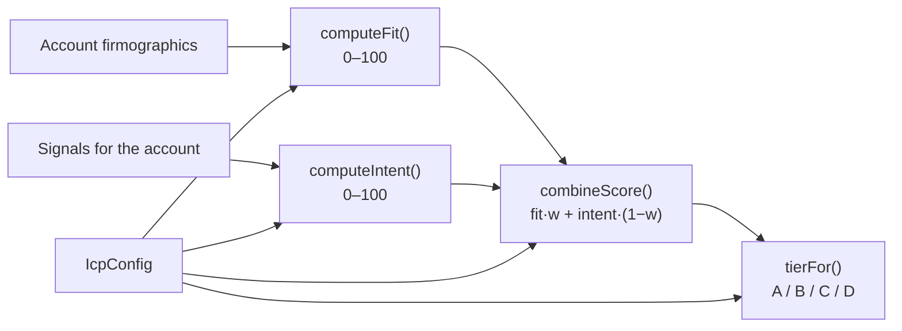

Each account has three scores (`fitScore`, `intentScore`, `score`) and a `tier`. The math is a set of pure functions in `backend/src/modules/scoring/engine.ts`. Persistence, history and bulk operations live in `backend/src/modules/scoring/service.ts`. Every input to the formulas comes from the organization's `IcpConfig` (`GET/PUT /icp`).



## Fit score

`fitBreakdown(account, icp)` returns six criteria. `computeFit` sums their points and clamps the result to 0–100. The maximum possible is exactly 100.

| Criterion | Max | Points awarded | Match rule |
|---|---|---|---|
| Industry | 25 | 25 or 0 | `icp.industries.includes(account.industry)` (exact, case-sensitive) |
| Company size | 20 | **20** when in range. **8** when "near": outside the range but within `[employeeMin × 0.5, employeeMax × 1.5]`. Otherwise 0. | In range: `employeeMin ≤ employees ≤ employeeMax` |
| Geography | 15 | 15 or 0 | `icp.countries.includes(account.country)` |
| Revenue | 15 | 15 or 0 | `account.revenue ≥ icp.revenueMin` |
| Tech stack | 15 | `min(15, matches × 5)` | `matches` = account technologies that appear in `icp.technologies` |
| Funding stage | 10 | 10 or 0 | `icp.fundingStages.includes(account.fundingStage)` |

Each breakdown row is `{ label, points, max, matched, detail }`. `detail` holds display text such as `"1,200 employees"`, `"$36.0M"`, the matched tech list, or `"No matching tech"`. For company size, `matched` is only true when the size is in range, so a "near" size shows `matched: false` with 8 points.

## Intent score

```ts title="src/modules/scoring/engine.ts"
export function computeIntent(signals: Signal[], icp: IcpConfig, now = Date.now()) {
  let total = 0
  for (const s of signals) {
    const ageDays = (now - new Date(s.occurredAt).getTime()) / 86_400_000
    if (ageDays > icp.intentDecayDays * 3) continue
    const decay = Math.pow(0.5, ageDays / icp.intentDecayDays)
    const weight = (icp.signalWeights[s.type] ?? 50) / 100
    total += s.strength * weight * decay * 0.45
  }
  return Math.round(clamp(total))
}
```

For each signal on the account:

```text title="Per-signal contribution"
points(s) = strength(s) × (signalWeights[type] / 100) × 0.5 ^ (ageDays / intentDecayDays) × 0.45
intent    = round( clamp( Σ points(s) for signals with ageDays ≤ 3 × intentDecayDays, 0, 100 ) )
```

- **`halfLife`** is `icp.intentDecayDays` (default 14). A signal loses half its value every half-life.
- **Cut-off.** Signals older than `3 × halfLife` (42 days by default) contribute nothing. At that age they would still be worth 12.5 %, so the cut-off is a hard edge.
- **Weight.** `icp.signalWeights[type]`, or 50 if the type is missing.
- **Scale factor 0.45.** A single maximum-strength signal with weight 100 and age 0 contributes 45 points. About three fresh strong signals are needed to saturate the score.
- **Signals dated in the future** have a negative age, so their decay factor is above 1. Nothing prevents this: the ingest schema accepts any ISO `occurredAt`.
- The total is clamped to 0–100 and **rounded** to an integer.

## Combined score and tier

```ts title="src/modules/scoring/engine.ts"
export function combineScore(fit: number, intent: number, icp: IcpConfig) {
  const w = icp.fitWeight / 100
  return Math.round(fit * w + intent * (1 - w))
}

export function tierFor(score: number, icp: IcpConfig): Tier {
  if (score >= icp.tierThresholds.A) return "A"
  if (score >= icp.tierThresholds.B) return "B"
  if (score >= icp.tierThresholds.C) return "C"
  return "D"
}
```

With the default ICP (`fitWeight` 55, thresholds `A 70 / B 52 / C 35`):

| Tier | Score range |
|---|---|
| A | ≥ 70 |
| B | 52–69 |
| C | 35–51 |
| D | < 35 |

`scoreAccount(account, signals, icp)` combines all of the above. It filters `signals` to `s.accountId === account.id` itself, so callers may pass a superset.

## Worked example

Default ICP. Account: SaaS, 300 employees, United States, $36M revenue, technologies `Salesforce, Segment, Stripe`, Series B.

| Fit criterion | Result | Points |
|---|---|---|
| Industry (SaaS ∈ industries) | match | 25 |
| Company size (50 ≤ 300 ≤ 2000) | in range | 20 |
| Geography (United States) | match | 15 |
| Revenue ($36M ≥ $5M) | match | 15 |
| Tech stack (Salesforce, Segment) | 2 matches × 5 | 10 |
| Funding stage (Series B) | match | 10 |
| **Fit** | | **95** |

| Signal | Strength | Weight | Age (days) | Decay `0.5^(age/14)` | Points `× 0.45` |
|---|---|---|---|---|---|
| website_visit | 90 | 0.90 | 0 | 1.000 | 36.45 |
| funding | 80 | 0.75 | 14 | 0.500 | 13.50 |
| intent_topic | 60 | 0.70 | 7 | 0.707 | 13.36 |
| hiring | 70 | 0.60 | 50 | — (older than 42 days) | 0 |
| **Intent** | | | | | 63.31, rounded to **63** |

Combined: `round(95 × 0.55 + 63 × 0.45) = round(52.25 + 28.35) = round(80.6) = ` **81**, which is **Tier A**.

If the website visit had happened 28 days ago (decay 0.25), it would contribute 9.11 points instead of 36.45. Intent would drop to `round(35.97) = 36`, and the score to `round(52.25 + 16.2) = 68`, which is **Tier B**.

## Scoring service

| Method | What it does | Persists |
|---|---|---|
| `getIcp(orgId)` | Returns the org's ICP (`db.icp.get(orgId, orgId)`). If none exists, creates one from `defaultIcp()` with `id: orgId`. | Creates the ICP if missing |
| `updateIcp(orgId, patch)` | Merges the patch into the current ICP (`id` stays `orgId`, `updatedAt` refreshed), then calls `rescoreAll(orgId, "ICP configuration updated")`. Returns `{ icp, changed }`. | ICP, all accounts |
| `rescoreAccount(orgId, accountId, reason)` | Loads the account, ICP and **all** of the account's signals, then runs `scoreAccount`. Updates `fitScore`, `intentScore`, `score`, `tier`, and appends `{ at, fit, intent, score, reason }` to `scoreHistory` (keeping the **last 20**). If `score` changed, it logs a `score_change` activity (`"Score 64 → 81 (Tier A)"`, actor `system`). Returns `{ before, after, tier, account }`. A missing account returns `{ before: 0, after: 0, tier: "D", account: null }` and writes nothing. | 1 account, maybe 1 activity |
| `rescoreMany(orgId, ids, reason)` | Calls `rescoreAccount` for each id in turn. Returns `[{ id, before, after, tier }]`. | N accounts |
| `rescoreAll(orgId, reason)` | Loads the ICP, all accounts (**including flagged duplicates**) and all signals, groups the signals by account, and scores everything in memory. Writes with a **single** `updateMany(orgId, {}, fn)`. Every account gets a history entry even when nothing changed. **No activities are logged.** Returns how many accounts changed score **or** tier. | All accounts (one file write) |
| `preview(orgId, draftIcp, top = 10)` | Scores non-duplicate accounts under both the current ICP and the draft. Returns `total`, the tier `distribution` (`current` vs. `draft`), `promoted`/`demoted` counts (tier letters compared as strings, so `"A" < "B"` means promoted), `tierChanges`, `avgCurrent`/`avgDraft`, and the `top` N rows by draft score with `delta`. | Nothing |
| `breakdown(orgId, account)` | Returns the fit breakdown, `fitScore` (`min(100, sum)`), `intentScore`, `score`, `fitWeight`, `intentDecayDays`, and up to **20** `contributors`: `{ signal, weight, decay, points }`, newest first, with points rounded to 1 decimal and zero-point signals excluded. | Nothing |

<Callout type="info" title="History retention">
`HISTORY_LIMIT = 20`. Because `rescoreAll` appends to every account, a few ICP saves can push older signal-driven entries out of an account's history.
</Callout>

### HTTP surface

| Endpoint | Role | Calls |
|---|---|---|
| `GET /icp` | viewer and above | `getIcp` |
| `PUT /icp` | admin and above | `updateIcp` with the full `icpSchema` (refines: `employeeMin ≤ employeeMax`, `A > B > C`, at least one industry) |
| `POST /icp/preview` | viewer and above | `preview(orgId, { ...body.icp, updatedAt }, body.top)`, where `top` is 1–100 (default 10). Returns **200**. |
| `GET /icp/defaults` | viewer and above | `defaultIcp(nowIso())` |
| `GET /accounts/:id/score-breakdown` | viewer and above | `breakdown` |
| `POST /accounts/:id/rescore` | member and above | `rescoreAccount(…, "Manual re-score")` |
| `POST /accounts/bulk-rescore` | member and above | `rescoreMany(…, "Manual re-score")` |

## When re-scoring happens

| Trigger | Call site | Function | `reason` |
|---|---|---|---|
| Account created | `accountService.create` | inline `scoreAccount(base, [], icp)`, stored with history `"Initial score"` | `Initial score` |
| Scoring field changed (`industry`, `employees`, `revenue`, `country`, `technologies`, `fundingStage`) | `accountService.update` | `rescoreAccount` | `` `${source}: firmographics changed` `` |
| …via `PATCH /accounts/:id` | route → `accountService.update` | same | `Manual edit: firmographics changed` |
| …via enrichment (`POST /accounts/:id/enrich`, `bulk-enrich`, agent `enrich` action) | `accountService.enrich` → `update` | same, when the mock patch changes a scoring field (typically `technologies`) | `Waterfall enrichment (…): firmographics changed` |
| …via import with `updateExisting` | `importService.importAccounts` → `update` | same | `CSV import: firmographics changed` / `JSON import: …` |
| …via merge (technologies union) | `accountService.merge` → `update` | same | `Merged duplicate “…”: firmographics changed` |
| Duplicate merged | `accountService.merge` | `rescoreAccount` (always) | `Duplicate merged` |
| Signal processed by the agent | `agentService.processSignal` (autopilot ingest, `/signals/:id/process`, `/signals/process-pending`, simulate, webhook) | `rescoreAccount` | `` `Signal: ${signal.title}` `` |
| Manual | `POST /accounts/:id/rescore`, `POST /accounts/bulk-rescore` | `rescoreAccount` / `rescoreMany` | `Manual re-score` |
| ICP saved | `PUT /icp` → `updateIcp` | `rescoreAll` | `ICP configuration updated` |
| Accounts imported | `importService.importAccounts` when `created > 0`. `importContacts` when `accountsCreated > 0`. | `rescoreAll` | `Import` |

<Callout type="warn" title="Cases that do NOT re-score">
- **Ingesting a signal with autopilot off.** The score only updates when the signal is processed.
- **Deleting a signal**, and cascades that delete signals.
- **The passage of time.** Intent decays continuously, but nothing recomputes it on a schedule, so stored intent scores are only as fresh as the last trigger. A periodic `rescoreAll` job is listed in [Tech debt](/docs/engineering/tech-debt).
- **Changing `stage`, `ownerId`, `tags` or other non-scoring fields.**
</Callout>

## Where scores are read

- Account lists sort and filter on `score`, `fitScore`, `intentScore` and `tier`.
- The agent matches playbooks on the post-rescore `account.score` and `account.tier` (`minScore`, `tiers`).
- Analytics: the dashboard counts "hot accounts" as tier A non-duplicates. The overview includes the tier distribution.
- `withAccounts` includes `tier` and `score` in every expanded account summary.
- The demo seed (`seed/generate.ts`) also calls `scoreAccount` so the generated data is consistent.
