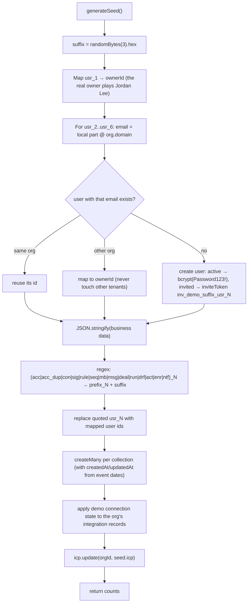

A fresh database is empty. The API starts without data, but `server.ts` logs a warning until an organization exists. Four entry points create or reset data, and they all build on two functions: `createOrganization()` (`src/modules/organization/service.ts`) and `seedDemoData()` / `clearOrgData()` (`src/seed/demo.ts`).

| Command | Where | Creates org? | Deletes | Loads demo data |
|---|---|---|---|---|
| `npm run setup` | repo root | via bootstrap / seed | nothing | only with `-- --demo` |
| `npm run bootstrap` | `backend/` (or root) | yes, if the admin email doesn't exist | nothing | no |
| `npm run seed:demo` | `backend/` (or root) | yes, if missing | business data of the bootstrap org | yes |
| `npm run db:reset` | `backend/` | yes, recreated | **everything, all tenants** | no |
| `POST /admin/reset` | API (owner) | no | business data of the caller's org | if `{ demo: true }` |

## `createOrganization()`

This function is shared by `POST /auth/register`, bootstrap, seed-demo, db:reset and the tests.

```ts title="src/modules/organization/service.ts"
export async function createOrganization(input: {
  orgName: string
  domain: string
  ownerName: string
  ownerEmail: string
  password: string
  plan?: Organization["plan"]
})
```

<Steps>
<Step>Lower-cases the email and rejects it with `409 An account with this email already exists` if **any** workspace already uses it.</Step>
<Step>Creates the organization with `id = orgId = newId("org")`: plan `growth` (unless given), `seats = PLAN_SEATS[plan]`, timezone `America/New_York`, and `settings: { autopilot: true, waterfallOrder: ["clearbit", "apollo", "fullenrich", "prospeo", "limadata"] }`.</Step>
<Step>Creates the owner: role `owner`, title `Owner`, status `active`, `bg-indigo-500`, a bcrypt `passwordHash`, and `lastActiveAt`.</Step>
<Step>Creates the default ICP (`scoringService.getIcp` → `defaultIcp()` with `id: orgId`).</Step>
<Step>Creates the 19 `INTEGRATION_CATALOG` records, all `connected: false` and `status: "disconnected"`. Default settings: `autoSync: true`, `syncInterval: "hourly"`, `writeBack` (true for CRMs), `useInWaterfall: true` (enrichment and contacts), and `model: "claude-opus-5"` with `tokenBudget: "5000"` (LLM).</Step>
</Steps>

It returns `{ org, owner }`. It creates no accounts, playbooks, sequences or mailboxes.

## `npm run bootstrap`

`scripts/bootstrap.ts` is **idempotent**. It reads the `BOOTSTRAP_*` variables:

| Variable | Default |
|---|---|
| `BOOTSTRAP_ORG_NAME` | `My Company` |
| `BOOTSTRAP_ORG_DOMAIN` | `example.com` |
| `BOOTSTRAP_ADMIN_NAME` | `Admin User` |
| `BOOTSTRAP_ADMIN_EMAIL` | `admin@example.com` |
| `BOOTSTRAP_ADMIN_PASSWORD` | `ChangeMe123!` (at least 8 characters) |

If a user with `BOOTSTRAP_ADMIN_EMAIL` already exists, it prints `✔ Admin … already exists (org …). Nothing to do.` and exits with 0. Otherwise it calls `createOrganization` and prints the org id, the login and the data directory.

```bash
cd backend && npm run bootstrap
# ✔ Workspace created
#   Organization: My Company (org_Ab3xk9Qz)
#   Admin login:  admin@example.com / ChangeMe123!
#   Data dir:     /…/backend/db
```

<Callout type="warn">
The script prints the admin password to stdout. Don't run it in CI logs with a real password.
</Callout>

## `npm run seed:demo`

`scripts/seed-demo.ts`:

1. Looks up `BOOTSTRAP_ADMIN_EMAIL` globally. If it isn't found, creates the workspace with `createOrganization`.
2. `clearOrgData(owner.orgId)`
3. `seedDemoData(owner.orgId, owner.id)`
4. Prints the inserted counts with `console.table`, plus the logins: the admin (from `.env`) and the demo teammates as `<name>@<BOOTSTRAP_ORG_DOMAIN>` / `Password123!`.

Running it again **replaces** the demo data. Record ids change on every run (see id remapping below).

### The generator: `src/seed/generate.ts`

`generateSeed()` returns a complete `SeedData` object (org, users, API keys, accounts, contacts, signals, ICP, rules, runs, drafts, sequences, enrollments, mailboxes, inbox, deals, activities, integrations, notifications) for a fictional company, "Acme Growth Inc.".

- **Deterministic.** A `mulberry32(42)` PRNG drives every random choice, so the *shape* is stable between runs. Dates are relative to `Date.now()` (`ago(days)`, `ahead(days)`), so signals are always fresh and intent scores stay meaningful.
- **Placeholder ids** (`usr_1`, `acc_1`, `acc_dup_1`, `con_1`, `sig_1`, `rule_1`, `seq_1`, `mb_1`, `msg_1`, `deal_1`, `run_1`, `drf_1`, `act_1`, `enr_1`, `ntf_1`, …) cross-reference each other.
- **Volume.** A current run inserts 66 accounts (64 generated plus 2 duplicates), 222 contacts, 260 signals (skewed towards about 15 "hot" accounts), 5 playbooks, 40 runs, 5 drafts, 5 sequences, 109 enrollments, 4 mailboxes, 16 inbox messages, 34 deals, 224 activities and 5 notifications.
- **Scores** are computed with the real `scoreAccount` from the scoring engine, so seeded accounts are consistent with the ICP.
- **Playbooks** include `Hot pricing-page visitors` (website_visit, min 55, tiers A/B, approval), `Funding round follow-up`, `Champion job change`, `Tier A surge → create deal`, and the disabled `Hiring SDRs`.
- **Demo users.** `usr_1` Jordan Lee (owner), `usr_2` Sam Rivera (admin), `usr_3` Taylor Brooks (member), `usr_4` Casey Morgan (member), `usr_5` Riley Chen (viewer), `usr_6` Alex Kim (member, **invited**).

### Loading: `seedDemoData(orgId, ownerId)`



- **Id remapping.** Every placeholder id gets a random 6-hex suffix (for example `acc_12` becomes `acc_12a4f9c1`). Several orgs can then hold the demo dataset side by side in the same files without id collisions. Users are mapped to real user ids in the target org.
- **Timestamps.** For signals, runs, enrollments, inbox messages, activities and notifications, `createdAt`/`updatedAt` come from the event time (`occurredAt`, `startedAt`, `enrolledAt`, `receivedAt`, `at`). Playbooks and mailboxes get "now".
- **Integrations.** The org's existing catalog records are updated with the demo `connected`, `status`, `lastSyncAt`, `apiKeyMasked`, `usage` and `settings`. **No `apiKeyEncrypted` is set**, so "connected" demo integrations have no real credential.
- **ICP.** Overwritten with the demo ICP (`id` stays `orgId`).
- **Not seeded.** The demo org record and demo API keys from `generateSeed()` are ignored. The real org keeps its name, domain and plan.
- **Demo teammates' emails** use the **org's** domain, so logins look like `sam@<org domain>`. Demo teammates count against seats, but seeding doesn't check the seat limit.

`DEMO_MEMBER_PASSWORD = "Password123!"` is exported from `src/seed/demo.ts`.

## `clearOrgData(orgId)`

```ts title="src/seed/demo.ts"
const DATA_COLLECTIONS = [
  db.accounts, db.contacts, db.signals, db.playbooks, db.runs, db.drafts, db.sequences,
  db.enrollments, db.mailboxes, db.inbox, db.deals, db.activities, db.notifications,
] as const
```

1. `removeMany(orgId, {})` on each collection above.
2. Deletes and recreates the org's ICP from `defaultIcp()`.
3. Deletes and recreates the integration catalog (all disconnected, with default settings), which **discards stored vendor credentials**.
4. Sets `organization.settings.autopilot = true`. `waterfallOrder` is left alone.

**Kept:** the organization, users, user preferences and API keys.

## `POST /admin/reset`

```http
POST /api/v1/admin/reset
Authorization: Bearer <owner token>
Content-Type: application/json

{ "demo": true }
```

- Role: **owner only**.
- Allowed only when `config.enableAdminReset` is true, which requires `ENABLE_ADMIN_RESET=true` **and** `NODE_ENV !== "production"`. Otherwise the response is `403 Admin reset is disabled`.
- Runs `clearOrgData(orgId)`, then `seedDemoData(orgId, auth.userId)` when `demo` is true (default `false`).
- Response: `200 { data: { reset: true, demo, counts } }`, where `counts` is `null` without demo data.
- Whether the UI offers the reset comes from `GET /meta` → `features.adminReset`.

## `npm run db:reset`

`scripts/reset.ts` deletes **all data for all tenants**, then recreates the bootstrap workspace:

1. Refuses to run when `NODE_ENV=production` (exit code 1).
2. Unless `--yes` is passed, asks you to type `reset` (`This deletes all data in <DATA_DIR>…`).
3. `truncateAll()` truncates every repository.
4. `createOrganization()` with the `BOOTSTRAP_*` values.

```bash
npm run db:reset            # interactive
npm run db:reset -- --yes   # no prompt (scripts/CI)
```

<Callout type="error">
Every organization, user and API key is deleted, not just the bootstrap org. Back up `DATA_DIR` first if you need anything in it. After a reset, existing JWTs fail with `401 User no longer has access`.
</Callout>

## Root `npm run setup`

`scripts/setup.mjs` is the one-time local setup, run from the repo root:

```js title="scripts/setup.mjs (abridged)"
if (!existsSync("backend/.env")) {
  const env = readFileSync("backend/.env.example", "utf8")
    .replace(/^JWT_SECRET=.*$/m, `JWT_SECRET=${randomBytes(32).toString("hex")}`)
    .replace(/^ENCRYPTION_KEY=.*$/m, `ENCRYPTION_KEY=${randomBytes(32).toString("hex")}`)
  writeFileSync("backend/.env", env)
}
if (!existsSync("frontend/.env.local")) copyFileSync("frontend/.env.example", "frontend/.env.local")
const demo = process.argv.includes("--demo")
execSync(`npm --prefix backend run ${demo ? "seed:demo" : "bootstrap"}`, { stdio: "inherit" })
```

| Step | Behaviour |
|---|---|
| `backend/.env` | Created from `.env.example` with a random 64-hex `JWT_SECRET` and `ENCRYPTION_KEY`. **Never overwritten** if it already exists. |
| `frontend/.env.local` | Copied from `frontend/.env.example` (`NEXT_PUBLIC_API_URL=http://localhost:4000/api/v1`) if missing |
| Database | `bootstrap`, or `seed:demo` with `--demo` |

Typical first run:

```bash
npm install && npm run install:all   # root tooling + backend + frontend
npm run setup                        # or: npm run setup -- --demo
npm run dev                          # API :4000 and web :3000 via concurrently
```

<Callout type="info">
Review the `BOOTSTRAP_*` values in `backend/.env` before running setup, or re-run `npm run bootstrap` after changing them. Bootstrap only checks the admin email, so changing the email creates a **second** workspace.
</Callout>

Other root scripts: `npm run dev` / `start` (both apps through `concurrently`), `npm run build`, `npm test` (backend tests), and `npm run seed:demo` / `npm run bootstrap` (proxied to the backend). See [Getting started](/docs/engineering/getting-started).
