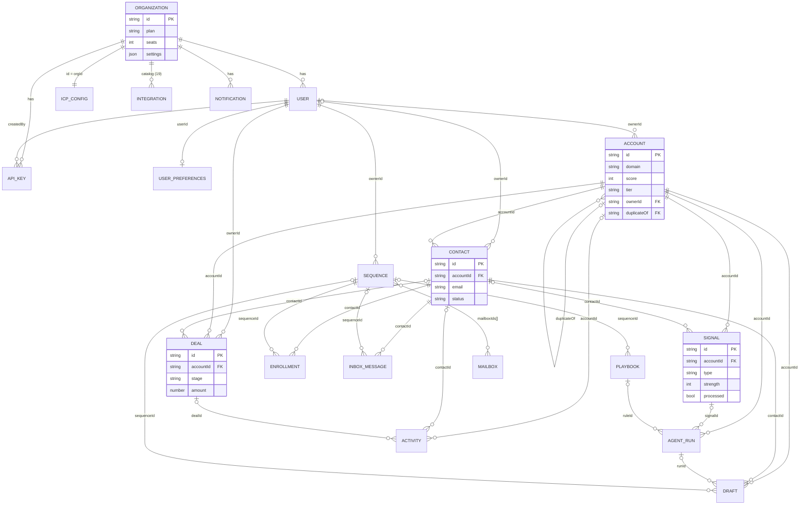

The API stores 19 collections. Their shapes are defined in `backend/src/domain/types.ts`, and each collection is registered in `backend/src/db/index.ts`, which maps it to a file in `DATA_DIR` (default `backend/db/`). The frontend keeps a copy of the public shapes in `frontend/src/lib/types.ts` as its API contract.

## Conventions

Every stored record is a `Stored<T>`, which adds these fields to the domain type:

<TypeTable
  type={{
    id: { type: 'string', description: 'Prefixed random id from newId(prefix), e.g. "acc_Xa9x2bQk". The prefix per collection is listed below. Callers may pass their own id (seed, ICP, runs).', required: true },
    orgId: { type: 'string', description: 'Owning tenant. Set by the repository from the orgId argument, never from input.', required: true },
    createdAt: { type: 'string (ISO 8601)', description: 'Set on create unless supplied. Never changed by update().', required: true },
    updatedAt: { type: 'string (ISO 8601)', description: 'Refreshed by every update() / updateMany().', required: true },
  }}
/>

- **Ids** come from `newId(prefix)` in `lib/ids.ts`: the prefix, `_`, and 8 random alphanumeric characters (`randomToken(8)`, from the Web Crypto RNG), for example `acc_Xa9x2bQk`. The demo seed uses its own ids with a random 6-hex suffix.
- **Timestamps** are ISO strings from `nowIso()`. Date filters compare the strings lexicographically, which works because the format is fixed.
- **Optional fields** are removed from the file when set to `undefined`, because `JSON.stringify` drops them. Services use this to clear a field, for example `{ duplicateOf: undefined }`.
- **References** are plain id strings. Nothing enforces foreign keys; services validate them where it matters and clean up in the cascades described below.

## Entity–relationship diagram

## Collections at a glance

| Repository (`db.*`) | File in `DATA_DIR` | Id prefix | Type | Module owner |
|---|---|---|---|---|
| `organizations` | `organizations.json` | `org` | `Organization` | organization |
| `users` | `users.json` | `usr` | `UserRecord` | organization / auth |
| `userPreferences` | `user_preferences.json` | `pref` | `UserPreferences` | organization |
| `apiKeys` | `api_keys.json` | `key` | `ApiKeyRecord` | organization |
| `accounts` | `accounts.json` | `acc` | `Account` | accounts |
| `contacts` | `contacts.json` | `con` | `Contact` | contacts |
| `signals` | `signals.json` | `sig` | `Signal` | signals |
| `icp` | `icp_config.json` | `icp` (unused: id = orgId) | `IcpConfig & { id }` | scoring |
| `playbooks` | `playbooks.json` | `rule` | `PlaybookRule` | agent |
| `runs` | `agent_runs.json` | `run` | `AgentRun` | agent |
| `drafts` | `drafts.json` | `drf` | `OutreachDraft` | agent |
| `sequences` | `sequences.json` | `seq` | `Sequence` | outreach |
| `enrollments` | `enrollments.json` | `enr` | `Enrollment` | outreach |
| `mailboxes` | `mailboxes.json` | `mb` | `Mailbox` | outreach |
| `inbox` | `inbox_messages.json` | `msg` | `InboxMessage` | outreach |
| `deals` | `deals.json` | `deal` | `Deal` | pipeline |
| `activities` | `activities.json` | `act` | `Activity` | activities |
| `integrations` | `integrations.json` | `int` | `Integration` | integrations |
| `notifications` | `notifications.json` | `ntf` | `AppNotification` | notifications |

A file is created on the first write to its collection. For example, `user_preferences.json` doesn't exist until someone saves preferences.

## Auth service

### Organization

The tenant root, stored in `organizations.json`. An organization's `orgId` equals its `id`.

<TypeTable
  type={{
    id: { type: 'string', description: 'Tenant id ("org_…"). Also the orgId of every record in the workspace.', required: true },
    name: { type: 'string', description: 'Workspace name (1–120 chars via PATCH /org).', required: true },
    domain: { type: 'string', description: 'Company domain, lower-cased. Demo teammates get emails at this domain.', required: true },
    plan: { type: '"starter" | "growth" | "enterprise"', description: 'Subscription plan. New workspaces start on "growth".', required: true, default: '"growth"' },
    seats: { type: 'number', description: 'PLAN_SEATS[plan]: starter 3, growth 10, enterprise 50.', required: true, default: '10' },
    timezone: { type: 'string', description: 'IANA timezone.', required: true, default: '"America/New_York"' },
    'settings.autopilot': { type: 'boolean', description: 'When true, signalService.ingest runs the agent immediately.', required: true, default: 'true' },
    'settings.waterfallOrder': { type: 'string[]', description: 'Integration keys in enrichment order. Unknown or disconnected keys are kept but ignored.', required: true, default: '["clearbit","apollo","fullenrich","prospeo","limadata"]' },
  }}
/>

**Notes.** It is created only by `createOrganization()` (register, bootstrap, reset, seed). `POST /org/plan` refuses a plan whose seats are fewer than the current user count. There is no delete endpoint.

### User (`UserRecord`)

Stored in `users.json`. The public shape `User` is produced by `toPublicUser()`, which drops the private fields.

<TypeTable
  type={{
    id: { type: 'string', description: '"usr_…"', required: true },
    name: { type: 'string', description: 'Display name. For invites, derived from the email local part.', required: true },
    email: { type: 'string', description: 'Lower-cased. Unique across ALL organizations (checked with findGlobal).', required: true },
    role: { type: '"owner" | "admin" | "member" | "viewer"', description: 'Exactly one owner per org. It cannot be invited, assigned, changed or removed.', required: true },
    avatarColor: { type: 'string', description: 'Tailwind class, e.g. "bg-indigo-500".', required: true },
    title: { type: 'string', description: 'Job title.' },
    status: { type: '"active" | "invited"', description: 'Only active users can log in or pass authenticateBearer.', required: true },
    lastActiveAt: { type: 'string', description: 'Updated on login and invite acceptance.' },
    passwordHash: { type: 'string', description: 'PRIVATE. bcryptjs hash, cost 10. Absent for invited users.' },
    inviteToken: { type: 'string', description: 'PRIVATE. "inv_" + 24 random chars. Cleared when the invite is accepted.' },
  }}
/>

**Delete cascade** (`orgService.removeUser`): it deletes the user's `userPreferences`, sets `ownerId: null` on their accounts and contacts, and reassigns their deals and sequences to the acting admin. It refuses to remove the owner or the acting user.

### UserPreferences

Stored in `user_preferences.json`, at most one per `userId`. Until one is saved, `GET /me/preferences` returns `DEFAULT_PREFERENCES`.

<TypeTable
  type={{
    userId: { type: 'string', description: 'Owning user.', required: true },
    notifications: { type: 'Record<string, boolean>', description: 'Defaults: highIntentSignal, draftsAwaitingApproval, positiveReplies, integrationErrors = true; dealStageChanges = false.', required: true },
    channels: { type: 'Record<string, boolean>', description: 'Defaults: inApp, email = true; slack = false. At least one must be true.', required: true },
  }}
/>

<Callout type="warn" title="Preferences are stored but not read">
No code reads these flags when it creates notifications or sends Slack messages yet. See [Tech debt](/docs/engineering/tech-debt).
</Callout>

### ApiKeyRecord

Stored in `api_keys.json`. The public shape `ApiKey` (from `toPublicApiKey()`) omits `hash`.

<TypeTable
  type={{
    name: { type: 'string', description: 'Label (1–80 chars).', required: true },
    prefix: { type: 'string', description: 'First 12 chars of the secret, e.g. "se_live_Qp91", shown in the UI.', required: true },
    scopes: { type: 'string[]', description: 'Subset of API_SCOPES. Only "signals:write" is enforced by a route today.', required: true },
    createdBy: { type: 'string', description: 'User id. Becomes ctx.auth.userId for API-key requests.', required: true },
    revoked: { type: 'boolean', description: 'Revoked keys fail lookup (the lookup filters on revoked: false). Keys are never deleted.', required: true },
    lastUsedAt: { type: 'string', description: 'Updated on every successful API-key request.' },
    hash: { type: 'string', description: 'PRIVATE. sha256(secret) as hex. The plaintext secret is returned once, at creation.', required: true },
  }}
/>

## Entity service

### Account

Stored in `accounts.json`. This is the central entity.

<TypeTable
  type={{
    name: { type: 'string', description: '1–200 chars.', required: true },
    domain: { type: 'string', description: 'normalizeDomain(): lower-cased, protocol, "www." and path stripped. Must contain a dot.', required: true },
    industry: { type: 'string', description: 'Free text; INDUSTRIES lists the known values.', default: '"Other"', required: true },
    employees: { type: 'number', description: 'Head count.', default: '0', required: true },
    revenue: { type: 'number', description: 'USD. Defaults to employees × 120,000 on create.', required: true },
    country: { type: 'string', description: '', default: '""', required: true },
    city: { type: 'string', description: '', default: '""', required: true },
    technologies: { type: 'string[]', description: 'Tech stack.', default: '[]', required: true },
    fundingStage: { type: 'string', description: 'e.g. "Series B"; FUNDING_STAGES lists the values.', default: '""', required: true },
    description: { type: 'string', description: '', default: '""', required: true },
    linkedinUrl: { type: 'string', description: '', default: '""', required: true },
    ownerId: { type: 'string | null', description: 'Assigned seller. null = unassigned.', default: 'null', required: true },
    stage: { type: '"new" | "researching" | "engaged" | "opportunity" | "customer" | "disqualified"', description: 'Lifecycle stage. Set to "opportunity" by deal creation and "customer" when a deal is closed won.', default: '"new"', required: true },
    fitScore: { type: 'number (0–100)', description: 'Computed by the scoring engine.', required: true },
    intentScore: { type: 'number (0–100)', description: 'Computed by the scoring engine.', required: true },
    score: { type: 'number (0–100)', description: 'Combined score.', required: true },
    tier: { type: '"A" | "B" | "C" | "D"', description: 'From score and icp.tierThresholds.', required: true },
    scoreHistory: { type: 'ScorePoint[]', description: '{ at, fit, intent, score, reason }. Only the last 20 entries are kept (HISTORY_LIMIT).', required: true },
    enrichedAt: { type: 'string', description: 'Last enrichment time.' },
    enrichmentSources: { type: 'string[]', description: 'Union of vendor names used across enrichments.', required: true },
    versions: { type: 'EntityVersion[]', description: '{ version, at, source, changes: { field, from, to }[] }. Version 1 is "record created".', required: true },
    tags: { type: 'string[]', description: '', default: '[]', required: true },
    duplicateOf: { type: 'string', description: 'Id of the canonical account when this one was created with an existing domain.' },
  }}
/>

**Invariants and behaviour**

- **Duplicate detection** runs on create only. If a non-duplicate account already has the same normalized domain, the new record gets `duplicateOf` set to that account's id. `GET /accounts?view=all` hides duplicates, and `view=duplicates` lists them.
- **Versioning** (`diffVersion`): every `accountService.update` appends an `EntityVersion` for changed fields. These fields are never versioned: `updatedAt`, `scoreHistory`, `versions`, `fitScore`, `intentScore`, `score`, `tier`.
- **Re-scoring** happens when any of `industry`, `employees`, `revenue`, `country`, `technologies` or `fundingStage` changes (`SCORING_FIELDS`). See [Scoring engine](/docs/engineering/backend/scoring-engine).
- **Owner assignment** (`assignOwner`) also sets `ownerId` on all of the account's contacts.

**Delete cascade** (`accountService.removeMany`, used by `DELETE /accounts/:id` and `POST /accounts/bulk-delete`), in this order:

1. Enrollments and inbox messages of the account's contacts
2. Contacts
3. Deals, signals, drafts, agent runs and activities with that `accountId`
4. Accounts whose `duplicateOf` points at a removed account get `duplicateOf` cleared
5. The accounts themselves

**Merge** (`POST /accounts/:id/merge` on a duplicate) moves contacts, signals, deals, activities, drafts and runs to the canonical account. It then deletes the duplicate, unions `tags` and `technologies`, keeps the canonical `ownerId` (or takes the duplicate's if the canonical has none), logs an activity and re-scores.

### Contact

Stored in `contacts.json`.

<TypeTable
  type={{
    accountId: { type: 'string', description: 'Must reference an existing account (checked on create and on account change).', required: true },
    firstName: { type: 'string', description: '', required: true },
    lastName: { type: 'string', description: '', required: true },
    title: { type: 'string', description: '', default: '""', required: true },
    seniority: { type: '"C-Level" | "VP" | "Director" | "Manager" | "IC"', description: 'Used by bestContact() in SENIORITY_ORDER.', default: '"IC"', required: true },
    department: { type: 'string', description: '', default: '""', required: true },
    email: { type: 'string', description: 'Trimmed and lower-cased. Unique per org when non-empty (checked on create only).', required: true },
    emailStatus: { type: '"verified" | "unverified" | "invalid" | "missing"', description: 'Defaults to "unverified" when an email is given, else "missing". Reset when the email changes.', required: true },
    phone: { type: 'string', description: '' },
    linkedinUrl: { type: 'string', description: '', default: '""', required: true },
    location: { type: 'string', description: 'Defaults to "<account city>, <account country>".', required: true },
    ownerId: { type: 'string | null', description: 'Inherits the account owner on create.', required: true },
    status: { type: '"new" | "in_sequence" | "replied" | "meeting" | "unsubscribed" | "bounced"', description: 'Outreach status. "unsubscribed" and "bounced" contacts are never enrolled or picked by the agent.', default: '"new"', required: true },
    lastContactedAt: { type: 'string', description: 'Set by draft sends and inbox replies.' },
    createdAt: { type: 'string', description: 'Part of the domain type. Contact has no updatedAt of its own, but the stored record has one.', required: true },
  }}
/>

**Delete cascade** (`contactService.removeMany`): the contact's enrollments, drafts and inbox messages, then the contact. Signals, deals and activities that reference the contact are **not** touched, so their `contactId` is left dangling. The `withContacts` expansion returns `contact: null` for these.

## Signal ingestion

### Signal

Stored in `signals.json`.

<TypeTable
  type={{
    type: { type: '"intent_topic" | "website_visit" | "hiring" | "funding" | "job_change" | "tech_install" | "social_engagement" | "news"', description: 'SignalType. Drives playbook triggers and ICP weights.', required: true },
    source: { type: 'string', description: 'Vendor name. Defaults to SIGNAL_SOURCES[type][0] (e.g. "RB2B" for website_visit).', required: true },
    accountId: { type: 'string', description: 'Resolved from accountId or from a domain match on a non-duplicate account.', required: true },
    contactId: { type: 'string', description: 'Must belong to the same account.' },
    title: { type: 'string', description: '1–300 chars.', required: true },
    detail: { type: 'string', description: 'Up to 2000 chars.', default: '""', required: true },
    strength: { type: 'number (0–100)', description: 'Raw strength used in the intent formula.', required: true },
    occurredAt: { type: 'string', description: 'Defaults to the ingest time. Drives intent decay.', required: true },
    processed: { type: 'boolean', description: 'false until agentService.processSignal has run on it.', required: true },
  }}
/>

`DELETE /signals/:id` removes only the signal. Its runs stay, and the account is not re-scored.

## Scoring

### IcpConfig

Stored in `icp_config.json`. There is **one record per org, and its `id` is the `orgId`**. `scoringService.getIcp` creates it lazily from `defaultIcp()`.

<TypeTable
  type={{
    id: { type: 'string', description: 'Always equal to orgId.', required: true },
    industries: { type: 'string[]', description: 'At least one. Fit: 25 pts.', default: '["SaaS","Fintech","Cybersecurity","E-commerce"]', required: true },
    countries: { type: 'string[]', description: 'Fit: 15 pts.', default: '["United States","United Kingdom","Canada","Germany"]', required: true },
    employeeMin: { type: 'number', description: 'Must be ≤ employeeMax.', default: '50', required: true },
    employeeMax: { type: 'number', description: '', default: '2000', required: true },
    revenueMin: { type: 'number', description: 'USD. Fit: 15 pts.', default: '5000000', required: true },
    technologies: { type: 'string[]', description: '5 pts per match, max 15.', default: '["Salesforce","HubSpot","Snowflake","Segment","Outreach"]', required: true },
    fundingStages: { type: 'string[]', description: 'Fit: 10 pts.', default: '["Series A","Series B","Series C","Series D+"]', required: true },
    fitWeight: { type: 'number (0–100)', description: 'Intent weight = 100 − fitWeight.', default: '55', required: true },
    signalWeights: { type: 'Record<SignalType, number>', description: 'Per-type weight, 0–100.', default: 'intent_topic 70, website_visit 90, hiring 60, funding 75, job_change 80, tech_install 45, social_engagement 35, news 30', required: true },
    intentDecayDays: { type: 'number (1–365)', description: 'Half-life in days. Signals older than 3× are ignored.', default: '14', required: true },
    tierThresholds: { type: '{ A: number; B: number; C: number }', description: 'Must satisfy A > B > C.', default: '{ A: 70, B: 52, C: 35 }', required: true },
    updatedAt: { type: 'string', description: '', required: true },
  }}
/>

## Orchestration agent

### PlaybookRule

Stored in `playbooks.json`.

<TypeTable
  type={{
    name: { type: 'string', description: '1–120 chars.', required: true },
    description: { type: 'string', description: '', default: '""', required: true },
    enabled: { type: 'boolean', description: 'Disabled rules are never evaluated.', default: 'true', required: true },
    trigger: { type: 'SignalType | "any"', description: 'Signal type that activates the rule.', required: true },
    minScore: { type: 'number (0–100)', description: 'Account score (after re-scoring) must be ≥ this.', required: true },
    tiers: { type: 'Tier[]', description: 'At least one. The account tier must be in the list.', required: true },
    actions: { type: 'AgentActionType[]', description: '"rescore" is always added first on create and update.', required: true },
    sequenceId: { type: 'string', description: 'Required when actions include "enroll_sequence". Must exist. Also copied onto drafts.' },
    requireApproval: { type: 'boolean', description: 'true: drafts are created "pending". false: drafts are sent immediately.', default: 'true', required: true },
    runs: { type: 'number', description: 'Incremented each time the rule matches.', required: true },
  }}
/>

### AgentRun

Stored in `agent_runs.json`. Runs are immutable apart from `resolveRunStep`.

<TypeTable
  type={{
    signalId: { type: 'string', description: 'Triggering signal.' },
    accountId: { type: 'string', description: '', required: true },
    ruleId: { type: 'string', description: 'Matched playbook, if any.' },
    trigger: { type: 'string', description: '"<source>: <signal title>".', required: true },
    startedAt: { type: 'string', description: '', required: true },
    durationMs: { type: 'number', description: 'Wall-clock time of processSignal.', required: true },
    status: { type: '"completed" | "awaiting_approval" | "failed" | "skipped"', description: 'See the orchestration agent page.', required: true },
    steps: { type: 'AgentStep[]', description: '{ action: AgentActionType | "evaluate", label, status: "done" | "skipped" | "pending" | "failed", detail? }', required: true },
    scoreBefore: { type: 'number', description: '' },
    scoreAfter: { type: 'number', description: '' },
  }}
/>

### OutreachDraft

Stored in `drafts.json`.

<TypeTable
  type={{
    runId: { type: 'string', description: 'Run that produced the draft.' },
    accountId: { type: 'string', description: '', required: true },
    contactId: { type: 'string', description: '', required: true },
    channel: { type: '"email" | "linkedin"', description: '"linkedin" when the trigger was job_change.', required: true },
    subject: { type: 'string', description: '', required: true },
    body: { type: 'string', description: '', required: true },
    rationale: { type: 'string', description: 'Why the agent chose this account and contact.', required: true },
    status: { type: '"pending" | "approved" | "rejected" | "sent"', description: '"approved" exists in the type but no code sets it: approval goes straight to "sent".', required: true },
    sequenceId: { type: 'string', description: 'Copied from the rule. The contact is enrolled on approval.' },
  }}
/>

## Outreach

### Sequence

Stored in `sequences.json`.

<TypeTable
  type={{
    name: { type: 'string', description: '1–120 chars. Duplicates get the suffix " (copy)".', required: true },
    status: { type: '"active" | "paused" | "draft"', description: 'Can only be activated when it has at least one step.', default: '"draft"', required: true },
    ownerId: { type: 'string', description: 'Must be a user in the org. Defaults to the creator.', required: true },
    mailboxIds: { type: 'string[]', description: 'Must all exist.', default: '[]', required: true },
    steps: { type: 'SequenceStep[]', description: '{ id: "step_…", channel: "email" | "linkedin_connect" | "linkedin_message" | "call" | "wait", dayOffset, subject?, body? }. New sequences start with one empty email step.', required: true },
    stats: { type: '{ enrolled, sent, opened, replied, meetings, bounced }', description: 'Counters. Only enrolled (on enroll) and meetings (on book-meeting) are updated by code.', required: true },
    settings: { type: 'SequenceSettings', description: '{ sendDays (0 = Mon … 6 = Sun), startHour, endHour (> startHour), timezone, stopOnReply, trackOpens }' },
  }}
/>

**Delete cascade** (`removeSequence`): deletes its enrollments and clears `sequenceId` on playbooks and drafts. Inbox messages keep their `sequenceId`.

### Enrollment

Stored in `enrollments.json`.

<TypeTable
  type={{
    sequenceId: { type: 'string', description: '', required: true },
    contactId: { type: 'string', description: 'At most one "active" enrollment per (sequence, contact).', required: true },
    currentStep: { type: 'number', description: 'Starts at 0. Nothing advances it (no scheduler yet).', required: true },
    status: { type: '"active" | "paused" | "completed" | "replied" | "bounced" | "unsubscribed"', description: 'Bulk status changes accept active / paused / completed. book-meeting sets "replied".', required: true },
    enrolledAt: { type: 'string', description: '', required: true },
    nextStepAt: { type: 'string', description: 'Set to the enroll time.' },
  }}
/>

`enrollmentService.enroll` skips contacts that are `unsubscribed` or `bounced`, have `emailStatus = "invalid"`, or are already actively enrolled. Eligible contacts get `status: "in_sequence"`.

### Mailbox

Stored in `mailboxes.json`.

<TypeTable
  type={{
    email: { type: 'string', description: 'Lower-cased, unique per org.', required: true },
    provider: { type: '"SES" | "Google" | "Microsoft" | "Mailpool"', description: '', required: true },
    dailyLimit: { type: 'number', description: '', required: true },
    sentToday: { type: 'number', description: 'Starts at 0; not incremented by code.', required: true },
    warmupEnabled: { type: 'boolean', description: '', default: 'true', required: true },
    healthScore: { type: 'number', description: 'New mailboxes start at 70.', default: '70', required: true },
    status: { type: '"healthy" | "warning" | "paused"', description: 'New mailboxes start as "warning".', default: '"warning"', required: true },
  }}
/>

Deleting a mailbox removes its id from every sequence's `mailboxIds`.

### InboxMessage

Stored in `inbox_messages.json`.

<TypeTable
  type={{
    contactId: { type: 'string', description: '', required: true },
    sequenceId: { type: 'string', description: '' },
    channel: { type: '"email" | "linkedin"', description: 'Replies are sent through the email provider only for "email".', required: true },
    subject: { type: 'string', description: '', required: true },
    snippet: { type: 'string', description: '', required: true },
    body: { type: 'string', description: '', required: true },
    receivedAt: { type: 'string', description: '', required: true },
    sentiment: { type: '"positive" | "neutral" | "negative" | "ooo"', description: 'Chooses the mock reply template.', required: true },
    read: { type: 'boolean', description: '', required: true },
    archived: { type: 'boolean', description: 'Hidden from lists unless archived=true.', required: true },
    thread: { type: '{ from: "us" | "them"; body; at }[]', description: 'Replies are appended with from "us".', required: true },
  }}
/>

<Callout type="info">
Nothing creates inbox messages through the API. There is no inbound email ingestion yet, so they come only from the demo seed.
</Callout>

## CRM / Pipeline

### Deal

Stored in `deals.json`.

<TypeTable
  type={{
    name: { type: 'string', description: '', required: true },
    accountId: { type: 'string', description: 'Must exist. Cannot be changed with PATCH.', required: true },
    contactId: { type: 'string', description: 'Optional. PATCH with null clears it.' },
    ownerId: { type: 'string', description: 'Defaults to the account owner, else the creator.', required: true },
    stage: { type: '"discovery" | "qualified" | "demo" | "proposal" | "negotiation" | "closed_won" | "closed_lost"', description: 'Stage changes go through pipelineService.move.', required: true },
    amount: { type: 'number', description: 'USD.', required: true },
    probability: { type: 'number', description: 'Reset from DEAL_STAGES on every move: 10 / 25 / 40 / 60 / 80 / 100 / 0.', required: true },
    closeDate: { type: 'string', description: 'Set to now when moved to a closed stage.', required: true },
    source: { type: 'string', description: '"Manual", "Sequence reply", or "Agent: …" (agent-sourced, used by analytics).', default: '"Manual"', required: true },
    crmId: { type: 'string', description: 'Set by POST /deals/sync-crm.' },
    syncedAt: { type: 'string', description: 'Cleared by any edit or move. Deals without it are pushed on the next sync.' },
    notes: { type: 'string', description: '', default: '""', required: true },
  }}
/>

Side effects of `move`: moving to `closed_won` sets the account stage to `customer` and creates a notification. Every move logs a `stage_change` activity and publishes `deal.stage_changed`. Creating a deal moves an account in `new`, `researching` or `engaged` to `opportunity`. Deleting a deal leaves its activities in place.

### Activity

Stored in `activities.json`. Activities form the append-only timeline.

<TypeTable
  type={{
    accountId: { type: 'string', description: '' },
    contactId: { type: 'string', description: '' },
    dealId: { type: 'string', description: 'POST /activities requires at least one of accountId, contactId or dealId.' },
    type: { type: '"note" | "email" | "call" | "meeting" | "stage_change" | "enrichment" | "score_change" | "agent" | "signal"', description: '', required: true },
    title: { type: 'string', description: '', required: true },
    detail: { type: 'string', description: '' },
    actorId: { type: 'string | "agent" | "system"', description: 'User id, or a synthetic actor.' },
    at: { type: 'string', description: 'Event time (sort key).', required: true },
  }}
/>

## Integrations and notifications

### Integration

Stored in `integrations.json`. `createOrganization` creates one record for each of the 19 entries in `INTEGRATION_CATALOG`, all disconnected.

<TypeTable
  type={{
    key: { type: 'string', description: 'Stable catalog key ("hubspot", "clearbit", …). Unique per org.', required: true },
    name: { type: 'string', description: '', required: true },
    category: { type: '"enrichment" | "intent" | "contacts" | "scraping" | "email" | "linkedin" | "calls" | "crm" | "llm"', description: '', required: true },
    description: { type: 'string', description: '', required: true },
    feeds: { type: 'string', description: 'Which logical service consumes it.', required: true },
    connected: { type: 'boolean', description: '', required: true },
    status: { type: '"ok" | "error" | "syncing" | "disconnected"', description: '', required: true },
    lastSyncAt: { type: 'string', description: '' },
    apiKeyMasked: { type: 'string', description: '"••••••••" + last 4 characters.' },
    usage: { type: '{ used; limit; unit }', description: 'Set on connect: limit 10,000, unit "credits", or "k tokens" for LLMs.' },
    settings: { type: 'Record<string, string | boolean>', description: 'Defaults: autoSync, syncInterval "hourly", writeBack (CRM only), useInWaterfall (enrichment/contacts), model and tokenBudget (LLM).', required: true },
    apiKeyEncrypted: { type: 'string', description: 'SERVER ONLY. AES-256-GCM "iv.tag.ciphertext" (base64url). Removed by toPublicIntegration() and cleared on disconnect.' },
  }}
/>

### AppNotification

Stored in `notifications.json`. Each org keeps at most **200**: older ones are deleted when a new one is created.

<TypeTable
  type={{
    title: { type: 'string', description: '', required: true },
    body: { type: 'string', description: '', required: true },
    href: { type: 'string', description: 'In-app link.' },
    at: { type: 'string', description: '', required: true },
    read: { type: 'boolean', description: '', required: true },
    kind: { type: '"signal" | "agent" | "reply" | "deal" | "system"', description: '', required: true },
  }}
/>

Notifications are org-wide. There is no per-user recipient field.

## Reset behaviour

`clearOrgData(orgId)` (`POST /admin/reset`, `npm run seed:demo`) removes every business collection for the org: accounts, contacts, signals, playbooks, runs, drafts, sequences, enrollments, mailboxes, inbox, deals, activities and notifications. It then recreates the default ICP and the disconnected integration catalog, and turns autopilot back on. Organizations, users, preferences and API keys are kept. See [Seeding and scripts](/docs/engineering/backend/seeding-and-scripts).
