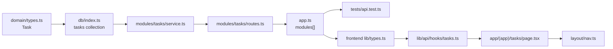

This tutorial builds a small example feature called **Tasks**: follow-ups assigned to an account. It goes through every layer of the stack and uses the same patterns as the existing code. SellEasy has no Tasks feature today; it's only a vehicle for the tutorial. Copy the steps, and swap in your own resource.



<Callout type="info" title="Two repositories">
`backend/` and `frontend/` are separate git repositories. A feature like this one needs a PR in each. Merge and deploy the API first, because the UI depends on it.
</Callout>

## Backend

<Steps>
<Step>

### Add the domain type

```ts title="backend/src/domain/types.ts"
// ---------- Tasks ----------
export interface Task {
  id: ID
  title: string
  accountId: ID
  ownerId: ID | null
  dueAt: string
  done: boolean
  completedAt?: string
}
```

This file is the source of truth. Server-only fields, if a type has any, belong here too, and the frontend copy leaves them out.

</Step>
<Step>

### Register the collection

```ts title="backend/src/db/index.ts"
import type { /* … */ Task } from "../domain/types.js"

export const db = {
  // …existing collections
  tasks: collection<Task>("tasks", "task"), // → db/tasks.json, ids like task_Xa81kq2P
}
```

The JSON driver creates `db/tasks.json` on the first write. Every method takes `orgId` first, so the data is always scoped to one tenant.

Also make the new data take part in the lifecycle of existing records:

- Add `db.tasks` to `DATA_COLLECTIONS` in `src/seed/demo.ts`, so that `POST /admin/reset` and `seed:demo` clear it.
- Add `await db.tasks.removeMany(orgId, { accountId: { in: ids } })` to `accountService.removeMany`, so deleting an account also deletes its tasks.
- Add the collection to `accountService.merge`, if merging duplicate accounts should move the tasks too.

</Step>
<Step>

### Write the service

The business rules live in the service. Throw `HttpError` helpers when a rule is broken, and log activity for things users should see in the timeline.

```ts title="backend/src/modules/tasks/service.ts"
import { db } from "../../db/index.js"
import type { Where } from "../../db/repository.js"
import type { Stored, Task } from "../../domain/types.js"
import { badRequest, conflict, notFound } from "../../lib/errors.js"
import { nowIso } from "../../lib/ids.js"
import { activityService } from "../activities/service.js"

export const TASK_SORT_FIELDS = ["dueAt", "title", "createdAt"] as const
type TaskSort = { field: (typeof TASK_SORT_FIELDS)[number]; dir: "asc" | "desc" }

export interface TaskFilters {
  q?: string
  done?: boolean
  accountId?: string
  ownerId?: string
}

export const taskService = {
  list(orgId: string, f: TaskFilters, page: number, pageSize: number, sort: TaskSort) {
    const where: Where<Stored<Task>> = {
      done: f.done,
      accountId: f.accountId,
      ownerId: f.ownerId,
      $or: f.q ? [{ title: { contains: f.q } }] : undefined,
    }
    return db.tasks.list(orgId, { where, sort: [sort, { field: "title", dir: "asc" }], page, pageSize })
  },

  async get(orgId: string, id: string) {
    const task = await db.tasks.get(orgId, id)
    if (!task) throw notFound("Task")
    return task
  },

  async create(orgId: string, actorId: string, input: { title: string; accountId: string; dueAt: string; ownerId?: string | null }) {
    const account = await db.accounts.get(orgId, input.accountId)
    if (!account) throw badRequest("Account not found")
    const task = await db.tasks.create(orgId, {
      ...input,
      ownerId: input.ownerId ?? account.ownerId ?? actorId,
      done: false,
    })
    await activityService.log(orgId, { accountId: task.accountId, type: "note", title: `Task created: ${task.title}`, actorId })
    return task
  },

  async complete(orgId: string, actorId: string, id: string) {
    const task = await this.get(orgId, id)
    if (task.done) throw conflict("Task is already done")
    const updated = await db.tasks.update(orgId, id, { done: true, completedAt: nowIso() })
    await activityService.log(orgId, { accountId: task.accountId, type: "note", title: `Task completed: ${task.title}`, actorId })
    return updated
  },

  async remove(orgId: string, id: string) {
    if (!(await db.tasks.remove(orgId, id))) throw notFound("Task")
  },
}
```

</Step>
<Step>

### Declare the routes

`createModule(tag, basePath)` groups the routes under one OpenAPI tag. Each `route()` sets the zod schemas, roles and status code. The wrapper takes care of auth, validation, the envelope and the OpenAPI entry.

```ts title="backend/src/modules/tasks/routes.ts"
import { z } from "zod"
import { withAccounts } from "../../lib/expand.js"
import { boolQuery, createModule, idParams, listQuery, paged, parseSort } from "../../lib/http.js"
import { TASK_SORT_FIELDS, taskService } from "./service.js"

export const tasksModule = createModule("Tasks", "/tasks")
const { route } = tasksModule

// No .default() in fields that PATCH reuses: zod applies defaults inside .partial() too.
const taskFields = z.object({
  title: z.string().trim().min(1).max(200),
  accountId: z.string().min(1),
  dueAt: z.iso.datetime(),
  ownerId: z.string().nullable().optional(),
})

route({
  method: "get",
  path: "/",
  summary: "List tasks (with account summary)",
  description: "Filters: done, accountId, ownerId, q. Sort fields: " + TASK_SORT_FIELDS.join(", "),
  query: listQuery.extend({
    done: boolQuery,
    accountId: z.string().optional(),
    ownerId: z.string().optional(),
  }),
  handler: async ({ orgId, query }) => {
    const sort = parseSort(query.sort, TASK_SORT_FIELDS, { field: "dueAt", dir: "asc" })
    const page = await taskService.list(orgId, query, query.page, query.pageSize, sort)
    return paged({ ...page, items: await withAccounts(orgId, page.items) }) // → { data, meta }
  },
})

route({
  method: "post",
  path: "/",
  summary: "Create a task",
  body: taskFields,                                     // roles default: member+
  handler: ({ orgId, auth, body }) => taskService.create(orgId, auth.userId, body), // → 201
})

route({
  method: "post",
  path: "/:id/complete",
  summary: "Mark a task done",
  status: 200,                                          // an action, not a create
  params: idParams,
  handler: ({ orgId, auth, params }) => taskService.complete(orgId, auth.userId, params.id),
})

route({
  method: "delete",
  path: "/:id",
  summary: "Delete a task",
  params: idParams,
  handler: async ({ orgId, params }) => {
    await taskService.remove(orgId, params.id)          // returns undefined → 204
  },
})
```

Checklist for route declarations:

- **Register static paths such as `/stats` before `/:id`.** Otherwise the `/:id` route matches them first.
- **Set `roles` only when the default isn't right.** For example, use `roles: atLeast("admin")` for settings-style resources.
- **Handlers that return nothing produce `204`.** When a service method returns a value you don't want to send, wrap the call in a block, as the delete handler does.

</Step>
<Step>

### Register the module

```ts title="backend/src/app.ts"
import { tasksModule } from "./modules/tasks/routes.js"

const modules: AppModule[] = [
  // …
  pipelineModule,
  tasksModule,
  activitiesModule,
  // …
]
```

Restart `npm run dev` (tsx watch picks up the change), then check [Swagger](http://localhost:4000/api/v1/docs). The **Tasks** tag appears automatically.

```bash
curl -s -X POST http://localhost:4000/api/v1/tasks \
  -H "Authorization: Bearer $TOKEN" -H 'content-type: application/json' \
  -d '{"title":"Send pricing deck","accountId":"acc_8f8db25","dueAt":"2026-09-24T09:00:00Z"}'
```

</Step>
<Step>

### Add a test

```ts title="backend/tests/api.test.ts"
describe("tasks", () => {
  it("creates, lists, completes and deletes a task", async () => {
    const acc = await request(app).get(api("/accounts?pageSize=1")).set(auth())
    const accountId = acc.body.data[0].id

    const created = await request(app)
      .post(api("/tasks"))
      .set(auth())
      .send({ title: "Follow up", accountId, dueAt: "2026-10-01T09:00:00Z" })
    expect(created.status).toBe(201)

    const list = await request(app).get(api(`/tasks?accountId=${accountId}&done=false`)).set(auth())
    expect(list.body.meta.total).toBeGreaterThan(0)
    expect(list.body.data[0].account.id).toBe(accountId)

    const done = await request(app).post(api(`/tasks/${created.body.data.id}/complete`)).set(auth())
    expect(done.status).toBe(200)
    expect((await request(app).post(api(`/tasks/${created.body.data.id}/complete`)).set(auth())).status).toBe(409)

    expect((await request(app).delete(api(`/tasks/${created.body.data.id}`)).set(auth())).status).toBe(204)
  })
})
```

```bash
cd backend && npm run typecheck && npm test
```

</Step>
</Steps>

## Frontend

<Steps>
<Step>

### Mirror the type

```ts title="frontend/src/lib/types.ts"
// ---------- Tasks ----------
export interface Task {
  id: ID
  title: string
  accountId: ID
  ownerId: ID | null
  dueAt: string
  done: boolean
  completedAt?: string
}
```

</Step>
<Step>

### Write the hooks

```ts title="frontend/src/lib/api/hooks/tasks.ts"
"use client"

import type { Entity, Task, WithAccount } from "@/lib/types"
import { api, type Query } from "../client"
import { useApiMutation, useApiQuery } from "../query"

export type TaskRecord = WithAccount<Entity<Task>>

export interface TaskFilters extends Query {
  page?: number
  pageSize?: number
  q?: string
  sort?: string
  done?: boolean
  accountId?: string
  ownerId?: string
}

export const taskKeys = {
  all: ["tasks"] as const,
  list: (f: TaskFilters) => ["tasks", "list", f] as const,
}

export const useTasks = (f: TaskFilters) => useApiQuery(taskKeys.list(f), () => api.page<TaskRecord>("/tasks", f))

export function useCreateTask() {
  return useApiMutation(
    (body: Pick<Task, "title" | "accountId" | "dueAt"> & { ownerId?: string | null }) => api.post<Entity<Task>>("/tasks", body),
    { successMessage: (t) => `Task “${t.title}” created` },
  )
}

export function useCompleteTask() {
  return useApiMutation((id: string) => api.post<Entity<Task>>(`/tasks/${id}/complete`), {
    successMessage: "Task completed",
    // default invalidate: "all" also refreshes the account timeline (activity was logged)
  })
}

export function useDeleteTask() {
  return useApiMutation((id: string) => api.delete(`/tasks/${id}`), { successMessage: "Task deleted" })
}
```

Then export the file from the barrel:

```ts title="frontend/src/lib/api/index.ts"
export * from "./hooks/tasks"
```

</Step>
<Step>

### Build the page

Create `src/app/(app)/tasks/page.tsx`. Because it's inside `(app)`, it's automatically protected by the session guard and rendered inside the sidebar layout.

```tsx title="frontend/src/app/(app)/tasks/page.tsx"
"use client"

import { useState } from "react"
import Link from "next/link"
import { CheckIcon, ListTodoIcon, Loader2Icon, SearchIcon, Trash2Icon } from "lucide-react"
import { Button } from "@/components/ui/button"
import { Card } from "@/components/ui/card"
import { Input } from "@/components/ui/input"
import { Switch } from "@/components/ui/switch"
import { Label } from "@/components/ui/label"
import { Table, TableBody, TableCell, TableHead, TableHeader, TableRow } from "@/components/ui/table"
import { TablePagination } from "@/components/accounts/table-kit"
import { useDebounced } from "@/components/accounts/use-debounced"
import { ConfirmDialog } from "@/components/shared/confirm-dialog"
import { EmptyState } from "@/components/shared/empty-state"
import { PageHeader } from "@/components/shared/page-header"
import { QueryError, TableSkeleton } from "@/components/shared/query-state"
import { StatusBadge } from "@/components/shared/status"
import { canWrite, useCompleteTask, useCurrentUser, useDeleteTask, useTasks } from "@/lib/api"
import { shortDate } from "@/lib/format"
import { cn } from "@/lib/utils"

const PAGE_SIZE = 25

export default function TasksPage() {
  const user = useCurrentUser()
  const writable = canWrite(user.role)
  const complete = useCompleteTask()
  const remove = useDeleteTask()

  const [search, setSearch] = useState("")
  const [showDone, setShowDone] = useState(false)
  const [page, setPage] = useState(0)
  const [deleteId, setDeleteId] = useState<string | null>(null)

  const q = useDebounced(search.trim())
  const tasks = useTasks({
    q: q || undefined,
    done: showDone ? undefined : false,
    sort: "dueAt:asc",
    page: page + 1,
    pageSize: PAGE_SIZE,
  })
  const rows = tasks.data?.data ?? []

  return (
    <>
      <PageHeader title="Tasks" description="Follow-ups assigned to accounts." />

      <div className="flex flex-wrap items-center gap-3">
        <div className="relative w-full sm:w-72">
          <SearchIcon className="absolute top-1/2 left-2.5 size-4 -translate-y-1/2 text-muted-foreground" />
          <Input
            className="pl-8"
            placeholder="Search tasks…"
            aria-label="Search tasks"
            value={search}
            onChange={(e) => {
              setSearch(e.target.value)
              setPage(0)
            }}
          />
        </div>
        <div className="flex items-center gap-2">
          <Switch id="show-done" checked={showDone} onCheckedChange={(v) => { setShowDone(v); setPage(0) }} />
          <Label htmlFor="show-done">Show completed</Label>
        </div>
        {tasks.isFetching && !tasks.isLoading && <Loader2Icon className="size-4 animate-spin text-muted-foreground" />}
      </div>

      {tasks.error ? (
        <QueryError error={tasks.error} onRetry={() => tasks.refetch()} />
      ) : tasks.isLoading ? (
        <Card className="p-0"><TableSkeleton /></Card>
      ) : rows.length === 0 ? (
        <EmptyState icon={ListTodoIcon} title="No tasks" description="Tasks you create on accounts show up here." />
      ) : (
        <Card className="gap-0 overflow-hidden p-0">
          <Table className={cn(tasks.isPlaceholderData && "opacity-60 transition-opacity")}>
            <TableHeader>
              <TableRow>
                <TableHead>Task</TableHead>
                <TableHead>Account</TableHead>
                <TableHead>Due</TableHead>
                <TableHead>Status</TableHead>
                <TableHead><span className="sr-only">Actions</span></TableHead>
              </TableRow>
            </TableHeader>
            <TableBody>
              {rows.map((t) => (
                <TableRow key={t.id}>
                  <TableCell className="font-medium">{t.title}</TableCell>
                  <TableCell>
                    {t.account ? <Link href={`/accounts/${t.account.id}`} className="hover:underline">{t.account.name}</Link> : "—"}
                  </TableCell>
                  <TableCell>{shortDate(t.dueAt)}</TableCell>
                  <TableCell><StatusBadge status={t.done ? "completed" : "pending"} label={t.done ? "Done" : "Open"} /></TableCell>
                  <TableCell className="text-right">
                    {writable && !t.done && (
                      <Button size="icon-sm" variant="ghost" aria-label="Mark done" disabled={complete.isPending} onClick={() => complete.mutate(t.id)}>
                        <CheckIcon />
                      </Button>
                    )}
                    {writable && (
                      <Button size="icon-sm" variant="ghost" aria-label="Delete task" onClick={() => setDeleteId(t.id)}>
                        <Trash2Icon />
                      </Button>
                    )}
                  </TableCell>
                </TableRow>
              ))}
            </TableBody>
          </Table>
          <TablePagination page={page} pageSize={PAGE_SIZE} total={tasks.data?.meta.total ?? 0} onPageChange={setPage} />
        </Card>
      )}

      <ConfirmDialog
        open={deleteId !== null}
        onOpenChange={(open) => !open && setDeleteId(null)}
        title="Delete task?"
        description="This cannot be undone."
        confirmLabel="Delete"
        onConfirm={() => deleteId && remove.mutate(deleteId, { onSuccess: () => setDeleteId(null) })}
      />
    </>
  )
}
```

Notes on the page:

- **Filter changes reset the page to 0.** They do it in the event handler, not in an effect, because of the `set-state-in-effect` lint rule.
- **The UI page is 0-based and the API page is 1-based.** The hook call converts with `page + 1`.
- **Write controls are hidden for viewers,** and the API enforces the same rule.
- **If you read `useSearchParams()`** (for a `?id=` sheet, for example), wrap the page body in `<Suspense>`. See [Next.js 16 notes](/docs/engineering/frontend/auth-and-routing#nextjs-16-notes).
- **For a detail route such as `tasks/[id]/page.tsx`,** read the ID with `useParams<{ id: string }>()`.

</Step>
<Step>

### Add the nav item

```ts title="frontend/src/components/layout/nav.ts"
import { ListTodoIcon /* , … */ } from "lucide-react"

export const NAV_GROUPS: { label: string; items: NavItem[] }[] = [
  // …
  {
    label: "Engage",
    items: [
      { title: "Outreach", href: "/outreach", icon: SendIcon, service: "Outreach service" },
      { title: "Pipeline", href: "/pipeline", icon: KanbanSquareIcon, service: "CRM/Pipeline service" },
      { title: "Tasks", href: "/tasks", icon: ListTodoIcon, service: "Tasks service" },
      { title: "Analytics", href: "/analytics", icon: BarChart3Icon, service: "Analytics service" },
    ],
  },
  // …
]
```

Adding the item to `NAV_GROUPS` gives you all of these:

- the sidebar entry
- the breadcrumb title (`ALL_NAV` is used by `AppHeader`)
- a "Pages" entry in the ⌘K command menu

To show a count badge, add it to the `badges` map in `app-sidebar.tsx`.

</Step>
<Step>

### Verify

```bash
cd frontend && npm run lint && npx tsc --noEmit && npm run build
```

Then open `http://localhost:3000/tasks`. Check that:

- the list, search, toggle, pagination and actions all work
- a viewer can see the page but has no action buttons
- the account's **Activity** tab shows the "Task created" and "Task completed" entries

</Step>
</Steps>

## Optional follow-ups

| Idea | Where |
|---|---|
| Add tasks to global search | `backend/src/modules/search/routes.ts` and `SearchResults` in `hooks/meta.ts` |
| Include tasks in the demo data | `backend/src/seed/generate.ts` and `seedDemoData` |
| Show a Tasks tab on the account page | `(app)/accounts/[id]/page.tsx`, calling `useTasks({ accountId: id })` |
| Add a stats endpoint | `GET /tasks/stats`, declared **before** `/:id`, and consumed with `useApiQuery(["tasks","stats"], …)` |
| Document the feature | An API page under `docs/content/docs/engineering/api/`, and the feature guide under `docs/content/docs/product/features/` |

See [Contributing](/docs/engineering/contributing) for the full checklists.
