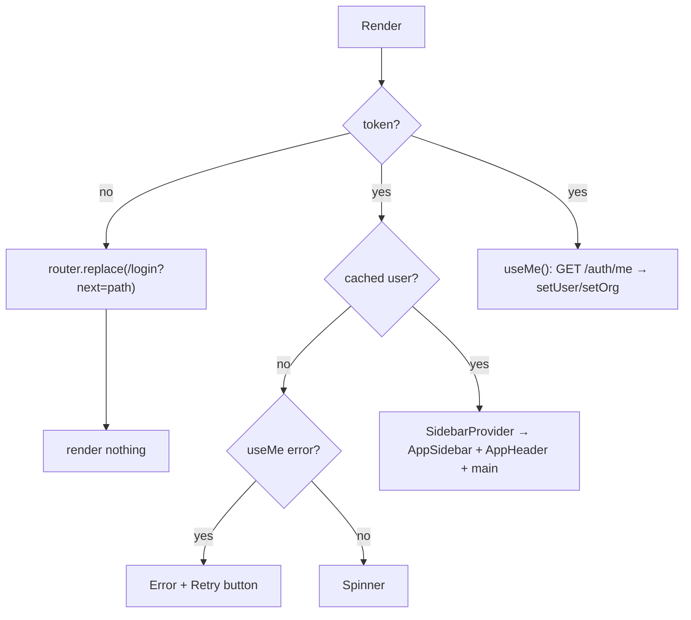

This page explains how the web app knows who you are, which pages you can see, and how deep links such as `/pipeline?deal=…` work. The server side of auth is covered in [Authentication](/docs/engineering/api/authentication).

## Session store (`lib/api/auth-store.ts`)

The session is the **only** client state the app persists.

```ts title="src/lib/api/auth-store.ts"
export const useAuthStore = create<AuthState>()(
  persist(
    (set) => ({
      token: null,
      user: null,
      org: null,
      setSession: ({ token, user, org }) => set({ token, user, org }),
      setUser: (user) => set({ user }),
      setOrg: (org) => set({ org }),
      clear: () => set({ token: null, user: null, org: null }),
    }),
    {
      name: "selleasy-session",                          // localStorage key
      storage: createJSONStorage(() => localStorage),
      skipHydration: true,                               // hydrated manually by SessionGate
    },
  ),
)
```

| Field | Written by | Purpose |
|---|---|---|
| `token` | `useLogin`, `useRegister`, `useAcceptInvite` (`setSession`) | The JWT that `client.ts` sends as `Authorization: Bearer …` |
| `user` | `setSession`, `useMe` (`setUser`), `useUpdateProfile` | A cached `User`, so the first paint is instant. `useCurrentUser()` reads it. |
| `org` | `setSession`, `useMe` (`setOrg`), `useUpdateOrg` | A cached org, used for the name in the sidebar |

Outside React, read the store with `useAuthStore.getState()`. `client.ts` does this to attach the token and to clear the session after a `401`.

<Callout type="warn" title="Security trade-off">
The JWT is kept in `localStorage`, so any script running on the page could read it. That's acceptable for the current stage. Moving it to an httpOnly cookie would need API changes. The token lasts `JWT_EXPIRES_IN` (7 days by default) and the API can't revoke it.
</Callout>

## Hydration: `Providers` and `SessionGate`

`src/components/providers.tsx` wraps the whole app:

```tsx
<QueryClientProvider client={queryClient}>
  <ThemeProvider attribute="class" defaultTheme="system" enableSystem disableTransitionOnChange>
    <TooltipProvider delayDuration={200}>
      <SessionGate>{children}</SessionGate>
      <Toaster richColors position="bottom-right" />
    </TooltipProvider>
  </ThemeProvider>
</QueryClientProvider>
```

The store uses `skipHydration: true`, so it starts out empty on both the server and the client. That avoids hydration mismatches. After mount, `SessionGate`:

1. Removes the old `sell-easy-demo` localStorage key, left over from the in-browser demo.
2. Calls `useAuthStore.persist.rehydrate()`.
3. Shows a centred spinner until rehydration finishes, and then renders the children.

As a result, no page renders before the app knows whether a token exists.

## The route guard: `(app)/layout.tsx`

Every page under `src/app/(app)/` shares this layout:



- **`useSession()`** returns `{ token, user, org, isAuthenticated }`, where `isAuthenticated` means a token exists.
- **`useMe()`** is keyed by `["auth", "me", token]`, has a 60 s `staleTime`, and runs only when a token exists. It refreshes the cached user and org on every load and on window focus, so role or name changes show up.
- **When `/auth/me` returns `401`** (expired token, removed user), the client clears the store, and the guard redirects to `/login?next=<current path>`.
- **The `next` parameter.** After signing in, the login page redirects to `next` only if it starts with `/`, which prevents open redirects. Otherwise it goes to `/dashboard`.
- **`/`** (`app/page.tsx`) redirects to `/dashboard` or `/login`.

## Login page modes

`src/app/login/page.tsx` shows a single card with tabs:

| Mode | Shown when | Fields | Hook, then endpoint |
|---|---|---|---|
| **Sign in** (`login`) | default | Work email, password | `useLogin` → `POST /auth/login` |
| **Create workspace** (`signup`) | Tab | Company, domain, your name, email, password | `useRegister` → `POST /auth/register` |
| **Accept invite** (`invite`) | The URL has `?invite=<token>`. The tab list is hidden. | Name (optional), password | `useAcceptInvite` → `POST /auth/accept-invite` |

- **Session and redirect.** All three hooks use `invalidate: "none"` and `toastError: false`, and call `setSession()` on success. The page's effect then sees `isAuthenticated` and redirects.
- **Error display.** Field errors from the API appear under each input through `fieldError(err, field)`, which reads `ApiError.fieldErrors[field][0]`. Other errors, such as "Invalid email or password", appear as a toast.
- **Signed-in visitors.** A user who is already signed in and opens `/login` is sent straight on.
- **Connected host.** The left panel shows which API host the app is talking to (`API_URL`).

Invite links look like `https://app.example.com/login?invite=inv_…`. The Team settings tab builds them with `window.location.origin`, because the API doesn't send emails yet.

## Logout

Logout is in the sidebar's user menu (`app-sidebar.tsx`):

```ts
const logout = () => {
  void api.post("/auth/logout").catch(() => undefined) // best effort; the API is stateless
  clear()          // wipe the zustand session (and localStorage)
  qc.clear()       // drop every cached query so the next user starts clean
  router.replace("/login")
}
```

## Role gating

The API enforces every permission. The UI hides or disables controls so users don't see buttons that would only return `403`.

| Helper | Defined in | True for |
|---|---|---|
| `canWrite(role)` | `hooks/auth.ts` | `owner`, `admin`, `member` (anyone except a viewer) |
| `isAdmin(role)` | `hooks/auth.ts` | `owner`, `admin` |
| `role === "owner"` | used inline | Plan changes (`PlanCard`) and workspace reset (`DangerZone`, the sidebar menu) |
| `useCurrentUser()` | `hooks/auth.ts` | Returns the cached `User`. It **throws** if there's no user, so only call it inside `(app)`, where the layout guarantees one. |

```tsx title="Typical usage"
const user = useCurrentUser()
const writable = canWrite(user.role)
const admin = isAdmin(user.role)

return (
  <PageHeader
    title="Accounts"
    actions={writable && <Button onClick={() => setAddOpen(true)}>Add account</Button>}
  />
)
```

Where each role check applies:

- **`canWrite`:** create, edit and delete buttons on accounts, contacts, signals, deals and sequences; draft approval; the **Simulate signal** button and autopilot switch in the header; the `?new=1` and `?import=1` deep links.
- **`isAdmin`:** the ICP editor's save button, playbook management, integration connect/configure and the waterfall, mailbox add/remove, team management, the org profile, and the **API keys** tab (which is hidden for other roles).
- **Owner only:** the plan card and **Reset workspace**. Reset also needs `GET /meta` to return `features.adminReset`.

## URL parameter conventions

Pages keep **shareable UI state** in the query string. They read it with `useSearchParams()` and write it with `router.replace(...)` and `{ scroll: false }`. Transient state, such as filters and the current table page, stays in component state.

| Param | Page | Effect |
|---|---|---|
| `?new=1` | `/accounts`, `/pipeline` | Opens the "Add account" or "New deal" dialog. It's cleared when the dialog closes. The command menu uses it. Writers only. |
| `?import=1` | `/accounts` | Opens the import dialog, for example from the dashboard's empty state. Writers only. |
| `?id=<contactId>` | `/contacts` | Opens the contact detail sheet. Used by the command menu and inbox links. |
| `?deal=<dealId>` | `/pipeline` | Opens the deal sheet. Used by notifications, the command menu and the book-meeting toast. |
| `?run=<runId>` | `/agent` | Opens the run sheet with its step timeline. Used by the Simulate toast and the dashboard feed. |
| `?signal=<signalId>` | `/signals` | Opens the signal sheet at first render. Links from the agent's run sheet use it. |
| `?tab=<name>` | `/agent` (`runs`, `approvals`, `playbooks`), `/outreach` (`sequences`, `inbox`, `mailboxes`), `/settings` (`profile`, `organization`, `team`, `api-keys`, `notifications`, `appearance`) | Selects a tab. Invalid values fall back to the default tab. |
| `?next=<path>` | `/login` | Where to go after signing in |
| `?invite=<token>` | `/login` | Switches the page to accept-invite mode |

<Callout type="info" title="Derive dialog state from the URL instead of syncing it in an effect">
Pages don't copy a URL parameter into state with `useEffect`, because the `react-hooks/set-state-in-effect` lint rule forbids that. They **combine** the two values instead:

```tsx
const wantsNew = writable && searchParams.get("new") === "1"
const addOpen = addOpenManual || wantsNew
const setAddOpen = (open: boolean) => {
  setAddOpenManual(open)
  if (!open && wantsNew) router.replace("/accounts")
}
```
</Callout>

## Next.js 16 notes

The app runs Next.js **16.3** with Turbopack. `frontend/AGENTS.md` warns that this version has breaking changes. Check `node_modules/next/dist/docs/` before relying on older patterns.

- **Every page is a client component.** Pages start with `"use client"` because they rely on hooks, the session store and TanStack Query. The root `app/layout.tsx` is the only server component, and it only sets fonts, metadata and `<Providers>`.
- **Route params are read with `useParams()`.** In Next 16, `params` passed to a page is a **Promise**. Client pages don't await it. They call `useParams()` instead:

  ```tsx title="src/app/(app)/accounts/[id]/page.tsx"
  const { id } = useParams<{ id: string }>()
  ```

- **`useSearchParams()` must be inside `<Suspense>`.** Otherwise the production build fails on pages that are rendered statically. Each page that reads search params exports a small wrapper:

  ```tsx
  export default function PipelinePage() {
    return (
      <Suspense>
        <Pipeline />
      </Suspense>
    )
  }
  ```

  The wrapper is used on `/login`, `/accounts`, `/contacts`, `/signals`, `/agent`, `/outreach`, `/pipeline` and `/settings`.
- **Layout props are typed with the global helpers.** For example, the root layout uses `LayoutProps<"/">`, which Next generates.
- **`turbopack.root` is pinned.** The repo root has its own `package.json` and lockfile, so `next.config.ts` sets `turbopack: { root: path.resolve(__dirname) }`. Without it, Turbopack warns that it inferred the wrong workspace root.
- **The route group `(app)`** shares a layout without adding a URL segment, so `/dashboard` is served from `src/app/(app)/dashboard/page.tsx`.
