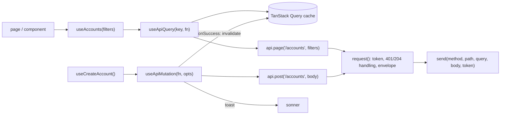
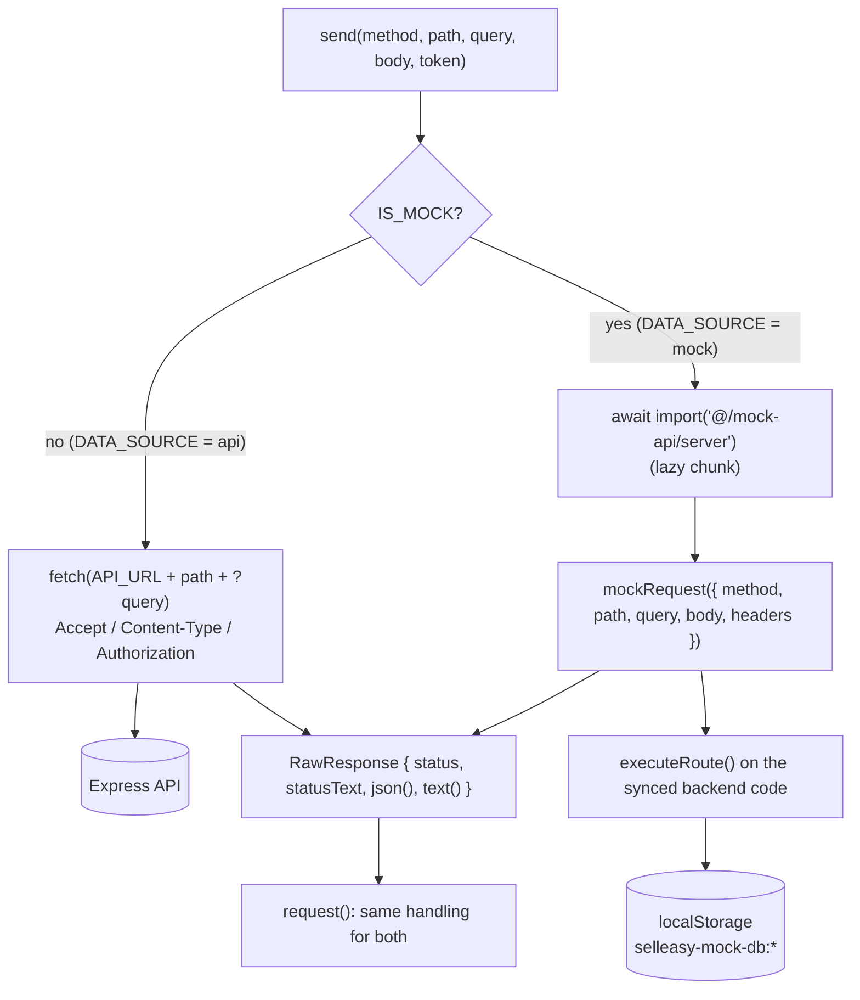

Everything the UI shows comes from the API, through `frontend/src/lib/api/`. Pages and components import from **one** entry point:

```ts
import { useAccounts, useCreateAccount, errorMessage, canWrite } from "@/lib/api"
```

<Files>
  <Folder name="src/lib/api" defaultOpen>
    <File name="index.ts" />
    <File name="client.ts" />
    <File name="query.ts" />
    <File name="auth-store.ts" />
    <Folder name="hooks" defaultOpen>
      <File name="auth.ts" />
      <File name="meta.ts" />
      <File name="accounts.ts" />
      <File name="contacts.ts" />
      <File name="signals.ts" />
      <File name="agent.ts" />
      <File name="outreach.ts" />
      <File name="pipeline.ts" />
      <File name="activity.ts" />
      <File name="analytics.ts" />
      <File name="integrations.ts" />
    </Folder>
  </Folder>
</Files>



## Transport: `api` or `mock`

`send()` is the only place that knows where requests go:



```ts title="src/lib/api/client.ts"
export const API_URL = (process.env.NEXT_PUBLIC_API_URL ?? "http://localhost:4000/api/v1").replace(/\/$/, "")

export const DATA_SOURCE: "api" | "mock" = process.env.NEXT_PUBLIC_DATA_SOURCE === "mock" ? "mock" : "api"
export const IS_MOCK = DATA_SOURCE === "mock"
```

- **`API_URL`** comes from `NEXT_PUBLIC_API_URL` (trailing slash removed). The login page shows the host it's connected to.
- **`DATA_SOURCE`** is `"mock"` only when `NEXT_PUBLIC_DATA_SOURCE` is exactly `mock`. Anything else, including unset, means `"api"`.
- **`IS_MOCK`** is exported from `@/lib/api` for UI hints: the login page pre-fills `jordan@acmegrowth.com` / `demo1234` and shows "Demo mode · sample data stored in this browser", and `AppHeader` shows a **Demo data** badge.
- Both variables are `NEXT_PUBLIC_*`, so they're **inlined at build time**. Restart `next dev` or rebuild after you change them. See [Configuration](/docs/engineering/configuration#frontend).

In mock mode, `send()`:

1. Dynamically imports `@/mock-api/server`, so the backend copy is a separate chunk that's only loaded when mock mode is on.
2. Converts `query` with the same `toSearchParams()` as the fetch path, then passes it as a plain object. Array values arrive as comma-joined strings, as they would over HTTP.
3. Passes `body` as is (the dispatcher deep-copies it through JSON) and only the `authorization` header.
4. Wraps the `{ status, json?, text? }` result in the same `RawResponse` shape that `fetch` produces. There's no `network_error` in mock mode.

Everything after `send()` (401 handling, 204, raw text, the envelope) is shared, so hooks behave identically in both modes. How `mockRequest()` works is described in [Mock data mode](/docs/engineering/frontend/mock-mode).

## `client.ts`: the request wrapper

### `request()`

Every call goes through one private function, `request(method, path, { query, body, raw })`, which reads the token from `useAuthStore` and calls `send()`:

1. **Builds the query.** `query` values that are `undefined`, `null` or `""` are left out. Arrays are joined with commas, which matches the API's CSV filter format. Empty arrays are left out.
2. **Adds headers.** `Authorization: Bearer <token>` when `useAuthStore` holds a token. On the `fetch` path it also always sends `Accept: application/json`, and `Content-Type: application/json` when there's a body.
3. **Handles network errors** (`api` mode only). If `fetch` throws, it throws `ApiError(0, "network_error", "Cannot reach the API at … Is the backend running?")`.
4. **Handles `401`.** If the response is `401` and a token was sent, it calls `useAuthStore.getState().clear()`. The `(app)` layout then sees there's no session and redirects to `/login?next=…`.
5. **Handles `204`.** It resolves to `undefined`.
6. **Handles `raw` requests** (`api.text`). It returns the response text, or throws `ApiError(status, "request_failed", statusText)`.
7. **Unwraps the envelope.** For a response that isn't OK, or isn't JSON, it throws `ApiError(status, error.code, error.message, error.details)`. Otherwise it returns `{ data, meta }` when the response has `meta`, and **just `data`** when it doesn't.

### The `api` object

| Method | HTTP | Returns | Use for |
|---|---|---|---|
| `api.get<T>(path, query?)` | GET | `T` (the unwrapped `data`) | Single resources and plain arrays |
| `api.page<T>(path, query?)` | GET | `Paged<T>` = `{ data: T[]; meta }` | Paginated lists |
| `api.text(path, query?)` | GET | `string` | CSV downloads |
| `api.post<T>(path, body?)` | POST | `T` | Creates and actions. The body defaults to `{}`. |
| `api.put<T>(path, body?)` | PUT | `T` | Full replacements (`/icp`, `/me/preferences`, `/integrations/waterfall`) |
| `api.patch<T>(path, body?)` | PATCH | `T` | Partial updates |
| `api.delete<T = void>(path)` | DELETE | `void` (204) | Deletes |

<Callout type="info" title="page() versus get()">
`api.page` exists only to set the return type. At runtime, `request()` returns `{ data, meta }` for **any** response that has `meta`. Use `api.page` for paginated endpoints so the type matches what comes back.
</Callout>

### `ApiError`, `errorMessage` and `downloadText`

- **`ApiError`** has `status`, `code`, `message` and `details`, plus a `fieldErrors` getter that returns `details.fieldErrors ?? {}`.
- **`errorMessage(err)`** returns a string for a toast. For field errors, the result looks like `"email: Invalid email address · password: …"`. Otherwise it's the error's message, or "Something went wrong". See [Errors](/docs/engineering/api/errors#handling-errors-in-the-frontend).
- **`downloadText(content, filename, type = "text/csv")`** makes the browser download a string, using a Blob and a temporary `<a download>`. It's used for the analytics CSV export and the import templates.

## `query.ts`: TanStack Query wrappers

### `makeQueryClient()`

```ts title="src/lib/api/query.ts"
export function makeQueryClient() {
  return new QueryClient({
    defaultOptions: {
      queries: {
        staleTime: 15_000,
        refetchOnWindowFocus: true,
        retry: (count, err) => !(err instanceof ApiError && err.status >= 400 && err.status < 500) && count < 2,
      },
      mutations: { retry: false },
    },
  })
}
```

- **Cached data is fresh for 15 s** unless a query sets its own `staleTime`. Examples: `useMeta` (`Infinity`), `useMe` (60 s) and `useUsers` (60 s).
- **Queries refetch when the window regains focus.**
- **Retries:** `4xx` errors are never retried. Other failures, including `network_error`, are retried up to **2** times. Mutations are never retried.
- `Providers` creates the client once with `useState(makeQueryClient)`.

### `useApiQuery(key, fn, opts?)`

```ts
export function useApiQuery<T>(key: readonly unknown[], fn: () => Promise<T>, opts = {}) {
  return useQuery({ queryKey: key, queryFn: fn, placeholderData: keepPreviousData, ...opts })
}
```

It's a thin wrapper around `useQuery`, with `placeholderData: keepPreviousData` as the default. When filters, pages or sort order change, the table keeps showing the previous rows (and `isPlaceholderData` is `true`) until the new page arrives, so it doesn't flash back to a skeleton.

<Callout type="warn" title="Detail queries turn this off">
Detail hooks such as `useAccount`, `useDeal`, `useContact`, `useSequence` and `useIcp` pass `placeholderData: undefined`. Without that, opening record B would briefly show record A's data. Do the same for any hook that's keyed by an ID.
</Callout>

### `useApiMutation(fn, options?)`

```ts
export interface ApiMutationOptions<TData, TVars> extends Omit<UseMutationOptions<TData, Error, TVars>, "mutationFn"> {
  successMessage?: string | ((data: TData, vars: TVars) => string | undefined)
  toastError?: boolean                                        // default true
  invalidate?: readonly (readonly unknown[])[] | "all" | "none" // default "all"
}
```

| Option | Default | Behaviour |
|---|---|---|
| `successMessage` | none | Shows `toast.success(...)` after the invalidation finishes. It can be a string or a function of `(data, vars)`. Return `undefined` to skip the toast. |
| `toastError` | `true` | Shows `toast.error(errorMessage(err))`. Set it to `false` when the form shows errors inline, as the login forms do. |
| `invalidate` | `"all"` | `"all"` calls `qc.invalidateQueries()` for every query. A list of key **prefixes** invalidates only those, for example `[["api-keys"]]`. `"none"` skips invalidation. |
| `onSuccess`, `onError`, `onMutate`, … | — | Standard TanStack options. Your `onSuccess` runs **after** the invalidation and the toast. |

**Why invalidate everything by default?** A single server action often changes many resources. Approving a draft, for example, updates the draft, the run, the contact, enrollments, activities and stats. Refetching every active query is simple and correct. Queries that aren't mounted are only marked stale, so the cost is small.

Use a narrower `invalidate` when the change really is local:

| Hook | `invalidate` |
|---|---|
| `useLogin`, `useRegister`, `useAcceptInvite`, `useChangePassword`, `useResendInvite`, `useSuggestReply` | `"none"` |
| `useSavePreferences` | `[["me", "preferences"]]` |
| `useCreateApiKey`, `useRevokeApiKey` | `[["api-keys"]]` |
| `useSetAutopilot` | `[["agent", "settings"]]` |
| `useUpdateMessage` | `[["inbox"]]` |
| `useSaveWaterfall` | `[["integrations"]]` |
| `useMarkNotificationRead`, `useMarkAllNotificationsRead` | `[["notifications"]]` |

Per-call callbacks work as usual:

```tsx
const createAccount = useCreateAccount()

createAccount.mutate(values, {
  onSuccess: ({ account, duplicateOf }) => {
    if (duplicateOf) toast.warning(`Possible duplicate of ${duplicateOf.name}`)
    router.push(`/accounts/${account.id}`)
  },
})
```

## Hooks by service

Each file in `hooks/` matches one backend service. It exports query hooks (`useX`), mutation hooks (`useVerbX`), the filter and input types, and sometimes plain fetchers.

| File | Exports (selection) | Endpoints |
|---|---|---|
| `auth.ts` | `useSession`, `useCurrentUser`, `canWrite`, `isAdmin`, `useMe`, `useLogin`, `useRegister`, `useAcceptInvite`, `useChangePassword`, `useOrg`, `useUpdateOrg`, `useChangePlan`, `useUpdateProfile`, `usePreferences`, `useSavePreferences`, `useUsers`, `useInviteUser`, `useResendInvite`, `useUpdateUser`, `useRemoveUser`, `useApiKeys`, `useCreateApiKey`, `useRevokeApiKey`, `useResetWorkspace` | `/auth/*`, `/org`, `/me`, `/users`, `/api-keys`, `/admin/reset` |
| `meta.ts` | `useMeta`, `useSearch` | `/meta`, `/search` |
| `accounts.ts` | `accountKeys`, `useAccounts`, `useAccountCounts`, `useDuplicates`, `useAccount`, `useScoreBreakdown`, `useAccountVersions`, `useAccountContacts`, `useAccountSignals`, `useAccountDeals`, `useAccountActivities`, `useCreateAccount`, `useUpdateAccount`, `useDeleteAccount`, `useBulkDeleteAccounts`, `useAssignOwner`, `useEnrichAccounts`, `useEnrichAccount`, `useRescoreAccounts`, `useRescoreAccount`, `useBulkEnrollAccounts`, `useEnrollAccountContacts`, `useMergeDuplicate`, `useDismissDuplicate`, `useImport`, `fetchImportTemplate` | `/accounts/*`, `/import/*` |
| `contacts.ts` | `useContacts`, `useContact`, `useContactEnrollments`, `useContactActivities`, `useCreateContact`, `useUpdateContact`, `useDeleteContact`, `useBulkDeleteContacts`, `useVerifyEmails`, `useEnrollContacts` | `/contacts/*` |
| `signals.ts` | `useSignals`, `useSignalStats`, `useSignal`, `useIngestSignal`, `useSimulateSignal`, `useProcessSignal`, `useProcessPending`, `useDeleteSignal`, **plus ICP:** `useIcp`, `useIcpDefaults`, `useIcpPreview`, `useSaveIcp`, `toIcpInput` | `/signals/*`, `/icp/*` |
| `agent.ts` | `useAgentSettings`, `useSetAutopilot`, `useAgentStats`, `useAgentRuns`, `useAgentRun`, `usePlaybooks`, `useCreatePlaybook`, `useUpdatePlaybook`, `useDeletePlaybook`, `useDrafts`, `useApproveDraft`, `useRejectDraft`, `useRegenerateDraft` | `/agent/*` |
| `outreach.ts` | `useSequences`, `useSequence`, `useOutreachStats`, `useSequenceEnrollments`, `useSequencePerformance`, `useEnrollable`, `useCreateSequence`, `useUpdateSequence`, `useDeleteSequence`, `useDuplicateSequence`, `useAddStep`, `useUpdateStep`, `useRemoveStep`, `useMoveStep`, `useEnrollInSequence`, `useBulkEnrollmentStatus`, `useRemoveEnrollments`, `useMailboxes`, `useAddMailbox`, `useUpdateMailbox`, `useRemoveMailbox`, `useInbox`, `useInboxMessage`, `useInboxCounts`, `useUpdateMessage`, `useReplyToMessage`, `useSuggestReply`, `useBookMeeting` | `/sequences/*`, `/enrollments/*`, `/mailboxes/*`, `/inbox/*`, `/outreach/stats` |
| `pipeline.ts` | `useDeals`, `usePipelineStats`, `useDeal`, `useDealActivities`, `useCreateDeal`, `useUpdateDeal`, `useMoveDeal`, `useDeleteDeal`, `useSyncCrm` | `/deals/*` |
| `activity.ts` | `useActivities`, `useLogActivity`, `useNotifications`, `useMarkNotificationRead`, `useMarkAllNotificationsRead` | `/activities`, `/notifications/*` |
| `analytics.ts` | `useDashboard`, `useAnalyticsOverview`, `fetchDealsCsv` | `/analytics/*` |
| `integrations.ts` | `useIntegrations`, `useIntegrationStats`, `useIntegration`, `useWaterfall`, `useConnectIntegration`, `useDisconnectIntegration`, `useSyncIntegration`, `useUpdateIntegrationSettings`, `useSaveWaterfall` | `/integrations/*` |

Some patterns worth knowing:

- **Conditional queries.** Pass `enabled`, as in `useAccount(id)` (`enabled: !!id`) and `useApiKeys(canManage)` in the API keys tab.
- **Polling.** `useNotifications` sets `refetchInterval: 30_000`.
- **A POST used as a query.** `useIcpPreview(icp)` calls `POST /icp/preview`, keyed by the draft ICP, with `staleTime: 30_000`. The scoring page debounces the draft by 400 ms and enables the query only when the draft passes client-side validation. The preview therefore reruns only after the user pauses, and only for valid drafts.
- **Plain fetchers.** `fetchDealsCsv(days)` and `fetchImportTemplate(type)` aren't hooks. Call them from event handlers and pass the result to `downloadText`.

## Query keys

Keys are arrays whose **first element is the resource**. Invalidating by prefix relies on this.

| Prefix | Examples |
|---|---|
| `["accounts", …]` | `["accounts","list",filters]`, `["accounts","detail",id]`, `["accounts","counts"]`, `["accounts","breakdown",id]`, `["accounts","activities",id,pageSize]` |
| `["contacts", …]` | `["contacts","list",f]`, `["contacts","detail",id]`, `["contacts","enrollments",id]` |
| `["deals", …]` | `["deals","list",f]`, `["deals","stats",f]`, `["deals","detail",id]`, `["deals","activities",id]` |
| `["signals", …]` | `["signals","list",f]`, `["signals","stats"]`, `["signals","detail",id]` |
| `["agent", …]` | `["agent","settings"]`, `["agent","stats"]`, `["agent","runs",f]`, `["agent","run",id]`, `["agent","playbooks"]`, `["agent","drafts",f]` |
| `["sequences", …]` | `["sequences","list",f]`, `["sequences","detail",id]`, `["sequences","stats"]`, `["sequences","enrollments",id,f]`, `["sequences","performance",id]`, `["sequences","enrollable",id,q]` |
| `["inbox", …]` | `["inbox","list",f]`, `["inbox","detail",id]`, `["inbox","counts",archived]` |
| Others | `["icp"]`, `["icp","defaults"]`, `["icp","preview",icp]`, `["mailboxes"]`, `["integrations",…]`, `["analytics","dashboard"]`, `["analytics","overview",days]`, `["notifications"]`, `["activities",f]`, `["users"]`, `["org"]`, `["api-keys"]`, `["me","preferences"]`, `["meta"]`, `["search",q]`, `["auth","me",token]` |

The filter object is part of the key, so each combination of filters gets its own cache entry. `accounts.ts` exports `accountKeys` (`all`, `list(f)`, `detail(id)`) so the account keys are defined in one place. New hook files should do the same.

## Types: `lib/types.ts` is the API contract

`frontend/src/lib/types.ts` mirrors the **public** shapes from `backend/src/domain/types.ts`. Server-only fields such as `passwordHash`, `inviteToken`, `apiKeyEncrypted` and the API key `hash` are left out. It also adds helper types for the response shapes:

```ts title="src/lib/types.ts (helpers)"
/** Every persisted record returned by the API carries these. */
export type Entity<T extends { id: ID }> = T & { orgId: ID; createdAt: string; updatedAt: string }

export interface PageMeta { total: number; page: number; pageSize: number }
export interface Paged<T> { data: T[]; meta: PageMeta }

export type WithAccount<T> = T & { account: AccountRef | null }  // expanded account summary
export type WithContact<T> = T & { contact: ContactRef | null }  // expanded contact summary

export interface Session { token: string; user: User; org: Entity<Organization> }
export interface RescoreResult { before: number; after: number; tier: Tier }
export interface EnrollResult { enrolled: number; skipped: number; enrolledIds: ID[]; sequence: { id: ID; name: string } }
export interface ImportResult { total: number; created: number; updated: number; skipped: number; errors: { row: number; message: string }[]; dryRun: boolean; accountsCreated?: number }
```

Hook files combine these helpers into record types, for example:

```ts
export type DealRecord = WithContact<WithAccount<Entity<Deal>>>          // GET /deals items
export type AgentRunRecord = WithAccount<Entity<AgentRun>> & { ruleName: string | null }
```

<Callout type="warn" title="Keep the types in sync by hand">
There's no code generation. When you change a response shape in the backend, update `lib/types.ts`, or the local interface in the hook file, in the **same change**. See [Contributing](/docs/engineering/contributing#keeping-types-in-sync).
</Callout>

## Optimistic updates: `useMoveDeal`

Dragging a deal on the kanban board must feel instant. `useMoveDeal` is the only hook that updates the cache optimistically:

```ts title="src/lib/api/hooks/pipeline.ts"
export function useMoveDeal() {
  const qc = useQueryClient()
  return useApiMutation(
    ({ id, stage }: { id: string; stage: DealStage }) => api.post<Entity<Deal>>(`/deals/${id}/move`, { stage }),
    {
      onMutate: async ({ id, stage }): Promise<MoveSnapshot> => {
        const listKey = ["deals", "list"]
        const detailKey = ["deals", "detail", id]
        // 1. stop in-flight fetches from overwriting the optimistic state
        await Promise.all([qc.cancelQueries({ queryKey: listKey }), qc.cancelQueries({ queryKey: detailKey })])
        // 2. snapshot every cached deal list + the detail
        const snapshot: MoveSnapshot = {
          lists: qc.getQueriesData<Paged<DealRecord>>({ queryKey: listKey }),
          detail: [detailKey, qc.getQueryData<DealRecord>(detailKey)],
        }
        // 3. write the new stage everywhere
        const updatedAt = new Date().toISOString()
        qc.setQueriesData<Paged<DealRecord>>({ queryKey: listKey }, (old) =>
          old ? { ...old, data: old.data.map((d) => (d.id === id ? { ...d, stage, updatedAt } : d)) } : old,
        )
        qc.setQueryData<DealRecord>(detailKey, (old) => (old ? { ...old, stage } : old))
        return snapshot
      },
      // 4. roll back on failure (useApiMutation still shows the error toast)
      onError: (_err, _vars, snapshot) => {
        const snap = snapshot as MoveSnapshot | undefined
        if (!snap) return
        for (const [key, data] of snap.lists) qc.setQueryData(key, data)
        qc.setQueryData(snap.detail[0], snap.detail[1])
      },
    },
  )
}
```

After the mutation succeeds, the default `invalidate: "all"` refetches everything. That picks up the server-side effects: the new probability, a customer-stage change, the notification and the activity.

## Adding a hook

<Steps>
<Step>

### Declare the response types

Put reusable entity shapes in `lib/types.ts`. Put endpoint-specific response shapes in the hook file.

</Step>
<Step>

### Write the hooks

```ts title="src/lib/api/hooks/tasks.ts"
"use client"

import type { Entity, Paged } from "@/lib/types"
import { api, type Query } from "../client"
import { useApiMutation, useApiQuery } from "../query"

export interface Task {
  id: string
  title: string
  accountId: string
  dueAt: string
  done: boolean
}
export type TaskRecord = Entity<Task>

export interface TaskFilters extends Query {
  page?: number
  pageSize?: number
  q?: string
  done?: boolean
  accountId?: string
}

export const taskKeys = {
  all: ["tasks"] as const,
  list: (f: TaskFilters) => ["tasks", "list", f] as const,
  detail: (id: string) => ["tasks", "detail", id] as const,
}

export const useTasks = (f: TaskFilters) =>
  useApiQuery(taskKeys.list(f), () => api.page<TaskRecord>("/tasks", f))

export const useTask = (id: string | undefined) =>
  useApiQuery(taskKeys.detail(id ?? ""), () => api.get<TaskRecord>(`/tasks/${id}`), {
    enabled: !!id,
    placeholderData: undefined,
  })

export function useCreateTask() {
  return useApiMutation((body: Pick<Task, "title" | "accountId" | "dueAt">) => api.post<TaskRecord>("/tasks", body), {
    successMessage: (t) => `Task “${t.title}” created`,
  })
}

export function useCompleteTask() {
  return useApiMutation((id: string) => api.post<TaskRecord>(`/tasks/${id}/complete`), {
    invalidate: [taskKeys.all], // only tasks are affected
  })
}
```

</Step>
<Step>

### Export them from the barrel file

```ts title="src/lib/api/index.ts"
export * from "./hooks/tasks"
```

</Step>
<Step>

### Use them in a component

```tsx
const [page, setPage] = useState(0)
const { data, isLoading, error, refetch, isPlaceholderData } = useTasks({ page: page + 1, pageSize: 25 })
```

</Step>
</Steps>

For a full walkthrough that includes the backend module and the page, see [Adding a page](/docs/engineering/frontend/adding-a-page).
