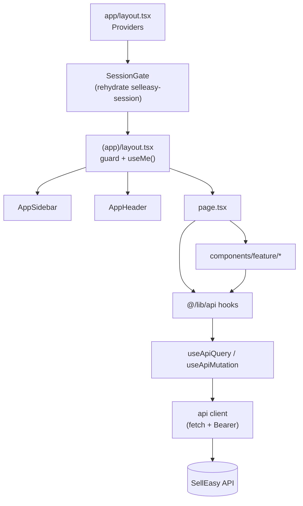

The web app in `frontend/` is a Next.js 16 App Router application. It is a **thin client**: every screen reads and writes through the SellEasy API, using typed TanStack Query hooks. The only thing the browser keeps is the session token, plus a cached copy of the current user and org.

## Stack

| Concern | Library | Version | Notes |
|---|---|---|---|
| Framework | Next.js (App Router, Turbopack) | 16.3.5 | Every page is a client component (`"use client"`). See [Next.js 16 notes](/docs/engineering/frontend/auth-and-routing#nextjs-16-notes). |
| UI runtime | React / React DOM | 19.2.8 | The React Compiler lint rules are enabled |
| Language | TypeScript | 5.x | Path alias `@/*` points to `src/*` |
| Styling | Tailwind CSS v4 (`@tailwindcss/postcss`), `tw-animate-css` | 4.x | Design tokens live in `src/app/globals.css` |
| Components | shadcn/ui, `radix-nova` style (Radix primitives from the `radix-ui` package) | shadcn 4.21 | Generated into `src/components/ui` |
| Server state | `@tanstack/react-query` | 5.103 | Wrapped by `useApiQuery` and `useApiMutation` |
| Client state | `zustand` + `persist` | 5.0 | **Session only** (`selleasy-session`) |
| Icons | `lucide-react` | 1.47 | |
| Toasts | `sonner` | 2.0 | `<Toaster richColors position="bottom-right" />` |
| Command palette | `cmdk` | 1.1 | ⌘K / Ctrl+K global search |
| Charts | `recharts` (through shadcn `chart.tsx`) | 3.8 | Dashboard and analytics |
| Drag and drop | `@dnd-kit/core` | 6.3 | Pipeline kanban |
| Theming | `next-themes` | 0.4 | `attribute="class"`, system default |
| Dates | `date-fns` | 4.4 | `lib/format.ts` |
| Fonts | Geist and Geist Mono (`next/font/google`) | — | |

## No data in the browser

Earlier prototypes kept a demo database in `localStorage` (`sell-easy-demo`). That's gone, and `SessionGate` deletes the old key on load. The rules now are:

- **All business logic runs on the API.** That includes scoring, dedup, enrollment eligibility, agent runs, analytics and CSV export.
- **Only the session is persisted.** The `selleasy-session` key holds `{ token, user, org }`. `user` and `org` are a cache, refreshed from `GET /auth/me` on every load.
- **Every read goes through a hook in `@/lib/api`.** Pages never call `fetch` themselves.
- **After a mutation, the app refetches.** `useApiMutation` invalidates every cached query by default, so every screen shows what the server now has. The only optimistic update is the pipeline stage move.
- **The UI keeps a copy of some constants only for labels.** Lists such as industries, deal stages and API scopes come from `GET /meta`. `lib/constants.ts` provides fallbacks and display labels.

## Folder structure

```text
frontend/src/
├── app/
│   ├── layout.tsx              Root: fonts, globals.css, <Providers>
│   ├── page.tsx                "/" → /dashboard or /login
│   ├── globals.css             Tailwind v4 + design tokens (light/.dark)
│   ├── login/page.tsx          Sign in · create workspace · accept invite
│   └── (app)/                  Authenticated area (route group, no URL segment)
│       ├── layout.tsx          Session guard + /auth/me + sidebar + header
│       ├── dashboard/  accounts/  accounts/[id]/  contacts/  signals/
│       ├── scoring/  agent/  outreach/  outreach/[id]/  pipeline/
│       └── analytics/  integrations/  settings/
├── components/
│   ├── ui/                     shadcn primitives (button, dialog, sheet, table, sidebar, chart…)
│   ├── layout/                 app-sidebar, app-header, command-menu, notifications, nav.ts
│   ├── shared/                 page-header, stat-card, score, status, avatars, confirm-dialog,
│   │                           empty-state, query-state
│   ├── accounts/ contacts/ signals/ agent/ outreach/ pipeline/ integrations/ settings/
│   └── providers.tsx           QueryClient, ThemeProvider, TooltipProvider, SessionGate, Toaster
├── hooks/use-mobile.ts         Used by the shadcn sidebar
└── lib/
    ├── api/                    client.ts, query.ts, auth-store.ts, index.ts, hooks/*
    ├── types.ts                API contract (mirrors backend/src/domain/types.ts)
    ├── constants.ts            UI labels, tier and status styles, fallbacks
    ├── format.ts               currency, percent, timeAgo, shortDate, initials…
    └── utils.ts                cn()
```

## Route map

Every authenticated page lives under `src/app/(app)/`. It gets the sidebar and header from `(app)/layout.tsx`, and it's only rendered once a session exists.

| Route | Page file | Key components | Hooks | API endpoints |
|---|---|---|---|---|
| `/` | `app/page.tsx` | — | `useSession` | none (redirects) |
| `/login` | `app/login/page.tsx` | Tabs: sign in, create workspace, invite | `useLogin`, `useRegister`, `useAcceptInvite`, `useSession` | `POST /auth/login`, `/auth/register`, `/auth/accept-invite` |
| `/dashboard` | `(app)/dashboard/page.tsx` | `StatCard`, recharts area and bar charts, hot accounts, latest signals and runs | `useDashboard`, `useCurrentUser` | `GET /analytics/dashboard` |
| `/accounts` | `(app)/accounts/page.tsx` | `AddAccountDialog`, `ImportDialog`, `EnrollDialog`, `BulkBar`, `SortButton`, `TablePagination`, `DuplicatesView` | `useAccounts`, `useAccountCounts`, `useDuplicates`, `useEnrichAccounts`, `useRescoreAccounts`, `useAssignOwner`, `useBulkDeleteAccounts`, `useMergeDuplicate`, `useDismissDuplicate`, `useUsers`, `useMeta` | `GET /accounts`, `/accounts/counts`, `/accounts/duplicates`; `POST /accounts/bulk-*`, `/accounts/:id/merge`, `/accounts/:id/dismiss-duplicate`, `/import/accounts` |
| `/accounts/[id]` | `(app)/accounts/[id]/page.tsx` | Tabs: Overview, Contacts, Signals, Deals, Activity, History. `EditAccountDialog`, `CreateDealDialog`, `AddContactDialog`, `ContactSheet`, `ActivityTimeline` | `useAccount`, `useScoreBreakdown`, `useAccountVersions`, `useAccountContacts`, `useAccountSignals`, `useAccountDeals`, `useAccountActivities`, `useUpdateAccount`, `useDeleteAccount`, `useEnrichAccount`, `useRescoreAccount`, `useAssignOwner`, `useMergeDuplicate`, `useDismissDuplicate`, `useProcessSignal`, `useLogActivity`, `useVerifyEmails`, `useIcp`, `useUsers` | `GET /accounts/:id` and its sub-resources; `PATCH` and `DELETE /accounts/:id`; `POST /accounts/:id/enrich`, `/rescore`, `/merge`, `/enroll`; `POST /activities`; `POST /signals/:id/process` |
| `/contacts` | `(app)/contacts/page.tsx` | `AddContactDialog`, `ContactSheet` (`?id=`), `EnrollDialog`, `ImportDialog` | `useContacts`, `useBulkDeleteContacts`, `useVerifyEmails`, `useUsers`; the sheet also uses `useContact`, `useContactEnrollments`, `useContactActivities`, `useUpdateContact`, `useDeleteContact` | `GET /contacts`, `/contacts/:id`, `/contacts/:id/enrollments`, `/contacts/:id/activities`; `POST /contacts/bulk-delete`, `/contacts/verify-emails`, `/contacts/enroll`, `/import/contacts` |
| `/signals` | `(app)/signals/page.tsx` | `IngestSignalDialog`, `SignalSheet` (`?signal=`), `AccountPicker`, `RunTimeline` | `useSignals`, `useSignalStats`, `useSignal`, `useIngestSignal`, `useSimulateSignal`, `useProcessSignal`, `useProcessPending`, `useAgentSettings`, `usePlaybooks`, `useAccountContacts`, `useMeta` | `GET /signals`, `/signals/stats`, `/signals/:id`; `POST /signals`, `/signals/simulate`, `/signals/:id/process`, `/signals/process-pending` |
| `/scoring` | `(app)/scoring/page.tsx` | `IcpEditor`, `ChipSelect`, `SliderField`, live preview table | `useIcp`, `useIcpDefaults`, `useIcpPreview` (a POST used as a query), `useSaveIcp`, `useMeta` | `GET /icp`, `/icp/defaults`; `POST /icp/preview`; `PUT /icp` |
| `/agent` | `(app)/agent/page.tsx` | Tabs (`?tab=runs\|approvals\|playbooks`): `RunsTab` + `RunSheet` (`?run=`), `ApprovalsTab` + `DraftReviewCard`, `PlaybooksTab` + `PlaybookForm` | `useAgentRuns`, `useAgentRun`, `useAgentStats`, `useAgentSettings`, `useSetAutopilot`, `useDrafts`, `useApproveDraft`, `useRejectDraft`, `useRegenerateDraft`, `usePlaybooks`, `useCreatePlaybook`, `useUpdatePlaybook`, `useDeletePlaybook`, `useSequences`, `useProcessPending`, `useSimulateSignal` | `/agent/*`; `GET /sequences`; `POST /signals/process-pending`, `/signals/simulate` |
| `/outreach` | `(app)/outreach/page.tsx` | Tabs (`?tab=sequences\|inbox\|mailboxes`): `SequencesTab`, `InboxTab`, `MailboxesTab`, `NewSequenceDialog` | `useSequences`, `useOutreachStats`, `useDuplicateSequence`, `useDeleteSequence`, `useInbox`, `useInboxMessage`, `useInboxCounts`, `useUpdateMessage`, `useReplyToMessage`, `useSuggestReply`, `useBookMeeting`, `useMailboxes`, `useAddMailbox`, `useUpdateMailbox`, `useRemoveMailbox` | `/sequences`, `/outreach/stats`, `/inbox/*`, `/mailboxes/*` |
| `/outreach/[id]` | `(app)/outreach/[id]/page.tsx` | `NameEditor`, `SequenceSteps`, `SequenceEnrolled`, `SequencePerformance`, `SequenceSettings`, `EnrollDialog` | `useSequence`, `useUpdateSequence`, `useDeleteSequence`, `useDuplicateSequence`, `useSequenceEnrollments`, `useSequencePerformance`, `useAddStep`, `useUpdateStep`, `useRemoveStep`, `useMoveStep`, `useEnrollable`, `useEnrollInSequence`, `useBulkEnrollmentStatus`, `useRemoveEnrollments`, `useMailboxes` | `/sequences/:id` and all of its sub-routes; `/enrollments/bulk-*` |
| `/pipeline` | `(app)/pipeline/page.tsx` | `DealBoard` (dnd-kit), `DealTable`, `DealSheet` (`?deal=`), `NewDealDialog` (`?new=1`), `AccountCombobox` | `useDeals`, `usePipelineStats`, `useSyncCrm`, `useMoveDeal` (optimistic), `useDeal`, `useDealActivities`, `useCreateDeal`, `useUpdateDeal`, `useDeleteDeal`, `useLogActivity`, `useTeam`, `useCrmName` | `GET /deals`, `/deals/stats`, `/deals/:id`, `/deals/:id/activities`; `POST /deals`, `/deals/:id/move`, `/deals/sync-crm`; `PATCH` and `DELETE /deals/:id`; `GET /integrations?category=crm` |
| `/analytics` | `(app)/analytics/page.tsx` | Range toggle (30/90/180), recharts, tier, sequence and rep tables, CSV export | `useAnalyticsOverview`, `fetchDealsCsv` | `GET /analytics/overview`, `/analytics/deals.csv` |
| `/integrations` | `(app)/integrations/page.tsx` | `IntegrationCard`, `ConnectDialog`, `ConfigureSheet`, `WaterfallCard` | `useIntegrations`, `useIntegrationStats`, `useIntegration`, `useConnectIntegration`, `useDisconnectIntegration`, `useSyncIntegration`, `useUpdateIntegrationSettings`, `useWaterfall`, `useSaveWaterfall` | `/integrations/*` |
| `/settings` | `(app)/settings/page.tsx` | Tabs (`?tab=`): `ProfileTab`, `OrganizationTab`, `TeamTab`, `ApiKeysTab` (admins only), `NotificationsTab`, `AppearanceTab` | `useUpdateProfile`, `useChangePassword`, `useOrg`, `useUpdateOrg`, `useChangePlan`, `useResetWorkspace`, `useUsers`, `useInviteUser`, `useResendInvite`, `useUpdateUser`, `useRemoveUser`, `useApiKeys`, `useCreateApiKey`, `useRevokeApiKey`, `usePreferences`, `useSavePreferences`, `useMeta` | `/me`, `/me/preferences`, `/org`, `/org/plan`, `/users/*`, `/api-keys/*`, `/admin/reset`, `/auth/change-password` |

**Shared chrome.** These components appear on every authenticated page:

| Component | Hooks | Endpoints |
|---|---|---|
| `AppSidebar` | `useAgentStats`, `useInboxCounts`, `useSignalStats` (for the nav badges), `useMeta`, `useResetWorkspace` | `/agent/stats`, `/inbox/counts`, `/signals/stats`, `/meta`, `POST /auth/logout`, `POST /admin/reset` |
| `AppHeader` | `useAgentSettings`, `useSetAutopilot`, `useSimulateSignal`, `useAccount` and `useSequence` (for breadcrumb labels) | `/agent/settings`, `POST /signals/simulate` |
| `CommandMenu` | `useSearch` | `GET /search` |
| `Notifications` | `useNotifications` (polls every 30 s), `useMarkNotificationRead`, `useMarkAllNotificationsRead` | `/notifications/*` |

## How a page is put together



## Next steps

<Cards>
  <Card title="Data layer" href="/docs/engineering/frontend/data-layer" description="The API client, query helpers, hooks, cache keys and optimistic updates." />
  <Card title="Auth and routing" href="/docs/engineering/frontend/auth-and-routing" description="The session store, the route guard, login modes, role gating and URL parameters." />
  <Card title="UI conventions" href="/docs/engineering/frontend/ui-conventions" description="shadcn components, shared building blocks, theming, forms, tables and lint rules." />
  <Card title="Adding a page" href="/docs/engineering/frontend/adding-a-page" description="A full walkthrough, from backend module to sidebar item." />
</Cards>
