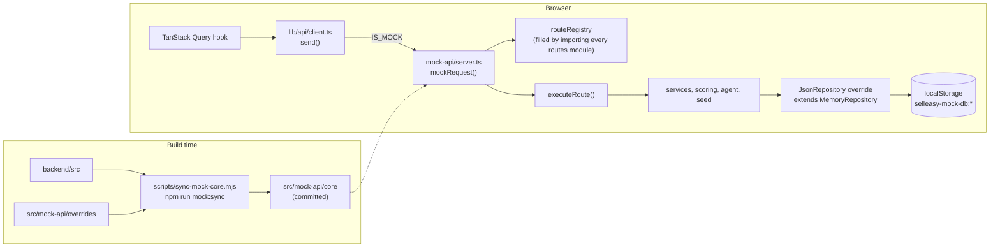

Mock data mode lets the web app run **without the SellEasy API**. With `NEXT_PUBLIC_DATA_SOURCE=mock`, every request the UI makes is handled inside the browser by a generated copy of `backend/src`, and the data is stored in `localStorage`. The default is `NEXT_PUBLIC_DATA_SOURCE=api`, which talks to the Express backend over HTTP.

## Why it exists

- **Stakeholder demos with no infrastructure.** Only the frontend has to be deployed (for example on Vercel). There's no API, database or secret to host.
- **One source of truth.** Mock mode doesn't use fixtures or hand-written fake endpoints. It runs the same route definitions, zod schemas, role checks and services as the API, so the demo behaves like the product and stays current as the backend changes.
- **An easy path to the real backend.** When an API is hosted, set `NEXT_PUBLIC_DATA_SOURCE=api` and `NEXT_PUBLIC_API_URL`, then rebuild. No UI code changes.

For how the modes fit into the wider environment plan, see [Environments and data modes](/docs/architecture/environments-and-data-modes).

## Quick start

<Tabs items={['From the repo root', 'From frontend/', '.env.local']}>
<Tab value="From the repo root">

```bash
npm run dev:mock      # cross-env NEXT_PUBLIC_DATA_SOURCE=mock npm --prefix frontend run dev
```

</Tab>
<Tab value="From frontend/">

```bash
NEXT_PUBLIC_DATA_SOURCE=mock npm run dev
```

</Tab>
<Tab value=".env.local">

```bash title="frontend/.env.local"
NEXT_PUBLIC_DATA_SOURCE=mock
```

Restart `next dev` after editing the file.

</Tab>
</Tabs>

Open `http://localhost:3000`. The login form is pre-filled with the demo login:

| Email | Password | Role |
|---|---|---|
| `jordan@acmegrowth.com` | `demo1234` | owner |
| `sam@acmegrowth.com`, `taylor@acmegrowth.com`, `casey@acmegrowth.com` | `Password123!` | admin, member, member |
| `riley@acmegrowth.com` | `Password123!` | viewer |

The login page says "Demo mode · sample data stored in this browser", and the app header shows a **Demo data** badge (its tooltip says the data lives in this browser and no backend is used).

## How it works



### 1. The client switches transport

`src/lib/api/client.ts` reads `NEXT_PUBLIC_DATA_SOURCE` into `DATA_SOURCE` and `IS_MOCK`. In mock mode, `send()` runs `await import("@/mock-api/server")` and calls `mockRequest({ method, path, query, body, headers: { authorization } })` instead of `fetch`. The result is wrapped in the same response shape, so `request()`, the hooks and the error handling don't change. The mock API is a separate, lazily loaded chunk. See [Frontend data layer](/docs/engineering/frontend/data-layer#transport-api-or-mock).

### 2. The dispatcher matches the route

`src/mock-api/server.ts` imports every backend routes module (`./core/modules/*/routes`, the same list as `backend/src/app.ts`). Importing a module runs its `createModule().route()` calls, and the browser override of `lib/http.ts` only pushes each definition into `routeRegistry`.

`mockRequest()` then:

<Steps>
<Step>Seeds the demo workspace if needed (see below).</Step>
<Step>Waits a **simulated latency of 60–200 ms**.</Step>
<Step>Compiles each registered `fullPath` into a regular expression once, turning `:param` segments into `([^/]+)` and allowing an optional trailing slash, the way Express does.</Step>
<Step>Finds the **first** route whose path matches and whose method equals the request method. With no match it returns `404` and `{ error: { code: "not_found", message: "Route GET /x not found" } }`.</Step>
<Step>Decodes the path parameters, deep-copies the body through JSON, and calls `executeRoute(def, { params, query, body, headers })`. This is the same function the Express binding calls, so authentication, role checks, zod validation and the status rules are identical.</Step>
<Step>Converts the result: `{ status, json }` (deep-copied through JSON so the UI never shares objects with the in-memory database), `204`, or, for a `fileResponse()`, `200` with the file content as text.</Step>
<Step>On an error, uses `errorOutput(err)` to build the `HttpError` envelope. Any other error is logged to the console as `[mock-api]` and returned as `500 internal_error`.</Step>
</Steps>

Only the `Authorization` header is forwarded. Paths are relative to the API prefix (for example `/accounts`), just as the client uses them.

### 3. The demo workspace is seeded on first use

Before the first request is handled, `ensureSeeded()` looks for a user with `DEMO_EMAIL` (`jordan@acmegrowth.com`). If there isn't one, it calls the backend's own `createOrganization()` (org **Acme Growth Inc.**, domain `acmegrowth.com`, owner **Jordan Lee**, password `demo1234`) and then `seedDemoData(org.id, owner.id)`. That's the same dataset `npm run seed:demo` loads. The promise is cached, so concurrent requests wait for a single seed.

### 4. Data is kept in `localStorage`

The browser override of `db/json/json-repository.ts` is a `MemoryRepository` whose `loadRows()` reads `localStorage["selleasy-mock-db:<collection>"]` and whose `persistRows()` writes the whole collection back, **debounced by 250 ms**. Data survives reloads and is private to that browser profile. See [Data layer](/docs/engineering/backend/data-layer#the-browser-driver-mock-mode).

To wipe it:

- Use **Load demo data** in the user menu (or **Settings → Organization → Reset workspace**). This runs `POST /admin/reset` in the browser: it clears the workspace's business data and, with `demo: true`, reloads the dataset. `ENABLE_ADMIN_RESET` is always on in mock mode.
- Delete the `selleasy-mock-db:*` keys (and `selleasy-session`) in devtools, or clear the site data. The next request seeds a new workspace.
- In code, `resetMockDatabase()` (exported from `mock-api/server.ts`) stops further writes, removes every `selleasy-mock-db:*` key and the session, and reloads the page; the workspace is seeded again on the first request. Nothing in the UI calls it today.

## What's real and what's simulated

| Area | In mock mode | Source |
|---|---|---|
| Route definitions, zod validation, default roles, status codes, envelope | **Real** (same code) | `core/lib/route-runtime.ts`, `core/modules/*/routes.ts` |
| Business logic: accounts, dedup, scoring, agent, outreach, pipeline, analytics, search, import, CSV export | **Real** | `core/modules`, `core/domain` |
| Demo dataset | **Real** (same generator as `seed:demo`) | `core/seed` |
| Password hashing | **Real** bcrypt (`bcryptjs`), running in the browser | `core/modules/organization/service.ts` |
| Vendor providers (enrichment, CRM, email, LLM) | The backend's own **mocks**, including their 300–800 ms artificial delays | `core/providers` |
| Event bus | **Real** in-memory bus | `core/events/bus.ts` |
| Transport | **Simulated.** No HTTP, 60–200 ms delay, no CORS, no Swagger, no `/health` | `mock-api/server.ts` |
| Sessions | **Simulated.** Unsigned `mock.` base64 tokens, valid 7 days | `overrides/middleware/auth.ts` |
| Hashing and encryption | **Simulated.** `sha256` is an FNV-1a digest; `encrypt`/`decrypt` are base64 with a `mock.` prefix | `overrides/lib/crypto.ts` |
| Configuration | **Fixed values.** Simulation and admin reset on, all providers `mock`, `NODE_ENV=development` | `overrides/config.ts` |
| Rate limiting | **None** (no-op shim) | `shims/express-rate-limit.ts` |
| Logging | `warn` and above to the browser console with a `[mock-api]` prefix | `overrides/lib/logger.ts` |
| Storage | `localStorage`, per browser | `overrides/db/json/json-repository.ts` |
| Slack notifications | Never sent (they need `NODE_ENV=production`) | `core/modules/notifications/service.ts` |

## The generated core

`frontend/src/mock-api/core/` is produced by `frontend/scripts/sync-mock-core.mjs` and **committed**, so the frontend (a separate repository) builds without the backend folder. Every file starts with an `AUTO-GENERATED … do not edit` header.

### What the sync script does

1. Reads every `.ts` file (not `.d.ts`) under `../backend/src`, or under `BACKEND_SRC` if set (resolved relative to `frontend/`). It exits with an error if the folder doesn't exist.
2. **Skips** the server-only entry points and adapters: `app.ts`, `server.ts`, `lib/openapi.ts` and `middleware/error.ts`.
3. **Transforms** each file:
   - strips the `.js` suffix from relative imports (NodeNext style) for the bundler, in both `from "…"` and `import("…")`
   - rewrites `csv-parse/sync` to `csv-parse/browser/esm/sync`
   - rewrites `express-rate-limit` to `@/mock-api/shims/express-rate-limit`
4. **Applies the overrides**: every file in `src/mock-api/overrides/` replaces the file at the same relative path (with the same transforms).
5. **Refuses server-only imports.** If any output file still imports `node:*`, `express`, `jsonwebtoken`, `pino`, `dotenv…`, `helmet`, `cors` or `compression`, it prints the file and exits with code 1.
6. Without `--check`, deletes `src/mock-api/core` and writes the new files. With `--check`, compares them with what's on disk and exits with code 1 on any `changed:` or `removed:` file.

### Scripts

| Command | Where | What it does |
|---|---|---|
| `npm run mock:sync` | `frontend/` or the repo root | Regenerates `src/mock-api/core` |
| `npm run mock:check` | `frontend/` or the repo root | Fails if the committed core is stale. Run it in CI. |
| `npm run dev:mock` | repo root | `next dev` with `NEXT_PUBLIC_DATA_SOURCE=mock` (via `cross-env`) |

### Tooling settings

- `eslint.config.mjs` ignores `src/mock-api/core/**` and `src/mock-api/overrides/**` (the code is linted in the backend repository).
- `tsconfig.json` excludes `src/mock-api/overrides` and `scripts`. The overrides are type-checked **after** they're copied into `core/`, where their relative imports resolve. `npx tsc --noEmit` therefore checks the whole generated core.
- `csv-parse` and `bcryptjs` are frontend dependencies because the copied services import them. `zod` is shared.

### Sync workflow

<Steps>
<Step>Change code in `backend/src` and test it in the backend as usual.</Step>
<Step>In `frontend/`, run `npm run mock:sync`.</Step>
<Step>Run `npx tsc --noEmit` and try the affected screens with `npm run dev:mock`.</Step>
<Step>Commit the regenerated `src/mock-api/core` in the frontend repository, and link that PR to the backend PR.</Step>
<Step>CI runs `npm run mock:check` so a stale copy can't be merged or deployed.</Step>
</Steps>

If you add a **new routes module**, also add `import "./core/modules/<name>/routes"` to `src/mock-api/server.ts`. The server doesn't discover modules on its own.

## Browser overrides

Files in `src/mock-api/overrides/` replace backend files that need Node or Express. Each keeps the **same exports** as the file it replaces, so the rest of the copied code compiles unchanged.

| Override | Replaces | Browser behaviour |
|---|---|---|
| `config.ts` | `backend/src/config.ts` (dotenv, zod env parsing, `node:path`) | A fixed `config` object with the same shape: `ENABLE_SIMULATION` and `ENABLE_ADMIN_RESET` on, `LOG_LEVEL: "warn"`, every provider `mock`, `DB_DRIVER: "json"`, `RATE_LIMIT_MAX` effectively unlimited. Also exports `DEMO_EMAIL` and `DEMO_PASSWORD`. |
| `lib/logger.ts` | pino logger | `trace`/`debug`/`info` are no-ops. `warn`, `error` and `fatal` go to `console.warn`/`console.error` with a `[mock-api]` prefix. |
| `lib/crypto.ts` | `node:crypto` AES-256-GCM and SHA-256 | **Not real cryptography.** `encrypt` → `mock.` plus base64, `decrypt` reverses it, `sha256` → a deterministic 64-hex FNV-1a digest. `mask` and `randomSecret` match the server. |
| `lib/http.ts` | Express binding | `createModule()` returns a no-op `router` and a `route()` that only registers the definition in `routeRegistry`. Re-exports `route-runtime.ts`. |
| `middleware/auth.ts` | `jsonwebtoken` sessions | `signToken` returns `mock.` plus base64 JSON `{ sub, org, role, exp }` with a 7-day `exp`, **unsigned**. `authenticateBearer` decodes it, checks `exp`, and re-reads the user like the server. `authenticateApiKey` and `authenticateRequest` match the server. |
| `db/json/json-repository.ts` | File-backed `JsonRepository` (`node:fs`) | A `MemoryRepository` persisted to `localStorage` under `selleasy-mock-db:<collection>`, debounced by 250 ms. Exports `MOCK_DB_PREFIX`. |

`src/mock-api/shims/express-rate-limit.ts` isn't an override: the sync script redirects the package import to it. Its `rateLimit()` returns a function that does nothing, and the auth module "mounts" it on the no-op router.

## Keeping backend code portable

Everything under `backend/src` except the skipped and overridden files runs in the browser. In particular `lib/route-runtime.ts`, `lib/roles.ts`, `lib/ids.ts`, `db/memory`, `events/bus.ts`, `domain/`, `modules/`, `providers/` and `seed/` must not import Node-only modules or use Node globals such as `Buffer` and `process`. If a file needs a Node API, add a browser override with the same exports. The full rule set is in [Contributing](/docs/engineering/contributing#keeping-mock-mode-in-sync).

Examples of portable choices already in the backend:

- `lib/ids.ts` uses `globalThis.crypto.getRandomValues` (Web Crypto) for `randomToken`, `randomHex` and `newId`.
- `events/bus.ts` uses a `Map` of handlers and `queueMicrotask` instead of `node:events`.
- Route handlers return `fileResponse()` instead of writing to an Express response.
- `MemoryRepository` holds all query logic, and the storage drivers only load and save rows.

## Deploying a demo and switching to the API

The steps are in [Deployment](/docs/engineering/deployment#frontend-only-demo-on-vercel). In short:

1. Make sure `npm run mock:check` passes, and deploy the frontend with `NEXT_PUBLIC_DATA_SOURCE=mock`.
2. To use a real backend later, set `NEXT_PUBLIC_DATA_SOURCE=api` and `NEXT_PUBLIC_API_URL=https://<api host>/api/v1`, add the web origin to the API's `CORS_ORIGINS`, and **redeploy**.

<Callout type="warn" title="The flag is fixed at build time">
`NEXT_PUBLIC_*` values are inlined when Next.js builds. Changing `NEXT_PUBLIC_DATA_SOURCE` has no effect until you restart `next dev` or rebuild and redeploy.
</Callout>

## Limitations

<Callout type="error" title="Not secure, not shared">
Mock mode is for demos. Tokens can be forged, hashes and "encryption" are not cryptographic, and all data is readable in devtools. Never enter real credentials, vendor keys or customer data.
</Callout>

- **Data is per browser.** Each browser profile has its own workspace. Nothing is shared between visitors, devices or colleagues, and clearing site data deletes it. Tabs don't sync: each keeps its own in-memory copy, and the last one to write a collection wins.
- **Storage is small.** `localStorage` is usually limited to about **5 MB** per origin, and each collection is one JSON string. Large imports can hit the limit. Failed writes are logged to the console and are lost on reload.
- **Recent writes can be lost.** Saves happen 250 ms after the last change, so closing the tab immediately after an action may drop it.
- **The first load is slower.** Seeding runs bcrypt and creates the whole dataset in the browser, which takes about 1–2 seconds on first use.
- **No external access.** There's no HTTP endpoint, so vendor webhooks (`POST /webhooks/signals`), Zapier and API keys can't be used from outside the browser. API keys can still be created and revoked in the UI, but nothing can call the mock API with them.
- **Server-only features are missing.** No Swagger UI or `openapi.json`, no `/health`, no rate limits, no request logging, no Slack notifications.
- **The copy can go stale.** The demo only reflects backend changes that were synced and committed. `npm run mock:check` in CI guards against this.
- **Bundle size.** The mock chunk contains the backend code and the demo generator. It's only downloaded when mock mode is on.

For fixes to common problems, see [Troubleshooting](/docs/engineering/troubleshooting#mock-data-mode).
