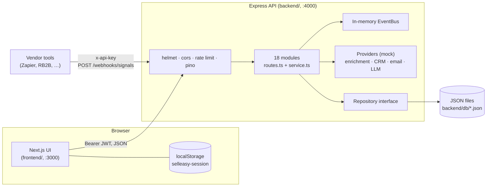

SellEasy is an agentic go-to-market (GTM) platform. It takes in buying signals, scores each account on ICP fit plus live intent, and runs an orchestration agent that can route accounts, draft outreach, enroll contacts in sequences and open deals. A human approves the agent's drafts before they are sent.

The codebase has two apps and a docs site:

- **`backend/`** is an Express 5 + TypeScript REST API. It holds all the data and all the business rules.
- **`frontend/`** is a Next.js 16 UI. It only displays and edits data through the API. With `NEXT_PUBLIC_DATA_SOURCE=mock` it instead runs a synced copy of the backend's route and service code inside the browser, so it can be deployed on its own for demos (see [Mock data mode](/docs/engineering/frontend/mock-mode)).
- **`docs/`** is this Fumadocs site.

These pages are for developers and technical PMs who need to understand the whole system, from how an HTTP request is handled to how a page is rendered.

## Tech stack

| Layer | Technology | Notes |
|---|---|---|
| Frontend framework | Next.js 16.3 (App Router, Turbopack), React 19.2, TypeScript 5 | Every page is a client component. In the default `api` mode the UI keeps no domain data in the browser. |
| UI kit | Tailwind CSS v4, shadcn/ui (`radix-nova` style), lucide-react, sonner, cmdk | Components live in `frontend/src/components/ui` |
| Server state | TanStack Query v5 | Typed hooks per service in `frontend/src/lib/api/hooks` |
| Client state | zustand (with `persist`) | Holds the session only: token, cached user and org |
| Charts and drag-and-drop | recharts, dnd-kit | Analytics and dashboard charts; pipeline kanban |
| Backend framework | Express 5, TypeScript (ESM, `NodeNext`), run with `tsx` in dev | `backend/src/app.ts` |
| Validation | zod v4 | Validates every request body, query string and path parameter. Also validates env config and generates the OpenAPI spec. |
| Auth | JWT (`jsonwebtoken`) + bcrypt (`bcryptjs`); SHA-256-hashed API keys | Four roles: `owner`, `admin`, `member`, `viewer` |
| Security middleware | helmet, cors, express-rate-limit, compression | Also pino / pino-http for logging |
| Storage | JSON-file database (`backend/db/*.json`) behind a `Repository<T>` interface. The shared query logic lives in `MemoryRepository`. | The Postgres driver is a placeholder and not implemented yet. Mock mode persists the same collections to `localStorage`. |
| Secrets at rest | AES-256-GCM (`ENCRYPTION_KEY`) | Used for vendor API keys |
| Vendors | Provider interfaces with **mock** implementations | Covers enrichment, CRM, email, LLM and connection tests. None of them call a real vendor yet. |
| Events | In-memory `EventBus` (a handler `Map` dispatched with `queueMicrotask`) | EventBridge/SQS are planned |
| API docs | OpenAPI 3.1 generated from the route definitions, served by Swagger UI | `/api/v1/openapi.json`, `/api/v1/docs` |
| Tests | vitest + supertest | Backend API tests only |
| Mock data mode | `frontend/src/mock-api` (generated `core/` plus browser `overrides/`) | `NEXT_PUBLIC_DATA_SOURCE=mock`. Frontend-only demo deployments. |
| Docs | Fumadocs (Next.js + MDX), Mermaid | `docs/`, runs on port 3002 |

## System at a glance

The diagram shows the default `api` data source. In `mock` mode the Express box is replaced by an in-browser dispatcher that runs the same route definitions against `localStorage`. See [Architecture](/docs/engineering/architecture#two-data-modes).

A typical write request goes like this:

1. The UI calls a TanStack Query mutation.
2. `lib/api/client.ts` sends the JSON request with the bearer token (or hands it to `mockRequest()` in mock mode).
3. `executeRoute()` in `lib/route-runtime.ts` authenticates the caller, checks the role, validates the input with zod and calls the service.
4. The service applies the business rules through the tenant-scoped repository. That can mean re-scoring an account, running the agent, or writing activity and notifications.
5. The response comes back as `{ data }`. The mutation then invalidates the cached queries so every screen refetches.

See [Architecture](/docs/engineering/architecture) for the full picture.

## Repository map

| Path | What it is |
|---|---|
| `package.json`, `scripts/setup.mjs` | Root tooling. `install:all`, `setup`, `dev` (runs both apps with `concurrently`), `dev:mock`, `mock:sync`, `mock:check`, `build`, `test` |
| `plan.md` | Architecture and implementation plan, with an implementation-status table |
| `backend/src/modules/<service>/` | One folder per service boundary. Each has a `routes.ts` (HTTP contract) and a `service.ts` (business logic). |
| `backend/src/lib/route-runtime.ts` | Transport-agnostic route runtime: `RouteDef`, `executeRoute()` (auth, roles, zod validation, response envelope), `fileResponse()`, `routeRegistry` and the shared schemas |
| `backend/src/lib/http.ts` | `createModule()` and `route()`: registers each definition and binds it to Express |
| `backend/src/db/` | `Repository<T>` query language, the JSON driver and the Postgres placeholder |
| `backend/src/domain/` | Domain types (the source of truth) and business constants |
| `backend/db/` | The JSON database, one file per collection. Git-ignored. |
| `frontend/src/app/` | App Router pages. `(app)/` holds the authenticated pages; `login/` is public. |
| `frontend/src/lib/api/` | API client (with the `api` / `mock` data-source switch), query helpers, session store and hooks |
| `frontend/src/mock-api/` | In-browser API for mock mode: `server.ts`, the generated `core/` copy of `backend/src`, and browser `overrides/` |
| `frontend/scripts/sync-mock-core.mjs` | Regenerates or checks `src/mock-api/core` (`npm run mock:sync` / `mock:check`) |
| `frontend/src/lib/types.ts` | Copy of the API contract types |
| `docs/content/docs/` | These docs |

For a folder-by-folder walkthrough, see [Repository structure](/docs/engineering/repository-structure).

## Where to start

<Cards>
  <Card title="Getting started" href="/docs/engineering/getting-started" description="Install, configure and run both apps locally in about five minutes." />
  <Card title="Architecture" href="/docs/engineering/architecture" description="Services, request flow, the orchestration loop and the production path." />
  <Card title="Data model" href="/docs/engineering/data-model" description="Collections, entities, relationships and tenancy." />
  <Card title="API reference" href="/docs/engineering/api" description="Every endpoint, with its roles, parameters, examples and error codes." />
  <Card title="Frontend" href="/docs/engineering/frontend" description="Route map, data layer, auth and UI conventions." />
  <Card title="Configuration" href="/docs/engineering/configuration" description="Environment variables for the API and the web app." />
  <Card title="Mock data mode" href="/docs/engineering/frontend/mock-mode" description="Run and deploy the web app without a backend, using demo data in the browser." />
</Cards>

## Key conventions

- **The backend owns all data and rules.** Scoring, deduplication, enrollment eligibility, agent orchestration, CRM sync and analytics all live in `backend/src`. In `api` mode the frontend only holds the session token and a cached copy of the user and org. Mock mode doesn't break this rule: it runs a generated copy of the same backend code, never hand-written frontend logic.
- **One module per service.** Each module has `routes.ts` (a zod schema per route, plus `roles`, `status` and `summary`) and `service.ts` (the logic). Every route is registered through `createModule(tag, basePath).route({...})`, which also adds it to the OpenAPI document automatically.
- **Keep shared backend code portable.** Route definitions, services, the domain, `db/memory`, the event bus and the seed also run in the browser. Don't import Node-only modules there, and run `npm run mock:sync` in `frontend/` after changing `backend/src`. See [Contributing](/docs/engineering/contributing#keeping-mock-mode-in-sync).
- **Response envelope.** Success responses are `{ data }`, and lists add `meta: { total, page, pageSize }`. Errors are `{ error: { code, message, details? } }`. See [Errors](/docs/engineering/api/errors).
- **Status codes.** A create returns `201`. An action endpoint that sets `status: 200` returns `200`. An endpoint whose handler returns nothing returns `204`. The webhook returns `202`.
- **Default permissions.** `GET` routes are open to every role (`viewer` and up). Write routes need `member` or higher unless the route says otherwise. Org, team, API key, integration, ICP and playbook management need `admin` or higher.
- **Tenancy.** Every repository method takes `orgId`, and every record carries `orgId`, `createdAt` and `updatedAt`. The only cross-tenant lookups are `findGlobal` calls in the auth code.
- **Lists.** Lists take `page`, `pageSize` (at most 1000), `q` and `sort=field:asc|desc`. Multi-value filters are comma-separated, for example `tier=A,B`.
- **Types.** `backend/src/domain/types.ts` is the source of truth. `frontend/src/lib/types.ts` mirrors the public shapes and has to be updated by hand when those shapes change.
- **Frontend data access.** Pages call hooks from `@/lib/api`, never `fetch` directly. Mutations use `useApiMutation`, which invalidates **all** queries by default because one server action often changes many resources.
- **Mocks are labeled.** Vendor calls, email sending, LLM drafting and CRM push are mocks. Treat any "sent" or "synced" state as simulated until the real adapters exist. See [Events and providers](/docs/engineering/backend/events-and-providers).
