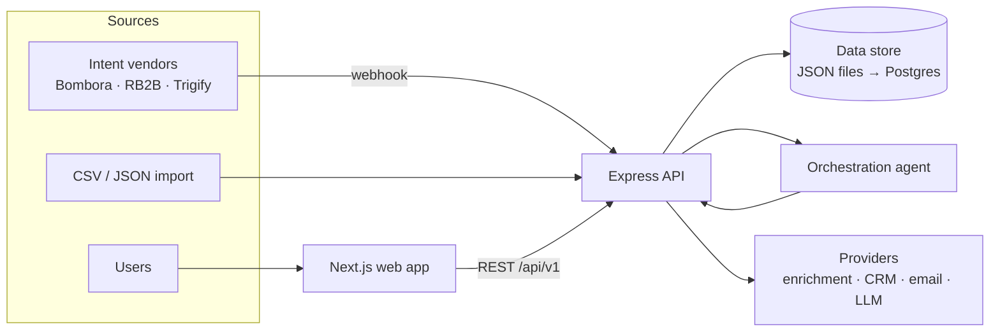

SellEasy turns **buying signals into pipeline**. It unifies intent, hiring, funding and website signals per account. It scores every account on **ICP fit + live intent**, and an **orchestration agent** routes accounts, drafts outreach, enrolls contacts in sequences and opens deals. People stay in the loop through an approval queue.

These docs have six sections:

<Cards>
  <Card title="Product" href="/docs/product">
    For product managers, GTM leaders and anyone who needs to understand **what** SellEasy does, **who** it is for, and **how** each feature behaves.
  </Card>
  <Card title="Product architecture" href="/docs/architecture">
    For stakeholders and engineering leads: the layers, capability maturity, data flows, integrations, environments (including the mock-data demo) and the target AWS platform.
  </Card>
  <Card title="MVP scope" href="/docs/mvp-scope">
    What the first customer-ready release includes and excludes, acceptance criteria, success metrics, launch checklist and risks.
  </Card>
  <Card title="Roadmap (3 months)" href="/docs/roadmap">
    The phased plan from today's build to GA and enterprise readiness: timeline, deliverables, exit criteria, dependencies and gates.
  </Card>
  <Card title="Team & cost" href="/docs/team-and-cost">
    Three-person team plan and the estimated budget in rupees — people, infrastructure, vendors and AI.
  </Card>
  <Card title="Engineering" href="/docs/engineering">
    For developers: architecture, data model, API reference, the backend and frontend codebases, configuration, testing and deployment.
  </Card>
</Cards>

## Quick links

<Cards>
  <Card title="Core concepts" href="/docs/product/core-concepts" description="Accounts, signals, fit, intent, tiers, playbooks — the vocabulary of the product." />
  <Card title="End-to-end user journeys" href="/docs/product/user-journeys" description="From a raw signal to a booked meeting and a won deal." />
  <Card title="Run it locally" href="/docs/engineering/getting-started" description="Install, bootstrap the database and start both servers in minutes." />
  <Card title="Architecture" href="/docs/engineering/architecture" description="Services, request flow and how the agent loop works." />
  <Card title="API reference" href="/docs/engineering/api" description="Every endpoint, grouped by service, with examples." />
  <Card title="Configuration" href="/docs/engineering/configuration" description="Every environment variable and what it switches on." />
  <Card title="Demo vs. live data" href="/docs/architecture/environments-and-data-modes" description="How the in-browser mock mode works and how to switch a demo to the real API." />
  <Card title="Headline budget" href="/docs/team-and-cost/total-budget" description="Three-month budget in ₹ for a team of three engineers." />
</Cards>

## The system at a glance

