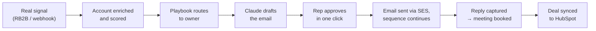

This tab defines the **minimum viable product (MVP)**: the first release that real customers use with their own data. It builds on what already exists. The workflow is built, and the MVP is mostly about **connecting it to the real world** (storage, hosting, vendors) and making it dependable enough for paying pilots.

<Callout type="info" title="Timing">
The MVP is delivered across [Phase 1](/docs/roadmap/phase-1-foundation) and [Phase 2](/docs/roadmap/phase-2-real-integrations) of the roadmap. Design partners start on a **pilot build** at the end of Phase 1 (early December 2026). The **MVP launch** — every must-have below done — is the exit of Phase 2 (early February 2027). General availability follows at the end of Phase 3.
</Callout>

## Target customer

| Attribute | MVP target |
|---|---|
| Company | B2B SaaS or tech-enabled services, **50–500 employees**, selling to other businesses |
| Revenue team | 3–15 SDRs / AEs, with a RevOps or sales-ops owner |
| Stack | **HubSpot** CRM; Google Workspace or Microsoft 365 mailboxes; already paying for, or willing to try, a website visitor-ID or intent tool (RB2B, Trigify, Bombora) |
| Motion | Outbound + signal-led prospecting into a defined ICP |
| Buyer | Head of Sales / CRO (economic buyer), RevOps (champion and admin) |
| Region | North America first (English content, US data-protection norms) |
| Out of profile for MVP | Salesforce-only orgs, enterprise SSO requirements, EU data residency, high-volume agencies |

Personas are described in [Personas](/docs/product/personas).

## Primary use case

> **When a target account shows buying intent, SellEasy gets the right rep a relevant, approved message within minutes, and tracks the result through to pipeline.**

## MVP goal statement

**With 5–8 design-partner teams using their own data for at least four weeks, SellEasy proves that it turns real buying signals into approved, sent outreach and booked meetings faster than the team's current process — and that reps trust the drafts enough to send most of them.**

The measurable targets are in [Success metrics](/docs/mvp-scope/success-metrics).

## Scope summary

| Area | In MVP | Real integration required before launch | Deferred |
|---|---|---|---|
| Accounts, contacts, import, dedup | ✅ | — | S3 bulk import, soft delete |
| Enrichment | ✅ | **One enrichment vendor** (Clearbit or Apollo) | Full multi-vendor waterfall |
| Signals | ✅ | **One intent source webhook** (RB2B) + generic webhook | Bombora, Trigify, scraping |
| ICP & scoring | ✅ | — | Multiple ICPs, LLM scoring |
| Orchestration agent | ✅ | **Claude drafting** | Multi-playbook, research agent |
| Approvals | ✅ | — | Wider auto-send guardrails |
| Sequences & sending | ✅ | **One sending provider** (SES) + step scheduler | Instantly / Mailpool, LinkedIn |
| Reply inbox | ✅ | Inbound reply capture for SES | AI auto-triage at scale |
| Pipeline & CRM | ✅ | **One CRM** (HubSpot, two-way for deals) | Salesforce, Attio |
| Analytics | ✅ | Instrumentation for MVP metrics | Warehouse, call intelligence |
| Platform | ✅ | PostgreSQL, AWS hosting, invite emails, backups, monitoring | SSO, audit log, billing, SOC 2 |

Full detail: [In scope](/docs/mvp-scope/in-scope) and [Out of scope](/docs/mvp-scope/out-of-scope).

## What "done" means

The MVP is done when **all** of the following are true:

1. Every **Must** item in [In scope](/docs/mvp-scope/in-scope) is shipped to production with its real integration.
2. Every criterion in [Acceptance criteria](/docs/mvp-scope/acceptance-criteria) passes in staging and is spot-checked in production.
3. The [Launch checklist](/docs/mvp-scope/launch-checklist) is complete and signed off by product, engineering and GTM.
4. At least **five design partners** have used production with real data for **two consecutive weeks** with no Sev-1 incident.
5. The [success metrics](/docs/mvp-scope/success-metrics) are instrumented and visible on an internal dashboard.
6. Known risks have owners and mitigations ([Risks & assumptions](/docs/mvp-scope/risks-and-assumptions)).

## In this tab

<Cards>
  <Card title="In scope" href="/docs/mvp-scope/in-scope" description="Must / Should / Could capabilities, user stories and required integrations." />
  <Card title="Out of scope" href="/docs/mvp-scope/out-of-scope" description="What is deliberately deferred and why." />
  <Card title="Acceptance criteria" href="/docs/mvp-scope/acceptance-criteria" description="Testable Given / When / Then criteria per capability." />
  <Card title="Success metrics" href="/docs/mvp-scope/success-metrics" description="Targets for activation, draft quality, replies, meetings and pipeline." />
  <Card title="Launch checklist" href="/docs/mvp-scope/launch-checklist" description="Product, engineering, security, data and GTM readiness." />
  <Card title="Risks & assumptions" href="/docs/mvp-scope/risks-and-assumptions" description="Risk register and the assumptions the MVP rests on." />
</Cards>
