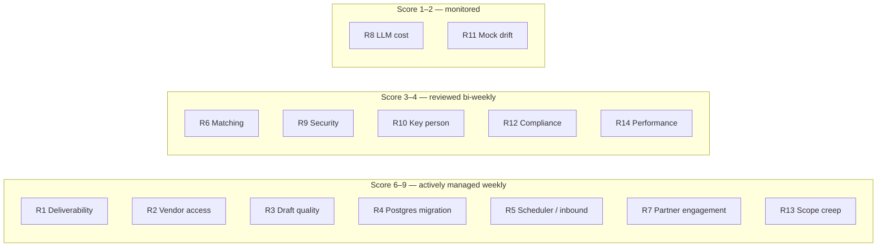

Review this page every two weeks across all three months. Roadmap-wide risks (team availability, vendor contracts, the compressed timeline) are in [Roadmap → Dependencies & risks](/docs/roadmap/dependencies-and-risks).

**Scales.** Likelihood and impact: **H** high · **M** medium · **L** low. Score = likelihood × impact (H = 3, M = 2, L = 1); 6–9 is red, 3–4 amber, 1–2 green.

## Risk register

| ID | Risk | L | I | Score | Mitigation | Owner |
|---|---|:-:|:-:|:-:|---|---|
| R1 | **Deliverability**: new sending domains or AI-written copy land in spam, so reply rates look like product failure | H | H | 🔴 9 | Dedicated, warmed sending domains per partner; conservative daily limits; SPF/DKIM/DMARC checks; seed-inbox testing; bounce and complaint alarms; approval on by default | Lead engineer + GTM |
| R2 | **Vendor access delays**: RB2B, enrichment or HubSpot app approval takes longer than planned | M | H | 🔴 6 | Start vendor conversations in week 1 of Month 1; build against sandboxes and recorded fixtures; generic webhook and CSV fallbacks ([In scope](/docs/mvp-scope/in-scope#integrations-required-before-launch)) | Integrations engineer |
| R3 | **Draft quality**: Claude drafts are generic or inaccurate, so reps reject them | M | H | 🔴 6 | Evaluation set before launch; signal-aware prompts; enrichment data in context; edit-rate tracking; weekly prompt reviews with partners | ML/LLM engineer |
| R4 | **Postgres migration** introduces data bugs (transactions, cascades) | M | H | 🔴 6 | Run full API suite on Postgres; migration dry runs with record-count checks; staging soak for two weeks; keep JSON only for dev | Backend engineer |
| R5 | **Scheduler and inbound capture** are more complex than estimated (time zones, threading, bounces) | H | M | 🔴 6 | Start in week 5 (first week of Month 2); narrow MVP to SES only; property-based tests for send windows; out-of-office handling as a Should | Backend engineer |
| R6 | **Signal-to-account matching** is poor (visitor domains don't match imported accounts) | M | M | 🟠 4 | Domain normalisation (already built); configurable "create account on unknown domain"; match-rate reporting | Integrations engineer |
| R7 | **Design-partner engagement** drops after kickoff | M | H | 🔴 6 | Signed success criteria; weekly check-ins; named champion; fast bug turnaround; in-app review-queue reminders | PM / GTM |
| R8 | **LLM cost** exceeds budget as partners scale usage | L | M | 🟢 2 | Per-workspace token budgets (setting exists); fast model for high-volume tasks; prompt caching; cost per approved draft on the dashboard | ML/LLM engineer |
| R9 | **Security incident** (credential leak, tenant data exposure) | L | H | 🟠 3 | Secrets Manager, tenant-isolation tests, pen test, WAF, least-privilege IAM, audit of admin actions in logs | Lead engineer |
| R10 | **Small team, key-person dependency** on the lead engineer | M | M | 🟠 4 | Pairing, ADRs, runbooks, hire the second backend engineer by month 2 | Founders |
| R11 | **Mock demo drifts** from the real product and confuses prospects | L | L | 🟢 1 | `npm run mock:check` in CI; separate demo deployment | Frontend engineer |
| R12 | **Compliance**: email or privacy complaints (CAN-SPAM, GDPR for EU contacts) | L | H | 🟠 3 | Unsubscribe and suppression; footer requirements; exclude EU contacts by default in MVP; DPA with partners | PM |
| R13 | **Scope creep** from partner requests (Salesforce, LinkedIn, SSO) | H | M | 🔴 6 | Scope change rule (below); keep a visible "later" list | PM |
| R14 | **Performance** at partner data volumes (dashboards computed per request) | M | M | 🟠 4 | Load test at 10×; SQL aggregates on Postgres; Redis as a Should | Backend engineer |

## Assumptions

| ID | Assumption | How we validate it | If wrong |
|---|---|---|---|
| A1 | Target customers use **HubSpot** as their CRM | Qualify design partners on CRM | Salesforce does not fit three months — it moves to the [post-launch backlog](/docs/roadmap/beyond-the-mvp) and the ICP is re-qualified |
| A2 | Partners already have, or will buy, an intent or visitor-ID tool (RB2B at minimum) | Pilot agreement lists vendor prerequisites | Rely on the generic webhook plus job-change or hiring signals from enrichment |
| A3 | Partners **bring their own vendor keys**; SellEasy pays only for LLM and SES | Pricing conversations | Add vendor pass-through costs to [budget](/docs/team-and-cost/vendor-and-ai-cost) |
| A4 | Human approval is acceptable and even preferred | Review-speed and approval-rate metrics | Invest earlier in auto-send guardrails |
| A5 | SES is enough for pilot sending volumes (≤ ~20k emails per month in total) | SES limits and deliverability tests | Pull Instantly or Mailpool forward from the [post-launch backlog](/docs/roadmap/beyond-the-mvp) |
| A6 | Claude (`claude-opus-5`) produces send-worthy drafts at ≤ $0.10 per approved draft | Offline evals and live cost logging | Use `claude-sonnet-5` or `claude-haiku-4-5` for some tasks; refine prompts |
| A7 | Existing product logic (scoring, agent, dedup) is correct at real data volumes | Staging soak with partner-sized data | ~20% of [Month 3](/docs/roadmap/month-3-launch) is already reserved for burn-down |
| A8 | All three engineers in [Team plan](/docs/team-and-cost/team-plan) are in seat on **5 October 2026** | Offers signed before the end of September | There is no slack to absorb a late start: descope Should items and cut in the order named on each month page |
| A9 | 2–3 design partners can be signed during Month 1 and go live on their own data from 16 November | Founder pipeline | Use internal dogfooding on the founder's own outbound as the pilot data source |
| A10 | North-America-only data is acceptable for the MVP | Partner qualification | Add EU region work (not in this plan) |
| A11 | The modular monolith scales to GA volumes | Load tests | Extract signal ingestion earlier |

## Scope change rule

Any request to add scope to the MVP after work starts on 5 October 2026 must:

1. Be written down with the requesting partner(s) and the problem it solves.
2. Be sized by engineering (S / M / L).
3. **Replace** an item of equal or larger size from the Should or Could lists, or move the MVP date, decided by the PM and lead engineer together.
4. Be recorded in the release notes.

Security fixes and launch-blocking bugs are exempt.
