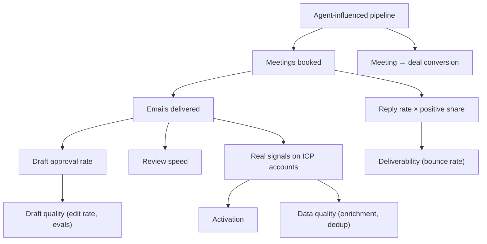

These metrics judge the MVP against its [goal statement](/docs/mvp-scope#mvp-goal-statement). Targets are **starting hypotheses** for 5–8 design partners over the first 4–8 weeks of real use; revisit them after the first two weeks of data. Product-wide metric definitions live in [Product → Metrics](/docs/product/metrics).

## Scorecard

| # | Metric | Definition | MVP target | Minimum to continue | Source |
|---|---|---|---|---|---|
| 1 | **Activation rate** | Workspaces that, within 7 days of kickoff, have imported accounts **and** connected ≥ 1 signal source **and** enabled ≥ 1 playbook **and** have ≥ 1 active sequence | ≥ 80% of design partners | ≥ 60% | Product events |
| 2 | **Time to first real signal** | Kickoff → first non-simulated signal stored | Median ≤ 1 business day | ≤ 3 days | `signals` + events |
| 3 | **Time to first approved draft** | First real signal → first approved agent draft | Median ≤ 1 day | ≤ 3 days | `drafts` |
| 4 | **Signal-to-draft latency** | Signal stored → draft ready (p95) | ≤ 2 minutes | ≤ 10 minutes | Agent runs |
| 5 | **Draft approval rate** | Sent ÷ (sent + rejected) | ≥ 70% | ≥ 50% | `drafts` |
| 6 | **Edit rate** | Approved with edits ÷ approved | ≤ 50% (falling week on week) | ≤ 70% | Events |
| 7 | **Review speed** | Pending drafts reviewed within 24 hours | ≥ 80% | ≥ 60% | `drafts` |
| 8 | **Reply rate** | Replies ÷ delivered emails, on agent-drafted sequences | ≥ 5% | ≥ 3% | Outreach events |
| 9 | **Positive reply share** | Positive ÷ all replies | ≥ 30% | ≥ 20% | Inbox sentiment |
| 10 | **Meetings booked** | Meetings from SellEasy-sourced conversations per workspace per month | ≥ 4 | ≥ 2 | Book-meeting events, HubSpot |
| 11 | **Pipeline influenced** | Σ deal amount where an agent run on the account preceded deal creation (per workspace, per month) | ≥ 3× the workspace's monthly subscription price | ≥ 1× | Runs ⨝ deals |
| 12 | **Weekly active users** | Users with ≥ 3 active days per week ÷ seats | ≥ 60% | ≥ 40% | Events |
| 13 | **Bounce rate** | Hard bounces ÷ sent, per mailbox | ≤ 2% | ≤ 3% | SES events |
| 14 | **Data quality** | Accounts enriched with core firmographics ÷ accounts; contacts with verified email ÷ contacts targeted | ≥ 70% · ≥ 80% | ≥ 50% · ≥ 60% | Accounts, contacts |
| 15 | **Duplicate rate after import** | Flagged duplicates ÷ imported accounts, two weeks after import | ≤ 2% | ≤ 5% | Accounts |
| 16 | **Reliability** | Uptime of API (monthly) · failed agent runs ÷ runs | ≥ 99.5% · ≤ 2% | ≥ 99% · ≤ 5% | Monitoring, runs |
| 17 | **Design partner intent to pay** | Partners who agree to a paid plan at the end of the pilot | ≥ 50% | ≥ 30% | Sales |

<Callout type="success" title="North star">
**Agent-influenced pipeline created per week** remains the product's north star ([Metrics](/docs/product/metrics#north-star-metric)). For the MVP it is tracked per design partner (metric 11) because absolute totals are small.
</Callout>

## Metric tree

## Guardrails

These must not get worse while chasing the targets:

| Guardrail | Threshold | Action if breached |
|---|---|---|
| Spam complaint rate (SES) | ≤ 0.1% | Pause affected mailbox; review content |
| Negative-sentiment reply share | ≤ 25% | Review prompts and playbook targeting |
| Auto-send playbooks | ≤ 20% of enabled playbooks | Require approval for new playbooks |
| LLM cost per approved draft | ≤ $0.10 (see [cost model](/docs/team-and-cost/vendor-and-ai-cost)) | Switch model per task, tighten prompts, use caching |
| Support tickets per workspace per week | ≤ 3 | Triage root causes before adding partners |

## Instrumentation

Most metrics can be computed from existing collections once they hold real data (`signals`, `agent_runs`, `drafts`, `enrollments`, `inbox_messages`, `deals`). The following **new events** are required, sent to a product analytics tool (for example PostHog or Amplitude) and stored in Postgres for joins:

| Event | Key properties | Emitted by |
|---|---|---|
| `workspace.activated` | criteria met, days since kickoff | Scheduled job |
| `import.completed` | kind, rows, created, updated, skipped, errors | Import service |
| `integration.connected` / `integration.error` | vendor, category | Integrations service |
| `signal.ingested` | type, source, vendor event id, matched account (bool) | Signal ingestion |
| `agent.run.completed` | status, playbook id, duration ms, steps | Agent |
| `llm.call` | task (draft, reply, sentiment), model, input tokens, output tokens, cached tokens, latency, cost estimate | LLM adapter |
| `draft.reviewed` | outcome (approved, approved_edited, rejected, regenerated), time to review | Agent |
| `email.sent` / `email.delivered` / `email.bounced` / `email.complained` | mailbox, sequence, step | Email adapter, SES events |
| `email.replied` | sentiment, sequence, step | Inbound capture |
| `meeting.booked` | source (inbox, manual), deal id | Outreach |
| `crm.synced` | direction, object, conflict (bool) | CRM sync worker |
| `session.active` | user, role | Web app |

**Notes**

- Every event carries `orgId`, `userId` (if any) and an ISO timestamp. Never include email bodies or personal data beyond ids.
- Mark design-partner workspaces with a `cohort` property so internal and demo workspaces are excluded.
- Mock mode must not send analytics events, or demo traffic will pollute the numbers.
- Review the scorecard weekly with each design partner; adjust targets only with a written rationale.

## Related

- [Acceptance criteria → M12](/docs/mvp-scope/acceptance-criteria#m12--analytics-and-instrumentation)
- [Analytics (feature)](/docs/product/features/analytics)
- [Roadmap → KPIs per phase](/docs/roadmap)
