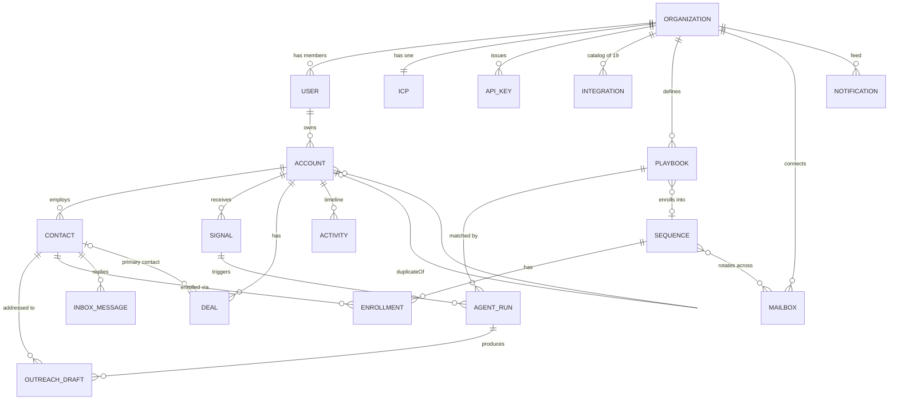

This page defines the vocabulary of SellEasy. Read it before the feature guide. Every term here matches a field or rule in the API. The numbers are the real defaults from `backend/src/domain/constants.ts` and the scoring engine (`backend/src/modules/scoring/engine.ts`). For database-level definitions, see the [data model](/docs/engineering/data-model).

## How the concepts relate



## Workspace & people

### Organization (workspace)

An **organization** is a tenant. Every record belongs to exactly one organization, and every API query is limited to the caller's organization. An organization has:

- `name`, `domain`, `timezone` (default `America/New_York`)
- `plan`: `starter` (3 seats), `growth` (10 seats, the default at sign-up) or `enterprise` (50 seats)
- `settings.autopilot`: whether the agent processes signals as they arrive. Default **on**.
- `settings.waterfallOrder`: the enrichment provider order. Default `clearbit → apollo → fullenrich → prospeo → limadata`.

A new organization starts with an owner user, the default ICP and a disconnected catalog of 19 integrations.

### User & roles

A **user** belongs to one organization, has a `status` of `active` or `invited`, and has one **role**:

| Role | Summary |
|---|---|
| `owner` | Full access, including plan changes and workspace reset. Exactly one per workspace, and the role can't be transferred. |
| `admin` | Manages the team, API keys, integrations, ICP, playbooks and mailboxes. |
| `member` | Works the data: accounts, contacts, signals, sequences, drafts and deals. |
| `viewer` | Read-only. |

Seats count **every** user, including those with pending invites. See [Roles & permissions](/docs/product/roles-and-permissions).

### API key

An **API key** (`se_live_…`) lets outside systems call SellEasy. The secret is shown once and stored as a hash. Each key has **scopes** (`accounts:read`, `accounts:write`, `signals:write`, `outreach:read`, `outreach:write`, `pipeline:read`, `pipeline:write`). Today only the signals webhook accepts API keys, and it requires `signals:write`.

## Accounts & contacts

### Account

An **account** is a company. Key fields:

| Field | Notes |
|---|---|
| `name`, `domain` | The domain is normalized: lower-cased, with protocol, `www.` and any path removed. It must contain a dot. |
| `industry`, `employees`, `revenue`, `country`, `city`, `technologies[]`, `fundingStage` | **Firmographics.** Changing any of the six listed below the table triggers a re-score. |
| `ownerId` | The owning user, or unassigned. |
| `stage` | The lifecycle stage (see below). |
| `fitScore`, `intentScore`, `score`, `tier` | Stored scoring outputs. |
| `scoreHistory[]` | The last 20 scoring events, each with fit, intent, score and a reason. |
| `versions[]` | Field-level change history (see *Entity versions*). |
| `enrichedAt`, `enrichmentSources[]` | When and by which providers the account was enriched. |
| `tags[]`, `description`, `linkedinUrl` | Free-form context. |
| `duplicateOf` | Set when the account is flagged as a possible duplicate of another account. |

The fields that trigger a re-score are **industry, employees, revenue, country, technologies and fundingStage**. If an account is created without `revenue`, the API estimates it as `employees × $120,000`.

### Account stages

| Stage | Set by |
|---|---|
| `new` | Default on creation |
| `researching` | Manual |
| `engaged` | Manual |
| `opportunity` | Automatically when a deal is created on an account in `new`, `researching` or `engaged`. Can also be set manually. |
| `customer` | Automatically when a deal moves to **Closed won**. Can also be set manually. |
| `disqualified` | Manual |

### Contact

A **contact** is a person at an account. It has a name, title, department, email, phone, LinkedIn URL and location, plus:

- `seniority`: `C-Level`, `VP`, `Director`, `Manager` or `IC`. The agent uses this order to pick the "most senior reachable contact".
- `emailStatus`: `verified`, `unverified`, `invalid` or `missing`. A new or changed email is set to `unverified`, and an empty email to `missing`.
- `status`: `new`, `in_sequence`, `replied`, `meeting`, `unsubscribed` or `bounced`.
- `ownerId`: copied from the account on creation. It is updated when the account is reassigned through the owner selector, bulk assign or agent routing. An import that changes the account owner does not update it.

Emails are lower-cased and must be unique within a workspace.

### Duplicates

When an account is created manually or through the API, SellEasy checks whether a non-duplicate account already has the same normalized domain. If one does, the new account is still created but flagged with `duplicateOf`. Flagged accounts appear in **Accounts → Duplicates**. A reviewer can then:

- **Merge** the duplicate into the canonical record. Contacts, signals, deals, activities, drafts and agent runs move to the canonical account. Tags and technologies are combined. The canonical owner is kept, or the duplicate's owner is used if the canonical account has none. The duplicate is deleted and the canonical account is re-scored.
- **Dismiss** the flag ("Not a duplicate").

Account import handles an existing domain differently: the row is **skipped**, or **updated** if you choose that option. It does not create a flagged duplicate.

### Entity versions

Every change to an account adds a **version** that lists each changed field with its `from` and `to` values and a `source`. Example sources are `Manual edit`, `CSV import`, `Waterfall enrichment (Clearbit → Apollo.io)`, `Agent routing` and `Deal closed won`. Scoring fields and timestamps are not versioned. Version 1 is always `record: — → created`. The versions appear in the **History** tab of the account page.

## Signals

A **signal** is evidence of buying intent for one account, optionally tied to one contact. It has a `type`, `source`, `title`, `detail`, `strength` (0–100), `occurredAt` and a `processed` flag.

| Type | Label | Default sources | Default weight |
|---|---|---|---|
| `intent_topic` | Intent topic | Bombora | 70 |
| `website_visit` | Website visit | RB2B | **90** |
| `hiring` | Hiring | Apify, Linkup | 60 |
| `funding` | Funding | Linkup, Apollo.io | 75 |
| `job_change` | Job change | Trigify.io, Apollo.io | 80 |
| `tech_install` | Tech install | Clearbit, Apify | 45 |
| `social_engagement` | Social engagement | Trigify.io | 35 |
| `news` | News | Linkup | 30 |

If no `source` is sent, the first default source for the type is used. Signals arrive through the UI, the API-key webhook or the simulator. See [Signals](/docs/product/features/signals).

## Scoring

### ICP (ideal customer profile)

Each organization has **one ICP configuration**:

| Setting | Default |
|---|---|
| Industries | SaaS, Fintech, Cybersecurity, E-commerce |
| Countries | United States, United Kingdom, Canada, Germany |
| Employee range | 50 – 2,000 |
| Minimum revenue | $5,000,000 |
| Technologies | Salesforce, HubSpot, Snowflake, Segment, Outreach |
| Funding stages | Series A, Series B, Series C, Series D+ |
| Fit weight | 55 (so intent weight is 45) |
| Signal weights | See the table above |
| Intent half-life | 14 days |
| Tier thresholds | A ≥ 70, B ≥ 52, C ≥ 35 |

### Fit score (0–100)

Fit measures how closely an account matches the ICP. There are six criteria:

| Criterion | Max points | Rule |
|---|---:|---|
| Industry | 25 | 25 if the industry is in the ICP list, otherwise 0 |
| Company size | 20 | 20 if employees are within `[min, max]`. **8 (partial)** if outside but within `[0.5 × min, 1.5 × max]`. Otherwise 0. |
| Geography | 15 | 15 if the country is in the ICP list |
| Revenue | 15 | 15 if revenue ≥ the minimum |
| Tech stack | 15 | 5 per matching technology, capped at 15 (3 matches) |
| Funding stage | 10 | 10 if the funding stage is in the ICP list |

`fit = min(100, sum of points)`

### Intent score (0–100)

Intent is the weighted, time-decayed sum of **all** of the account's signals:

```text
for each signal:
  ageDays = (now − occurredAt) / 1 day
  if ageDays > 3 × halfLife → ignore
  decay   = 0.5 ^ (ageDays / halfLife)
  weight  = signalWeights[type] / 100        (50 if missing)
  points  = strength × weight × decay × 0.45

intent = round( min(100, Σ points) )
```

A signal loses half its value every **half-life** (14 days by default) and is ignored completely after **three half-lives** (42 days). The 0.45 factor scales the sum so that two or three strong recent signals reach the top of the range. Intent is recalculated at the moment of scoring, so an account's intent falls over time only when it is re-scored.

### Combined score & tier

```text
score = round( fit × fitWeight/100 + intent × (1 − fitWeight/100) )

tier  = A if score ≥ A threshold (70)
        B if score ≥ B threshold (52)
        C if score ≥ C threshold (35)
        D otherwise
```

Thresholds must satisfy A > B > C. The tier is what playbooks match on.

### When re-scoring happens

- When an account is created (history reason "Initial score").
- When any of the six firmographic fields changes: manual edit, enrichment, import update or merge.
- When the agent processes a signal. This is always the first step, with reason `Signal: <title>`.
- On **Re-score** (one account or in bulk).
- When the ICP is saved. **Every** account is re-scored with reason "ICP configuration updated".
- After an import that created at least one account. All accounts are re-scored with reason "Import".

When a score changes, a `score_change` activity is logged (`Score 41 → 58 (Tier B)`).

### Worked example (default ICP)

Take **Northwind Pay**: Fintech, 40 employees, United States, $4.8M revenue, technologies Salesforce, AWS and Stripe, funding stage Seed.

<Steps>
<Step>

**Fit**

| Criterion | Match? | Points |
|---|---|---:|
| Industry: Fintech | ✔ in list | 25 |
| Size: 40 | ✘ below 50, but ≥ 25 (0.5 × 50) → partial | 8 |
| Geography: United States | ✔ | 15 |
| Revenue: $4.8M | ✘ below $5M | 0 |
| Tech: Salesforce (AWS and Stripe not in ICP) | 1 match × 5 | 5 |
| Funding: Seed | ✘ | 0 |
| **Fit** | | **53** |

</Step>
<Step>

**Intent.** The account has four signals:

| Signal | Strength | Weight | Age | Decay | Points |
|---|---:|---:|---:|---:|---:|
| Website visit (pricing page) | 80 | 0.90 | 0 d | 1.000 | 32.4 |
| Funding (raised Seed extension) | 90 | 0.75 | 14 d | 0.500 | 15.2 |
| Intent topic surge | 70 | 0.70 | 7 d | 0.707 | 15.6 |
| News | 60 | 0.30 | 45 d | ignored (more than 42 d) | 0 |
| **Intent** | | | | | **63** |

</Step>
<Step>

**Combined score.** `53 × 0.55 + 63 × 0.45 = 29.15 + 28.35 = 57.5` → rounds to **58** → **Tier B** (at least 52, below 70).

</Step>
<Step>

**Decay in action.** If no new signals arrive, a re-score 14 days later gives: website visit 16.2 + funding 7.6 + intent topic 7.8 = intent **32**. The score becomes `53 × 0.55 + 32 × 0.45 ≈ 44` → **Tier C**. A playbook limited to Tiers A/B would no longer match this account.

</Step>
</Steps>

## Orchestration

### Autopilot

An organization-wide switch. When it is **on**, every ingested signal is processed by the agent right away. When it is **off**, signals are stored as *unprocessed* until someone clicks **Process** or **Process N pending**.

### Playbook

A **playbook** is a rule that tells the agent what to do:

| Field | Meaning |
|---|---|
| `trigger` | A signal type, or `any` |
| `minScore` | The account's score **after re-scoring** must be at least this value (0–100) |
| `tiers[]` | The account's tier must be one of these (at least one required) |
| `actions[]` | Any of `rescore`, `route_owner`, `enrich`, `draft_outreach`, `enroll_sequence`, `create_deal`, `notify`. `rescore` is always included. |
| `sequenceId` | Used by `enroll_sequence` (required for that action) and by approved drafts |
| `requireApproval` | Default **true**. Drafts wait for review instead of being sent automatically. |
| `enabled` | Disabled playbooks are ignored |
| `runs` | Counts how many times the playbook matched |

**Matching:** enabled playbooks whose trigger is the signal type or `any` are checked **in creation order**. The **first** one whose `minScore` and `tiers` both match wins. Only one playbook runs per signal.

### Agent run & steps

An **agent run** records one evaluation of one signal. It includes the trigger (`<source>: <title>`), the matched playbook, the score before and after, the duration and a list of **steps**. Each step has a status of `done`, `skipped`, `pending` or `failed`, plus a detail message.

| Run status | Meaning |
|---|---|
| `completed` | A playbook matched and every action finished (or was skipped harmlessly) |
| `awaiting_approval` | A playbook matched and produced a draft that waits for review |
| `failed` | An action failed, for example `enroll_sequence` with no sequence or contact, or an unexpected error |
| `skipped` | No playbook matched |

### Outreach draft & approval

A **draft** is a message the agent wrote for the account's most senior reachable contact. It has a channel (`linkedin` for job-change signals, otherwise `email`), a subject, a body, a **rationale** and a status:

- `pending`: waiting in **Agent → Approvals**. Reviewers can edit, **Regenerate**, **Approve & send** or **Reject**.
- `sent`: approved and sent, or created by a playbook with approval turned off.
- `rejected`: discarded. The run step is marked skipped and the run completes.
- `approved` exists in the data model but is not used today, because approval sends the message immediately.

## Outreach

### Sequence, steps & enrollment

A **sequence** is a multi-step cadence with a `status` of `draft`, `active` or `paused`, an owner, sending mailboxes, sending-window settings and lifetime `stats` (enrolled, sent, opened, replied, meetings, bounced). A **step** has a channel (`email`, `linkedin_connect`, `linkedin_message`, `call`, `wait`) and a **day offset**. Email steps have a subject and body, and LinkedIn message and call steps have a body.

An **enrollment** links a contact to a sequence and has a `currentStep`, a `status` (`active`, `paused`, `completed`, `replied`, `bounced`, `unsubscribed`), `enrolledAt` and `nextStepAt`. A contact is **eligible** unless it is `unsubscribed` or `bounced`, has an `invalid` email, or is already *actively* enrolled in the same sequence.

<Callout type="warn">Sequences do not send on a schedule yet. Enrolling a contact records the enrollment, but steps don't advance on their own. See [Outreach](/docs/product/features/outreach).</Callout>

### Mailbox

A sending inbox (`SES`, `Google`, `Microsoft` or `Mailpool`) with a daily limit, a sent-today count, a warm-up flag, a health score (0–100) and a status (`healthy`, `warning`, `paused`). Sequences rotate across the mailboxes selected for them.

### Inbox message & sentiment

An **inbox message** is a prospect reply tied to a contact and optionally a sequence. It holds a thread of `us`/`them` messages, a channel (`email`/`linkedin`), read and archived flags, and a **sentiment**: `positive`, `neutral`, `negative` or `ooo` (out of office). Users can change the sentiment manually. **Book meeting** always sets it to positive.

## Pipeline

### Deal, stages & probabilities

A **deal** is an opportunity on an account. It has an amount, stage, probability, close date, owner, optional primary contact, `source` (for example `Manual`, `Sequence reply`, `Agent: website visit`), notes and CRM sync fields (`crmId`, `syncedAt`).

| Stage | Default probability |
|---|---:|
| Discovery | 10% |
| Qualified | 25% |
| Demo | 40% |
| Proposal | 60% |
| Negotiation | 80% |
| Closed won | 100% |
| Closed lost | 0% |

Moving a deal resets its probability to the stage default. A closed stage also sets the close date to now. You can override the probability by editing the deal. Any change clears `syncedAt`, which marks the deal for the next CRM sync. A deal is **agent-sourced** when its `source` starts with `Agent`.

## Everything else

### Activity

An **activity** is a timeline entry linked to an account, contact and/or deal. Types: `note`, `email`, `call`, `meeting`, `stage_change`, `enrichment`, `score_change`, `agent`, `signal`. The actor is a user, `agent` or `system`. Users can log notes, calls, meetings and emails by hand. The system logs everything else.

### Notification

An **in-app notification** in the header bell. The feed is **shared by the whole workspace** and keeps the latest 200. Today notifications are created by the agent's **Notify owner** action and when a deal is **won**. Each has a `kind` (`signal`, `agent`, `reply`, `deal`, `system`) and an optional link.

### Integration

An entry in the vendor catalog: a key, category, the service it **feeds**, connection status (`ok`, `error`, `syncing`, `disconnected`), a masked API key, usage and settings. See [Integrations](/docs/product/features/integrations).

### Enrichment waterfall

The ordered list of connected **enrichment** and **contacts** vendors that have "Use in waterfall" turned on. Enrichment is meant to try provider 1 first and fall through to the next on a miss. The current mock adapter does not do this: it reports the first two providers as its sources.

## Related

- [Glossary](/docs/product/glossary): a short definition of every term.
- [Scoring engine (engineering)](/docs/engineering/backend/scoring-engine)
- [Orchestration agent (engineering)](/docs/engineering/backend/orchestration-agent)
