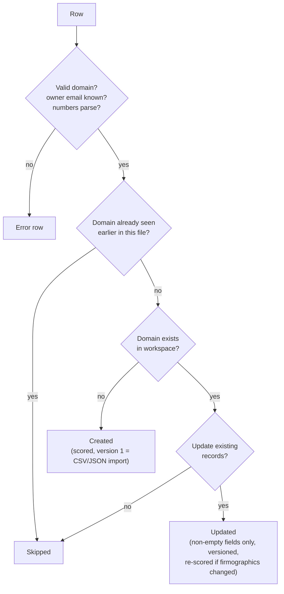

Data import is the fastest way to fill a new workspace or refresh it from a CRM or spreadsheet export. It is available as an **Import** button on both the [Accounts](/docs/product/features/accounts) and [Contacts](/docs/product/features/contacts) screens (also via `/accounts?import=1`). Every row is validated and normalized, de-duplicated, then created or updated. The result screen lists row-level errors.

**Who uses it:** RevOps, and any member who needs to load a list.

## How to import

<Steps>
<Step>Open **Accounts → Import** or **Contacts → Import**.</Step>
<Step>Optional: click **Download template** to get a CSV with the canonical headers and one example row.</Step>
<Step>Choose or drag in a **.csv** or **.json** file (**5 MB maximum**). The dialog detects the format and shows the number of rows it found. The file is treated as JSON if its name ends in `.json`, or if it isn't a `.csv` file and its content starts with `[` or `{`.</Step>
<Step>

Choose your options:

- **Update existing records.** Rows that match an existing record overwrite its fields. Without this option, those rows are skipped.
- **Validate only (dry run).** Every row is checked and the result shows what *would* happen. Nothing is saved.

</Step>
<Step>Click **Validate** (dry run) or **Import N rows**.</Step>
<Step>Review the result: **Created**, **Updated**, **Skipped**, **Errors**, and for contacts the number of accounts that were (or would be) created. After a dry run, click **Run import** to apply it. **Import another file** starts over.</Step>
</Steps>

<Callout type="info">
Rows are processed one by one and errors don't stop the import. Valid rows are saved even when other rows fail. Fix the failing rows and re-import the file: rows that were already imported are **skipped**, or **updated** if you turn on *Update existing records*.
</Callout>

## File format rules

- **Header matching** ignores case and all non-alphanumeric characters. `Company Name`, `company_name` and `COMPANY-NAME` all match `companyname`.
- **Unknown columns** are ignored.
- If two columns map to the same field, the first **non-empty** value wins.
- **CSV:** the first row is the header. A UTF-8 BOM is handled. Blank lines are skipped. Rows can have more or fewer columns than the header. Values are trimmed. An empty file is rejected with *"CSV is empty"*.
- **JSON:** the file must be an **array of objects**. Array values are joined with `, `. An element that isn't an object gives the row error *"Row must be an object"*. Invalid JSON, or JSON that isn't an array, rejects the whole request.
- **Empty values** are ignored: they never overwrite existing data.
- **List fields** (technologies, tags) are split on `,`, `;` or `|`.
- **Number fields** (employees, revenue) accept `1,200`, `$5M`, `12.5k`, `2 billion`, `50-200` (the lower bound is used) and `1000+`. The symbols `$`, `€` and `£`, commas and spaces are removed. Accepted suffixes: `k`/`thousand`, `m`/`mm`/`million`, `b`/`bn`/`billion`. Anything else gives the error *"employees must be a number (got "…")"*.
- **Row numbers** in the error report are **spreadsheet line numbers** for CSV (the header is line 1) and **1-based array positions** for JSON.

## Accounts

### Columns

| Field | Required | Accepted headers (aliases) | Notes |
|---|:-:|---|---|
| `domain` | ✔ | domain, website, url, website url, company domain, company website | Normalized (lower-case; protocol, `www.` and path removed) and must look like `example.com` |
| `name` | | name, company, company name, account name, organization, organisation | If empty, the domain is used as the name |
| `industry` | | industry | Free text. The ICP matches exact names such as `SaaS`. |
| `employees` | | employees, employee count, headcount, number of employees, company size, size | Number |
| `revenue` | | revenue, annual revenue | Number (USD). If missing on a **new** account, estimated as `employees × 120,000` |
| `country` | | country | Use full names (for example `United States`) to match the ICP |
| `city` | | city, location | |
| `fundingStage` | | funding stage, funding | For example `Series B` |
| `description` | | description | |
| `linkedinUrl` | | linkedin url, linkedin, company linkedin url | |
| `technologies` | | technologies, tech, tech stack, technology | List |
| `tags` | | tags, tag | List |
| `ownerEmail` | | owner email, owner | Must match a team member's email, otherwise the row errors |

### De-duplication and updates



- Matching uses the **normalized domain**. If both a canonical account and a flagged duplicate share the domain, the canonical account is used.
- On update, the name is only changed when the file has a non-empty name.
- Changes are versioned with the source **CSV import** or **JSON import**.
- If at least one account was created, **every account in the workspace is re-scored** afterwards (history reason "Import").

### Account row errors

| Message | Cause |
|---|---|
| `domain is required` | No domain (or alias) value |
| `Invalid domain "…"` | The normalized domain doesn't match `name.tld` |
| `employees must be a number (got "…")` | The value can't be parsed (the same applies to revenue) |
| `No team member with email …` | `ownerEmail` doesn't match any user in the workspace |
| `Row must be an object` | A JSON array element isn't an object |

## Contacts

### Columns

| Field | Required | Accepted headers (aliases) | Notes |
|---|:-:|---|---|
| `firstName` | ✔* | first name, first, given name | *Or supply a full name |
| `lastName` | | last name, last, surname, family name | |
| full name | | name, contact name | Split on whitespace: the first word becomes the first name and the rest the last name (unless a last name is given) |
| `email` | | email, email address, work email | Lower-cased and must be a valid address. This is the de-duplication key. |
| `title` | | title, job title, position | Used to infer seniority |
| `seniority` | | seniority, level | See the mapping below |
| `department` | | department | |
| `phone` | | phone, phone number, mobile | |
| `linkedinUrl` | | linkedin url, linkedin, linkedin profile | |
| `location` | | location, city | If empty, copied from the account |
| `accountId` | one of | account id, account | Must be an existing account ID |
| `accountDomain` | one of | account domain, domain, company domain, website, company website | Links to an existing account, or **creates** one |
| `accountName` | one of | account name, company, company name, organization | Exact match on an existing account name (case-insensitive) |

### How the account is resolved

The first column that has a value is used:

1. **accountId**: must exist, otherwise *"Account … not found"*.
2. **accountDomain**: normalized and validated. If an account has that domain, the contact is linked to it (canonical preferred). **If not, a new account is created** (named after `accountName` if given, otherwise the domain) and counted in *accounts created*.
3. **accountName**: must match an existing account, otherwise *"Account "X" not found — add an account domain column to create it"*.
4. None of these → *"An account is required (accountId, accountDomain or accountName)"*.

### Seniority

If `seniority` is **blank**, it is inferred from the title:

| Title contains | Seniority |
|---|---|
| chief, CEO, CTO, CFO, COO, CMO, CRO, CIO, CISO, CPO, founder, co-founder, president, owner (but not "vice president") | C-Level |
| VP, SVP, EVP, vice president, head of | VP |
| director | Director |
| manager, lead, supervisor | Manager |
| anything else | IC |

If `seniority` is **given**, it must be one of these values (ignoring case and punctuation):

| Value | Maps to |
|---|---|
| c-level, c-suite, cxo, executive, founder, owner | C-Level |
| vp, vice president, svp, evp, head | VP |
| director | Director |
| manager, lead | Manager |
| ic, individual contributor, entry, senior, staff | IC |

Any other value gives the error *"Unknown seniority "…" (use C-Level, VP, Director, Manager or IC)"*.

### De-duplication and updates

- The match key is the **email address**. A repeated email later in the same file is **skipped**. A row whose email already exists in the workspace is **skipped**, or **updated** when *Update existing records* is on.
- An update applies the non-empty detail fields (title, department, phone, LinkedIn, location), the first name, the last name (if given), the seniority (if a seniority or title is given) and, if an account column is present, **moves the contact** to the resolved account.
- **Contacts without an email are never de-duplicated.** Every such row creates a new contact.
- New contacts start with status **new** and email status **unverified**, or **missing** without an email. Their owner is copied from the account.
- If any account was created, all accounts are re-scored afterwards.

### Contact row errors

| Message | Cause |
|---|---|
| `firstName (or name) is required` | No first name or full name |
| `Invalid email "…"` | The email isn't a valid address |
| `Unknown seniority "…"` | See the seniority table above |
| `Invalid account domain "…"` | The account domain doesn't look like `name.tld` |
| `Account … not found` / `Account "X" not found — add an account domain column to create it` | The account couldn't be resolved |
| `An account is required (accountId, accountDomain or accountName)` | No account column has a value |

## Templates

| Template | Headers |
|---|---|
| `accounts-import-template.csv` | name, domain, industry, employees, revenue, country, city, fundingStage, description, linkedinUrl, technologies, tags, ownerEmail |
| `contacts-import-template.csv` | firstName, lastName, email, title, seniority, department, phone, linkedinUrl, location, accountDomain, accountName |

Example JSON for contacts:

```json
[
  { "name": "Jane Doe", "work email": "jane.doe@acme.com", "job title": "VP of Sales", "company domain": "acme.com" },
  { "firstName": "Raj", "lastName": "Patel", "title": "RevOps Manager", "account": "acc_123" }
]
```

## Permissions

Import requires **Member** or higher. The Import buttons are hidden from viewers.

## Edge cases & limitations

- Imports are synchronous and have no undo. Use a dry run first.
- The limit is **5 MB** per file. This is enforced by the dialog and by the API (`IMPORT_MAX_BYTES`).
- A contact row can create its account and then still fail a later check (for example an unknown seniority). The account stays.
- A dry run of a contact file doesn't create accounts, so rows that point to a *would-be-created* domain are counted, but that domain is only created by the real run.
- Account import never creates flagged duplicates: an existing domain is always skipped or updated.
- Importing does not run enrichment, email verification or the agent.

## Related

- [Import API](/docs/engineering/api/import)
- [Accounts](/docs/product/features/accounts) · [Contacts](/docs/product/features/contacts)
- [User journey: first-time setup](/docs/product/user-journeys#a-first-time-setup)
