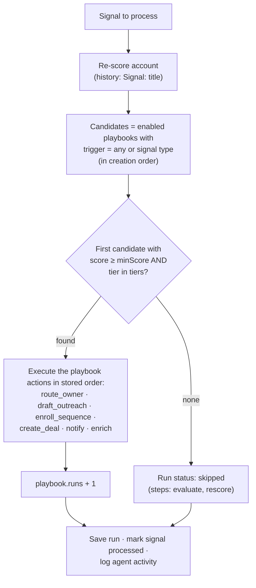

The orchestration agent turns signals into action. For each signal, it **re-scores** the account, finds the **first matching playbook**, and runs that playbook's **actions**: routing, enrichment, drafting, enrollment, deal creation and notification. Every run is recorded step by step. Outreach it writes waits in an **approval queue** unless the playbook says otherwise.

The **Agent** screen (`/agent`) has the autopilot switch, run statistics and three tabs: **Activity** (runs), **Approvals** (drafts) and **Playbooks**.

**Who uses it:** RevOps (playbooks), SDRs and AEs (approvals), Head of Sales (activity).

<Callout type="warn" title="Mocked parts">
Drafting uses a **template-based mock LLM**. The UI labels the step "Draft outreach with Claude", but no model is called yet. Sending uses a **mock email provider** that only logs. Enrichment is a **mock** too. Everything else here, including matching, routing, enrollment, deals, notifications and run tracking, is fully built.
</Callout>

## The agent loop

### When it runs

- **Autopilot on:** as soon as a signal is ingested (UI, webhook or simulation).
- **Autopilot off:** only when a user clicks **Process** / **Process now** on a signal, or **Process N pending**, which handles unprocessed signals oldest first.

Autopilot is a single workspace setting, shown in the header and on the Agent page. **Members and above** can change it.

## Playbooks

### Fields

| Field | UI control | Rules |
|---|---|---|
| **Name** | Text | Required, up to 120 characters |
| **Description** | Text area | Optional, up to 1,000 characters |
| **Trigger** | *Any signal* or one of the 8 signal types | |
| **Minimum score** | Slider 0–100 (default 50) | Compared with the account's score **after** re-scoring |
| **Tiers** | Checkboxes A, B, C, D (default A, B) | At least one |
| **Actions** | Checkboxes | At least one. **Re-score account** is always on and can't be removed. |
| **Sequence** | Select (or *No sequence*) | **Required** if *Enroll in sequence* is selected. Also used to enroll contacts when a draft is approved. |
| **Require approval** | Switch (default **on**) | When on, drafts wait in Approvals. When off, drafts are sent immediately. |
| **Enabled** | Switch on the playbook card | Disabled playbooks are never evaluated |
| **Runs** | Read-only | How many times the playbook has matched |

Each card shows its position (`#1`, `#2`…), a flow (trigger → actions), min score, tiers, approval mode (*Required* / *Auto-send*), run count and linked sequence.

### Matching rules

1. Only **enabled** playbooks are considered.
2. The trigger must be **`any`** or equal to the **signal's type**.
3. Candidates are checked in **creation order**, which is the order shown on the Playbooks tab.
4. The **first** candidate where `score ≥ minScore` **and** `tier ∈ tiers` wins. **Only one playbook runs per signal.**
5. If none match, the run is **skipped**. Its evaluate step explains why: either "N playbook(s) considered — score X / Tier Y below threshold" or "No enabled playbook for this signal type".

<Callout type="info" title="Ordering tip">
Playbooks can't be reordered. Because the first match wins, create specific, high-threshold playbooks (for example "Tier A surge → create deal") **before** broad ones that use *Any signal*. To change the order, recreate the broad playbook so it comes later.
</Callout>

### Managing playbooks

<Steps>
<Step>Go to **Agent → Playbooks → New playbook** (admins only).</Step>
<Step>Fill in the fields. The form shows errors for a missing name, no tiers, or *Enroll in sequence* without a sequence.</Step>
<Step>Click **Create playbook**. New playbooks are **enabled**.</Step>
<Step>Use the card's switch to enable or disable it, **Edit** to change it (setting *No sequence* clears the sequence), or **Delete** to remove it. Past runs are kept and show "Deleted playbook".</Step>
</Steps>

Deleting a sequence clears it from every playbook that used it.

## Actions in detail

Actions run in the order they are stored on the playbook. Re-scoring always happens first, before matching, and is not repeated.

<Callout type="info" title="Execution order">
The playbook form always saves actions in catalog order: **re-score → route → draft → enroll → deal → notify → enrich**. For playbooks created in the UI, this means **enrichment runs last**. A playbook created through the API keeps the order it was sent in. For example, the demo playbook "Funding round follow-up" enriches *before* it enrolls, until it is saved again from the UI.
</Callout>

| Action | Exact behaviour | Step result |
|---|---|---|
| **Re-score account** | Always happens first, before matching. Recalculates fit, intent, score and tier, and adds a score history point `Signal: <title>`. | `done`: "before → after (Tier X)" |
| **Route to owner** | If the account **already has an owner**, nothing changes. Otherwise it is assigned **round-robin** to the active, non-viewer user who currently owns the **fewest** accounts. The change is versioned as "Agent routing" and the account's contacts are reassigned too. | `skipped` "Already owned by …" · `done` "Round-robin assigned to …" · `failed` "No active sellers to route to" |
| **Enrich account** | Runs the enrichment waterfall **(mock)**, which may re-score the account. | `done`: "A → B refreshed" |
| **Draft outreach** | Picks the **most senior reachable contact** (C-Level > VP > Director > Manager > IC, excluding *unsubscribed* and *bounced*). Writes a subject and body **(mock LLM)** that mention the signal, signed with the first name of the **account owner** (or "The team"). The channel is **LinkedIn** for *job change* signals and **email** otherwise. The rationale reads "Tier X (score N). Trigger: source — title. Chose *title* as the most senior reachable contact." With approval **on**, the draft is **pending** and the run becomes **awaiting approval**. With approval **off**, the draft is saved as **sent**, sent immediately **(mock)**, and the contact becomes *in sequence* with `lastContactedAt` set to now. | `pending` "Draft for *Name* awaiting approval" · `done` "Sent to *Name*" · `failed` "No reachable contact on account" |
| **Enroll in sequence** | Enrolls the most senior reachable contact in the playbook's sequence, following the normal [eligibility rules](/docs/product/features/outreach#enrollment). | `done` "*Name* → *Sequence*" · `skipped` "Contact already enrolled or not eligible" · `failed` "Sequence not configured" / "No reachable contact" (the **run** becomes **failed**) |
| **Create deal** | If the account has an **open** deal, nothing happens. Otherwise it creates "*Account* – Discovery" in stage **Discovery** (10%), with amount `round(employees × 40 / 1000) × $1,000` (or **$12,000** if that is 0), a close date **45 days** out, and source `Agent: <signal type>`. Creating the deal moves a *new*, *researching* or *engaged* account to **Opportunity**. | `skipped` "Open deal exists: …" · `done` "Discovery deal opened" |
| **Notify owner** | Posts an **in-app notification** titled "*Account*: *signal title*" with the body "Tier X · score N. *Playbook*." It links to the account. The feed is shared by the whole workspace. | `done` "Owner notified" |

If an action throws an unexpected error, its step is marked **failed** with the error message and the run becomes **failed**. The remaining actions still run.

After the actions finish, the playbook's **runs** count goes up by 1. The run is saved, the signal is marked **processed**, and an `agent` activity is logged on the account ("Agent ran *Playbook*" or "Agent evaluated signal").

## Run statuses

| Status | When |
|---|---|
| **completed** | A playbook matched and nothing is pending or failed. A run also becomes completed when its pending draft is approved or rejected. |
| **awaiting_approval** | A playbook matched and its draft is waiting for review |
| **failed** | A step failed in a way that fails the run: an *Enroll in sequence* error or an unexpected error |
| **skipped** | No playbook matched |

<Callout type="info">
Some failures don't fail the run. A *Route to owner* step with no sellers and a *Draft outreach* step with no contact are marked **failed**, but the run can still end as **completed**. Check the step list for details.
</Callout>

## Activity tab

- **Stat cards:** **Runs today** (last 24 hours, with the 7-day count), **Actions taken** (steps marked *done*, excluding *evaluate*, across all runs), **Awaiting approval** (pending drafts) and **Success rate** = completed ÷ (completed + failed). Skipped and awaiting runs are excluded, and the rate shows 100% when there is no data.
- **Run table:** Time, Account, Trigger (`source: title`), Playbook, Status, Score (before → after), Duration. You can filter by status (with counts), and the table shows 25 per page, newest first.
- **Run sheet** (click a row, or open `/agent?run=<id>`): playbook name, status, start time and duration, the account with tier and score change, the triggering signal (links to the signal sheet), a **step timeline**, the pending draft (reviewable in place) and any reviewed drafts.

## Approvals tab

Pending drafts are listed newest first (up to 50 at a time). Each **review card** shows:

- the account (with tier), the contact's name and title, the channel badge and how long ago it was drafted;
- **Why this draft**, the agent's rationale;
- an editable **Subject** and **Message**, with an *Edited* badge once changed.

| Button | Effect |
|---|---|
| **Approve & send** | Subject and body can't be empty. Sends the message, including your edits **(mock email)**. Sets the draft to **sent** and completes the run step ("Approved & sent by *Name*"), which changes an awaiting run to **completed**. Sets the contact to **in sequence** and updates `lastContactedAt`. **Enrolls the contact** in the playbook's sequence if one is set, silently skipping enrollment if it fails. Logs an activity: *email* for email drafts, *note* for LinkedIn drafts. |
| **Regenerate** | Writes a new subject and body **(mock LLM)**. The draft stays pending, and any local edits are replaced. |
| **Reject** | Asks for confirmation. Sets the draft to **rejected**, marks the run step *skipped* ("Draft rejected by reviewer") and completes the run. Nothing is sent. |

A draft that is no longer pending can't be changed again. The API returns *"Draft is already sent"* (or *rejected*).

**Recently reviewed** (collapsible) lists the last 10 sent or rejected drafts, with links to their runs.

<Callout type="warn">
In the current build, LinkedIn-channel drafts are "sent" through the same mock **email** provider. No LinkedIn automation (HeyReach) is connected yet.
</Callout>

## Permissions

| Action | Viewer | Member | Admin | Owner |
|---|:-:|:-:|:-:|:-:|
| View runs, stats, drafts, playbooks | ✔ | ✔ | ✔ | ✔ |
| Toggle autopilot, process signals, simulate | – | ✔ | ✔ | ✔ |
| Approve, reject, regenerate drafts | – | ✔ | ✔ | ✔ |
| Create, edit, enable/disable, delete playbooks | – | – | ✔ | ✔ |

## Edge cases & limitations

- Only **one** playbook runs per signal, and playbooks can't be reordered.
- The agent runs in the API process during the ingest request. There is no queue or retry yet (EventBridge/SQS is planned; see the [roadmap](/docs/product/roadmap)).
- "Notify owner" posts to the workspace feed rather than a specific user. Slack delivery only happens in production when `SLACK_WEBHOOK_URL` is set.
- Draft quality depends on the mock templates until a real LLM provider is configured.
- The *Approvals* list loads the newest 50 pending drafts. Clear them to see older ones.
- A draft's **sequence** comes from the playbook when the draft is created. Changing the playbook later doesn't update existing drafts.

## Related

- [Core concepts → Orchestration](/docs/product/core-concepts#orchestration)
- [User journey: signal to meeting](/docs/product/user-journeys#b-from-signal-to-meeting)
- [Orchestration agent (engineering)](/docs/engineering/backend/orchestration-agent)
