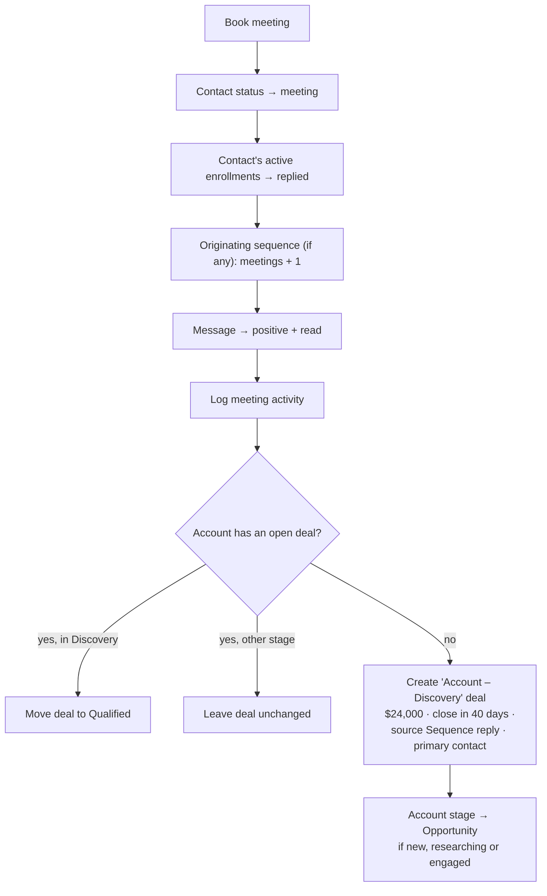

The **Outreach** screen (`/outreach`) is where reps engage prospects. It has three tabs: **Sequences** (cadences and their enrollments), **Inbox** (replies) and **Mailboxes** (sending inboxes and deliverability). Each sequence has its own detail page at `/outreach/:id`.

**Who uses it:** SDRs and AEs every day. RevOps and admins set up sequences and mailboxes.

<Callout type="warn" title="What is not automated yet">
- **No scheduled sending.** Enrolling a contact creates an *active* enrollment at step 1, but no background job sends steps or advances enrollments. Sequence settings (days, hours, timezone, stop on reply, open tracking) are **saved but not applied**.
- **No inbound capture.** Inbox messages come from the demo dataset. No mailbox is read.
- **Mock sending.** Inbox replies and approved agent drafts go through a mock email provider that only logs them.
- **Static mailbox health.** Health scores and "sent today" counts are stored values, and nothing updates them.
- **Sequence stats** (sent, opened, replied, bounced) are not updated by the product. Only **enrolled** (on enrollment) and **meetings** (on Book meeting) change.
</Callout>

## Sequences tab

### Summary cards

| Card | Definition |
|---|---|
| **Enrolled** | Sum of `stats.enrolled` across all sequences. The hint shows **active** enrollments right now. |
| **Emails sent** | Sum of `stats.sent`. The hint shows the number of sequences. |
| **Open rate** | Σ opened ÷ Σ sent |
| **Reply rate** | Σ replied ÷ Σ sent |
| **Meetings booked** | Σ meetings. The hint shows meetings ÷ replies. |

### List

Search by name and filter by status (Active, Paused, Draft). Columns: Sequence, Status, Steps (count and channel icons), Owner, Enrolled (lifetime, plus the number active now), Open rate, Reply rate, Meetings. The row menu has **Open**, **Pause**/**Activate**, **Duplicate** and **Delete**.

### Creating a sequence

<Steps>
<Step>Click **New sequence**. Enter a **name**, choose an **owner** (any active user, defaulting to you) and optionally select **sending mailboxes**, which emails rotate across.</Step>
<Step>Click **Create sequence**. The sequence starts as a **Draft** with one blank **email step on day 0**, and its detail page opens.</Step>
<Step>Add and edit steps, set the sending window, then click **Activate**.</Step>
</Steps>

## Sequence detail

The header has an inline **rename** (click the name), status, owner, step count and created date. Actions: **Pause**/**Activate**, **Duplicate**, **Delete** and **Enroll contacts**. Six stat cards show Enrolled (with the number active now), Sent, Opened (and open rate), Replied (and reply rate), Meetings (and meetings per reply) and Bounced (and bounce rate).

### Steps

| Channel | What it represents | Content |
|---|---|---|
| **Email** | An automated email from a rotating mailbox | Subject + body |
| **LinkedIn connect** | A connection request through the LinkedIn integration | – |
| **LinkedIn message** | A direct message once connected | Body |
| **Call task** | A call task for the sequence owner | – |
| **Wait** | A pause before the next step | – |

- **Add step** adds a step at the end. Its **day offset** defaults to the previous step's day **+ 2**, or 0 for the first step.
- **Day** can be edited (whole number, 0 or more). Edits save when the field loses focus or you press Enter.
- **Move up/down** swaps a step with its neighbour. **Delete** removes a step, but an **active** sequence must keep at least one.
- Subject and body save when the field loses focus.

**Personalization variables.** Click a variable to copy it: `{{first_name}}`, `{{company}}`, `{{sender_name}}`, `{{similar_customer}}`, `{{funding_round}}`. The preview also understands `{{last_name}}` and `{{title}}`.

**Preview.** Click an email step to preview it as a real contact. The preview uses enrolled contacts, or enrollable ones if nobody is enrolled yet. Variables are filled in as follows:

| Variable | Filled with |
|---|---|
| `first_name`, `last_name`, `title` | The sample contact |
| `company` | The sample contact's account name |
| `sender_name` | The sequence owner's first name |
| `similar_customer` | Another account in the **Customer** stage, preferably in the same industry. Falls back to "Northwind". |
| `funding_round` | The account's funding stage. Falls back to "Series B". |

<Callout type="info">Variables are filled in only in the preview. Because nothing sends sequence steps yet, the API never fills them in.</Callout>

### Enrolled

Filter by status (Active, Paused, Completed, Replied, Bounced, Unsubscribed). The list shows 25 per page. Columns: Contact (links to the contact sheet), Account, Progress ("Step N of M" with a bar), Status, Enrolled, Next step (active enrollments only). Bulk actions: **Pause**, **Resume**, **Mark completed** and **Remove** (after confirmation).

### Settings

| Setting | Default in the UI | Rules |
|---|---|---|
| **Sequence owner** | Creator | Must be a member of the workspace. Changes save immediately. |
| **Sending mailboxes** | None | Toggling saves immediately. A warning says email steps can't send when none are selected. |
| **Sending days** | Mon–Fri | At least one day (0 = Monday … 6 = Sunday) |
| **Start / End hour** | 8:00 AM – 5:00 PM | End must be after start |
| **Timezone** | The organization's timezone | Any IANA name. The list shows common zones. |
| **Stop on reply** | On | Stored only (not applied yet) |
| **Track opens** | On | Stored only (not applied yet) |

When you activate a sequence that has email steps but no mailboxes, a warning appears.

### Performance

- **Conversion funnel:** Enrolled → Sent → Opened → Replied → Meetings, from the sequence's lifetime stats.
- **Conversion rates:** open rate = opened ÷ sent, reply rate = replied ÷ sent, meeting rate = meetings ÷ replies, bounce rate = bounced ÷ sent.
- **Per-step breakdown:** Reached, Delivered, Engaged, Replied and Reply rate for each step.

<Callout type="warn" title="Per-step numbers are modelled">
Per-step data isn't tracked yet, so the breakdown is **estimated from the sequence totals**:
- **reached** = enrolled × 0.86^(step position);
- **email steps** split the sequence's sent, opened and replied totals using decaying weights (0.72^k for sends, then × 0.9^k for opens and × 0.85^k for replies), so the email rows add up to the totals;
- **LinkedIn connect**: 92% of reached as requests, 38% accepted;
- **LinkedIn message**: 40% messages, 31% seen, 6% replied;
- **call**: 70% dials, 18% connected, 5% replied;
- **wait** steps show dashes.
</Callout>

### Status, duplicate and delete

| Action | Rules |
|---|---|
| **Activate** | Requires at least one step |
| **Pause** | Enrollments are left unchanged |
| **Duplicate** | Creates "*Name* (copy)" as a **Draft** with the same steps (new IDs), mailboxes, settings and owner. Stats start at zero. |
| **Delete** | Removes the sequence and **all its enrollments**, and clears it from any playbook or draft that referenced it |

## Enrollment

Contacts can be enrolled from several places: the sequence page (**Enroll contacts**), [Contacts](/docs/product/features/contacts), an account page, the bulk bar on the account list, the agent's *Enroll in sequence* action, and draft approval.

**Eligibility rules (enforced by the API):**

| Condition | Result |
|---|---|
| Contact status **unsubscribed** or **bounced** | Skipped |
| Email status **invalid** | Skipped |
| Already **actively** enrolled in this sequence | Skipped. A contact with a paused or completed enrollment *can* be enrolled again. |
| Sequence has **no steps** | Whole request rejected ("Sequence has no steps") |
| Otherwise | Enrolled: step 1, status **active**, next step now. Contact status → **in sequence**. Sequence `enrolled` + N. |

The sequence page's **Enroll contacts** dialog searches all contacts (name, email, title) and hides contacts already active in this sequence. It shows the first 100 matches and labels ineligible contacts **Will skip**, with the reason. After enrolling, a message shows how many were enrolled and skipped, and a note appears if the sequence isn't active.

<Callout type="info">The API accepts enrollment into **draft** and **paused** sequences. The Contacts and Accounts dialogs list only active and paused sequences.</Callout>

## Inbox tab

A two-pane view with the conversation list on the left and the thread on the right.

| Control | Behaviour |
|---|---|
| **Sentiment filter** | All, Positive, Neutral, Negative, OOO, each with a count |
| **Search** | Subject, snippet, body, or contact name and email |
| **Show archived** | Includes archived conversations, shown dimmed |
| **List** | The newest 50 messages. Each shows an unread dot, contact, account, time, channel icon, subject, snippet and sentiment. |

Opening a conversation **marks it read** (for members and above). The thread pane shows the contact (links to the contact sheet), title, account, subject, the originating sequence and the message bubbles (*You* / *contact name*).

| Action | What it does |
|---|---|
| **Sentiment selector** | Changes the sentiment (Positive, Neutral, Negative, Out of office) |
| **AI suggest** | Fills the reply box with a suggestion **(mock)**. Positive → a calendar-link reply. Negative → confirms removal from outreach. OOO → "I'll follow up when you're back". Neutral → asks for an intro. Signed with your first name. |
| **Send reply** (or Ctrl/⌘ + Enter) | For **email** threads where the contact has an email, sends from your address with the subject prefixed `Re:` **(mock)**. Always appends your message to the thread, marks it read, updates the contact's last-contacted time and logs an *email* activity. |
| **Book meeting** | See below |
| **Archive / Unarchive** | Hides the conversation from the default view, or restores it |
| **Mark unread** | Marks the conversation unread and closes it |

### What "Book meeting" does

A message confirms "Meeting booked", says whether the deal was created or updated, and offers **View deal**. No calendar event is created.

## Mailboxes tab

### Summary cards

**Mailboxes** (with the number warming up), **Sent today** (of total daily capacity across mailboxes that aren't paused), **Avg. health**, and **Alerts** (the number of deliverability alerts).

### Connecting a mailbox (admins)

<Steps>
<Step>Click **Connect mailbox**.</Step>
<Step>Enter the **email**, choose a **provider** (SES, Google, Microsoft, Mailpool) and set a **daily limit** (default 40; the API allows 1–2,000). The dialog recommends 50 or fewer for cold outreach.</Step>
<Step>Click **Connect**. The mailbox starts with **warm-up on**, **health 70** and status **Warning**. The same email can't be connected twice.</Step>
</Steps>

### Mailbox card

Health score bar (≥ 90 green, ≥ 80 blue, ≥ 65 amber, otherwise red), sent today against the limit, the number of sequences using the mailbox, a **Warm-up** switch and an editable **Limit**. Members and above can change these and **Pause**/**Resume** the mailbox. Only admins can **Remove** a mailbox, which also takes it out of every sequence's rotation.

### Deliverability alerts

These are calculated in the browser from the mailbox data:

| Alert | Condition |
|---|---|
| **Low health** | Health score below 80 |
| **Warm-up off** | Warm-up disabled and the mailbox isn't paused |
| **Near daily limit** | Sent today ≥ 85% of the limit and the mailbox isn't paused |
| **High volume** | Daily limit above 100 on a provider other than SES |

The tab also shows a **Domain authentication** checklist (SPF, DKIM, DMARC, custom tracking domain, secondary sending domains) and **Best practices**. These are **guidance only**: the app doesn't check DNS.

## Permissions

| Action | Viewer | Member | Admin | Owner |
|---|:-:|:-:|:-:|:-:|
| View sequences, enrollments, performance, inbox, mailboxes | ✔ | ✔ | ✔ | ✔ |
| Create, edit, activate, duplicate, delete sequences and steps | – | ✔ | ✔ | ✔ |
| Enroll, pause, resume, complete, remove enrollments | – | ✔ | ✔ | ✔ |
| Reply, AI suggest, book meeting, archive, change sentiment | – | ✔ | ✔ | ✔ |
| Edit mailbox limit, warm-up, pause | – | ✔ | ✔ | ✔ |
| Connect or remove mailboxes | – | – | ✔ | ✔ |

## Related

- [Contacts](/docs/product/features/contacts)
- [Pipeline](/docs/product/features/pipeline)
- [User journey: signal to meeting](/docs/product/user-journeys#b-from-signal-to-meeting)
- [Metrics](/docs/product/metrics)
