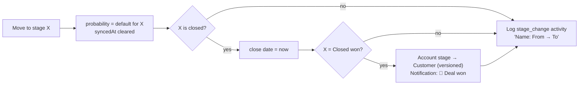

The **Pipeline** screen (`/pipeline`) tracks every opportunity from Discovery to close. Deals come from three places: reps (**New deal**, or **Create deal** on an account), **Book meeting** in the inbox, and the agent's **Create deal** action. The screen offers a Kanban **board** and a sortable **table**, a **deal sheet** for editing, and **Sync to CRM**.

**Who uses it:** AEs (daily), Head of Sales (forecast and win rate), SDRs (hand-offs).

## Stages and probabilities

| Stage | Default probability | Board colour |
|---|---:|---|
| Discovery | 10% | slate |
| Qualified | 25% | sky |
| Demo | 40% | indigo |
| Proposal | 60% | violet |
| Negotiation | 80% | amber |
| Closed won | 100% | emerald |
| Closed lost | 0% | rose |

The probability is set from the stage when a deal is created and **reset** every time the deal changes stage. You can override it on the deal sheet (0–100). The override lasts until the next stage change.

## Header and stats

Actions (members and above): **Sync to CRM** and **New deal** (also available from ⌘K → *Create deal*, or `/pipeline?new=1`).

| Card | Definition (filtered by the current search and owner, including closed deals) |
|---|---|
| **Open pipeline** | Σ amount of deals not closed. The hint shows the open deal count. |
| **Weighted pipeline** | Σ (amount × probability ÷ 100) over open deals, rounded |
| **Won this quarter** | Σ amount of Closed won deals whose close date is on or after the first day of the current calendar quarter (server time). The hint shows the count. |
| **Win rate** | won ÷ (won + lost) × 100, over all closed deals. 0 when nothing is closed. |
| **Avg deal size** | Σ amount ÷ number of deals, over **all** deals in scope (open and closed) |

<Callout type="info">The *Avg deal size* card averages every deal in scope (open and closed), as its "Across all N deals" hint says.</Callout>

## Filters and views

- **Search:** deal name, CRM ID, account name or account domain.
- **Owner:** *All owners*, *My deals*, or any non-viewer teammate.
- **Hide closed:** removes Closed won and Closed lost deals from the board or table. The stat cards still include them.
- **Unsynced badge:** the number of deals not yet pushed to the CRM.
- **Board / Table** toggle. Up to 1,000 deals are loaded.

### Board

<Steps>
<Step>Each stage is a column with its deal count and total amount.</Step>
<Step>Cards show the deal name, account, an **Agent** badge (when the source starts with "Agent"), amount, close date (**red when overdue**, meaning past due and not closed), CRM status (a check mark if synced, "unsynced" otherwise) and an owner avatar.</Step>
<Step>**Drag** a card to another column to move it (members and above), or use the card's **⋯ → Move to stage**. A message confirms the move.</Step>
<Step>Click a card, or press Enter on it, to open the **deal sheet**.</Step>
</Steps>

### Table

Sortable columns: Deal, Account, Stage (sorted in **pipeline order**, not alphabetically), Amount, Probability, Close date and Updated. Owner and CRM are also shown. Click a row to open the deal sheet.

## Deal sheet

Opens at `/pipeline?deal=<id>`. Other pages use this link too.

| Section | Contents |
|---|---|
| Header | Stage badge, source badge (with a bot icon for agent-sourced deals), name, amount, probability and age |
| Account | A link card with domain, industry and tier |
| Fields | **Name**, **Amount**, **Stage** (changes apply immediately), **Probability %**, **Close date**, **Owner** (non-viewers), **Primary contact** (contacts on the account), **Notes**. **Save** applies the other fields. |
| CRM | The connected CRM's name, **Record ID** (or "Not created") and **Last synced** (or "Pending sync") |
| Activity | **Log note** (Ctrl/⌘ + Enter) and the deal's activity feed, with actor names (users, *Agent*, *System*) |
| Footer | **Delete** (asks for confirmation), Close, Save |

## Business rules

### Creating a deal

| Where | Defaults |
|---|---|
| **New deal** dialog | Name "*Account* – New deal", amount $25,000, Discovery, closes in 30 days, owner = the account owner (if they are a seller) or you, primary contact = the account's first contact |
| **Create deal** on an account | Name "*Account* – New business", amount `max(12, round(employees × 40 / 1000)) × $1,000`, Discovery, closes in 45 days |
| **Book meeting** (inbox) | "*Account* – Discovery", $24,000, closes in 40 days, source *Sequence reply*, primary contact = the replying contact |
| Agent **Create deal** | "*Account* – Discovery", `round(employees × 40 / 1000) × $1,000` (or $12,000), closes in 45 days, source `Agent: <signal type>`. Skipped if an open deal exists. |

On every creation:
- The account must exist. If a contact is given, it must exist too.
- The **probability** comes from the stage. The **owner** defaults to the account owner, or to the user creating the deal. The **source** defaults to *Manual*.
- If the account's stage is *new*, *researching* or *engaged*, it moves to **Opportunity** (a versioned change, "Deal created").
- A `stage_change` activity "Deal created: *Name*" is logged.

### Moving a deal

- Moving a deal to the stage it is already in does nothing.
- **Closed lost** doesn't change the account's stage.
- Moving a won deal back to an open stage **doesn't** change the account back from *Customer*.
- Changing the stage through the deal edit API goes through the same move logic.

### Editing and CRM sync

- **Any** edit or move clears `syncedAt`, so the deal counts as unsynced ("Marked for next CRM sync").
- **Sync to CRM** requires a **connected CRM integration** (HubSpot, Attio or Salesforce). Otherwise it fails with *"Connect a CRM integration (HubSpot, Attio or Salesforce) first"*. It pushes **every unsynced deal**, gives each a CRM record ID (existing IDs are kept) and a sync time, and marks the CRM integration as synced. A message reports how many deals were pushed.

<Callout type="warn" title="Mock CRM">
The CRM adapter is a mock. It doesn't call HubSpot, Attio or Salesforce. It generates IDs such as `HU-482913`: two letters from the configured CRM provider name (HubSpot by default) and six digits. Deals are **not** pulled back from a CRM.
</Callout>

### Deleting

Deleting a deal removes only the deal. Its activities stay on the account timeline.

## Permissions

| Action | Viewer | Member+ |
|---|:-:|:-:|
| View board, table, stats, deal sheet | ✔ | ✔ |
| Create, edit, drag or move, delete deals, log notes | – | ✔ |
| Sync to CRM | – | ✔ |

## Edge cases & limitations

- There are no custom stages or pipelines. The seven stages are fixed.
- The board loads up to 1,000 deals at once.
- *Won this quarter* uses the calendar quarter in the API server's time zone.
- Overdue highlighting compares against the time the page was opened.
- CSV export of deals is on the [Analytics](/docs/product/features/analytics#export) page.

## Related

- [User journey: pipeline to closed-won](/docs/product/user-journeys#e-pipeline-management-to-closed-won)
- [Metrics](/docs/product/metrics)
- [Integrations → CRM](/docs/product/features/integrations)
