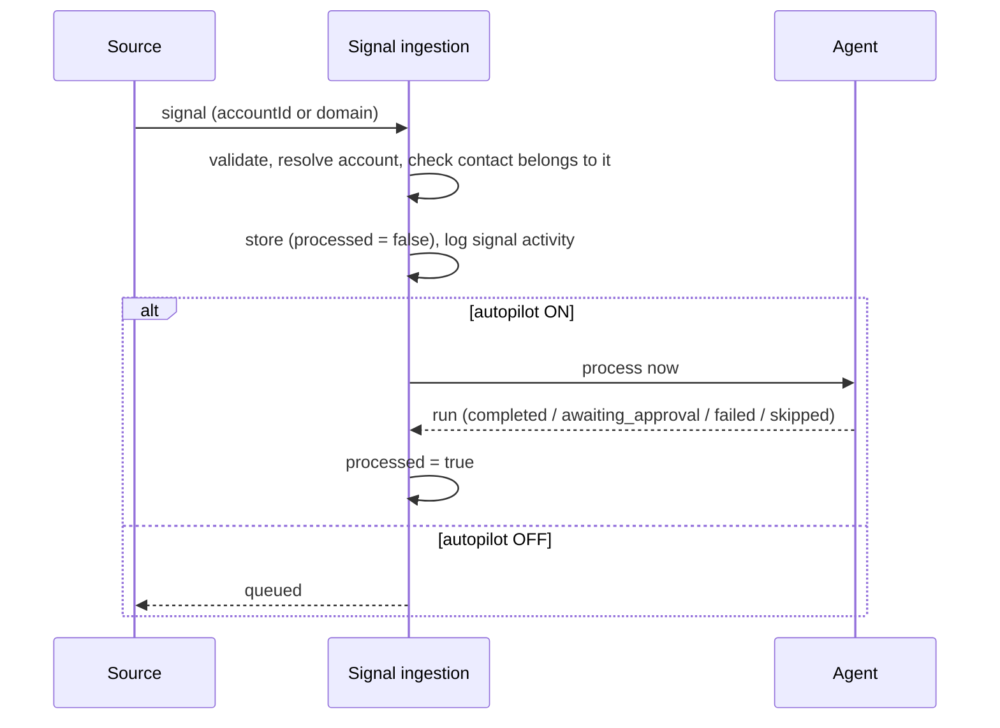

Signals are the triggers for SellEasy. A signal says *something happened at this account that suggests buying intent*: a pricing-page visit, a funding round, a new VP of Sales. The **Signals** screen (`/signals`) shows the incoming feed, volume statistics and the processing state of each signal, and lets you add signals by hand.

**Who uses it:** RevOps (monitoring sources), SDRs (context), Marketing Ops (volume and mix).

## Signal types and sources

| Type | What it means | Typical sources | Default ICP weight |
|---|---|---|---:|
| **Intent topic** | The company is researching a relevant topic | Bombora | 70 |
| **Website visit** | Identified visitors on your site (for example the pricing page) | RB2B | 90 |
| **Hiring** | Relevant job posts (for example AEs or SDRs) | Apify, Linkup | 60 |
| **Funding** | A new funding round | Linkup, Apollo.io | 75 |
| **Job change** | A champion or buyer joined or moved | Trigify.io, Apollo.io | 80 |
| **Tech install** | Adopted a relevant technology | Clearbit, Apify | 45 |
| **Social engagement** | Engaged with your posts | Trigify.io | 35 |
| **News** | Expansion, launches, press | Linkup | 30 |

Each signal has a **strength** from 0 to 100. Strength, type weight and age together determine how much the signal adds to the account's [intent score](/docs/product/core-concepts#intent-score-0100).

## Ways signals arrive

<Tabs items={['Webhook (vendors, Zapier)', 'Ingest signal (UI)', 'Simulate (demo)']}>
<Tab value="Webhook (vendors, Zapier)">

`POST /api/v1/webhooks/signals`, authenticated with the `x-api-key` header. The key needs the **`signals:write`** scope. The body is either one signal or `{ "signals": [ … ] }` with up to **100** items.

```json
{
  "type": "website_visit",
  "domain": "example.com",
  "title": "Visited pricing page",
  "detail": "2 identified visitors, 5 pageviews",
  "strength": 80,
  "source": "RB2B",
  "occurredAt": "2026-09-17T10:00:00Z"
}
```

| Field | Required | Rules |
|---|:-:|---|
| `type` | ✔ | One of the eight types |
| `accountId` **or** `domain` | ✔ | The domain is normalized and matched against non-duplicate accounts |
| `contactId` | | Must belong to the account |
| `title` | ✔ | 1–300 characters |
| `detail` | | Up to 2,000 characters |
| `strength` | ✔ | 0–100 |
| `source` | | Up to 100 characters. Defaults to the first typical source for the type. |
| `occurredAt` | | ISO date-time. Defaults to now. |

The response is **202** with `accepted` (the number of successful items) and a result for each item (`ok`, `signalId`, `runStatus`, or `error`). `runStatus` is the agent run status, or `queued` when autopilot is off. **Items that fail don't stop the rest of the batch.** For example, an unknown domain gives *"No account with domain …"*. See [Signals & webhooks API](/docs/engineering/api/signals-and-webhooks).

</Tab>
<Tab value="Ingest signal (UI)">

<Steps>
<Step>Click **Ingest signal** (members and above).</Step>
<Step>Choose the **signal type**. The **source** list changes to the typical sources for that type.</Step>
<Step>Pick the **account** (searchable) and, optionally, a **contact** on that account.</Step>
<Step>Enter a **title** (required) and a **detail**. The agent uses the detail when drafting outreach.</Step>
<Step>Set the **strength** (slider, default 70) and click **Ingest**.</Step>
</Steps>

A message shows the agent's result (for example "Agent drafted outreach — awaiting approval") with a **View run** link. If autopilot is off, it says **queued** instead.

</Tab>
<Tab value="Simulate (demo)">

**Simulate** (on this page, on the Agent page and in the header) is available when the server has `ENABLE_SIMULATION=true`. It:

- chooses a random account from the **30 non-duplicate accounts with the highest fit**;
- chooses a random type and one of that type's sources, with a realistic title and detail (for example "Raised Series B — $40M led by Sequoia");
- sets a strength between **60 and 97**;
- attaches the account's most senior reachable contact for website visits, job changes and social engagement;
- then ingests the signal like any other.

It fails with *"Add at least one account before simulating signals"* when the workspace has no accounts.

</Tab>
</Tabs>

## What happens on ingest



When the agent processes a signal, it always re-scores the account first and then evaluates playbooks. See [Orchestration agent](/docs/product/features/orchestration-agent).

## The Signals screen

### Header actions (members and above)

- **Process N pending**: runs the agent on every unprocessed signal, **oldest first**. A message reports how many were processed.
- **Simulate**: see above.
- **Ingest signal**: see above.

### Stat cards

| Card | Definition |
|---|---|
| **Signals (24h)** | Signals with `occurredAt` in the last 24 hours |
| **Signals (7d)** | The same over the last 7 days. The hint shows the all-time total. |
| **Unprocessed** | Signals not yet processed by the agent. The hint shows whether autopilot is on. |
| **Top source** | The source with the most signals, all-time, and its count |

### Charts

- **Signals by type:** counts per type over the **last 30 days**.
- **Sources:** each source's share of **all** signals ever ingested. Click a source to filter the feed by it, and click again to clear the filter.

### Signal feed

| Filter | Options |
|---|---|
| Search | Title, detail or account name |
| Type | All, or one of the eight types |
| Source | All known sources |
| Status | Any, Pending, Processed |
| Time range | Last 24h, Last 7 days, **Last 30 days (default)**, All time |

The feed shows 25 signals per page, newest first. Columns: Signal (title, type, detail), Account (with tier), Contact, Source, Strength, Time, Status. Pending rows have a **Process** button. Click a row to open the **signal sheet**, which shows the detail, the account with its score and tier, the contact, strength, the exact time, the status (with **Process now** if pending) and every **agent run** for the signal with its steps.

A link to `/signals?signal=<id>` opens that sheet directly. The agent run sheet uses these links.

## Autopilot

Autopilot is a workspace-wide switch, available in the header and on the Agent page.

| Autopilot | Effect on new signals |
|---|---|
| **On** (default for new workspaces) | Each signal is processed immediately when it is ingested. |
| **Off** | Signals are stored as **unprocessed**. They show in the sidebar badge and the **Unprocessed** card until someone clicks **Process**, **Process now** or **Process N pending**. |

Processing by hand always works, whatever the autopilot setting.

## Permissions

| Action | Viewer | Member+ |
|---|:-:|:-:|
| View feed, stats and sheets | ✔ | ✔ |
| Ingest, simulate, process, process pending | – | ✔ |
| Toggle autopilot | – | ✔ |
| Push via webhook | API key with `signals:write` (created by an admin) | |

## Edge cases & limitations

- Signals must belong to an **existing** account. The webhook doesn't create accounts.
- Domain matching skips accounts flagged as duplicates. Merge or dismiss duplicates to avoid mismatches.
- The **"Minimum signal strength"** setting on intent integrations is stored but **not enforced** at ingestion yet.
- Vendors don't push to SellEasy yet. Until real adapters exist, use the webhook (for example through Zapier) or manual and simulated signals.
- The API can re-process a signal that was already processed (`POST /signals/:id/process`), but the UI only offers **Process** for pending signals. Re-processing creates a new run.
- Deleting a signal is API-only (`DELETE /signals/:id`). There is no button for it.
- Simulation is a demo feature and will be removed. See the [roadmap](/docs/product/roadmap).

## Related

- [Core concepts → Signals](/docs/product/core-concepts#signals)
- [Settings → API keys](/docs/product/features/settings#api-keys)
- [Signals & webhooks API](/docs/engineering/api/signals-and-webhooks)
