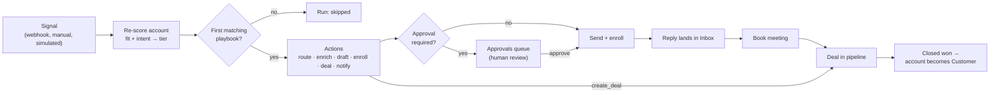

SellEasy is an agentic go-to-market (GTM) platform for B2B sales teams. It collects buying signals for each account: intent topics, website visits, hiring, funding, job changes, tech installs, social engagement and news. It scores every account on **ICP fit** and **live intent**. An **orchestration agent** then acts on the hottest accounts: it re-scores the account, routes it to an owner, drafts outreach, enrolls contacts in sequences and opens deals. Outreach written by the agent waits in an approval queue until a person approves it. The product has a Next.js web app and an Express API. All business rules live in the API.

<Callout type="info" title="The problem in one line">
Reps spend their week on accounts that aren't ready to buy. The signals that would tell them otherwise are spread across a dozen vendor tools, and nobody routes them to the right person in time.
</Callout>

## Who it is for

| Audience | What they get from SellEasy |
|---|---|
| **Head of Sales / CRO** | One view of pipeline, agent activity and which accounts are heating up. Also covers how much pipeline the agent sources. |
| **RevOps** | One place to define the ICP, tune scoring weights with a live preview, write playbooks, connect vendors and keep data clean. |
| **SDRs** | A ranked list of accounts to work, agent-drafted emails to approve, sequences to run and an inbox of replies. |
| **AEs** | A pipeline board with deals created automatically from high-intent accounts and booked meetings. |
| **Marketing Ops (read-only)** | Signal volume, source mix, attribution and funnel analytics. |
| **Workspace owner / admin** | Team, roles, seats, API keys, integrations and workspace settings. |

For goals, pains and jobs-to-be-done, see [Personas](/docs/product/personas).

## Key capabilities

<Cards>
  <Card title="Accounts & contacts" href="/docs/product/features/accounts" description="A de-duplicated, versioned, enriched record of every company and person in your TAM." />
  <Card title="Data import" href="/docs/product/features/data-import" description="CSV/JSON import with column aliases, domain/email de-duplication, dry run and a per-row error report." />
  <Card title="Signals" href="/docs/product/features/signals" description="Eight signal types from intent, web, hiring, funding and social sources, ingested by webhook or by hand." />
  <Card title="ICP & scoring" href="/docs/product/features/icp-scoring" description="An explainable fit + intent score with time decay, tiers A–D and a live what-if preview." />
  <Card title="Orchestration agent" href="/docs/product/features/orchestration-agent" description="Playbooks that re-score, route, enrich, draft, enroll, open deals and notify, with human approval." />
  <Card title="Outreach" href="/docs/product/features/outreach" description="Multi-channel sequences, enrollment rules, a reply inbox with sentiment, and mailbox health." />
  <Card title="Pipeline" href="/docs/product/features/pipeline" description="A drag-and-drop deal board with stage probabilities, CRM sync and closed-won effects." />
  <Card title="Analytics" href="/docs/product/features/analytics" description="Pipeline created, attribution by signal, funnel, tier performance, sequences and rep leaderboard." />
  <Card title="Integrations" href="/docs/product/features/integrations" description="A catalog of 19 vendors across 9 categories, with encrypted keys and an enrichment waterfall." />
</Cards>

## How the pieces fit

Every new signal goes through the same loop. The agent re-scores the account and picks the first playbook that matches. It then runs that playbook's actions. Any outreach it drafts waits for a person to approve it (unless the playbook turns approval off). Approved outreach is sent and the contact is enrolled in a sequence. When a prospect replies, the rep books a meeting, which creates or advances a deal.

The [core concepts](/docs/product/core-concepts) page defines each object in this diagram. The [user journeys](/docs/product/user-journeys) page walks through the loop step by step.

## What is live vs. mocked today

The workflow and the business rules are fully built. Calls to outside systems go through **provider adapters**, and today every adapter is a **mock**. The mocks behave the same way every time and need no network access. The UI does not show which features are backed by a mock, so the table below lists them.

| Area | Status | Notes |
|---|---|---|
| Accounts, contacts, dedup, merge, versioning | ✅ Live | Business rules run in the API. Data is stored in JSON files (`DB_DRIVER=json`). |
| CSV/JSON import | ✅ Live | Validation, aliases, de-duplication, dry run and an error report. |
| Scoring engine, ICP editor, live preview | ✅ Live | Deterministic formula. See [ICP & scoring](/docs/product/features/icp-scoring). |
| Signal ingestion (UI + webhook with API key) | ✅ Live | Vendors don't push data yet. Signals come from the webhook, manual entry or **Simulate**. |
| Orchestration agent, playbooks, approvals | ✅ Live | Runs in the API process on each ingest. There is no queue or event bus yet. |
| Pipeline board, stage rules, closed-won effects | ✅ Live | |
| Analytics & dashboard aggregates | ✅ Live | Computed on request from the stored records. |
| Team, roles, API keys, plans & seats | ✅ Live | Plans only change the seat count. There is no billing. |
| **Enrichment & email verification** | 🟡 Mock | Fills a few plausible fields and reports the first two waterfall vendors as sources. |
| **LLM drafting & AI reply suggestions** | 🟡 Mock | Uses templates. The UI says "Draft outreach with Claude", but no LLM is called yet. |
| **Email sending** (approved drafts, inbox replies) | 🟡 Mock | Messages are only logged by the API. Nothing is delivered. |
| **CRM push** ("Sync to CRM") | 🟡 Mock | Generates fake CRM record IDs. A connected CRM integration is still required. |
| **Integration connect / test / sync** | 🟡 Mock | Any key of 8 or more characters "connects". Sync history is synthetic. |
| **Invite emails** | 🟡 Not wired | Admins copy an invite link from the UI instead. |
| **Sequence sending / step scheduling** | ⛔ Not built | Enrolling a contact is only a state change. Steps never advance on their own. |
| **Inbound reply capture** | ⛔ Not built | Inbox messages come from the demo dataset. No mailbox is read. |
| **Mailbox health, warm-up, DNS checks** | ⛔ Not built | Health scores and send counts are stored values. The DNS checklist is guidance only. |
| **Notification preferences (email / Slack delivery)** | ⛔ Not built | Preferences are saved but not applied. The in-app feed is shared across the workspace. |

<Callout type="warn" title="Signal simulation">
When `ENABLE_SIMULATION=true`, the header shows a **Simulate signal** button. It creates a realistic random signal so you can demo the whole loop without vendor data. It is meant for demos and testing and will be removed once real vendor signals are flowing. See the [roadmap](/docs/product/roadmap).
</Callout>

## Where to go next

<Cards>
  <Card title="Problem & vision" href="/docs/product/problem-and-vision" description="Why SellEasy exists and the principles behind it." />
  <Card title="Core concepts" href="/docs/product/core-concepts" description="The mental model, with a worked scoring example." />
  <Card title="Feature guide" href="/docs/product/features" description="Every screen, rule and permission." />
  <Card title="Roles & permissions" href="/docs/product/roles-and-permissions" description="Who can do what." />
  <Card title="Architecture (engineering)" href="/docs/engineering/architecture" description="How the frontend, API and providers are built." />
  <Card title="Run it locally" href="/docs/engineering/getting-started" description="Set up the product on your machine." />
</Cards>
