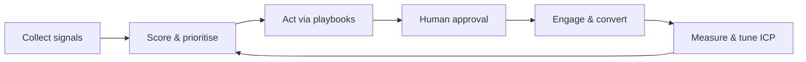

This page explains why SellEasy exists. It covers the problem B2B revenue teams have, the product we are building to fix it, the principles that guide design decisions, and what we have chosen not to build.

## The GTM problem

B2B sales teams have more data than ever and still spend most of their time on the wrong accounts.

### 1. Reps waste time on cold accounts

Territories and account lists are usually built once a quarter from firmographics. Those lists say nothing about who is buying *this week*. SDRs work down static lists and email accounts that show no sign of interest. Meanwhile an account that visited the pricing page yesterday waits in someone else's backlog.

### 2. Signals are scattered across tools

The evidence that an account is in-market already exists, but it is split across many tools:

| Signal | Typical source |
|---|---|
| Research on a topic (intent surge) | Bombora |
| Identified website visitors | RB2B |
| Job changes, social engagement | Trigify, Apollo |
| Hiring, funding, news | Apify, Linkup, Apollo |
| Tech installs | Clearbit, Apify |

Each tool has its own UI, its own alerts and its own idea of what an "account" is. Nobody sees all the signals for one account in one place. Nobody weights them against each other, and nobody notices when they go stale.

### 3. Routing and follow-up are manual

Even when someone spots a signal, turning it into action takes several manual steps. They have to find the owner, or pick one if there is none. Then they find the right contact, write a relevant message, add the contact to a sequence and, when there is a reply, open an opportunity in the CRM. Each hand-off adds delay, and buying windows are short. Intent data loses most of its value within a few weeks.

### 4. Scoring is opaque and hard to tune

Lead and account scores are often black boxes. Reps don't trust a score they can't explain. RevOps can't safely change weights because they can't see which accounts would move before they commit the change.

## The vision

**An agentic GTM system that watches every signal, decides which accounts matter now, and does the busywork, while people keep control of what gets sent to customers.**

In practice:

- **One account record** that combines firmographics, contacts, signals, deals and a full activity and version history.
- **A single, explainable score** that combines how well the account fits your ICP with how strongly it is showing intent right now. Intent fades over time.
- **An orchestration agent** that reacts to each new signal in seconds. It re-scores the account, matches it to a playbook and takes the actions the playbook lists: route, enrich, draft, enroll, open a deal, notify.
- **Human in the loop.** Outreach written by the agent waits in an approval queue by default. A person can edit, regenerate, approve or reject it.
- **Closed-loop measurement.** Analytics show which signals and playbooks produce pipeline and revenue, so the team can tune the system.

## Principles

<Accordions>
  <Accordion title="Explainable scores, not black boxes">
    Every score can be broken down. The account page shows exactly which fit criteria matched and how many points each earned. It also lists which signals add to intent and by how much, after weighting and decay. The formula is printed on the ICP page. Before saving a new ICP, RevOps sees a live preview of tier changes. See [ICP & scoring](/docs/product/features/icp-scoring).
  </Accordion>
  <Accordion title="Humans approve what customers see">
    Playbooks require approval by default. The agent can route, enrich, score and open deals on its own. Messages to prospects are held for review unless an admin explicitly turns approval off for a playbook. See [Orchestration agent](/docs/product/features/orchestration-agent).
  </Accordion>
  <Accordion title="Rent, don't build, data and delivery">
    SellEasy does not try to be a data vendor, an email service or a CRM. It connects to specialists (Clearbit, Apollo, Bombora, RB2B, SES, HubSpot, Salesforce, Anthropic and others) through provider adapters and adds orchestration on top. Vendor keys are stored encrypted. The enrichment waterfall lets you order providers by match rate and cost. See [Integrations](/docs/product/features/integrations).
  </Accordion>
  <Accordion title="Automate the busywork, not the judgement">
    The agent handles repetitive steps: re-scoring, round-robin routing, picking the most senior reachable contact, filling in a first draft, enrolling, and opening a discovery deal. People make the decisions: which accounts to disqualify, what to say, when to book, and how to run the deal.
  </Accordion>
  <Accordion title="Safe by default">
    Role-based access is enforced by the API on every request. Viewers are read-only, and only admins can change the ICP, playbooks, integrations or API keys. Enrollment skips contacts that are unsubscribed, bounced or have invalid emails. Deleting records cascades cleanly.
  </Accordion>
  <Accordion title="Swappable infrastructure">
    Storage, event bus, search, auth and every vendor sit behind interfaces. The product runs on a laptop today with JSON storage and mock providers. It can move to Postgres, EventBridge/SQS and real vendor adapters without changing the product surface. See [Architecture](/docs/engineering/architecture).
  </Accordion>
</Accordions>

## Non-goals

SellEasy intentionally does **not** aim to:

- **Replace the CRM.** The pipeline board is a working surface synced *to* your CRM (HubSpot, Attio or Salesforce). The CRM remains the system of record for revenue.
- **Be a contact database.** Contact and company data come from connected vendors or from your own imports.
- **Be an email service provider.** Delivery, warm-up and inbox infrastructure belong to SES, Mailpool, Instantly or Google/Microsoft mailboxes. SellEasy only shows mailbox health and applies guardrails.
- **Send AI-written messages without oversight by default.** Auto-send exists for each playbook, but it is opt-in.
- **Provide billing.** Plans control seat limits only. There is no payment flow.
- **Provide a general BI tool.** Analytics answer GTM questions. Deeper analysis is planned for a warehouse (Redshift) later.

## Differentiation

| Typical approach | SellEasy |
|---|---|
| Separate intent, visitor-ID and data tools, each with its own alerts | All signal types on one account timeline, weighted and time-decayed into one score |
| Static lead scores in the CRM | Fit + intent score recomputed on every signal, with a breakdown and a what-if preview |
| Humans read alerts and route manually | Playbooks route, enrich, draft, enroll and open deals within seconds |
| AI SDR tools that email autonomously | Agent drafts wait in an approval queue by default, and every run has a step-by-step trace |
| Hard-wired to a single data vendor | Vendor-neutral adapters and an ordered enrichment waterfall |
| Attribution by last touch in the CRM | Pipeline attributed to the signal types seen before each deal was opened |

## Related

- [Personas](/docs/product/personas): who we build for.
- [Roadmap](/docs/product/roadmap): how we get from today's build to the full vision.
- [Metrics](/docs/product/metrics): how we measure success.
