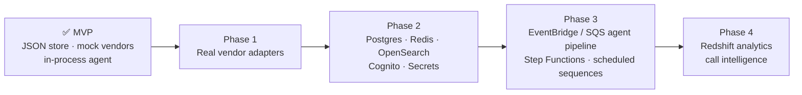

This roadmap starts from the implementation plan (`plan.md`, marked *implemented, phases 1–7*) and the architecture's documented next steps. It describes **direction and order**, not committed dates. See [Architecture](/docs/engineering/architecture) and [Deployment](/docs/engineering/deployment) for the technical design.

## Where we are today

The **MVP integration** (plan phases 1–7) is done:

| Plan phase | Result |
|---|---|
| 1 · Backend scaffold | Express 5 + TypeScript API, zod-validated config, logging, error handling, health check, JSON-file repository with atomic writes |
| 2 · Auth & org | Register, login, invites, JWT sessions, bcrypt passwords, roles, team, API keys, preferences |
| 3 · Domain modules | Accounts, contacts, import, signals, scoring, agent, outreach, pipeline, activities, notifications, integrations, search, analytics. Provider mocks and an in-process event bus. |
| 4 · Demo seed | `bootstrap` (empty workspace) and `seed:demo` (demo dataset). Dev-only reset endpoint. |
| 5–6 · Frontend on the API | Every page uses TanStack Query hooks. The browser holds only the session token. Import dialogs on Accounts and Contacts. |
| 7 · Developer experience | Root `setup` / `dev` scripts, Swagger UI at `/api/v1/docs`, READMEs |

## Phase 1: Real vendor adapters

**Goal:** replace the mocks so that real data comes in and real messages go out.

| Workstream | Scope | Switch |
|---|---|---|
| LLM | Anthropic (Claude) adapter for outreach drafting, reply suggestions and later research. Uses the model and token budget from the LLM integration settings. | `LLM_PROVIDER=anthropic` |
| Enrichment | Clearbit / Apollo / FullEnrich / Prospeo / Limadata adapters that **follow the waterfall** (fall through on a miss) and respect *Overwrite existing fields* | `ENRICHMENT_PROVIDER` |
| Email | SES / Instantly / Mailpool sending for approved drafts and inbox replies, using the sequence's mailboxes | `EMAIL_PROVIDER` |
| CRM | HubSpot / Attio / Salesforce push **and pull**, write-back of score and tier, conflict policy | `CRM_PROVIDER` |
| Signals | Native Bombora, RB2B and Trigify connectors (polling and signed webhooks), applying *Minimum signal strength* | vendor keys |
| LinkedIn | HeyReach for LinkedIn drafts and steps | `LINKEDIN_PROVIDER` |
| Connection testing | Real credential checks instead of the length check | – |
| Invites | Send invite emails through the email provider | – |
| Simulation | **Remove** Simulate once real signals flow | `ENABLE_SIMULATION=false` |

## Phase 2: Production data & platform services

**Goal:** scale beyond one process and a JSON folder.

- **PostgreSQL** repository driver (`DB_DRIVER=postgres`), with tables matching the collections one-to-one, plus SQL migrations.
- **Redis** cache (`CACHE_DRIVER=redis`) and **OpenSearch** for global search (`SEARCH_DRIVER=opensearch`).
- **Cognito** authentication (`AUTH_DRIVER=cognito`) with SSO. The SSO buttons stay hidden until then. Refresh-token revocation on logout.
- **Secrets Manager** for vendor credentials. **Sentry/Datadog** observability.
- Docker, docker-compose (API + Postgres + Redis) and CI/CD. See [Deployment](/docs/engineering/deployment).

## Phase 3: Event-driven agent pipeline

**Goal:** make orchestration asynchronous, reliable and scheduled.

- An **EventBridge / SQS** event bus (`EVENT_BUS_DRIVER`). Ingestion publishes `signal.ingested`, and a worker runs the agent. The webhook returns *queued*, as it already does when autopilot is off.
- **Step Functions** for multi-step enrichment workflows.
- A **sequence scheduler** that sends steps within the sending window, advances `currentStep`, respects **stop on reply** and daily mailbox limits, and updates sequence stats and per-step metrics (replacing today's modelled per-step numbers).
- **Inbound reply capture** from mailboxes, with automatic sentiment classification, *replied*/*bounced*/*unsubscribed* status updates, and bounce/unsubscribe handling.
- **Mailbox health** from real deliverability data, and DNS (SPF/DKIM/DMARC) verification.
- **Notification routing** that uses per-user preferences, with email and Slack delivery and per-user feeds (the "Notify **owner**" action).
- Scheduled **intent decay refresh**, so that stored scores and tiers fade without waiting for a new signal.
- Retries, dead-letter queues and idempotency for webhooks.

## Phase 4: Analytics & call intelligence

**Goal:** deeper insight and closed-loop learning.

- **Redshift** (or Snowflake) warehouse (`ANALYTICS_WAREHOUSE_URL`) with historical snapshots of tiers and pipeline, custom date ranges, and owner and segment filters.
- **Fireflies.ai** call intelligence feeding Analytics (call summaries pushed to the CRM).
- **Agent-influenced pipeline** and other proposed [success metrics](/docs/product/metrics#suggested-product-success-metrics-proposed).
- LLM-assisted account research and scoring. Feedback loops that suggest ICP changes based on tier win rates.

## Known limitations (current build)

| Area | Limitation |
|---|---|
| Vendors | Enrichment, verification, LLM, email, CRM, connection tests and sync logs are mocked |
| Sequences | No sending, scheduling or step advancement. Settings are stored only. Sent, opened, replied and bounced stats aren't updated. Per-step performance is modelled. |
| Inbox | No inbound capture. Messages come from seed data. |
| Agent | Runs synchronously during the ingest request. One playbook per signal. Playbooks can't be reordered. LinkedIn drafts are "sent" through the email adapter. |
| Scoring | Intent decays only when an account is re-scored. There is one ICP per workspace and no ICP version history. |
| Notifications | Shared workspace feed. Preferences aren't applied. No per-user or email delivery. Slack only in production via a workspace webhook. |
| Team | Invite emails aren't sent (copy the link instead). No ownership transfer. Domain-based access requests aren't built. |
| API keys | Only `signals:write` is enforced. No other endpoint accepts API keys. |
| Plans | Seat limits only. No billing. |
| Integrations | Most category settings (minimum strength, overwrite, caps, conflict policy, model) are stored but unused |
| Data | JSON-file storage in one process. No soft delete or undo for deletes and imports. |
| Pipeline | Fixed stages. Closed won sets the account to Customer and this isn't reverted if the deal is reopened. |

## Open questions

<Accordions>
  <Accordion title="Should more than one playbook be able to run per signal?">
    Today the first match wins. Alternatives are "run all matches", or priorities with a stop flag. This affects how RevOps designs playbooks and how run traces look.
  </Accordion>
  <Accordion title="How should playbook order be managed?">
    Order is creation order today. Options include drag-to-reorder, explicit priority numbers, or more specific rules winning automatically.
  </Accordion>
  <Accordion title="Who should 'Notify owner' notify?">
    The account owner only, owner and manager, or a configurable channel? This depends on per-user feeds and preference routing.
  </Accordion>
  <Accordion title="Should intent decay be recomputed on a schedule?">
    Nightly re-scoring would keep tiers fresh, but it creates score history noise and extra load. An alternative is to compute decay when data is read.
  </Accordion>
  <Accordion title="Multiple ICPs or segments?">
    Mid-market and enterprise motions may need different ICPs and thresholds. How would tiers and playbooks refer to segments?
  </Accordion>
  <Accordion title="How much autonomy should auto-send have?">
    Guardrails such as daily caps, domain allow-lists and sentiment checks may be needed before auto-send is safe at scale.
  </Accordion>
  <Accordion title="Which system owns a deal once CRM pull exists?">
    The CRM conflict policy is a setting today. Product needs to decide the default and how conflicts are shown to users.
  </Accordion>
  <Accordion title="Pricing and billing">
    Plan prices appear in the UI, but there is no billing. Should credits or usage be metered and enforced per plan?
  </Accordion>
</Accordions>

## Related

- [Product overview → live vs mocked](/docs/product#what-is-live-vs-mocked-today)
- [Configuration](/docs/engineering/configuration)
- [Architecture](/docs/engineering/architecture)
