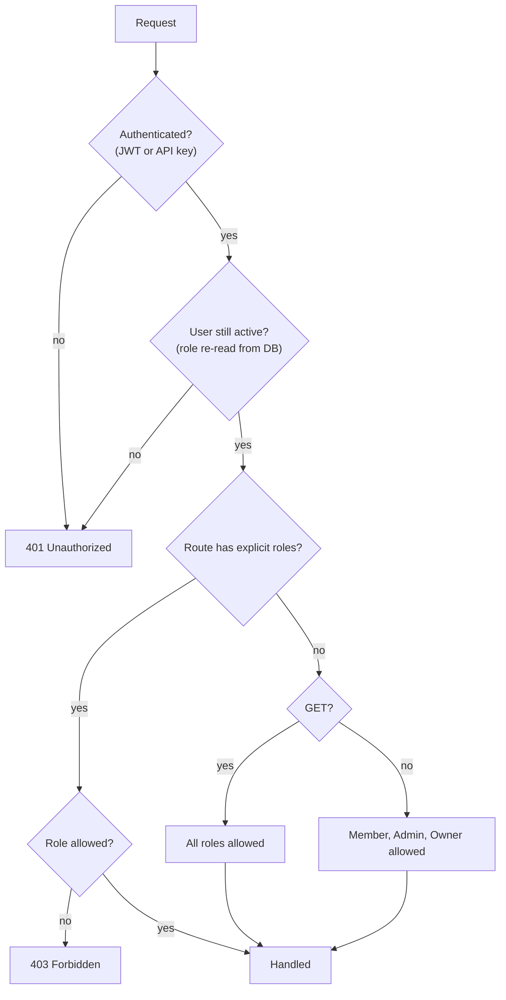

SellEasy has four roles. The **API enforces them on every request**. The web app mirrors the same rules by hiding or disabling controls, but the API is the source of truth. This page is based on the role settings of each backend route (`backend/src/modules/*/routes.ts`).

## Roles

| Role | Who | Summary |
|---|---|---|
| **Owner** | The person who created the workspace (exactly one) | Everything an admin can do, plus **change plan** and **reset workspace**. The owner can't be removed or demoted, and ownership can't be transferred. |
| **Admin** | RevOps, sales leadership | Manages the team, API keys, integrations, waterfall, ICP, playbooks, mailboxes and organization details. |
| **Member** | SDRs, AEs | Works all GTM data: accounts, contacts, imports, signals, drafts, sequences, inbox, deals and autopilot. |
| **Viewer** | Marketing Ops, analysts, executives | Read-only across the product. Can also run the ICP what-if preview and manage their own profile and preferences. |

## How the rules work

- **Default rule:** any `GET` is open to **all roles**. Any write (`POST`, `PUT`, `PATCH`, `DELETE`) needs **Member or above**, unless the route says otherwise.
- **Explicit rules:** some routes need **admin or above** (`atLeast("admin")`) or **owner only**. A few writes are explicitly opened to **every role**: your own profile, preferences, password, logout, marking notifications read, and the ICP preview.
- The user's role is **re-read on every request**, so role changes and removals take effect immediately.
- **API keys** act with **Member** permissions for the user who created the key. Today they are accepted only by the signals webhook, and only with the `signals:write` scope.
- Sign-up, login and accepting an invite need no authentication (these endpoints have stricter rate limits in production).

## Permission matrix

✔ = allowed · – = not allowed

### Workspace & team

| Capability | Viewer | Member | Admin | Owner |
|---|:-:|:-:|:-:|:-:|
| View organization, seat usage, team list | ✔ | ✔ | ✔ | ✔ |
| Edit own profile, change own password, notification preferences, appearance | ✔ | ✔ | ✔ | ✔ |
| Edit organization name, domain, timezone | – | – | ✔ | ✔ |
| **Change plan / seats** | – | – | – | ✔ |
| Invite member, resend invite | – | – | ✔ | ✔ |
| Change a member's role or title¹ | – | – | ✔ | ✔ |
| Remove member / revoke invite² | – | – | ✔ | ✔ |
| View, create, revoke **API keys** | – | – | ✔ | ✔ |
| **Reset workspace / load demo data** (dev only) | – | – | – | ✔ |

¹ Nobody can change their own role or the owner's role, and nobody can be promoted to owner.
² Nobody can remove themselves or the owner.

### Data: accounts, contacts, import, signals

| Capability | Viewer | Member | Admin | Owner |
|---|:-:|:-:|:-:|:-:|
| View accounts, contacts, duplicates, score breakdown, versions, activity | ✔ | ✔ | ✔ | ✔ |
| Global search (⌘K) | ✔ | ✔ | ✔ | ✔ |
| Create, edit, delete accounts and contacts (single and bulk) | – | ✔ | ✔ | ✔ |
| Assign owners, change account stage | – | ✔ | ✔ | ✔ |
| Enrich, re-score, merge, dismiss duplicates | – | ✔ | ✔ | ✔ |
| Verify or find emails | – | ✔ | ✔ | ✔ |
| Import CSV/JSON (download template: all roles) | – | ✔ | ✔ | ✔ |
| Log activities | – | ✔ | ✔ | ✔ |
| View signals and stats | ✔ | ✔ | ✔ | ✔ |
| Ingest, simulate, process, process pending, delete signals | – | ✔ | ✔ | ✔ |

### Intelligence: ICP & agent

| Capability | Viewer | Member | Admin | Owner |
|---|:-:|:-:|:-:|:-:|
| View ICP, defaults | ✔ | ✔ | ✔ | ✔ |
| **ICP live preview** (what-if, nothing saved) | ✔ | ✔ | ✔ | ✔ |
| **Save ICP & re-score** | – | – | ✔ | ✔ |
| View agent runs, stats, drafts, playbooks | ✔ | ✔ | ✔ | ✔ |
| Toggle **autopilot** | – | ✔ | ✔ | ✔ |
| Approve, reject, regenerate drafts | – | ✔ | ✔ | ✔ |
| Create, edit, enable/disable, delete **playbooks** | – | – | ✔ | ✔ |

### Engage: outreach & pipeline

| Capability | Viewer | Member | Admin | Owner |
|---|:-:|:-:|:-:|:-:|
| View sequences, enrollments, performance, inbox, mailboxes | ✔ | ✔ | ✔ | ✔ |
| Create, edit, activate, pause, duplicate, delete sequences and steps | – | ✔ | ✔ | ✔ |
| Enroll contacts, change enrollment status, remove enrollments | – | ✔ | ✔ | ✔ |
| Reply, AI suggest, book meeting, archive, mark read/unread, change sentiment | – | ✔ | ✔ | ✔ |
| Edit mailbox daily limit, warm-up, pause | – | ✔ | ✔ | ✔ |
| **Connect or remove mailboxes** | – | – | ✔ | ✔ |
| View deals, pipeline stats | ✔ | ✔ | ✔ | ✔ |
| Create, edit, move, delete deals | – | ✔ | ✔ | ✔ |
| Sync to CRM | – | ✔ | ✔ | ✔ |
| View analytics, export deals CSV | ✔ | ✔ | ✔ | ✔ |
| View dashboard | ✔ | ✔ | ✔ | ✔ |
| Mark notifications read | ✔ | ✔ | ✔ | ✔ |

### Integrations

| Capability | Viewer | Member | Admin | Owner |
|---|:-:|:-:|:-:|:-:|
| View catalog, stats, sync history, waterfall | ✔ | ✔ | ✔ | ✔ |
| **Sync now** | – | ✔ | ✔ | ✔ |
| Connect, reconnect, rotate key, disconnect | – | – | ✔ | ✔ |
| Change integration settings | – | – | ✔ | ✔ |
| Reorder enrichment waterfall | – | – | ✔ | ✔ |

## How the UI reflects roles

| Role | What changes in the UI |
|---|---|
| Viewer | Create, import, bulk and write buttons are hidden. Selectors, switches and editors are disabled or read-only. Opening an inbox thread doesn't mark it read. The ICP page says edits are a what-if preview. |
| Member | All working controls are shown. Admin-only controls (Save ICP, playbook editing, Connect mailbox, integration connect/configure, waterfall arrows, team management) are hidden or disabled with a tooltip. The **API keys** tab is hidden. |
| Admin | Everything except **Change plan** (disabled with "Only the workspace owner can change the plan") and the reset actions. |
| Owner | Everything. Reset and **Load demo data** appear only when the server enables admin reset. |

<Callout type="info" title="In-app matrix">
**Settings → Team** shows a simplified capability matrix. Its "Manage billing" row really means **change plan and seats**, because SellEasy has no billing flow.
</Callout>

## Related

- [Settings → Team & invites](/docs/product/features/settings#team--invites)
- [Personas](/docs/product/personas)
- [API reference](/docs/engineering/api)
