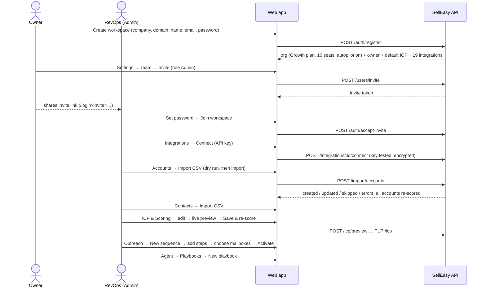
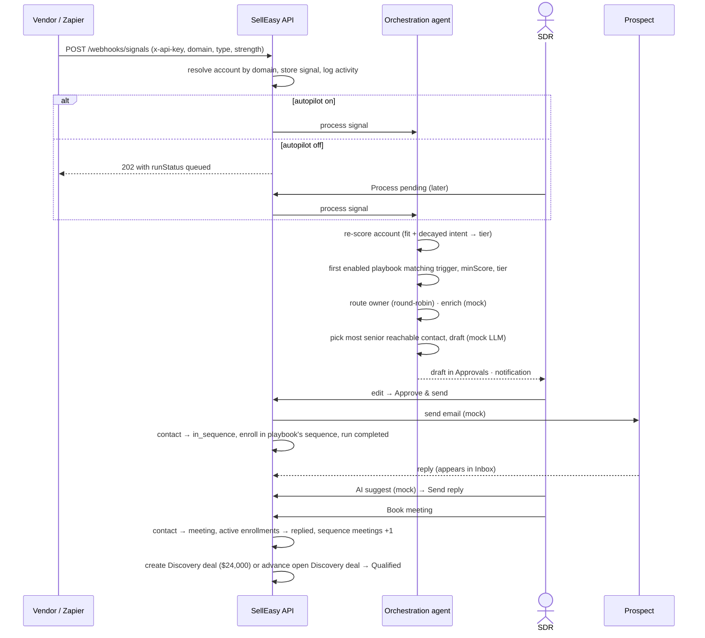
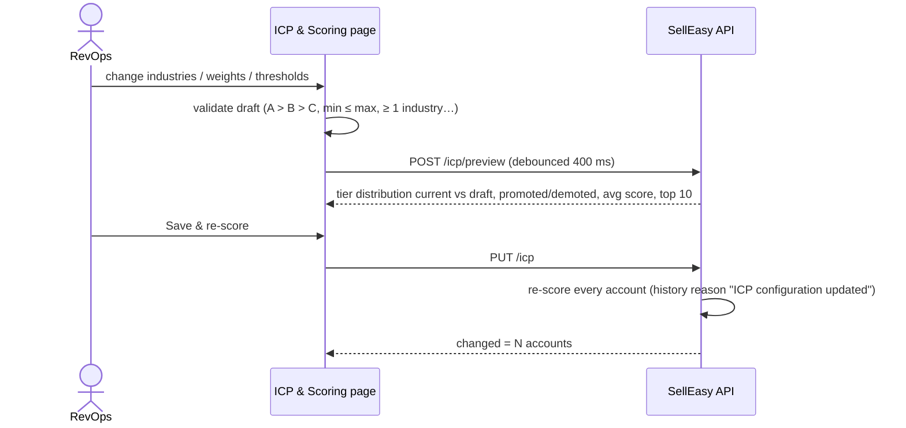
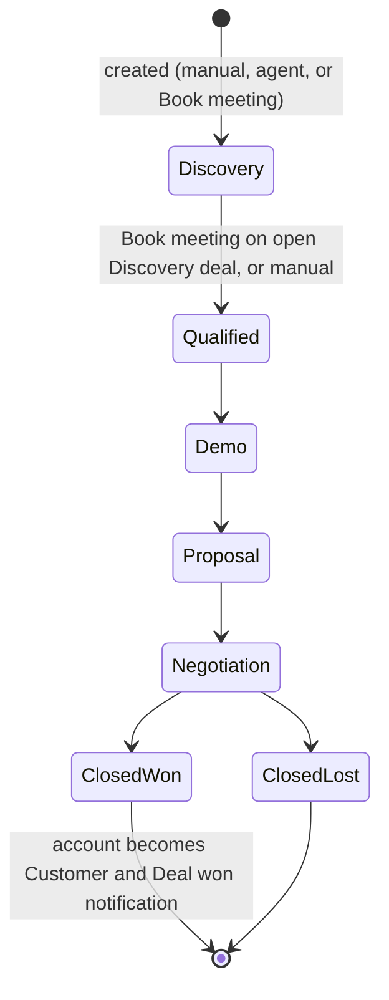
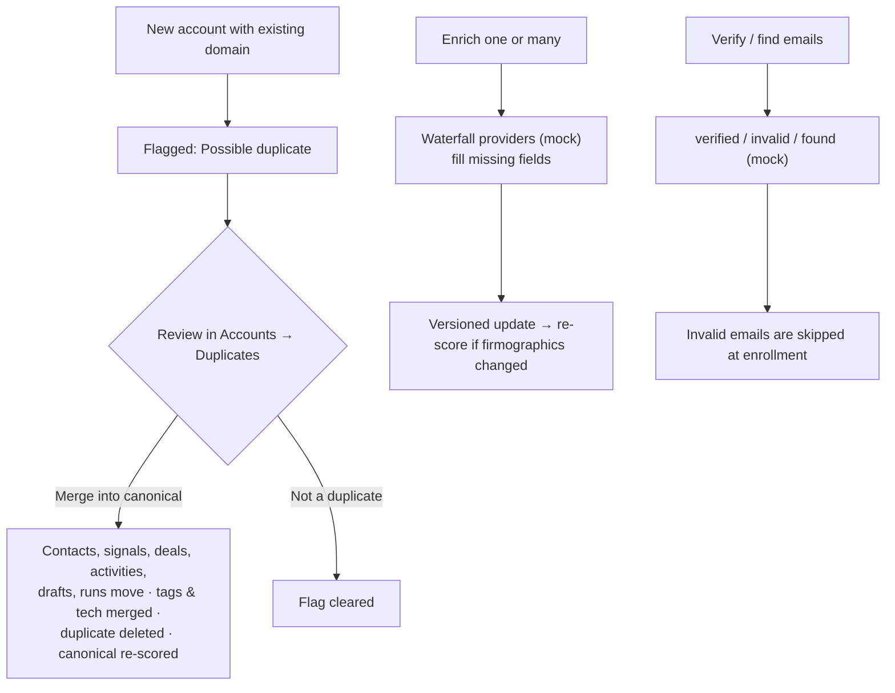

These journeys show how the features work together. Each one lists the actors, a sequence diagram and numbered steps, and describes what the system does at each step. For field-level detail, follow the links to the [feature guide](/docs/product/features).

<Callout type="info" title="Mocked steps">
Steps that call an outside vendor are marked **(mock)**. Today these are enrichment, email verification, LLM drafting, email sending and CRM push. The workflow and data changes are real, but nothing leaves the system. See the [status table](/docs/product#what-is-live-vs-mocked-today).
</Callout>

## (a) First-time setup

**Actors:** workspace owner, RevOps admin. **Goal:** go from an empty workspace to a scored account base with working playbooks.

<Steps>
<Step>

**Create the workspace.** On the login page, open **Create workspace** and enter the company, domain, your name, work email and a password of at least 8 characters. SellEasy creates the organization on the **Growth** plan (10 seats) with autopilot on, makes you the **owner**, and sets up the default ICP and a disconnected catalog of 19 integrations. On a server, the first admin can instead come from `BOOTSTRAP_ADMIN_*` (see [Getting started](/docs/engineering/getting-started)).

</Step>
<Step>

**Invite the team.** Go to **Settings → Team → Invite member**, enter an email and choose Admin, Member or Viewer. Invite emails aren't sent yet, so copy the **invite link** from the dialog and share it yourself. The invitee opens the link, can enter a name, sets a password and joins. Every invite uses a seat right away. See [Settings](/docs/product/features/settings#team--invites).

</Step>
<Step>

**Connect integrations** (admin). On **Integrations**, click **Connect** on each vendor and paste its API key. The key is tested **(mock: any key of 8 or more characters passes)**, encrypted and shown masked afterwards. Order the **Enrichment waterfall** and set sync options under **Configure**. See [Integrations](/docs/product/features/integrations).

</Step>
<Step>

**Import accounts, then contacts.** On **Accounts → Import**, download the template, upload a CSV or JSON file, run **Validate only (dry run)**, fix any rows the error report lists, then run the import. Repeat on **Contacts → Import**. Contacts link to accounts by `accountId`, `accountDomain` or `accountName`, and an unknown domain creates a new account. After any import that creates accounts, every account is re-scored. See [Data import](/docs/product/features/data-import).

</Step>
<Step>

**Configure the ICP** (admin). On **ICP & Scoring**, choose industries, countries, size and revenue, technologies and funding stages. Adjust the fit/intent balance, signal weights, half-life and tier thresholds. The **Live preview** shows tier changes before you save. **Save & re-score** applies the configuration to every account. See [Journey (d)](#d-revops-tunes-the-icp-with-live-preview).

</Step>
<Step>

**Create sequences.** On **Outreach → Sequences → New sequence**, name the sequence and choose an owner and mailboxes. Add steps (email, LinkedIn connect or message, call task, wait), write the copy using variables such as `{{first_name}}`, review the preview, and set the sending window. **Activate** the sequence when it's ready. Connecting mailboxes on **Outreach → Mailboxes** requires an admin.

</Step>
<Step>

**Create playbooks** (admin). On **Agent → Playbooks → New playbook**, choose a trigger, minimum score and tiers, the actions, a sequence (required when the actions include *Enroll in sequence*) and whether approval is required. Playbooks are checked in creation order, and the first match wins. See [Orchestration agent](/docs/product/features/orchestration-agent).

</Step>
<Step>

**Push signals.** An admin creates an API key with the `signals:write` scope (**Settings → API keys**) and points vendors or Zapier at `POST /api/v1/webhooks/signals`. Until then, the team can use **Ingest signal** or **Simulate**.

</Step>
</Steps>

## (b) From signal to meeting

**Actors:** signal vendor, orchestration agent, SDR, prospect. **Goal:** turn a buying signal into a booked meeting and a deal.

<Steps>
<Step>

**A signal arrives.** A vendor sends a signal to the webhook, identifying the account by `accountId` or company `domain`. Domain lookup ignores accounts flagged as duplicates. SellEasy stores the signal and logs a `signal` activity. If an account can't be found, that item fails and the rest of the batch continues.

</Step>
<Step>

**Autopilot decides when the agent runs.** When autopilot is **on**, the agent processes the signal immediately. When it is **off**, the signal waits as *unprocessed* and appears in the sidebar badge and in **Process N pending**.

</Step>
<Step>

**Re-score.** The agent recalculates fit and time-decayed intent across all of the account's signals, then the combined score and tier. It adds a score history point, plus a `score_change` activity if the score changed.

</Step>
<Step>

**Match a playbook.** The agent checks enabled playbooks with trigger `any` or the signal's type, in creation order. The first one whose **minimum score** and **tiers** both match the re-scored account runs. If none match, the run is recorded as **skipped** and no further steps run.

</Step>
<Step>

**Run actions.** In the demo playbook "Hot pricing-page visitors", the actions are:
- **Route to owner:** if the account has no owner, assign it round-robin to the active non-viewer user who owns the fewest accounts.
- **Draft outreach (mock LLM):** pick the most senior contact who isn't unsubscribed or bounced and write a draft that refers to the signal, with a rationale. Because approval is required, the draft is saved as **pending** and the run becomes **awaiting approval**.
- **Notify owner:** post an in-app notification such as "Acme: Visited pricing page".

</Step>
<Step>

**Review and approve.** The SDR opens **Agent → Approvals** (the dashboard and sidebar show the pending count). They read the rationale, edit the subject and body, click **Regenerate** if needed, then **Approve & send**. SellEasy sends the message **(mock)**, marks the draft *sent* and completes the run. It also sets the contact to *in sequence*, enrolls the contact in the playbook's sequence (if one is set and the contact is eligible) and logs the activity.

</Step>
<Step>

**Reply.** The prospect's reply appears in **Outreach → Inbox** with a sentiment. The SDR can click **AI suggest** **(mock)**, which fills a reply template based on the sentiment, then edit it and click **Send reply** (Ctrl/⌘ + Enter). The reply is added to the thread and sent **(mock)**.

</Step>
<Step>

**Book the meeting.** **Book meeting** sets the contact's status to *meeting*. It also marks the contact's active enrollments as *replied*, adds 1 to the sequence's meetings count, marks the message positive and read, and logs a `meeting` activity. If the account already has an open deal in **Discovery**, the deal moves to **Qualified**. If it has an open deal in any other stage, that deal is left unchanged. If it has no open deal, a new **Discovery** deal is created: "*Account* – Discovery", $24,000, closing in 40 days, source "Sequence reply". Creating the deal moves the account to **Opportunity**.

</Step>
</Steps>

<Callout type="info">
Some playbooks open deals directly. For example, the demo playbook "Tier A surge → create deal" uses **Create deal**. It creates a Discovery deal worth `employees × $40` (rounded to the nearest $1,000, or $12,000 when employees is 0), closing in 45 days, with source `Agent: <signal type>`. If the account already has an open deal, the step is skipped.
</Callout>

## (c) Daily SDR workflow

**Actor:** SDR (member). **Goal:** spend the day on the accounts most likely to convert.

<Steps>
<Step>

**Start on the dashboard.** Check **Tier A accounts**, **Signals (7d)**, **Positive replies**, the **Hottest accounts** list (the top 6 by intent) and **Agent activity**. If drafts are pending, click **Review N drafts**.

</Step>
<Step>

**Clear the approvals queue.** In **Agent → Approvals**, approve, edit, regenerate or reject each draft. Rejecting a draft completes its run without sending anything.

</Step>
<Step>

**Work your accounts.** Open **Accounts → My accounts**, sort by **Intent** or **Score** and filter by tier. On an account, check **Intent contributors** to see why it is hot, then **Enrich** it, **Add to sequence**, or **Create deal**.

</Step>
<Step>

**Handle the inbox.** In **Outreach → Inbox**, filter by **Positive**. Reply, **Book meeting**, archive, or correct the sentiment.

</Step>
<Step>

**Keep contacts clean.** On **Contacts**, filter by email status *missing* or *unverified*, select the rows and run **Verify / find emails** **(mock)** before enrolling.

</Step>
<Step>

**Enroll new people.** Select contacts, click **Enroll in sequence** and choose an active or paused sequence. Ineligible contacts (unsubscribed, bounced, invalid email or already active in that sequence) are skipped and counted in the result message.

</Step>
<Step>

**Log activity.** Record calls, meetings and notes on the account's **Activity** tab.

</Step>
</Steps>

## (d) RevOps tunes the ICP with live preview

**Actor:** RevOps (admin). **Goal:** change the scoring model safely.

<Steps>
<Step>Open **ICP & Scoring**. The page loads the saved configuration as an editable draft, and an **Unsaved changes** badge appears once you edit anything.</Step>
<Step>Change the settings. Invalid combinations are listed in a red alert and block saving.</Step>
<Step>Watch the **Live preview**. It shows the number of tier changes (↑ promoted / ↓ demoted), the average score with its delta, a *Current vs Draft* bar chart per tier, and the **Top 10 accounts** by draft score with deltas and previous tiers. The preview saves nothing, and viewers and members can use it too.</Step>
<Step>Use **Discard** to undo edits, or **Reset to defaults** to load the default ICP into the draft (it still needs to be saved).</Step>
<Step>Click **Save & re-score** (admins only). Every account is re-scored, and a message reports how many accounts changed score or tier. Playbooks use the new tiers from the next signal onwards.</Step>
</Steps>

<Callout type="warn">
The preview skips accounts flagged as duplicates, but **Save** re-scores every account, duplicates included. The preview's "current" column is recalculated now with the saved ICP, so it can differ slightly from stored scores if intent has decayed since they were last calculated.
</Callout>

## (e) Pipeline management to closed-won

**Actors:** AE (member), Head of Sales. **Goal:** move deals to close and keep the CRM in sync.

<Steps>
<Step>Open **Pipeline** in **Board** view. Each column shows its deal count and total amount. Cards show the account, amount, close date (red when overdue), CRM sync state, owner and an *Agent* badge for agent-sourced deals.</Step>
<Step>**Drag** a card to another stage, or use the card menu's **Move to stage**. The probability resets to the stage default (10/25/40/60/80/100/0%), and a `stage_change` activity is logged.</Step>
<Step>Open a card to use the **deal sheet**. Edit the name, amount, probability override, close date, owner, primary contact and notes, then **Save**. Log notes on the deal. Any edit marks the deal **unsynced**.</Step>
<Step>Click **Sync to CRM** **(mock)**. Every unsynced deal is pushed to the connected CRM and gets a CRM record ID and a sync time. If no CRM integration is connected, the sync fails with a message asking you to connect one.</Step>
<Step>Move the deal to **Closed won**. The close date becomes today, the probability 100%, the account's stage changes to **Customer** (a versioned change), and a "🎉 Deal won" notification is posted. **Closed lost** only sets the close date and a probability of 0%.</Step>
<Step>The Head of Sales tracks **Open / Weighted pipeline**, **Won this quarter** and **Win rate** at the top of the page, and uses [Analytics](/docs/product/features/analytics) for trends.</Step>
</Steps>

## (f) Data hygiene: duplicates, enrichment and email verification

**Actors:** RevOps, SDR. **Goal:** keep the account base accurate so that scores and outreach can be trusted.

<Steps>
<Step>

**Review duplicates.** **Accounts → Duplicates** (the tab count is highlighted when there are any) shows each flagged record next to its canonical record, with domain, created date, source, industry and contact count. Choose **Merge into canonical** or **Not a duplicate**. An account's page also shows a banner with the same actions.

</Step>
<Step>

**Enrich.** Select accounts and click **Enrich**, or use **Enrich** on an account page. **(mock)** The adapter fills in missing city, description and LinkedIn URL, sets employees to 50 if it was 0, and adds one technology the account doesn't have yet. It records the first two waterfall providers (or "Clearbit" if none are connected) as sources. The update is versioned under "Waterfall enrichment (…)", an `enrichment` activity is logged, and the account is re-scored if its technologies or other firmographics changed.

</Step>
<Step>

**Verify emails.** On **Contacts** or an account's **Contacts** tab, click **Verify emails**. With no selection, this checks every contact that isn't verified yet. **(mock)** Existing addresses come back *verified* or *invalid*. Missing addresses are generated as `first.last@domain` and marked *verified*. The result message shows how many were verified, invalid and found.

</Step>
<Step>

**Audit changes.** Use the account's **History** tab (field-level versions with their source) and **Activity** tab to see who or what changed a record.

</Step>
</Steps>

## Related

- [Core concepts](/docs/product/core-concepts)
- [Roles & permissions](/docs/product/roles-and-permissions)
- [Signals & webhooks API](/docs/engineering/api/signals-and-webhooks)
- [Orchestration agent internals](/docs/engineering/backend/orchestration-agent)
