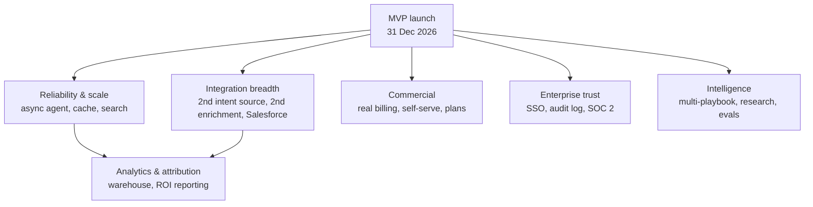

Everything on this page is **deliberately not scheduled** between 5 October and 31 December 2026. It is not forgotten and it is not "phase 4" — there are no further phases planned. It is a ranked backlog that gets re-ranked after launch, against real customers and real data.

<Callout type="info" title="How to read this page">
Each item has a **size** (S ≈ under a week for one engineer, M ≈ 1–3 weeks, L ≈ 3–6 weeks, XL ≈ more than 6 weeks or blocked on something external), a **trigger** — the observable condition that would justify doing it — and what it unblocks. Nothing here is committed. Doing several of these implies either a longer timeline or a larger team ([Team & cost](/docs/team-and-cost)).
</Callout>

## Ranking at launch

This is the expected order on 1 January 2027, and it will be wrong in some way by February. Re-rank it against evidence, not against this page.

## Theme 1 · Reliability and scale

| Item | Size | Trigger | Unblocks |
|---|---|---|---|
| **EventBridge + SQS asynchronous agent execution** | L | Webhook batches start timing out, or agent runs queue behind LLM latency, or sustained job volume passes a few thousand an hour | Bursty vendor traffic, multi-tenant fairness, retries at scale ([Tech debt #6](/docs/engineering/tech-debt), [Orchestration agent](/docs/engineering/backend/orchestration-agent)) |
| **Redis cache** | M | Dashboard p95 exceeds 2 s after the Month 3 SQL tuning, or read load on RDS becomes the constraint | Faster dashboards, session and rate-limit storage shared across tasks |
| **OpenSearch** | M | A workspace passes roughly 100k searchable records, or trigram search p95 exceeds 300 ms | Fast fuzzy search, filters and facets across accounts, contacts and signals ([Tech debt #22](/docs/engineering/tech-debt)) |
| **Worker autoscaling and SLOs** | M | More than one pilot-sized workspace produces sustained load, or a scheduled send batch misses its window | Published uptime and latency commitments |
| **Read replica and query isolation** | S | Analytics queries start affecting transactional latency | Heavier reporting without risking the app |
| **Data-integrity cleanup (dangling references, soft delete, undo)** | M | A customer deletes or imports something they need back | Safer bulk operations ([Tech debt #18](/docs/engineering/tech-debt)) |
| **Multi-region or EU data residency** | XL | The first EU customer makes it a contractual condition | European enterprise deals |

## Theme 2 · Integration breadth

The MVP ships with **one** of each: one LLM, one enrichment vendor, one intent source, one CRM, one sending path. Breadth is the most common thing customers will ask for.

| Item | Size | Trigger | Unblocks |
|---|---|---|---|
| **Second intent source** (Trigify if RB2B shipped, or the reverse) | M | Two or more prospects use the other vendor, or signal volume from one source is too thin | Wider signal coverage |
| **Second enrichment vendor and the waterfall** | M | Match rate from the first vendor sits below roughly 70% on real customer data | Higher coverage and better email-verification rates |
| **Bombora topic surge** | XL (contract-bound) | An enterprise deal depends on topic-surge data; the 4–12 week data agreement is started well in advance | Intent signal that is not website-visitor based |
| **Salesforce sync** | XL | More than roughly a quarter of qualified pipeline is on Salesforce | The half of the market HubSpot does not cover; note the AppExchange security review adds 6–10 weeks if a listing is wanted |
| **Attio sync** | M | Startup-segment demand appears | Modern-CRM segment |
| **Instantly / Mailpool** | M | SES caps or deliverability become the constraint on pilot volume | Higher-volume cold sending, warm-up networks |
| **LinkedIn sending (HeyReach)** | L | Customers consistently ask for multi-channel sequences and accept the account-safety risk | Multi-channel sequences; needs a real `LinkedInProvider` interface, which does not exist today ([Tech debt #2](/docs/engineering/tech-debt)) |
| **Call intelligence (Fireflies)** | M | Customers want meeting outcomes to feed scoring and ICP tuning | Meeting summaries, closed-loop ICP feedback |
| **Apify / Linkup research** | M | Draft quality plateaus and research context is the identified gap | Richer account research in drafts |
| **Public API beyond the signals webhook** | M | A customer asks to build on top, or a partner integration is proposed | Ecosystem and partner integrations |

## Theme 3 · Commercial

| Item | Size | Trigger | Unblocks |
|---|---|---|---|
| **Real billing and payments** | M | Manual invoicing exceeds roughly 10 customers, or self-serve signup is opened | Self-serve revenue; replaces the billing-lite shipped in Month 3 |
| **Usage metering and credit enforcement** | M | LLM or enrichment cost per workspace becomes material relative to price | Usage-based pricing, cost control |
| **Self-serve onboarding at scale** | L | Inbound signups exceed what the founder can onboard by hand | Growth without headcount |
| **Plan and entitlement expansion** | S | Pricing tiers diverge beyond seat counts | Packaging experiments |
| **In-product trial and activation tracking** | M | Conversion from trial to paid needs to be measured and improved | Funnel optimisation |

## Theme 4 · Enterprise trust

| Item | Size | Trigger | Unblocks |
|---|---|---|---|
| **SSO (SAML / OIDC) via Cognito or Auth0, MFA** | L | The first deal where security review names SSO as a requirement | Enterprise procurement; the identity-provider decision is still open ([Decisions](/docs/architecture/decisions#open-decisions)) |
| **Audit log** | M | A customer asks who changed what, or a compliance questionnaire requires it | Compliance questionnaires, enterprise admin |
| **SOC 2 Type I readiness, then Type II** | XL | Deals start stalling on the missing report; expect 4–8 weeks to book an auditor plus months of evidence | Enterprise sales cycles |
| **External penetration test** | S (plus 2–4 weeks lead time) | Booked for Q1 2027 in the Month 3 plan; run it | Security questionnaires, customer confidence |
| **Advanced roles and permissions** | M | Larger teams need finer-grained access than the current role set | Larger revenue teams |
| **Encryption key rotation** | S | A policy requirement or a suspected exposure | Security posture ([Tech debt #21](/docs/engineering/tech-debt)) |

## Theme 5 · Intelligence

| Item | Size | Trigger | Unblocks |
|---|---|---|---|
| **Multi-playbook execution and priority** | M | Customers build overlapping playbooks and complain that only the first match runs; the product decision must be made first ([Product → open questions](/docs/product/roadmap#open-questions)) | Richer orchestration ([Tech debt #20](/docs/engineering/tech-debt)) |
| **Prompt and model evaluation harness at scale** | M | Draft approval rate stalls, or model changes cause silent regressions | Confident prompt and model iteration |
| **Per-customer prompt tuning and brand voice** | M | Partners say drafts do not sound like them | Higher approval and reply rates |
| **Scoring feedback loop from outcomes** | L | Enough closed-won data exists to learn from (realistically 6+ months of usage) | ICP tuning that improves itself |
| **Multiple ICPs and segments** | M | A customer runs two motions in one workspace | Multi-segment customers |
| **Autonomous auto-send with guardrails** | M | Approval throughput becomes the bottleneck and trust in draft quality is established | Higher volume per rep; needs caps, allow-lists and sentiment checks first |
| **Notification preference routing (email, Slack, per-user)** | S | Users miss things in the shared workspace feed | Per-user relevance ([Tech debt #15](/docs/engineering/tech-debt)) |

## Theme 6 · Analytics and attribution

| Item | Size | Trigger | Unblocks |
|---|---|---|---|
| **Redshift (or Snowflake) warehouse** | L | Customers ask for custom date ranges, cohorts or history beyond what Postgres comfortably serves | Historical analytics; the warehouse choice is still open ([Decisions](/docs/architecture/decisions#open-decisions)) |
| **Attribution and agent-influenced pipeline** | L | Renewal conversations need a hard ROI number | The commercial ROI story; depends on the warehouse and on consistent event instrumentation |
| **Historical snapshots and trend reporting** | M | Customers want week-over-week movement, not just current state | Executive reporting |
| **Customer-facing exports and scheduled reports** | S | RevOps asks for data in their own tools | Self-service reporting |

## What would make us pull something forward

Three conditions, in order of authority:

<Steps>
<Step>
### A paying customer is blocked

Not "would like" — blocked from signing or from using the product. This outranks everything on the list. SSO and Salesforce are the two most likely candidates.
</Step>
<Step>
### The platform is failing under real load

A measured, repeated SLO breach — not a prediction. Async agent execution, Redis and OpenSearch each have a numeric trigger in the tables above for exactly this reason.
</Step>
<Step>
### The cost of not doing it is compounding

Manual invoicing, hand-onboarding and missing evaluation coverage all get worse with every customer. These are the items to do before they hurt, not after.
</Step>
</Steps>

Anything that satisfies none of the three stays on this page.

## Related

- [Roadmap overview](/docs/roadmap) · [Month 3 · Harden & launch](/docs/roadmap/month-3-launch)
- [MVP scope → Out of scope](/docs/mvp-scope/out-of-scope) — the same cuts, from the MVP's point of view
- [Engineering → Tech debt](/docs/engineering/tech-debt) — the itemised backlog with code-level detail
- [Architecture → Target architecture](/docs/architecture/target-architecture) · [Decisions](/docs/architecture/decisions)
- [Team & cost](/docs/team-and-cost) — what a larger team would cost
