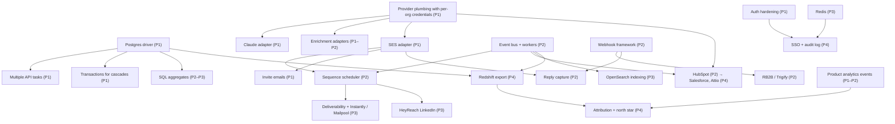

This page covers what the roadmap depends on and what could derail it. MVP-specific risks are in [MVP scope → Risks & assumptions](/docs/mvp-scope/risks-and-assumptions).

## Cross-phase dependencies

| Dependency | Needed by | Blocks if late | Mitigation |
|---|---|---|---|
| Postgres driver | Production with more than one task | Pilot build, every later phase | First epic; highest-seniority backend engineer |
| Provider plumbing (per-org credentials) | All real adapters | Claude, enrichment, SES, CRM | Week 1–2 of Phase 1 |
| SES production access | SES adapter, invites, scheduler | MVP | Request in week 1 |
| Event bus and workers | Scheduler, CRM sync, search indexing, warehouse | Phase 2 and later | Start day 1 of Phase 2 |
| Webhook framework | RB2B, Trigify, inbound events from vendors | MVP | Build once, reuse for all vendors |
| Product analytics events | Success metrics, attribution | MVP gate evidence | Ship first batch in Phase 1 |
| Redshift pipeline | Attribution, historical analytics | Phase 4 ROI story | Keep Postgres-based metrics as fallback |

## Vendor and contract lead times

Lead times are indicative; confirm when outreach starts.

| Vendor / item | What is needed | Typical lead time | Start by | Needed by |
|---|---|---|---|---|
| AWS | Organization, accounts, SES production access, service quotas | 1–5 days (SES review) | Week 1 (Oct 2026) | Month 1 |
| Anthropic | API organization, spend limits, data-handling terms | Days | Week 1 | Month 1 |
| Clearbit (HubSpot Breeze) or Apollo | API plan with enough credits; sandbox | 1–3 weeks | Week 1 | Month 2 |
| RB2B | Partner / API access, webhook secret | 1–3 weeks | Month 1 | Month 3 |
| Trigify | API access | 1–3 weeks | Month 2 | Month 4 |
| **Bombora** | Enterprise data agreement | **4–12 weeks** | Month 1 | Month 4 (conditional) |
| HubSpot | Developer account, public app registration; marketplace listing optional | Days (app) / 2–6 weeks (listing) | Month 1 | Month 3 |
| Penetration test firm | Scoping and booking | 2–4 weeks | Month 3 | Month 4 |
| Instantly / Mailpool | Accounts and API plans | Days | Month 4 | Month 5 |
| HeyReach | API plan | Days | Month 4 | Month 6 |
| Apify / Linkup | Accounts, usage plans | Days | Month 4 | Month 5 |
| Billing provider | Account, tax settings | 1–2 weeks | Month 6 | Month 8 |
| Compliance platform (Vanta, Drata or similar) | Contract, integrations | 2–4 weeks | Month 6 | Month 7 |
| SOC 2 auditor | Engagement letter | 4–8 weeks | Month 7 | Month 9 |
| **Salesforce AppExchange** | Partner program, security review | **6–10 weeks** | Month 6 | Month 9 (listing optional) |
| Fireflies | Business plan with API | Days | Month 8 | Month 9 |

## Hiring dependencies

| Role | Needed from | Typical time to hire (US / India) | Impact if late | Fallback |
|---|---|---|---|---|
| Lead engineer | Before month 1 | 6–10 weeks / 4–8 weeks | Whole plan shifts | Founder-engineer covers; fractional architect |
| Backend engineer 1 | Month 1 | 6–8 / 4–6 weeks | Postgres driver slips | Contractor for the driver |
| Frontend engineer | Month 1 | 5–8 / 4–6 weeks | Onboarding and auth UI slip | Lead engineer covers; contractor |
| Backend engineer 2 | Month 2 | 6–8 / 4–6 weeks | SES, scheduler slip → MVP slips | Contractor; defer Trigify |
| Integrations engineer | Month 2 | 6–10 / 4–8 weeks | Enrichment, RB2B, HubSpot slip | Vendor-experienced contractor |
| ML/LLM engineer (0.5) | Month 1 | 6–10 / 6–8 weeks | Draft quality risk | Lead engineer + prompt consultant |
| DevOps (0.5) | Month 1 | 2–4 weeks (fractional firm) | Staging slips | AWS partner or consultancy |
| QA | Month 2 | 4–6 / 3–5 weeks | Launch quality | Engineers own tests; contract QA |
| GTM / solutions | Month 5 | 6–8 / 4–6 weeks | GA onboarding load on PM | Founders cover |

Hiring timelines are a major schedule risk. If recruiting starts in September 2026, only the lead engineer, one backend engineer, frontend and PM are realistic for 5 October. The plan already staggers the rest to month 2.

## Roadmap risks

| ID | Risk | Phase | Likelihood | Impact | Mitigation | Owner |
|---|---|---|:-:|:-:|---|---|
| RR1 | Hiring takes longer than planned | 1–2 | H | H | Start recruiting now; contractors for Postgres and integrations; stagger scope | Founders |
| RR2 | Vendor contracts or API access delayed (Bombora, RB2B, AppExchange) | 1–4 | M | H | Start outreach in month 1; fallbacks (generic webhook, CSV); conditional epics | PM |
| RR3 | Deliverability problems undermine results | 2–3 | H | H | Warmed domains, limits, monitoring, approval default; Instantly / Mailpool in Phase 3 | Lead engineer |
| RR4 | Integration complexity underestimated (scheduler, HubSpot sync) | 2 | H | M | Earliest possible start; narrow scope; holiday buffer | Lead engineer |
| RR5 | LLM quality or cost off target | 1–3 | M | M | Evals, per-task model choice, caching, token budgets | ML/LLM engineer |
| RR6 | Design partners don't convert to paid | 3 | M | H | Signed success criteria; weekly scorecards; pricing tested early | Founders |
| RR7 | Scope creep from enterprise prospects | 3–4 | H | M | Scope change rule; GA gate re-ranking of Phase 4 | PM |
| RR8 | Security incident | Any | L | H | Pen test, Secrets Manager, least privilege, audit log, incident drills | Lead engineer |
| RR9 | Key-person dependency on the lead engineer | Any | M | H | ADRs, pairing, documented runbooks | Lead engineer |
| RR10 | AWS costs exceed plan at scale | 3–4 | L | M | Budgets and alerts; rightsizing; Savings Plans after GA | DevOps |
| RR11 | Platform policy changes (LinkedIn automation, email provider terms) | 3 | M | M | Feature flags; customer responsibility terms; alternative providers | PM |
| RR12 | Mock demo diverges from the product | Any | L | L | `mock:check` in CI; separate demo deployment | Frontend engineer |

## Decision points and go / no-go gates

| Gate | When | Go if… | If no-go |
|---|---|---|---|
| **G0 · Kickoff** | 5 Oct 2026 | Lead engineer, backend 1, frontend and PM in seat; budget approved for at least 6 months; AWS and Anthropic accounts ready | Delay start; use contractors to begin Postgres work |
| **G1 · Pilot** | 27 Nov 2026 | [Phase 1 exit criteria](/docs/roadmap/phase-1-foundation#exit-criteria-pilot-gate) met; ≥ 3 partners ready | Extend Phase 1 by ≤ 2 weeks; hold partner kickoffs |
| **G2 · MVP launch** | 5 Feb 2027 | [Phase 2 exit criteria](/docs/roadmap/phase-2-real-integrations#exit-criteria-mvp-launch-gate) met; launch checklist gates checked | Fix-forward sprint (≤ 2 weeks); cut Should items |
| **G3 · GA** | 2 Apr 2027 | [Phase 3 exit criteria](/docs/roadmap/phase-3-scale-and-intelligence#exit-criteria-ga-gate) met; ≥ 50% partner conversion | Stay in paid beta; revisit positioning, pricing and ICP before spending on Phase 4 |
| **G4 · Enterprise** | 2 Jul 2027 | [Phase 4 exit criteria](/docs/roadmap/phase-4-enterprise-and-analytics#exit-criteria-enterprise-gate) met | Focus on mid-market self-serve; defer SOC 2 audit |

### Other decisions with dates

| Decision | Options | Decide by | Why then |
|---|---|---|---|
| First enrichment vendor | Clearbit (Breeze) or Apollo | Week 2 of Phase 1 | Adapter work starts in month 2 |
| IaC tool | Terraform or CDK | Week 1 | Blocks staging |
| Frontend hosting | Vercel or CloudFront + S3 | Month 1 | Affects CI and domains |
| Bombora go / no-go | Contract or defer | Start of Phase 2 | Conditional epic |
| Deal ownership after two-way sync | CRM wins, SellEasy wins, most recent | Start of Phase 2 | HubSpot sync design |
| Multi-playbook semantics | First match, all matches, priority + stop | Start of Phase 3 | Agent epic design |
| Identity provider | Cognito or Auth0 | Mid Phase 3 | SSO epic starts month 7 |
| Pricing model | Seats, or seats + usage credits | Mid Phase 3 | GA pricing page; billing epic |
| Warehouse | Redshift Serverless or Snowflake | End of Phase 3 | Analytics epic starts month 7 |
| Phase 4 ranking | Re-rank epics on GA data | G3 | Capacity is limited |

## Related

- [Timeline → critical path](/docs/roadmap/timeline#critical-path)
- [Team & cost → assumptions](/docs/team-and-cost/assumptions)
- [Architecture → Decisions](/docs/architecture/decisions)
