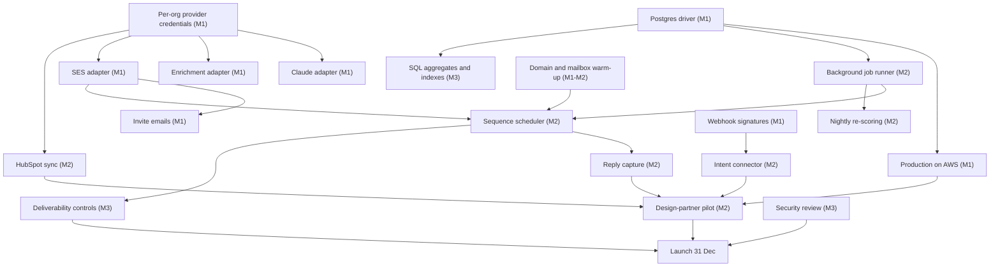
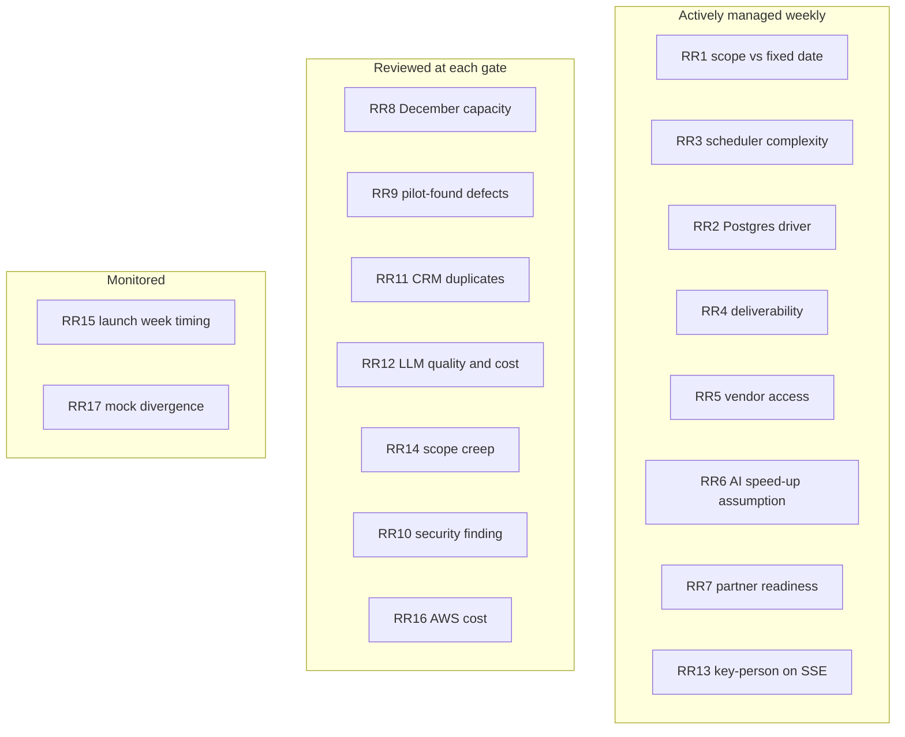

This page covers what could stop SellEasy launching on **31 December 2026**. MVP-specific product risks are in [MVP scope → Risks & assumptions](/docs/mvp-scope/risks-and-assumptions).

<Callout type="warn" title="The single defining risk">
**Three engineers and a fixed date means scope is the only variable.** There is no bench, no contractor budget assumed, and no QA safety net. Every month page carries an explicit "cut first if the month is slipping" list, and the gates below are real decisions. If the plan is behind, the answer is always to cut scope first, and only then — at the 18 December freeze — to consider moving the date.
</Callout>

## Technical dependency chain

| Dependency | Needed by | What it blocks if late | Mitigation |
|---|---|---|---|
| **Postgres driver** | End of week 3 | Production, the job runner, everything after | First epic, most senior engineer, `jsonb`-per-collection shape to stay close to the existing JSON driver |
| **Per-org provider credentials actually used** | Week 2 | Every real adapter | Small refactor of the provider factory in week 1 |
| **SES production access** | Week 3 | SES adapter, invite emails, the whole scheduler | Request on day 1; transactional fallback for invites while the review runs |
| **Domain and mailbox warm-up** | From 16 Oct | Pilot sending volume in Month 2 and deliverability at launch | Start in week 2; keep Month 2 volumes deliberately tiny |
| **Background job runner** | Week 6 | Scheduler, re-scoring, stat rollups, CRM retries | Postgres-backed queue rather than SQS — roughly a week instead of a month |
| **Webhook signature verification** | Week 4 | Accepting real vendor traffic safely | Built as part of Month 1 auth hardening |
| **One intent vendor with API access** | Week 5 | The signal half of the loop | RB2B preferred, Trigify as the fallback, generic webhook + Zapier as the no-vendor fallback |
| **HubSpot private app** | Week 5 | CRM half of the loop | Developer account in week 4; no marketplace listing attempted |
| **Design-partner mailbox access** | Week 7 | Reply capture | Raised in the partner kickoff, not in week 7 |
| **2–3 design partners with real data** | 16 Nov | Evidence for the G2 gate and the launch | Recruiting runs through Month 1; sign written success criteria |

## Vendor and contract lead times

Lead times are indicative. The pattern that matters: **everything is started in Month 1**, even when it is not needed until Month 2 or 3, because contracts and reviews do not compress.

| Vendor / item | What is needed | Typical lead time | Start by | Needed by |
|---|---|---|---|---|
| **AWS** | Organisation, accounts, service quotas | Days | Week 1 | Week 2 |
| **AWS SES production access** | Out of sandbox, sending quota increase | 1–5 days, occasionally longer with follow-up questions | **Day 1** | Week 3 |
| **Anthropic** | API organisation, spend limits, data-handling terms | Days | Week 1 | Week 2 |
| **Sending domain** | Registration, SPF / DKIM / DMARC, mailboxes | Days to set up, **2–4 weeks to warm** | **Week 1–2** | Pilot sending, week 7 |
| **Enrichment vendor** (Clearbit or Apollo) | Plan with enough credits, sandbox key | 1–3 weeks | Week 1, decided week 2 | Week 3 |
| **RB2B** (or Trigify) | Partner / API access, webhook secret | 1–3 weeks | **Week 1** | Week 5 |
| **HubSpot** | Developer account, private app | Days | Week 4 | Week 5 |
| **Sentry** | Account and project | Hours | Week 3 | Week 4 |
| **Design partners** | Signed success criteria, mailbox and CRM access | 2–4 weeks of conversations | Week 1 | 16 Nov |
| Penetration test firm | Scoping and booking | 2–4 weeks | December | **Q1 2027, not before launch** |

<Callout type="info" title="Deliberately not started">
Bombora (4–12 week data agreement), Salesforce AppExchange (6–10 week security review), SOC 2 auditors (4–8 weeks to engage, then months of evidence) and billing providers are **not** contacted in these three months. Each has a lead time longer than the value it would add before 31 December. They live in [Beyond the MVP](/docs/roadmap/beyond-the-mvp).
</Callout>

## Team dependencies

| Assumption | Impact if untrue | Fallback |
|---|---|---|
| All three engineers are in seat on **5 October** | The whole plan shifts day for day; there is no slack to absorb it | Founder-engineer covers week 1–2 setup; cut Month 1 scope in the documented order |
| The SSE is genuinely senior — can own architecture, AWS, Postgres and review everything | The plan has no second person who can carry the platform work | Fractional AWS help for the IaC stack only; do not outsource the Postgres driver |
| Both SEs are fluent in AI-assisted development from day one | The AI-assistance assumption in the estimates disappears and the plan becomes roughly a 5-month plan | Week 1 includes pairing on the workflow; if it has not taken by week 3, cut scope rather than pretend |
| The founder is genuinely available as PM — priorities, partners, decisions within a day | Decisions queue up and block engineers; a 3-person team cannot absorb a week of ambiguity | Named decision list with dates (below); default to the reversible option when the founder is unavailable |
| Nobody is lost to illness or leave for more than a week | Roughly 8% of total capacity per person-week lost, with no cover | Pair on the risky epics so no epic has exactly one person who understands it |

Budget for this team is in [Team & cost](/docs/team-and-cost) and the role breakdown in [Team plan](/docs/team-and-cost/team-plan).

## Risk register

Likelihood and impact: **H** high · **M** medium · **L** low.

| ID | Risk | Month | Likelihood | Impact | Mitigation | Owner |
|---|---|:-:|:-:|:-:|---|---|
| RR1 | **Fixed date plus three people**: scope does not fit and nothing gives | All | **H** | **H** | A named "cut first" list per month; gates with real no-go options; the freeze decision on 18 Dec | Founder |
| RR2 | Postgres driver takes longer than three weeks (cascades, transactions, aggregates) | 1 | M | **H** | Most senior engineer, first epic; full test suite against Postgres as the acceptance gate; enrichment moves to Month 2 if it slips | SSE |
| RR3 | Scheduler and reply capture are more complex than estimated (time zones, windows, threading, bounces) | 2 | **H** | **H** | Start week 5; property-based tests on window arithmetic; named reduced version (single mailbox, workspace time zone, reply detection without threading UI) | SSE |
| RR4 | Deliverability is poor at launch because warm-up started late or ramped too fast | 1–3 | M | **H** | Warm-up from 16 Oct; hard caps well under capacity; approval on by default; bounce rate watched daily | SSE |
| RR5 | Vendor access (RB2B / Trigify) does not arrive in time | 2 | M | **H** | Build against recorded fixtures; two vendors pursued, one shipped; generic webhook plus a Zapier bridge needs no vendor at all | SE-1 |
| RR6 | AI assistance does not deliver the assumed speed-up | All | M | **H** | Measure against the week-3 and week-6 plan, not against optimism; if behind at G1, cut Month 2 scope immediately rather than at G2 | SSE |
| RR7 | Design partners are not ready with real data by 16 November | 2 | M | **H** | Recruit from week 1 with written success criteria; internal dogfooding on the founder's own outbound as a fallback data source | Founder |
| RR8 | December capacity is lower than planned (holidays, illness, fatigue after two hard months) | 3 | **H** | M | Freeze on 18 Dec; weeks 12–13 planned as burn-down only; week 9–11 scope sized to be cuttable | Founder |
| RR9 | Pilot reveals real defects in existing scoring, dedup or agent logic at real volumes | 2–3 | M | M | It is the purpose of the pilot; ~20% of Month 3 reserved for burn-down | SSE |
| RR10 | Security review finds something structural (tenancy isolation, authorisation model) | 3 | L | **H** | Run the review in week 11, not week 13; a structural finding is an explicit no-go trigger | SSE |
| RR11 | HubSpot two-way sync creates duplicates or fights the CRM over ownership | 2–3 | M | M | Conflict policy decided 6 Nov; idempotency keys; a week of pilot traffic with zero duplicates is a G2 criterion | SE-1 |
| RR12 | LLM quality or cost off target | 1–3 | M | M | Eval set in CI from week 2; per-task model choice; token budgets and a per-org daily ceiling | SE-1 |
| RR13 | Key-person dependency on the SSE (one of three people knows the platform) | All | **M** | **H** | ADRs for every significant decision; runbooks written as the infra lands; pair on the Postgres and AWS work | SSE |
| RR14 | Scope creep from design partners or prospects mid-flight | 2–3 | **H** | M | One ranked triage list; only P0 bugs jump the queue; every new request goes to [Beyond the MVP](/docs/roadmap/beyond-the-mvp) | Founder |
| RR15 | Launching on 31 December lands in a dead commercial week | 3 | **H** | L | Accept it: 31 Dec is the engineering milestone; commercial launch activity runs in January | Founder |
| RR16 | AWS cost overruns from an over-built platform | 1–3 | L | M | Budgets and alerts in week 4; deliberately minimal architecture — no Redis, no OpenSearch, no queues | SSE |
| RR17 | Mock demo mode diverges from the real product | All | L | L | `mock:check` in CI; parity check at the end of Month 1 ([Mock mode](/docs/engineering/frontend/mock-mode)) | SE-2 |

### Risk heat map

## Go / no-go gates

Three gates, each a genuine decision made by the founder with the SSE. A gate is passed only when every criterion on the month page is demonstrably true — not "nearly".

| Gate | Date | Go if… | If no-go |
|---|---|---|---|
| **G1 · Production** | Mon 2 Nov 2026 | [Month 1 exit criteria](/docs/roadmap/month-1-foundation#exit-criteria-g1--production-gate-2-november) met: production on Postgres, backups restored in a drill, a Claude-drafted email delivered via SES, no mock warnings in the critical path, warm-up under way, 3 partners signed | **Do not start Month 2 scope.** Take up to one week to finish the foundation and cut Month 2 by the same amount — in practice this means dropping HubSpot pull sync and sequence-stat polish. A second week of slip here means the launch scope is cut to "signal in, draft, single-mailbox send" and the CRM sync is deferred entirely |
| **G2 · Pilot** | Mon 30 Nov 2026 | [Month 2 exit criteria](/docs/roadmap/month-2-integrations#exit-criteria-g2--pilot-gate-30-november) met: ≥ 2 partners live on real data for ≥ 2 weeks, the full loop demonstrated, scheduler hitting its windows, no dead-letter backlog | **The launch scope shrinks, the date does not.** Drop billing-lite, reduce docs to getting-started plus integration setup, and launch with whichever of the loop's legs is proven. If neither sending nor CRM sync works on real data, launch moves to mid-January and Month 3 becomes a recovery month |
| **G3 · Launch** | Thu 31 Dec 2026 | [Month 3 exit criteria](/docs/roadmap/month-3-launch#exit-criteria-g3--launch-gate-31-december) met and every **(gate)** item in the [launch checklist](/docs/mvp-scope/launch-checklist) signed off | Do not launch with open P0s or an unresolved high-severity security finding. Slip to mid-January with a written, dated plan. **This decision is made at the 18 December freeze, not on 31 December** |

### Decisions with dates

A three-person team cannot absorb open questions. Each of these has a date and a default.

| Decision | Options | Decide by | Default if undecided |
|---|---|---|---|
| IaC tool | Terraform · CDK | Wed 7 Oct | Terraform — broader hiring pool, better documented |
| Frontend hosting in production | Vercel · CloudFront + S3 | Fri 9 Oct | Vercel — less infra for one platform engineer to own |
| First enrichment vendor | Clearbit (Breeze) · Apollo | Fri 16 Oct | Apollo — faster to contract, adequate coverage |
| Intent vendor | RB2B · Trigify | Fri 30 Oct | Whichever has granted API access by that date |
| CRM conflict ownership | CRM wins · SellEasy wins · most recent wins | Fri 6 Nov | CRM wins — least surprising to a RevOps buyer |
| Reply capture mechanism | IMAP polling · provider webhook | Fri 13 Nov | Whichever the first two partners' mailboxes support |
| Billing approach for launch | Billing-lite + manual invoices · a billing provider | Fri 4 Dec | Billing-lite — a provider does not fit the timeline |
| Launch or slip | Launch 31 Dec · slip to mid-January | **Fri 18 Dec** | Launch, if and only if the G3 criteria are met |

Architectural decisions are recorded as ADRs in [Architecture → Decisions](/docs/architecture/decisions); open product questions are tracked in [Product → Roadmap & status](/docs/product/roadmap#open-questions).

## Related

- [Roadmap overview](/docs/roadmap) · [Timeline → critical path](/docs/roadmap/timeline#critical-path)
- [Month 1](/docs/roadmap/month-1-foundation) · [Month 2](/docs/roadmap/month-2-integrations) · [Month 3](/docs/roadmap/month-3-launch)
- [Beyond the MVP](/docs/roadmap/beyond-the-mvp)
- [MVP scope → Risks & assumptions](/docs/mvp-scope/risks-and-assumptions) · [Launch checklist](/docs/mvp-scope/launch-checklist)
- [Team & cost → assumptions](/docs/team-and-cost/assumptions)
