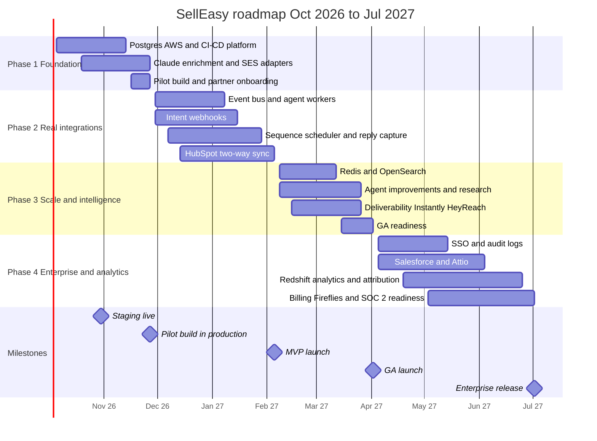
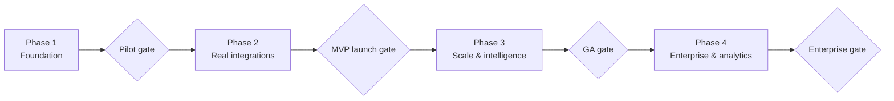

This roadmap covers **October 2026 to early July 2027**. It starts from today's state — the whole workflow is built, but storage is JSON files and every vendor adapter is a mock — and ends with an enterprise-ready platform. For the current feature status and limitations, see [Product → Roadmap & status](/docs/product/roadmap).

<Callout type="info" title="Planning basis">
Dates assume work starts on **Monday 5 October 2026** with the team in [Team plan](/docs/team-and-cost/team-plan). "Month 1" is October 2026 and "Month 9" is June 2027. The first **6 months** (Phases 1–3) take the product to general availability. **Months 7–9** (Phase 4) add enterprise and analytics capabilities and can be re-scoped based on GA results.
</Callout>

## Themes

| Theme | What it means | Phases |
|---|---|---|
| **Make it real** | Replace mocks with Postgres, AWS hosting and real vendor adapters | 1, 2 |
| **Close the loop** | Real signals in, real emails out, replies back, deals synced to the CRM | 2 |
| **Make it dependable** | CI/CD, observability, queues, retries, backups, security hardening | 1 → 3 |
| **Make it smarter** | Claude drafting, research, better playbooks, scheduled scoring | 1 → 3 |
| **Make it scale** | Redis, OpenSearch, autoscaling workers, deliverability tooling | 3 |
| **Make it enterprise-ready** | SSO, audit logs, Salesforce, warehouse analytics, billing, SOC 2 readiness | 4 |

## Phases

| Phase | Months | Dates (approx.) | Goal | Key deliverables | Exit criteria |
|---|---|---|---|---|---|
| [**1 · Foundation**](/docs/roadmap/phase-1-foundation) | 1–2 | 5 Oct – 27 Nov 2026 | Production-grade platform and first real adapters; pilot build | Postgres driver + migrations, AWS staging and production, CI/CD, observability, auth hardening, Claude drafting, one enrichment vendor, SES, invite emails | Pilot build in production; 3+ design partners onboarding; restore rehearsed |
| [**2 · Real integrations**](/docs/roadmap/phase-2-real-integrations) | 3–4 | 30 Nov 2026 – 5 Feb 2027 | Close the signal → meeting → CRM loop with real systems | RB2B / Trigify webhooks, Bombora (if contracted), HubSpot two-way sync, sequence scheduler, reply capture, EventBridge + SQS agent workers | **MVP launch**: all [MVP](/docs/mvp-scope) Musts live; 5+ partners on real data for 2 weeks |
| [**3 · Scale & intelligence**](/docs/roadmap/phase-3-scale-and-intelligence) | 5–6 | 8 Feb – 2 Apr 2027 | Handle GA volume and make the agent smarter | Redis, OpenSearch, playbook priority and multi-playbook, LLM research, deliverability tooling, Instantly / Mailpool, HeyReach, self-serve onboarding | **GA launch**; SLOs met for 4 weeks; paid conversion of partners |
| [**4 · Enterprise & analytics**](/docs/roadmap/phase-4-enterprise-and-analytics) | 7–9 | 5 Apr – 2 Jul 2027 | Win larger customers and prove ROI | SSO (Cognito or Auth0), audit logs, Salesforce and Attio, Redshift analytics and attribution, Fireflies, billing and plans, SOC 2 readiness | First enterprise customer live; SOC 2 Type I audit scheduled; billing live |

## Timeline

Month-by-month detail, owners and dependencies are in [Timeline](/docs/roadmap/timeline).

## Now / Next / Later

<Tabs items={['Now (Months 1–2)', 'Next (Months 3–6)', 'Later (Months 7–9+)']}>
  <Tab value="Now (Months 1–2)">
    - PostgreSQL driver, migrations and data migration script
    - AWS staging and production (ECS Fargate, RDS, IaC), CI/CD
    - Sentry, metrics, alerts and runbooks
    - Auth hardening and invite emails
    - Claude drafting and reply suggestions
    - One enrichment vendor (Clearbit or Apollo)
    - SES sending
    - Design-partner pilot build; stakeholder demo stays on mock mode
  </Tab>
  <Tab value="Next (Months 3–6)">
    - RB2B and Trigify webhooks; Bombora if contracted
    - HubSpot two-way sync
    - Sequence scheduler, inbound reply capture, real sequence stats
    - EventBridge + SQS agent workers
    - **MVP launch** (month 4)
    - Redis cache, OpenSearch search
    - Playbook priority and multi-playbook runs, LLM account research
    - Deliverability tooling, Instantly / Mailpool, HeyReach LinkedIn
    - **GA launch** (month 6)
  </Tab>
  <Tab value="Later (Months 7–9+)">
    - SSO via Cognito or Auth0, MFA, audit logs
    - Salesforce and Attio sync
    - Redshift analytics, attribution, agent-influenced pipeline
    - Fireflies call intelligence
    - Billing, plans and usage metering
    - SOC 2 Type I readiness
    - Beyond this plan: EU region, service extraction, multiple ICPs, mobile
  </Tab>
</Tabs>

## How the phases connect

Each gate is a go / no-go decision with explicit criteria. See [Dependencies & risks](/docs/roadmap/dependencies-and-risks#decision-points-and-go--no-go-gates).

## KPIs by phase

| Phase | Product KPIs | Platform KPIs |
|---|---|---|
| 1 | 3+ partners onboarding; first approved Claude draft sent via SES | Deploys per week ≥ 5; restore ≤ 1 h; zero mock warnings in production |
| 2 | Activation ≥ 80%; draft approval ≥ 70%; reply rate ≥ 5% | Webhook p95 ≤ 1 s; signal → draft p95 ≤ 2 min; DLQ empty daily |
| 3 | 20+ paying workspaces; WAU/seats ≥ 60%; meetings ≥ 4 per workspace per month | 99.9% API uptime; dashboard p95 ≤ 2 s; search p95 ≤ 300 ms |
| 4 | First enterprise logo; agent-influenced pipeline reported per customer; net revenue retention tracked | SSO live; audit coverage of admin actions 100%; SOC 2 controls ≥ 90% passing |

## Related

- [Team & cost](/docs/team-and-cost): team by phase and budget
- [MVP scope](/docs/mvp-scope): what Phases 1–2 must deliver
- [Target architecture](/docs/architecture/target-architecture): where the platform is heading
- [Engineering → Tech debt](/docs/engineering/tech-debt): the backlog the phases draw from
