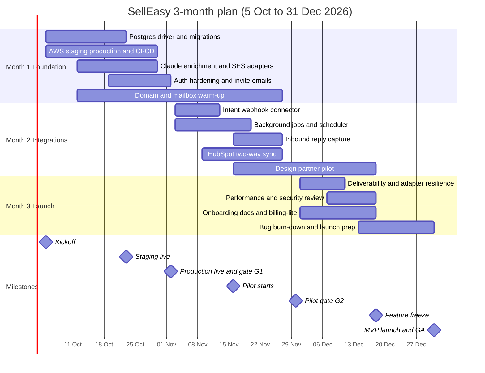
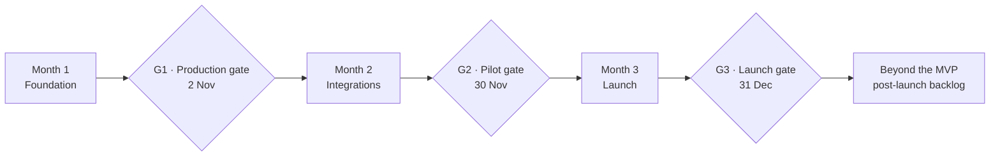

SellEasy's product workflow is already built: signals, scoring, the orchestration agent, approvals, sequences, pipeline and analytics all work end to end. What is missing is the plumbing to the real world — storage is JSON files and every vendor adapter is a mock. This roadmap covers the **three months** needed to swap those mocks for real systems and launch.

<Callout type="info" title="Planning basis">
Work starts **Monday 5 October 2026** and the MVP launches (GA) on **Thursday 31 December 2026**. The team is **three engineers** — one Senior Software Engineer and two Software Engineers — using AI pair-programming heavily. Budget for this team is in [Team & cost](/docs/team-and-cost). Feature status today is in [Product → Roadmap & status](/docs/product/roadmap).
</Callout>

## The goal

> By 31 December 2026, a paying design partner can log in to SellEasy in production, connect HubSpot and a real intent source, let the agent draft outreach with Claude, approve it, have it sent from a warmed domain on a schedule, see the reply land in the inbox, and watch the deal appear in their CRM — with no mocks anywhere in that path.

Everything in this plan either serves that sentence or is explicitly deferred.

## Who is doing it

| Role | Count | Owns |
|---|---|---|
| **SSE** — Senior Software Engineer (tech lead) | 1 | Architecture and ADRs, the Postgres driver, AWS and IaC, CI/CD, secrets, backups, observability, security, code review on every PR |
| **SE-1** — Software Engineer (integrations-leaning) | 1 | Vendor adapters: Claude, enrichment, SES, the intent webhook, HubSpot sync, reply capture |
| **SE-2** — Software Engineer (frontend-leaning) | 1 | Frontend wiring, auth and onboarding UI, settings and integration screens, scheduler UI, docs and support tooling |

There is **no product manager, no designer, no DevOps engineer and no QA engineer** on this plan. The **founder acts as PM** (priorities, design-partner relationships, scope calls, go/no-go decisions). The **SSE owns infrastructure** as part of the engineering job, not as a separate function. **Everyone tests** — there is no QA gate to hide behind, so tests ship with the PR and the design partners are the acceptance environment. Design work is limited to reusing the existing UI conventions ([UI conventions](/docs/engineering/frontend/ui-conventions)); no new visual language is created in these three months.

<Callout type="warn" title="Three people and a fixed date">
Three engineers and a fixed 31 December launch means **scope is the only variable that can flex**. Every month has a named list of "cut first" items, and the gate at the end of each month is a real go/no-go, not a formality. See [Dependencies & risks](/docs/roadmap/dependencies-and-risks).
</Callout>

## Why three months is realistic here

This is not a greenfield build. Three specific things make the compression possible:

<Steps>
<Step>
### The product is already built

Every domain module, API route, screen, scoring rule and agent playbook exists and is tested. The work is **replacing implementations behind interfaces that already exist** — `Repository`, the provider interfaces in `providers/index.ts`, the event bus. That is mechanical work, not discovery work. See [Tech debt](/docs/engineering/tech-debt), which is effectively this roadmap's backlog.
</Step>
<Step>
### The interfaces were designed for this

The Postgres driver slots in behind the existing `Repository` interface ([Data layer](/docs/engineering/backend/data-layer)). Vendor adapters slot in behind the existing provider factories ([Events & providers](/docs/engineering/backend/events-and-providers)). Env keys for all of it are already defined ([Configuration](/docs/engineering/configuration)).
</Step>
<Step>
### AI-assisted development is assumed, not optional

The team uses Claude Code / AI pair-programming as a default working mode, not an experiment. Every engineer is expected to be fluent in it from day one.
</Step>
</Steps>

### What AI assistance actually speeds up

Be honest about this, because the plan depends on it:

| AI assistance genuinely compresses | AI assistance does not help at all |
|---|---|
| Scaffolding the Postgres driver from the `Repository` interface and the existing JSON driver | Vendor contracts, pricing negotiation and API access approvals |
| Writing vendor adapters from OpenAPI specs and vendor docs (Claude, SES, HubSpot, enrichment, RB2B) | Domain and mailbox **warm-up**, which needs 2–4 weeks of real calendar time regardless of headcount |
| Generating SQL migrations and the JSON → Postgres data-move script | AWS SES production-access review and service-quota increases |
| Writing test suites, fixtures and recorded vendor responses | Security review findings that require design changes |
| Terraform / CDK modules from a described target architecture | Design-partner recruiting, onboarding calls and feedback cycles |
| Keeping these docs and runbooks in sync with the code | Deliverability reputation, which is earned over time |
| Reviewing diffs for the obvious classes of bug before the SSE reviews them | Judgement calls: what to cut, what "good enough" means, who to launch with |

The right mental model: AI assistance roughly halves the **typing-and-boilerplate** half of the work and barely touches the **waiting-and-deciding** half. That is why the calendar-bound items (warm-up, vendor access, pilot feedback) are front-loaded into Month 1 even though they are not engineering work.

## The three-month shape

| Month | Dates | Goal | Key deliverables | Exit criteria |
|---|---|---|---|---|
| [**1 · Foundation**](/docs/roadmap/month-1-foundation) | 5 Oct – 2 Nov 2026 | Run the existing product for real: real database, real hosting, real LLM, real sending | Postgres driver + migrations, ECS Fargate + RDS staging and production, CI/CD, Secrets Manager, automated backups, Sentry + metrics + alerts, auth hardening, Claude drafting adapter, one enrichment vendor, SES sending, invite emails, domain warm-up started | Production is live on Postgres with no mock warnings in the critical path; a Claude-drafted email is sent through SES from a real domain; restore from backup rehearsed |
| [**2 · Integrations**](/docs/roadmap/month-2-integrations) | 3 Nov – 30 Nov 2026 | Close the loop: real signal in, real email out, real reply back, real deal in the CRM | One intent webhook (RB2B or Trigify), HubSpot two-way sync, sequence scheduler with send windows and daily limits, inbound reply capture, background jobs for scheduled sending and re-scoring, pilot with 2–3 design partners on their own data | The full loop runs on a partner's real data for at least two weeks; sequences advance on schedule; replies appear in the inbox; deals appear in HubSpot |
| [**3 · Launch**](/docs/roadmap/month-3-launch) | 1 Dec – 31 Dec 2026 | Make it dependable, defensible and sellable | Deliverability controls, rate limits / retries / idempotency on every adapter, performance pass, security review, onboarding and docs, billing-lite or manual invoicing, bug burn-down | [Launch checklist](/docs/mvp-scope/launch-checklist) gates all green; **MVP launch / GA on 31 December 2026** |

Week-by-week detail is in [Timeline](/docs/roadmap/timeline).

## Themes

| Theme | What it means | Months |
|---|---|---|
| **Make it real** | Postgres, AWS hosting, Claude, SES, one enrichment vendor — no mocks in the critical path | 1 |
| **Close the loop** | Real intent signal in, scheduled email out, reply captured, deal in HubSpot | 2 |
| **Make it dependable** | CI/CD, observability, backups, retries, idempotency, rate limits, security review | 1 → 3 |
| **Prove it on real data** | Design partners running their own accounts, contacts and signals through the product | 2 → 3 |
| **Make it sellable** | Onboarding, docs, deliverability guardrails, invoicing, launch checklist | 3 |

## Now / Next / Later

<Tabs items={['Now (Month 1)', 'Next (Months 2–3)', 'Later (post-launch)']}>
  <Tab value="Now (Month 1)">
    - PostgreSQL driver behind the existing `Repository` interface, migrations, JSON → Postgres data-move script
    - ECS Fargate + RDS staging and production via IaC; CI/CD; Secrets Manager; automated RDS backups with a rehearsed restore
    - Sentry, structured logs, a handful of real metrics and alerts
    - Auth hardening: session policy, invite expiry, webhook signatures, API key scopes
    - Anthropic Claude adapter for drafting and reply suggestions
    - One enrichment vendor (Clearbit or Apollo — decided in week 2)
    - AWS SES sending, invite emails, and **domain + mailbox warm-up started by mid-October**
    - Vendor contracts and API keys chased in week 1, not week 6
  </Tab>
  <Tab value="Next (Months 2–3)">
    - One intent webhook connector — RB2B preferred, Trigify as the fallback
    - HubSpot two-way sync (contacts, companies, deals)
    - Sequence step scheduler: send windows, day offsets, mailbox rotation, daily limits, stop-on-reply
    - Inbound reply capture (IMAP or provider webhook) feeding the existing inbox
    - Background jobs: scheduled sending, nightly intent re-scoring, sequence stats
    - Pilot with 2–3 design partners on their own data from 16 November
    - Deliverability controls, rate limits, retries and idempotency on every adapter
    - Performance pass on the analytics and dashboard queries
    - Security review, onboarding flow, docs, billing-lite or manual invoicing
    - **Feature freeze 18 December · MVP launch / GA 31 December**
  </Tab>
  <Tab value="Later (post-launch)">
    Not scheduled in these three months. Sized and triggered in [Beyond the MVP](/docs/roadmap/beyond-the-mvp):

    - Redis cache and OpenSearch
    - EventBridge + SQS for asynchronous agent execution
    - SSO via Cognito or Auth0, MFA, audit log
    - Salesforce and Attio CRM sync
    - Redshift warehouse, attribution and historical analytics
    - Call intelligence (Fireflies)
    - Multi-playbook execution and playbook priority
    - LinkedIn sending (HeyReach)
    - Remaining vendors: Bombora, Trigify (if RB2B ships first), Instantly / Mailpool, Apify, Linkup
    - SOC 2 Type I readiness
  </Tab>
</Tabs>

## What is deliberately deferred

Everything below is **cut from the three months**, each with a one-line reason. The full post-launch backlog is in [Beyond the MVP](/docs/roadmap/beyond-the-mvp).

| Deferred | Reason it does not fit |
|---|---|
| Redis cache | Postgres indexes and a small query pass are enough at pilot volumes; adding a cache tier costs a week and buys nothing yet |
| OpenSearch | Postgres trigram or substring search covers pilot-sized datasets |
| EventBridge + SQS agent workers | A simple in-process job runner on a schedule is enough below pilot volume; the async rewrite is a month of work on its own |
| SSO, MFA, audit log | No design partner has asked for it; local JWT auth hardened in Month 1 is sufficient for mid-market pilots |
| Salesforce and Attio | HubSpot covers the target ICP; Salesforce needs a connected app and AppExchange review that alone exceeds the timeline |
| Redshift warehouse and attribution | Operational analytics computed from Postgres are enough for three months of pilot data |
| Call intelligence (Fireflies) | Not on the path from signal to meeting to CRM |
| Multi-playbook execution and priority UI | Open product decision; first-match-wins is a defensible default for launch |
| LinkedIn sending (HeyReach) | Extra vendor plus account-safety risk; email proves the loop first |
| Instantly / Mailpool | SES covers pilot volumes with conservative daily limits |
| Bombora | 4–12 week enterprise data agreement — longer than the entire plan |
| Second enrichment vendor / waterfall | One vendor proves the value; the waterfall is a match-rate optimisation |
| Apify / Linkup research agent | Needs evaluation work on output quality that there is no room for |
| SOC 2 Type I | Months of evidence collection; a security overview document and a DPA carry the pilots |
| Billing and usage metering | Replaced by billing-lite: seat limits already exist, invoices are issued manually |
| Self-serve onboarding at scale | Design partners are onboarded by hand; self-serve is a post-launch growth problem |
| Multiple ICPs and segments | Each pilot runs one motion |
| Notification preference routing | Shared workspace feed plus Slack webhook is acceptable for three pilots |

## KPIs per month

| Month | Product / delivery KPIs | Platform KPIs |
|---|---|---|
| **1** | 3 design partners signed with written success criteria; first Claude-drafted email approved and sent through SES; enrichment returns real firmographics on 100 test accounts | Production on Postgres; deploys per week ≥ 5; restore from backup rehearsed and timed ≤ 1 h; zero mock-provider warnings in production logs; Sentry catching real errors |
| **2** | 2–3 partners live on their own data; ≥ 1 real intent signal → agent run → approved draft → sent email per partner per week; ≥ 1 deal synced to HubSpot per partner | Webhook ingest p95 ≤ 1 s; scheduler sends within its window on ≥ 99% of due steps; reply capture latency ≤ 5 min; failed jobs retried and visible |
| **3** | Launch checklist all green; ≥ 1 partner willing to be referenced; draft approval rate ≥ 60%; bounce rate ≤ 2%; open bugs at P0/P1 = 0 at freeze | API p95 ≤ 500 ms on the top 10 routes; dashboard p95 ≤ 2 s; no unresolved high-severity security findings; adapters idempotent and rate-limited |

## How the months connect

Gate criteria and what happens on a no-go are in [Dependencies & risks](/docs/roadmap/dependencies-and-risks#go--no-go-gates).

## Related

- [Month 1 · Foundation](/docs/roadmap/month-1-foundation)
- [Month 2 · Real integrations](/docs/roadmap/month-2-integrations)
- [Month 3 · Harden & launch](/docs/roadmap/month-3-launch)
- [Beyond the MVP](/docs/roadmap/beyond-the-mvp)
- [Timeline](/docs/roadmap/timeline) — week by week
- [Dependencies & risks](/docs/roadmap/dependencies-and-risks)
- [MVP scope](/docs/mvp-scope) — what must be true to launch
- [Team & cost](/docs/team-and-cost) — the three-person budget
- [Target architecture](/docs/architecture/target-architecture) — where the platform is heading
- [Engineering → Tech debt](/docs/engineering/tech-debt) — the backlog this plan draws from
