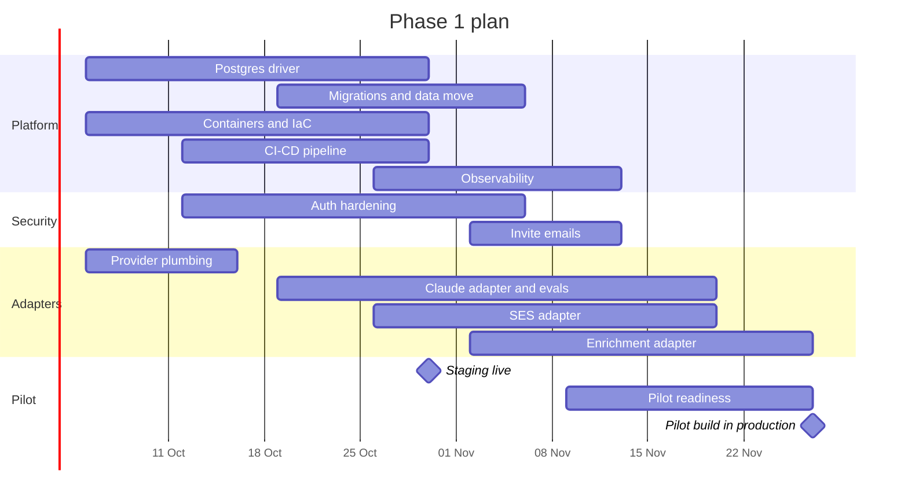

**Months 1–2 · 5 October – 27 November 2026 (8 weeks)**

Phase 1 turns SellEasy from a local application on JSON files and mocks into a hosted, observable platform that design partners can use. It also ships the three adapters with the highest value per unit of effort: **Claude drafting**, **one enrichment vendor** and **SES sending**.

## Objectives

1. Run the API statelessly on AWS with PostgreSQL, in staging and production.
2. Deploy safely and often, and know quickly when something breaks.
3. Replace the most visible mocks with real vendors.
4. Put a pilot build in front of the first 3+ design partners.
5. Keep the stakeholder demo (mock mode) working throughout.

## Scope and epics

| Epic | Scope | Size | Tech debt | Owner (role) |
|---|---|:-:|---|---|
| **E1.1 PostgreSQL driver** | `PostgresRepository` implementing the repository contract; transaction API for cascades; unique indexes (user email, API key hash); API tests on Postgres in CI | L | #1, #7 | Backend engineer 1 |
| **E1.2 Migrations & data move** | Migration tool and baseline schema (one table per collection, `org_id` first in indexes); JSON → Postgres migration script preserving ids and timestamps | M | #1 | Backend engineer 1 |
| **E1.3 Containers & IaC** | Dockerfile, docker-compose for local Postgres; Terraform or CDK for VPC, ECS Fargate, ALB, RDS, S3, Secrets Manager, CloudFront + WAF | L | #24 | DevOps (fractional) + lead engineer |
| **E1.4 CI/CD** | GitHub Actions: lint, type check, tests, `mock:check`, image build, deploy to staging on merge, manual promotion to production, rollback | M | #24 | DevOps + lead engineer |
| **E1.5 Observability** | Sentry (API + web), metrics and dashboards (CloudWatch or Datadog), alerts, structured log shipping, on-call runbooks | S | #25 | DevOps |
| **E1.6 Auth hardening** | Short-lived access tokens + refresh tokens (httpOnly cookie), logout revocation, password rules, shared rate-limit store, placeholder-secret rejection in production, configurable `trust proxy` | M | #11, #26 | Backend engineer 2 |
| **E1.7 Invite emails** | Send invite links through SES; expiry; stop returning tokens in production | S | #4 | Backend engineer 2 |
| **E1.8 Claude adapter** | `LlmProvider` for Anthropic (`claude-opus-5` drafts, `claude-haiku-4-5` fast tasks); prompt templates; per-org token budget; usage logging; evaluation set (~50 scenarios) | M | #2 | ML/LLM engineer + backend engineer 1 |
| **E1.9 Enrichment adapter** | One vendor (Clearbit or Apollo) behind the waterfall; per-org credentials; real connection test; usage metering; recorded fixtures | M | #2 | Integrations engineer (from month 2) / backend engineer 2 |
| **E1.10 SES adapter** | `EmailProvider` for SES; domain verification flow; configuration set; bounce and complaint events to SNS | M | #2 | Backend engineer 2 |
| **E1.11 Provider plumbing** | Factory per provider keyed by env; interfaces take `orgId`; decrypt per-org credentials; real sync log records | S | #2, #16 | Lead engineer |
| **E1.12 Pilot readiness** | `ENABLE_SIMULATION=false` in production; onboarding empty states; product analytics events (first batch); design-partner workspaces | S | #5 | PM + frontend engineer |
| **E1.13 Design partners** | Sign 5–8 partners; collect vendor prerequisites (RB2B, HubSpot, domains); schedule kickoffs | — | — | Founders + PM |

## Sequence within the phase

## Deliverables

- Staging (week 4) and production (week 8) on AWS, created from code.
- `DB_DRIVER=postgres` in both environments; JSON used only for local development and the browser demo.
- CI/CD pipeline with automatic staging deploys and one-click production promotion and rollback.
- Dashboards, alerts and runbooks; on-call rota.
- Claude-generated drafts and reply suggestions with token budgets and cost logging.
- One real enrichment vendor and SES sending, with domain verification.
- Invite emails; hardened sessions.
- Pilot build in production with design-partner workspaces.
- The Vercel stakeholder demo still on `NEXT_PUBLIC_DATA_SOURCE=mock`, kept in sync by CI.

## Team focus

| Role | Focus this phase |
|---|---|
| Lead engineer | Architecture, provider plumbing, reviews, IaC with DevOps |
| Backend engineer 1 | Postgres driver, migrations, Claude adapter integration |
| Backend engineer 2 (joins month 2) | Auth hardening, SES, invites |
| Frontend engineer | Auth flows (refresh tokens), onboarding empty states, analytics events |
| Integrations engineer (joins month 2) | Enrichment adapter, vendor sandboxes, fixtures |
| ML/LLM engineer (0.5) | Prompts, evaluation set, model choice per task |
| DevOps (0.5) | AWS accounts, IaC, CI/CD, observability |
| QA (0.5, from month 2) | Test plan for MVP acceptance criteria; Playwright smoke suite |
| Product manager | Design-partner pipeline, MVP acceptance criteria, instrumentation plan |
| Designer (0.5) | Onboarding, approval queue ergonomics |

See [Team plan](/docs/team-and-cost/team-plan).

## Exit criteria (pilot gate)

- [ ] Production and staging run on AWS with `DB_DRIVER=postgres`; at least two API tasks in production.
- [ ] A database restore has been rehearsed in ≤ 1 hour.
- [ ] CI blocks merges on failing tests, including API tests on Postgres and `mock:check`.
- [ ] Production logs contain no "using mock" warnings for LLM, email and enrichment.
- [ ] An approved Claude draft has been delivered through SES to an external inbox and passed SPF / DKIM / DMARC.
- [ ] At least three design partners have production workspaces and a scheduled kickoff.
- [ ] Error tracking and alerting are live, with an on-call rota.

## KPIs

| KPI | Target |
|---|---|
| Deploys to production per week (last 2 weeks) | ≥ 5 |
| Change failure rate | ≤ 15% |
| API uptime (production, last 2 weeks) | ≥ 99.5% |
| Offline eval: drafts rated "send" or "minor edit" | ≥ 75% (≥ 80% by MVP launch) |
| Enrichment match rate on partner lists | Measured; ≥ 70% target |
| Design partners signed | ≥ 5 |

## Risks specific to this phase

- **Postgres migration surprises** — mitigate with the full test suite on Postgres from week 2.
- **AWS account and SES production access** can take days — request SES production access in week 1.
- **Hiring lag** for backend engineer 2 and the integrations engineer — descope E1.9 to month 3 if needed (the MVP still needs it by Phase 2's end).

More in [Dependencies & risks](/docs/roadmap/dependencies-and-risks).

## Next

[Phase 2 · Real integrations](/docs/roadmap/phase-2-real-integrations)
