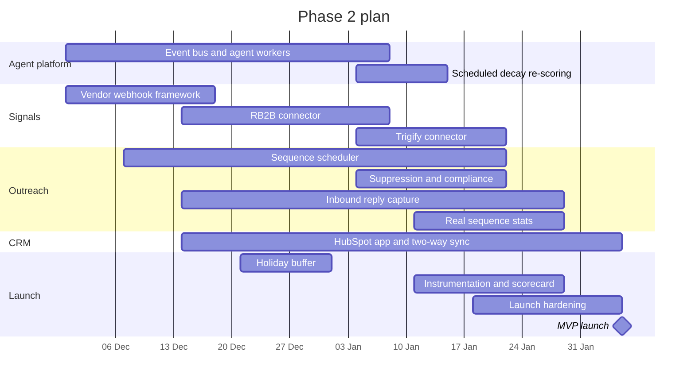

**Months 3–4 · 30 November 2026 – 5 February 2027 (10 weeks, including a two-week holiday buffer)**

Phase 2 closes the core loop with real systems: **real signals in → Claude drafts → emails out on a schedule → replies back → deals in HubSpot**. It ends with the **MVP launch**: every Must in [MVP scope](/docs/mvp-scope/in-scope) is live.

## Objectives

1. Ingest real intent signals from at least one vendor, verified and idempotent.
2. Move agent processing off the request path onto queues.
3. Send sequences automatically within sending windows and limits, and capture replies.
4. Keep HubSpot and SellEasy deals in sync in both directions.
5. Run 5+ design partners on real data for at least two weeks.

## Scope and epics

| Epic | Scope | Size | Tech debt | Owner (role) |
|---|---|:-:|---|---|
| **E2.1 Event bus and agent workers** | `EventBus` on EventBridge with an outbox table; SQS signals queue; agent worker entry point; idempotent `processSignal`; retries and DLQ; webhook returns `202` with `run: null`; publish `draft.approved` | M | #6, #19 | Lead engineer + backend engineer 1 |
| **E2.2 Vendor webhook framework** | Vendor-specific routes with HMAC verification, replay protection, event-id dedup, mapping to signal types, minimum-strength filter, sync log | M | #10 | Integrations engineer |
| **E2.3 RB2B connector** | Website visits → `website_visit` signals; unknown-domain rule (create or ignore) | S | — | Integrations engineer |
| **E2.4 Trigify connector** | Social engagement and job changes → signals | S | — | Integrations engineer |
| **E2.5 Bombora (conditional)** | Scheduled pull of topic surge per account (only if a contract is signed by month 3) | M | — | Integrations engineer |
| **E2.6 Sequence scheduler** | EventBridge Scheduler tick every minute; due enrollments inside send window; outreach queue; mailbox rotation and daily limits; step advancement; `wait` and `call` steps; completion; `sentToday` reset | L | #3 | Backend engineer 2 |
| **E2.7 Suppression and compliance** | Unsubscribe links and handling, suppression list, bounce and complaint processing from SES events | M | #3 | Backend engineer 2 |
| **E2.8 Inbound reply capture** | SES inbound (S3 + SNS) → match to contact and sequence → sentiment with `claude-haiku-4-5` → stop on reply → status updates → notifications | M | #9 | Backend engineer 1 + ML/LLM engineer |
| **E2.9 Real sequence stats** | Event-driven counters and per-status enrollment counts; replace modelled per-step numbers for email | M | #13, #17 | Backend engineer 1 |
| **E2.10 HubSpot app** | OAuth app; upsert companies, contacts, deals with associations; stage mapping; deal webhooks; conflict policy; score and tier write-back; CRM sync queue | L | — | Integrations engineer + lead engineer |
| **E2.11 Second enrichment vendor (Should)** | FullEnrich or Prospeo for emails, falling through in the waterfall | S | #2 | Integrations engineer |
| **E2.12 Scheduled decay re-scoring** | Nightly re-score per org without history noise; re-score on signal delete | S | #8 | Backend engineer 1 |
| **E2.13 Instrumentation and MVP dashboard** | Remaining product events; agent-influenced pipeline query; internal MVP scorecard | S | — | Frontend engineer + PM |
| **E2.14 Launch hardening** | Pen test, load test at 10× pilot volume, launch checklist, support runbooks | M | #24 | QA + DevOps + lead engineer |

## Sequence within the phase

## Deliverables

- Signals from RB2B (and Trigify) arriving in real time, verified and de-duplicated.
- Agent runs on SQS workers; webhooks respond in under a second.
- Sequences that send, advance, respect windows and limits, and stop on reply, unsubscribe or bounce.
- Replies in the inbox with automatic sentiment.
- HubSpot two-way deal sync with conflict handling and score write-back.
- Real outreach statistics.
- MVP scorecard dashboard per design partner.
- Completed [launch checklist](/docs/mvp-scope/launch-checklist) and pen test.

## Team focus

| Role | Focus this phase |
|---|---|
| Lead engineer | Event bus design, HubSpot architecture, launch readiness |
| Backend engineer 1 | Agent workers, inbound capture, stats, decay job |
| Backend engineer 2 | Scheduler, suppression, SES events |
| Integrations engineer | Webhook framework, RB2B, Trigify, HubSpot, second enrichment vendor |
| Frontend engineer | Integration setup flows (OAuth connect, webhook secrets), sequence and inbox UI updates, scorecard |
| ML/LLM engineer (0.5) | Sentiment classification, prompt iteration from partner feedback |
| DevOps (0.5) | Queues, DLQ alarms, scheduler, load test environment |
| QA (1.0 from month 4) | Acceptance criteria automation, time-zone and scheduling tests, regression |
| Product manager | Partner onboarding, weekly scorecard reviews, scope control |
| Designer (0.5) | Integration setup UX, inbox and approvals polish |

## Exit criteria (MVP launch gate)

- [ ] All [MVP Musts](/docs/mvp-scope/in-scope) are live in production with real integrations.
- [ ] All [acceptance criteria](/docs/mvp-scope/acceptance-criteria) pass in staging.
- [ ] Every **(gate)** item in the [launch checklist](/docs/mvp-scope/launch-checklist) is checked.
- [ ] 5+ design partners have used production with real data for 2 consecutive weeks with no Sev-1 incident.
- [ ] Pen test high findings are fixed.

## KPIs

| KPI | Target |
|---|---|
| Activation (partners meeting all activation criteria in 7 days) | ≥ 80% |
| Draft approval rate | ≥ 70% |
| Reply rate on agent-drafted sequences | ≥ 5% |
| Webhook p95 response time | ≤ 1 s |
| Signal → draft ready (p95) | ≤ 2 min |
| Bounce rate per mailbox | ≤ 2% |
| DLQ messages older than 24 h | 0 |

Full targets: [Success metrics](/docs/mvp-scope/success-metrics).

## Risks specific to this phase

- **Scheduler complexity** (time zones, daylight saving, limits) — start in week 1; property-based tests.
- **HubSpot app review and scopes** — register the app in Phase 1; use a private app for pilots if the public listing is not ready.
- **Holiday period** reduces capacity — two-week buffer already included.
- **Bombora contract** may not land — the epic is conditional and does not block the MVP.

## Next

[Phase 3 · Scale & intelligence](/docs/roadmap/phase-3-scale-and-intelligence)
