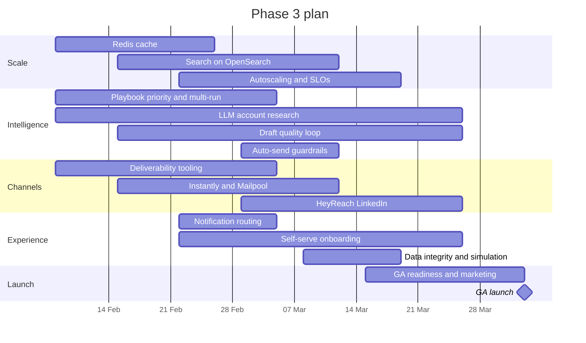

**Months 5–6 · 8 February – 2 April 2027 (8 weeks)**

Phase 3 prepares SellEasy for **general availability (GA)**: more customers, more signals and more sending, with a smarter agent and self-serve onboarding. It ends with the GA launch and the conversion of design partners to paid plans.

## Objectives

1. Keep dashboards and search fast at GA volumes.
2. Make the agent more capable and easier to control.
3. Make cold-email sending safe at volume and add LinkedIn as a channel.
4. Let new customers onboard without hand-holding.
5. Meet GA service-level objectives (SLOs) for four consecutive weeks.

## Scope and epics

| Epic | Scope | Size | Tech debt | Owner (role) |
|---|---|:-:|---|---|
| **E3.1 Redis cache** | ElastiCache; cache for `/analytics/*`, stats endpoints and `/meta`; event-driven invalidation; Redis rate-limit store (if not done) | M | #12, #26 | Backend engineer 1 |
| **E3.2 Search** | Postgres trigram as an interim step, then OpenSearch indexed from domain events; ⌘K on OpenSearch | M | #22 | Backend engineer 2 |
| **E3.3 Playbook priority and multi-playbook** | `priority` field and drag-to-reorder; optional "run all matches" with a stop flag; run trace shows each evaluated playbook | M | #20 | Backend engineer 1 + frontend engineer |
| **E3.4 LLM account research** | Research worker using Claude with web search and Linkup / Apify inputs; research summary on the account page; research context in drafts; batch processing for bulk runs | L | — | ML/LLM engineer + integrations engineer |
| **E3.5 Draft quality loop** | Learn from edits and rejections (prompt tuning, playbook-level tone and guidance), eval set expanded to ~200 scenarios, model choice per task (`claude-opus-5` / `claude-sonnet-5` / `claude-haiku-4-5`) | M | — | ML/LLM engineer |
| **E3.6 Deliverability** | Mailbox health from real bounce and complaint data; auto-pause; DNS (SPF / DKIM / DMARC) checks; warm-up status; backend deliverability alerts | M | #14 | Backend engineer 2 |
| **E3.7 Instantly and Mailpool** | `EmailProvider` adapters for volume sending with warm-up; reply and bounce webhooks | M | #2 | Integrations engineer |
| **E3.8 HeyReach (LinkedIn)** | New `LinkedInProvider`; LinkedIn steps (connect, message) through HeyReach; accept and reply webhooks; per-sender daily limits | M | #2 | Integrations engineer |
| **E3.9 Auto-send guardrails** | Daily caps per playbook, domain allow-lists, sentiment and content checks before auto-send | S | — | Backend engineer 1 |
| **E3.10 Notification routing** | Per-user notifications, preferences honoured, email and Slack delivery, "notify owner" | S | #15 | Backend engineer 2 |
| **E3.11 Self-serve onboarding** | Guided setup (import → connect → ICP → playbook → sequence), sample playbooks, in-app help | M | — | Frontend engineer + designer |
| **E3.12 Autoscaling and SLOs** | Queue-depth autoscaling for workers, API autoscaling, SLO dashboards, error budgets, capacity test at GA volume | M | — | DevOps + lead engineer |
| **E3.13 Data integrity** | Decide and implement delete behaviour per relation; soft delete for accounts and imports | S | #18 | Backend engineer 2 |
| **E3.14 Remove simulation** | Delete the simulate endpoint and button from the API build (demo keeps it in mock mode via overrides, or drop it) | S | #5 | Frontend engineer |

## Sequence within the phase

## Deliverables

- Cached dashboards and OpenSearch-backed global search.
- Playbook ordering, multi-playbook runs and auto-send guardrails.
- Account research summaries and research-aware drafts.
- Deliverability monitoring with automatic mailbox pausing.
- Volume sending through Instantly or Mailpool; LinkedIn steps through HeyReach.
- Per-user notifications by email and Slack.
- Self-serve onboarding.
- Autoscaling, SLO dashboards and error budgets.
- **GA release**, public pricing page and paid plans (invoiced until Phase 4 billing).

## Team focus

| Role | Focus this phase |
|---|---|
| Lead engineer | Scale architecture, SLOs, GA readiness |
| Backend engineers (2) | Cache, search, playbooks, guardrails, deliverability, notifications, data integrity |
| Integrations engineer | Instantly, Mailpool, HeyReach, research data sources |
| Frontend engineer | Playbook ordering, onboarding, research panel, notification settings |
| ML/LLM engineer (0.5) | Research agent, draft quality loop, evals, cost per task |
| DevOps (0.5) | ElastiCache, OpenSearch, autoscaling, capacity tests |
| QA | GA regression suite, channel and guardrail tests |
| Product manager | GA packaging and pricing, partner conversion, roadmap for Phase 4 |
| Designer (0.5) | Onboarding, research panel, playbook builder |
| GTM / solutions engineer (joins month 5) | Onboarding playbooks, demos, help centre, partner-to-paid conversion |

## Exit criteria (GA gate)

- [ ] SLOs met for 4 consecutive weeks: API availability ≥ 99.9%, dashboard p95 ≤ 2 s, signal → draft p95 ≤ 2 min.
- [ ] A capacity test at GA volume (~500k signals and ~250k emails per month) passes.
- [ ] Self-serve onboarding: a new workspace reaches activation without a call in ≥ 50% of trials.
- [ ] At least 50% of design partners converted to paid plans.
- [ ] Simulation removed from production builds.
- [ ] Support and on-call processes proven through at least one incident drill.

## KPIs

| KPI | Target |
|---|---|
| Paying workspaces | ≥ 20 |
| WAU ÷ seats | ≥ 60% |
| Meetings booked per workspace per month | ≥ 4 |
| Draft edit rate | ≤ 40% |
| Research coverage of Tier A accounts | ≥ 80% |
| Bounce rate / spam complaints | ≤ 2% / ≤ 0.1% |
| Search p95 | ≤ 300 ms |
| LLM cost per approved draft | ≤ $0.10 |

## Risks specific to this phase

- **LinkedIn automation** carries account-safety and platform-policy risk — conservative limits, clear customer responsibility, feature flag.
- **Research quality and cost** — evaluate on real accounts; use batch processing for bulk research; cap per workspace.
- **GA marketing date pressure** — GA can slip by up to two weeks without moving Phase 4 epics that don't depend on it.

## Next

[Phase 4 · Enterprise & analytics](/docs/roadmap/phase-4-enterprise-and-analytics)
