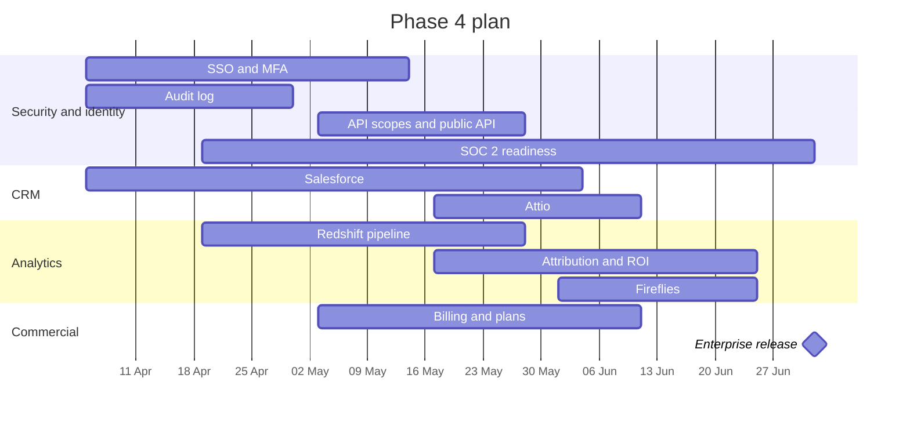

**Months 7–9 · 5 April – 2 July 2027 (13 weeks)**

Phase 4 opens the door to larger customers and proves return on investment. Its scope is the most flexible in the plan: re-prioritise the epics at the GA gate using pipeline data and customer requests.

## Objectives

1. Meet common enterprise security requirements (SSO, MFA, audit logs, SOC 2 readiness).
2. Support Salesforce and Attio customers.
3. Prove ROI with warehouse-backed analytics and attribution.
4. Add call intelligence to close the loop from meeting to outcome.
5. Charge customers automatically, with plans and usage limits.

## Scope and epics

| Epic | Scope | Size | Tech debt | Owner (role) |
|---|---|:-:|---|---|
| **E4.1 SSO and identity** | `AUTH_DRIVER=cognito` (or Auth0 per [ADR-12](/docs/architecture/decisions#adr-12--managed-identity-provider-for-sso-proposed)); SAML / OIDC per workspace; Google and Microsoft login; MFA; just-in-time provisioning; SSO buttons shown only when enabled | L | #11 | Backend engineer 2 + frontend engineer |
| **E4.2 Audit log** | Append-only audit events for admin and security actions (roles, keys, integrations, ICP, playbooks, exports, logins); UI and export; retention | M | — | Backend engineer 1 |
| **E4.3 API keys and public API** | Enforce scopes on read / write routes; API key auth on selected endpoints; OpenAPI response schemas; generated client types | M | #10, #23 | Backend engineer 1 |
| **E4.4 Salesforce** | Connected app (OAuth); accounts, contacts, leads, opportunities; field mapping UI; change data capture or polling; AppExchange security review preparation | L | — | Integrations engineer (+ second integrations engineer in the high scenario) |
| **E4.5 Attio** | Records and lists sync; webhooks | M | — | Integrations engineer |
| **E4.6 Redshift analytics** | Redshift Serverless; export pipeline from Postgres and domain events; daily snapshots of tiers, pipeline and runs; data model | L | #12 | Lead engineer + backend engineer 2 |
| **E4.7 Attribution and ROI** | Agent-influenced pipeline; attribution by signal type, playbook and sequence over custom ranges; owner and segment filters; tier win-rate feedback suggesting ICP changes | M | — | Backend engineer 1 + frontend engineer |
| **E4.8 Fireflies call intelligence** | Transcripts and summaries linked to deals and contacts; summaries pushed to the CRM; call signals in analytics | M | — | Integrations engineer + ML/LLM engineer |
| **E4.9 Billing and plans** | Billing provider (for example Stripe); plans, seats, usage credits (LLM tokens, enrichment); invoices; dunning; plan limits enforced | M | — | Backend engineer 2 + frontend engineer |
| **E4.10 SOC 2 readiness** | Compliance automation platform; policies; access reviews; vendor management; encryption key rotation; evidence collection; Type I audit scheduled | M | #21 | DevOps + lead engineer + PM |
| **E4.11 Limadata (Could)** | Real-time person and company data in the waterfall | S | — | Integrations engineer |

## Sequence within the phase

## Deliverables

- SSO (SAML / OIDC), social login and MFA; audit log with export.
- Scoped API keys and a documented public API.
- Salesforce and Attio sync with field mapping.
- Redshift-backed analytics with history, custom ranges, attribution and the agent-influenced pipeline north-star metric.
- Fireflies call summaries in SellEasy and the CRM.
- Self-serve billing with plan and usage limits.
- SOC 2 Type I readiness: controls implemented, evidence collection running, audit booked.

## Team focus

| Role | Focus this phase |
|---|---|
| Lead engineer | Warehouse architecture, SOC 2 technical controls, enterprise escalations |
| Backend engineers (2) | SSO, audit log, API scopes, billing, analytics pipeline |
| Integrations engineer | Salesforce, Attio, Fireflies, Limadata |
| Frontend engineer | SSO settings, audit log UI, mapping UI, analytics, billing |
| ML/LLM engineer (0.5) | Call summaries, ICP suggestions from win rates |
| DevOps (0.5) | Redshift, key rotation, access reviews, compliance tooling |
| QA | Enterprise regression, SSO matrix, CRM mapping tests |
| Product manager | Enterprise requirements, pricing and packaging, SOC 2 project management |
| Designer (0.5) | Analytics and admin experiences |
| GTM / solutions engineer | Enterprise pilots, security questionnaires, onboarding |

## Exit criteria (enterprise gate)

- [ ] SSO works with at least Okta and Microsoft Entra ID in staging and one customer.
- [ ] 100% of admin and security actions produce audit events.
- [ ] At least one Salesforce customer syncing in production.
- [ ] Analytics numbers reconcile with Postgres within 1% on sampled workspaces.
- [ ] Billing live for new self-serve workspaces.
- [ ] SOC 2 Type I audit window booked; ≥ 90% of controls passing in the compliance platform.

## KPIs

| KPI | Target |
|---|---|
| Enterprise customers (≥ 50 seats or SSO) | ≥ 1 live, ≥ 3 in pipeline |
| Agent-influenced pipeline | Reported for 100% of paying workspaces |
| Net revenue retention (early read) | Tracked monthly |
| Billing: failed payment recovery | ≥ 70% |
| Analytics p95 (warehouse-backed pages) | ≤ 3 s |
| Security questionnaire turnaround | ≤ 5 business days |

## Risks specific to this phase

- **AppExchange security review** can take 6–10 weeks — start preparation early in the phase; pilot Salesforce customers can use an unlisted app.
- **SOC 2 evidence period** — a Type II report needs an observation window after this plan; set expectations with enterprise prospects.
- **Warehouse cost creep** — use Redshift Serverless with base-capacity limits and scheduled workloads.
- **Scope overload** — Phase 4 has more candidate epics than capacity; rank them at the GA gate.

## After this plan

Candidate themes for months 10+: EU data residency, service extraction for ingestion and agents, multiple ICPs and segments, SOC 2 Type II, partner and agency features, mobile companion. See [Dependencies & risks](/docs/roadmap/dependencies-and-risks).
