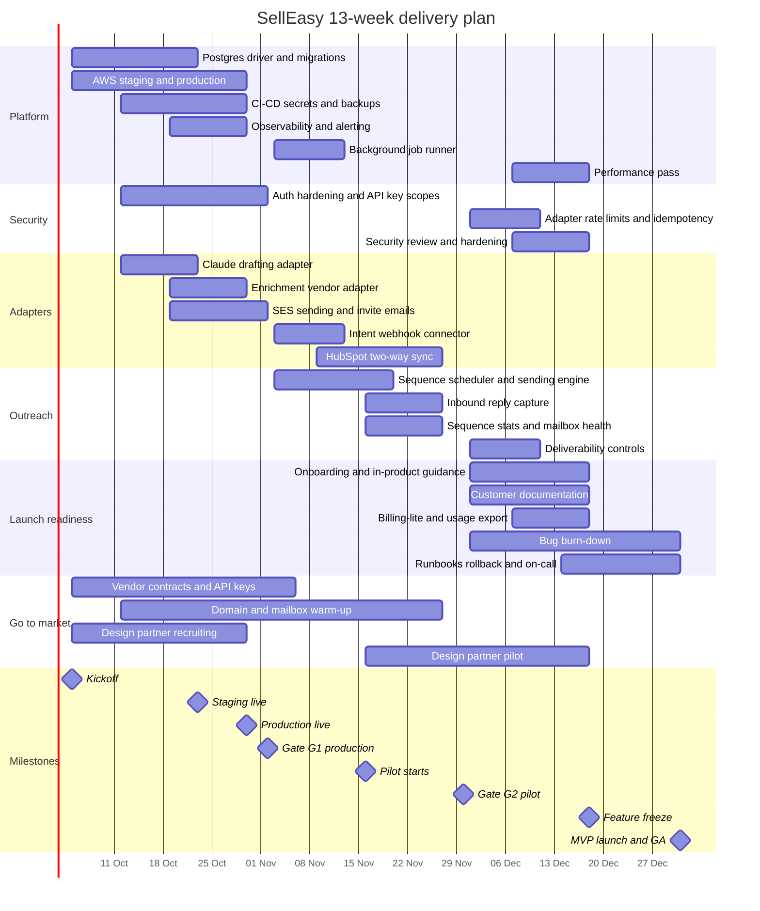
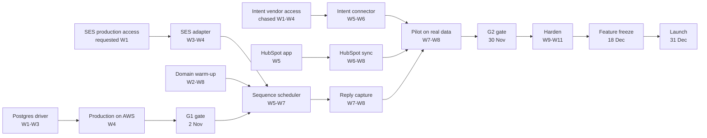

Thirteen working weeks, three engineers, one fixed launch date. Owners are **roles** — SSE (Senior Software Engineer / tech lead), SE-1 (integrations-leaning), SE-2 (frontend-leaning) — described in [Roadmap overview](/docs/roadmap#who-is-doing-it) and costed in [Team & cost](/docs/team-and-cost/team-plan).

<Callout type="warn" title="What this timeline assumes">
All three engineers are in seat on **5 October**, are fluent with AI-assisted development from day one, and are not split across other work. December is planned at reduced capacity for holidays. If any of those is untrue, the scope in the affected weeks is cut rather than the launch date moved — up to the freeze decision on 18 December.
</Callout>

## Week by week

| Week | Dates | Month | Focus | Milestone | Owner(s) |
|---|---|---|---|---|---|
| **W1** | 5–9 Oct | 1 | Kickoff; ADRs (IaC tool, frontend hosting); Postgres schema and driver skeleton; provider factory takes `orgId`; auth hardening plan. **AWS org + SES production request, Anthropic account, vendor outreach** | **Kickoff** (5 Oct) | All three + founder |
| **W2** | 12–16 Oct | 1 | Postgres driver — core collections and transactions; staging VPC and RDS; Claude adapter and eval harness; webhook signatures and API key scopes. **Domain live, warm-up starts** | Warm-up started (16 Oct); enrichment vendor decided | SSE, SE-1, SE-2 |
| **W3** | 19–23 Oct | 1 | Remaining collections; JSON → Postgres data-move script; CI running tests on Postgres; enrichment adapter; SES send path; integration settings UI wired up | **Staging live** (23 Oct) | SSE, SE-1, SE-2 |
| **W4** | 26–30 Oct | 1 | Production environment; Secrets Manager; automated backups + **rehearsed restore**; Sentry, metrics, alerts; bounce handling; invite emails end to end | **Production live** (30 Oct) | SSE, SE-1, SE-2 |
| **W5** | 3–6 Nov | 2 | Background job runner (Postgres queue, retries, DLQ); intent connector mapping and signature verification; scheduler send windows, mailbox rotation, daily limits | **G1 gate passed** (2 Nov); CRM conflict policy decided (6 Nov) | SSE, SE-1, SE-2 |
| **W6** | 9–13 Nov | 2 | Scheduler send path on SES with idempotency; intent connector live in staging; HubSpot app, contacts and companies; suppression and unsubscribe | Intent signals flowing in staging | SSE, SE-1, SE-2 |
| **W7** | 16–20 Nov | 2 | Nightly re-scoring and stat rollups; HubSpot deals and pull sync; reply capture UI and inbox threading; first partner onboarded | **Pilot starts** (16 Nov) | SSE, SE-1, SE-2 + founder |
| **W8** | 23–27 Nov | 2 | Reply capture backend; bounce and complaint classification; real sequence stats and mailbox health; partners 2 and 3 onboarded; pilot support | Full loop demonstrated on partner data | All three + founder |
| **W9** | 1–4 Dec | 3 | Adapter rate limits, retries and idempotency keys; deliverability DNS checks, caps and auto-pause; onboarding checklist and empty states | **G2 gate passed** (30 Nov) | SSE, SE-1, SE-2 |
| **W10** | 7–11 Dec | 3 | Performance profiling, indexes and SQL aggregates; suppression and deliverability panel; customer docs; billing-lite views and entitlement checks | Performance targets met | SSE, SE-1, SE-2 |
| **W11** | 14–18 Dec | 3 | Security review, dependency and container scanning, authorisation matrix tests; adapter failure states; docs and usage export finished | **Feature freeze** (18 Dec) | SSE, SE-1, SE-2 |
| **W12** | 21–24 Dec | 3 | Bug burn-down only; runbooks; rollback rehearsal; vendor failure drills; onboarding polish. Reduced capacity — holidays | Rollback rehearsed | All three |
| **W13** | 28–31 Dec | 3 | Launch checklist sign-off; on-call rota; final deliverability and partner sanity pass; launch-day monitoring watch | **MVP launch / GA** (31 Dec) | All three + founder |

## Full Gantt

## Milestones

| Milestone | Date | Definition | Accountable |
|---|---|---|---|
| **Kickoff** | Mon 5 Oct 2026 | All three engineers in seat; AWS and Anthropic accounts open; SES production access requested; IaC and hosting decisions made | Founder |
| **Warm-up started** | Fri 16 Oct 2026 | Sending domain registered with SPF, DKIM and DMARC; mailboxes created and on a warm-up schedule | SSE |
| **Staging live** | Fri 23 Oct 2026 | Staging on AWS running Postgres, deployed by CI | SSE |
| **Production live** | Fri 30 Oct 2026 | Production on AWS running Postgres, with secrets, backups and monitoring | SSE |
| **G1 · Production gate** | Mon 2 Nov 2026 | [Month 1 exit criteria](/docs/roadmap/month-1-foundation#exit-criteria-g1--production-gate-2-november) met | Founder + SSE |
| **Pilot starts** | Mon 16 Nov 2026 | First design partner live on their own data in production | Founder |
| **G2 · Pilot gate** | Mon 30 Nov 2026 | [Month 2 exit criteria](/docs/roadmap/month-2-integrations#exit-criteria-g2--pilot-gate-30-november) met; full loop proven on partner data | Founder + SSE |
| **Feature freeze** | Fri 18 Dec 2026 | No new functionality merged; burn-down and launch readiness only. The slip-or-launch decision is made here | Founder |
| **MVP launch / GA** | Thu 31 Dec 2026 | [Month 3 exit criteria](/docs/roadmap/month-3-launch#exit-criteria-g3--launch-gate-31-december) and every gate in the [launch checklist](/docs/mvp-scope/launch-checklist) signed off | Founder |

## Capacity reality check

| Month | Calendar weeks | Realistic engineer-weeks (3 people) | Notes |
|---|---|---|---|
| 1 · Foundation | 4 | ~12 | Full capacity; week 1 partly consumed by setup and accounts |
| 2 · Integrations | 4 | ~11 | Pilot support from week 7 takes roughly 15% of capacity |
| 3 · Launch | 4.5 | ~9 | Holidays in weeks 12–13; burn-down, not build |
| **Total** | **13** | **~32 engineer-weeks** | Everything in the plan has to fit inside this number |

That last number is the whole argument for the deferral list in [Beyond the MVP](/docs/roadmap/beyond-the-mvp). Roughly 32 engineer-weeks, AI-assisted, is enough to replace the mocks and close the loop. It is not enough to also build queues, a cache, search, SSO, a second CRM and a warehouse.

## Critical path

Anything on this chain that slips moves the launch date. Items **off** the chain can slip without moving it: the enrichment adapter, the integration settings UI, sequence-stat polish, billing-lite and most of the customer documentation.

The two least-compressible nodes are **domain warm-up** (calendar time, not effort) and **SES production access** (an external review). Both are week-1 actions for exactly that reason.

## Related

- [Roadmap overview](/docs/roadmap)
- [Month 1 · Foundation](/docs/roadmap/month-1-foundation) · [Month 2 · Real integrations](/docs/roadmap/month-2-integrations) · [Month 3 · Harden & launch](/docs/roadmap/month-3-launch)
- [Dependencies & risks](/docs/roadmap/dependencies-and-risks)
- [Team & cost → team plan](/docs/team-and-cost/team-plan)
